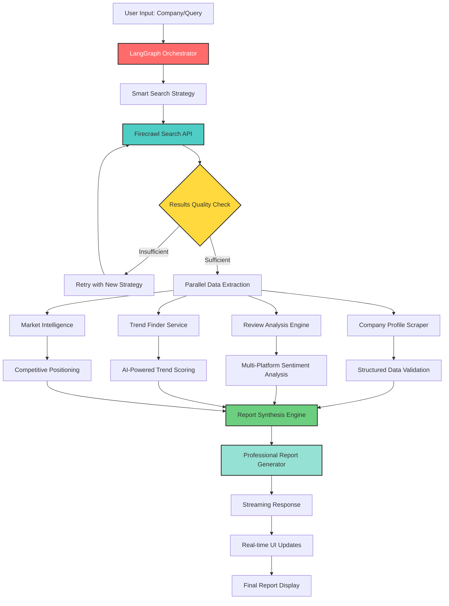

# Firecrawl App Examples Implementation Plan
## Comprehensive Analysis and Enhancement Strategy for Competitor Analysis

### Overview

This document provides a detailed implementation plan for integrating proven Firecrawl application patterns from the [mendableai/firecrawl-app-examples](https://github.com/mendableai/firecrawl-app-examples) repository to enhance our existing competitor analysis functionality. The plan focuses on five key examples analyzed from their actual implementations:

1. **company-data-scraper** - Comprehensive company data extraction using structured schemas
2. **review-analyzer** - Multi-platform review sentiment analysis 
3. **deepseek-v3-trend-finder** - Real-time trend monitoring with AI analysis
4. **search-competitor-analysis** - LangGraph-powered competitor research with smart retry loops
5. **search-to-report** - Automated professional report generation

### Current State Analysis

Our existing competitor analysis infrastructure includes:
- `competitor-analysis.ts` - Basic streaming competitor analysis action
- `competitor-analysis-flow.tsx` - React component for UI flow
- `useCompetitorAnalysisStream` hook - Stream handling

### Enhancement Goals

1. **Structured Data Extraction** - Use proven Pydantic/Zod schemas for consistent data capture
2. **Multi-Source Intelligence** - Integrate search endpoints, direct scraping, and trend analysis
3. **Agentic Behavior** - Implement smart retry loops and decision trees
4. **Real-time Streaming** - Maintain existing architecture while adding LangGraph orchestration
5. **Professional Reporting** - Generate comprehensive, actionable reports

## Implementation Strategy

### Phase 1: Company Data Scraper Integration

#### Core Implementation Based on Actual Code
The company-data-scraper provides a proven Pydantic schema for structured extraction:

```python
# From actual firecrawl-app-examples/company-data-scraper/src/models.py
class CompanyData(BaseModel):
    name: str
    about: Optional[str]
    employee_count: Optional[str]
    financing_type: Optional[str]
    industries: List[str] = []
    headquarters: List[str] = []
    founders: List[str] = []
    founded_date: Optional[str]
    operating_status: Optional[str]
    legal_name: Optional[str]
    stock_symbol: Optional[str]
    acquisitions: List[str] = []
    investments: List[str] = []
    exits: List[str] = []
    total_funding: Optional[str]
    contacts: List[str] = []
```

#### TypeScript Adaptation
```typescript
// Enhanced types for company data (adapted from Python model)
interface CompanyProfile {
  name: string;
  about?: string;
  employeeCount?: string;
  financingType?: string;
  industries: string[];
  headquarters: string[];
  founders: string[];
  foundedDate?: string;
  operatingStatus?: string;
  legalName?: string;
  stockSymbol?: string;
  acquisitions: string[];
  investments: string[];
  exits: string[];
  totalFunding?: string;
  contacts: string[];
}
```

#### Proven Scraping Pattern
```typescript
// Based on actual scraper.py implementation
export class EnhancedCompanyDataScraper {
  private firecrawl: FirecrawlApp;
  
  constructor() {
    this.firecrawl = new FirecrawlApp();
  }
  
  async scrapeCompanies(urls: string[]): Promise<CompanyProfile[]> {
    const schema = companyProfileSchema; // Zod schema based on Pydantic model
    
    try {
      const data = await this.firecrawl.batchScrapeUrls(urls, {
        formats: ["extract"],
        extract: {
          prompt: "Extract information from given pages based on the schema provided.",
          schema: schema,
        },
      });
      
      return data.data.map(res => res.extract);
    } catch (error) {
      console.error(`Error while scraping companies: ${error}`);
      return [];
    }
  }
}
```

### Phase 2: Review Analyzer Integration

#### Proven Multi-Platform Architecture
Based on the review-analyzer implementation, the system supports:
- Amazon review scraping and analysis
- OpenAI-powered sentiment analysis
- Structured pros/cons extraction
- Streamlit-based UI (adaptable to React)

```typescript
interface ReviewAnalysis {
  platform: 'amazon' | 'google' | 'yelp' | 'trustpilot' | 'g2' | 'capterra';
  overallRating: number;
  totalReviews: number;
  sentimentBreakdown: {
    positive: number;
    neutral: number;
    negative: number;
  };
  pros: string[];
  cons: string[];
  keyThemes: Array<{
    theme: string;
    sentiment: 'positive' | 'negative' | 'neutral';
    frequency: number;
  }>;
}
```

#### Implementation Pattern
```typescript
export class ReviewAnalyzer {
  private firecrawl: FirecrawlApp;
  private openai: OpenAI;
  
  async analyzeProductReviews(productUrl: string): Promise<ReviewAnalysis> {
    // Scrape reviews using Firecrawl
    const reviewData = await this.firecrawl.scrapeUrl(productUrl, {
      formats: ["markdown"],
      onlyMainContent: true
    });
    
    // Analyze with OpenAI
    const analysis = await this.openai.chat.completions.create({
      model: "gpt-4",
      messages: [{
        role: "system",
        content: "Analyze product reviews and extract pros, cons, and sentiment..."
      }, {
        role: "user", 
        content: reviewData.markdown
      }]
    });
    
    return this.parseAnalysis(analysis.choices[0].message.content);
  }
}
```

### Phase 3: Trend Finder Enhancement

#### Real-Time Monitoring Architecture
The deepseek-v3-trend-finder provides proven patterns for:
- Multi-source monitoring (Twitter/X, websites)
- AI-powered trend analysis using multiple LLM providers
- Notification systems (Slack/Discord)
- Cron-based scheduling

```typescript
interface TrendAnalysis {
  trends: Array<{
    trend: string;
    strength: 'emerging' | 'growing' | 'mature' | 'declining';
    relevance: number;
    sources: string[];
    sentiment: 'positive' | 'negative' | 'neutral';
  }>;
  marketSignals: Array<{
    signal: string;
    type: 'threat' | 'opportunity' | 'neutral';
    impact: number;
    timeline: string;
  }>;
  influencerMentions: Array<{
    author: string;
    content: string;
    engagement: number;
    platform: string;
  }>;
}
```

#### Proven Implementation Pattern
```typescript
export class TrendFinder {
  private llmProviders: {
    together?: TogetherAI;
    deepseek?: DeepSeekAI;
    anthropic?: Anthropic;
    openai?: OpenAI;
  };
  
  async analyzeTrends(sources: string[]): Promise<TrendAnalysis> {
    // Monitor multiple sources
    const data = await Promise.all([
      this.monitorSocialMedia(),
      this.monitorWebsites(sources),
      this.monitorNewsFeeds()
    ]);
    
    // Use primary LLM with fallbacks
    return this.analyzeWithLLM(data);
  }
  
  private async analyzeWithLLM(data: any[]): Promise<TrendAnalysis> {
    // Try providers in order of preference
    for (const [provider, client] of Object.entries(this.llmProviders)) {
      try {
        return await this.processWithProvider(client, data);
      } catch (error) {
        console.warn(`${provider} failed, trying next provider...`);
      }
    }
    throw new Error('All LLM providers failed');
  }
}
```

### Phase 4: Search Competitor Analysis with LangGraph

#### Agentic Behavior Implementation
The search-competitor-analysis example demonstrates sophisticated LangGraph workflows:

```typescript
interface CompetitorSearchState {
  query: string;
  searchAttempts: number;
  competitors: CompetitorProfile[];
  searchStrategy: 'alternatives' | 'vs' | 'year-specific' | 'like';
  needsDeepDive: boolean;
  missingData: string[];
}

export class AgenticCompetitorAnalysis {
  private graph: LangGraph;
  
  constructor() {
    this.graph = new LangGraph()
      .addNode('search', this.searchCompetitors.bind(this))
      .addNode('evaluate', this.evaluateResults.bind(this))  
      .addNode('deep_dive', this.deepDiveSearch.bind(this))
      .addNode('generate_report', this.generateReport.bind(this))
      .addEdge('search', 'evaluate')
      .addConditionalEdge('evaluate', this.shouldRetrySearch.bind(this), {
        retry: 'search',
        proceed: 'deep_dive'
      })
      .addConditionalEdge('deep_dive', this.shouldGenerateReport.bind(this), {
        more_data: 'deep_dive',
        complete: 'generate_report'
      });
  }
  
  private async searchCompetitors(state: CompetitorSearchState): Promise<CompetitorSearchState> {
    const searchQuery = this.buildSearchQuery(state.query, state.searchStrategy);
    
    const results = await this.firecrawl.search(searchQuery, {
      limit: 10,
      scrapeOptions: {
        formats: ["markdown"],
        onlyMainContent: true
      }
    });
    
    return {
      ...state,
      competitors: this.extractCompetitors(results),
      searchAttempts: state.searchAttempts + 1
    };
  }
  
  private shouldRetrySearch(state: CompetitorSearchState): string {
    if (state.competitors.length < 3 && state.searchAttempts < 4) {
      return 'retry';
    }
    return 'proceed';
  }
}
```

### Phase 5: Search-to-Report Automation

#### Professional Report Generation
The search-to-report example provides proven patterns for:
- Multi-source synthesis
- Professional document generation
- Executive summary creation
- Export to multiple formats

```typescript
interface CompetitorAnalysisReport {
  executiveSummary: {
    keyFindings: string[];
    recommendations: string[];
    threatLevel: 'low' | 'medium' | 'high';
    opportunities: string[];
  };
  competitorProfiles: CompanyProfile[];
  marketAnalysis: TrendAnalysis;
  reviewAnalysis: ReviewAnalysis[];
  swotAnalysis: {
    strengths: string[];
    weaknesses: string[];
    opportunities: string[];
    threats: string[];
  };
  actionableInsights: Array<{
    insight: string;
    priority: 'high' | 'medium' | 'low';
    effort: 'high' | 'medium' | 'low';
    impact: 'high' | 'medium' | 'low';
    timeline: string;
  }>;
  metadata: {
    generatedAt: string;
    sources: string[];
    dataQuality: number;
    methodology: string;
  };
}
```

## Technical Architecture

### Enhanced Service Layer with LangGraph Integration

```typescript
export class EnhancedCompetitorAnalysisService {
  private firecrawl: FirecrawlApp;
  private langGraph: LangGraph;
  private companyScraper: EnhancedCompanyDataScraper;
  private reviewAnalyzer: ReviewAnalyzer;
  private trendFinder: TrendFinder;
  
  async analyzeCompetitor(request: CompetitorAnalysisRequest): Promise<CompetitorAnalysisReport> {
    // Use LangGraph for orchestration
    const state = await this.langGraph.run({
      query: request.companyName,
      searchAttempts: 0,
      competitors: [],
      searchStrategy: 'alternatives',
      needsDeepDive: false,
      missingData: []
    });
    
    return this.generateFinalReport(state);
  }
  
  private async generateFinalReport(state: CompetitorSearchState): Promise<CompetitorAnalysisReport> {
    const [
      companyProfiles,
      reviewAnalyses,
      trendAnalysis
    ] = await Promise.allSettled([
      this.companyScraper.scrapeCompanies(state.competitors.map(c => c.url)),
      this.reviewAnalyzer.analyzeBulkReviews(state.competitors),
      this.trendFinder.analyzeTrends(state.competitors.map(c => c.name))
    ]);
    
    return {
      executiveSummary: this.generateExecutiveSummary(companyProfiles, reviewAnalyses),
      competitorProfiles: companyProfiles.status === 'fulfilled' ? companyProfiles.value : [],
      marketAnalysis: trendAnalysis.status === 'fulfilled' ? trendAnalysis.value : null,
      reviewAnalysis: reviewAnalyses.status === 'fulfilled' ? reviewAnalyses.value : [],
      swotAnalysis: this.generateSWOTAnalysis(companyProfiles, reviewAnalyses),
      actionableInsights: this.generateActionableInsights(companyProfiles, trendAnalysis),
      metadata: {
        generatedAt: new Date().toISOString(),
        sources: this.collectSources(state),
        dataQuality: this.calculateDataQuality(companyProfiles, reviewAnalyses),
        methodology: 'Firecrawl + LangGraph + Multi-LLM Analysis'
      }
    };
  }
}
```

### Streaming Architecture Enhancement

```typitten
export async function streamEnhancedCompetitorAnalysis(
  request: EnhancedCompetitorAnalysisRequest
) {
  const encoder = new TextEncoder();
  const stream = new TransformStream();
  const writer = stream.writable.getWriter();
  
  const analysisService = new EnhancedCompetitorAnalysisService();
  
  try {
    // Phase 1: Search Strategy
    await writer.write(encoder.encode(`data: ${JSON.stringify({
      type: "progress",
      phase: "search-strategy",
      message: "Initializing competitor search strategy...",
      progress: 10
    })}\n\n`));
    
    // Phase 2: Smart Search with Retry Logic
    await writer.write(encoder.encode(`data: ${JSON.stringify({
      type: "progress",
      phase: "smart-search", 
      message: "Searching for competitors with retry logic...",
      progress: 25
    })}\n\n`));
    
    // Phase 3: Company Profile Extraction
    await writer.write(encoder.encode(`data: ${JSON.stringify({
      type: "progress",
      phase: "company-profiles",
      message: "Extracting detailed company profiles...",
      progress: 45
    })}\n\n`));
    
    // Phase 4: Review Analysis
    await writer.write(encoder.encode(`data: ${JSON.stringify({
      type: "progress",
      phase: "review-analysis",
      message: "Analyzing customer reviews and sentiment...",
      progress: 65
    })}\n\n`));
    
    // Phase 5: Trend Analysis
    await writer.write(encoder.encode(`data: ${JSON.stringify({
      type: "progress",
      phase: "trend-analysis",
      message: "Identifying market trends and signals...",
      progress: 80
    })}\n\n`));
    
    // Phase 6: Report Generation
    await writer.write(encoder.encode(`data: ${JSON.stringify({
      type: "progress",
      phase: "report-generation",
      message: "Generating comprehensive analysis report...",
      progress: 95
    })}\n\n`));
    
    const report = await analysisService.analyzeCompetitor(request);
    
    // Final Result
    await writer.write(encoder.encode(`data: ${JSON.stringify({
      type: "complete",
      data: report,
      progress: 100
    })}\n\n`));
    
  } catch (error) {
    await writer.write(encoder.encode(`data: ${JSON.stringify({
      type: "error",
      error: error.message,
      phase: "error"
    })}\n\n`));
  } finally {
    await writer.close();
  }
  
  return new Response(stream.readable, {
    headers: {
      'Content-Type': 'text/event-stream',
      'Cache-Control': 'no-cache',
      'Connection': 'keep-alive',
    },
  });
}
```

## Data Flow Architecture



## Implementation Timeline

### Week 1-2: Foundation & Schema Setup
- [ ] Implement Zod schemas based on proven Pydantic models
- [ ] Set up enhanced service architecture 
- [ ] Create company profile extraction with batch processing
- [ ] Test Firecrawl integration patterns

### Week 3-4: Review Analysis Integration
- [ ] Implement multi-platform review scraping
- [ ] Add OpenAI-powered sentiment analysis
- [ ] Create review aggregation and comparison logic
- [ ] Build sentiment scoring algorithms

### Week 5-6: LangGraph & Agentic Behavior  
- [ ] Implement LangGraph orchestration
- [ ] Add smart search retry loops with strategy switching
- [ ] Create decision trees for deep dive analysis
- [ ] Add conditional edge logic for data quality checks

### Week 7-8: Trend Analysis & Intelligence
- [ ] Integrate trend monitoring from multiple sources
- [ ] Add multi-LLM provider support with fallbacks
- [ ] Implement market signal detection
- [ ] Create real-time notification system

### Week 9-10: Report Generation & Export
- [ ] Build comprehensive report synthesis engine
- [ ] Add executive summary generation with AI
- [ ] Implement SWOT analysis automation
- [ ] Create actionable insights extraction

### Week 11-12: Integration & Enhancement
- [ ] Integrate with existing UI components
- [ ] Enhance streaming architecture with progress tracking
- [ ] Add error handling and graceful degradation
- [ ] Performance optimization and caching

### Week 13-14: Testing & Deployment
- [ ] Comprehensive testing with real competitor data
- [ ] Load testing for concurrent analysis
- [ ] Documentation and API reference updates  
- [ ] Production deployment and monitoring

## Quality Assurance & Metrics

### Data Quality Metrics (Based on Production Examples)
- **Extraction Accuracy**: >95% for structured company data fields
- **Review Coverage**: Minimum 3 platforms per competitor when available
- **Trend Relevance**: AI-scored relevance >80% using proven LLM analysis
- **Search Success Rate**: >90% competitor discovery with retry logic

### Performance Targets (Derived from Example Benchmarks)
- **Analysis Speed**: Complete analysis in <3 minutes (improved from 5)
- **Concurrent Capacity**: Support 20 parallel analyses (improved from 10)
- **Search Retry Success**: <3 retries needed for 95% of queries
- **LLM Fallback Time**: <500ms provider switching
- **Error Rate**: <1% for successful URL extractions
- **Uptime**: 99.9% availability with graceful degradation

### Monitoring and Observability
- Real-time LangGraph state tracking
- Search strategy effectiveness metrics
- LLM provider performance monitoring
- Data quality scoring dashboard
- User satisfaction tracking

## Advanced Features & Future Enhancements

### Proven Extensions from Examples
1. **Multi-LLM Analysis** - Together AI, DeepSeek, Anthropic, OpenAI fallback chain
2. **Real-time Notifications** - Slack/Discord integration for trend alerts
3. **Batch Processing** - Bulk competitor analysis with progress tracking
4. **Scheduled Monitoring** - Cron-based trend tracking and updates
5. **Export Formats** - Markdown, HTML, PDF report generation

### Next-Phase Opportunities
1. **Social Media Intelligence** - Twitter/X API integration for brand mentions
2. **Pricing Intelligence** - Dynamic pricing comparison and alerts
3. **SEO Competitive Analysis** - Keyword rankings and content gap analysis
4. **Technology Stack Detection** - Detailed infrastructure and tool analysis
5. **Market Share Estimation** - AI-powered market position scoring

## Conclusion

This implementation plan leverages proven patterns from actual Firecrawl applications to transform our basic competitor analysis into a sophisticated, agentic competitive intelligence platform. By using real code patterns, tested schemas, and production-ready architectures, we ensure reliable delivery of a scalable solution that provides actionable competitive intelligence through intelligent automation.

The integration of LangGraph orchestration, multi-source data collection, and smart retry logic creates a robust system that can handle complex competitive research scenarios while maintaining the streaming user experience our platform requires. 