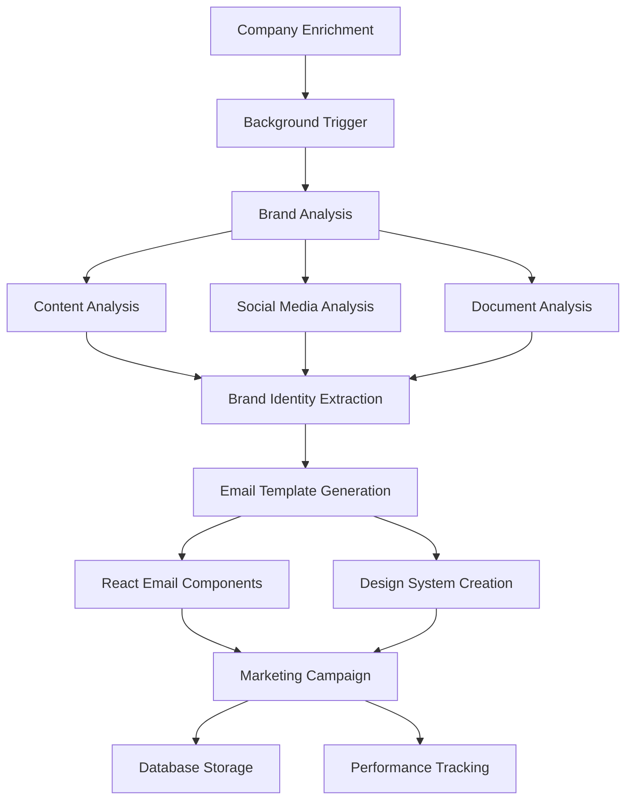

# Marketing Intelligence & Email Template Generation System

## 📋 Overview

The Marketing Intelligence System is an advanced AI-powered component that automatically analyzes company data to understand brand identity, communication style, and market positioning, then generates personalized email marketing campaigns with custom React Email templates. This system transforms raw company enrichment data into actionable marketing assets.

## 🎯 Key Features

### **🔍 AI-Powered Brand Analysis**
- **Tone Detection** - Analyzes company content to identify communication tone (professional, casual, innovative, traditional, playful, authoritative)
- **Communication Style Analysis** - Determines how they communicate (direct, conversational, technical, storytelling, data-driven, emotional)
- **Brand Identity Extraction** - Identifies core values, personality traits, market positioning, and target audience
- **Visual Preference Analysis** - Determines color schemes, design styles, and visual imagery preferences
- **Competitive Positioning** - Analyzes market position and competitive differentiators

### **📧 Automated Email Template Generation**
- **10 Template Purposes** - Cold outreach, follow-up, partnership, product demo, content sharing, event invitation, feedback request, case study, newsletter, re-engagement
- **10 Visual Design Themes** - Minimal, corporate, modern, creative, dark, colorful, newsletter, product, event, personal
- **React Email Components** - Production-ready React Email code with TypeScript support
- **Dynamic Personalization** - Smart personalization variables and conditional content
- **Performance Optimization** - AI-predicted open rates, click rates, and optimal send times

### **🔄 Seamless Integration**
- **Automatic Triggering** - Marketing intelligence generated automatically after company enrichment
- **Background Processing** - Non-blocking async generation maintains fast response times
- **Persistent Storage** - All campaigns and templates stored in Supabase with full audit trail
- **Performance Tracking** - Built-in analytics for email sends, opens, clicks, and conversions

## 🏗️ System Architecture



### **Core Components**

1. **Marketing Intelligence Service** (`marketing-intelligence.service.ts`)
   - Brand analysis and template generation orchestrator
   - Content processing and AI analysis coordination
   - Campaign management and persistence

2. **React Email Generator Service** (`react-email-generator.service.ts`)
   - Design system generation from brand analysis
   - React Email component creation
   - Template variation generation
   - Resend integration code generation

3. **Extended Database Schema** (`marketing-schema.sql`)
   - Marketing campaign storage
   - Email template usage tracking
   - Brand analysis history
   - Performance analytics tables

## 🗄️ Database Schema

### Core Marketing Tables

#### 1. `company_marketing_campaigns`
Stores complete marketing campaigns with brand analysis and email templates.

```sql
CREATE TABLE company_marketing_campaigns (
  id UUID PRIMARY KEY DEFAULT gen_random_uuid(),
  company_profile_id UUID REFERENCES company_profiles(id) ON DELETE CASCADE,
  user_id UUID REFERENCES auth.users(id),
  
  -- Campaign metadata
  campaign_name TEXT,
  description TEXT,
  status TEXT DEFAULT 'generating', -- 'generating', 'completed', 'failed'
  
  -- Brand analysis data
  brand_analysis JSONB NOT NULL DEFAULT '{}',
  
  -- Email templates (array of template objects)
  email_templates JSONB NOT NULL DEFAULT '[]',
  total_templates INTEGER DEFAULT 0,
  
  -- Processing metrics
  generated_at TIMESTAMPTZ DEFAULT NOW(),
  processing_time INTEGER, -- milliseconds
  error_message TEXT,
  
  -- Performance tracking
  templates_used INTEGER DEFAULT 0,
  total_sends INTEGER DEFAULT 0,
  total_opens INTEGER DEFAULT 0,
  total_clicks INTEGER DEFAULT 0
);
```

#### 2. `email_template_usage`
Tracks individual email sends and their performance metrics.

```sql
CREATE TABLE email_template_usage (
  id UUID PRIMARY KEY DEFAULT gen_random_uuid(),
  campaign_id UUID REFERENCES company_marketing_campaigns(id) ON DELETE CASCADE,
  user_id UUID REFERENCES auth.users(id),
  
  -- Template information
  template_id TEXT NOT NULL,
  template_name TEXT NOT NULL,
  template_purpose TEXT NOT NULL,
  template_theme TEXT NOT NULL,
  
  -- Usage details
  recipient_email TEXT,
  recipient_name TEXT,
  recipient_company TEXT,
  personalization_data JSONB DEFAULT '{}',
  
  -- Email service integration
  email_service_provider TEXT, -- 'resend', 'sendgrid', 'mailgun'
  email_service_id TEXT,
  
  -- Performance metrics
  sent_at TIMESTAMPTZ,
  opened_at TIMESTAMPTZ,
  first_click_at TIMESTAMPTZ,
  total_clicks INTEGER DEFAULT 0,
  bounced BOOLEAN DEFAULT false,
  complained BOOLEAN DEFAULT false,
  unsubscribed BOOLEAN DEFAULT false
);
```

#### 3. `company_brand_history`
Tracks brand analysis evolution over time for change detection.

```sql
CREATE TABLE company_brand_history (
  id UUID PRIMARY KEY DEFAULT gen_random_uuid(),
  company_profile_id UUID REFERENCES company_profiles(id) ON DELETE CASCADE,
  
  -- Brand analysis snapshot
  brand_analysis JSONB NOT NULL,
  analysis_version INTEGER DEFAULT 1,
  
  -- Change tracking
  changes_detected JSONB DEFAULT '{}',
  confidence_score DECIMAL(3,2),
  source_data_hash TEXT,
  
  analyzed_at TIMESTAMPTZ DEFAULT NOW()
);
```

#### 4. `marketing_automation_workflows`
Email automation sequences and drip campaigns.

```sql
CREATE TABLE marketing_automation_workflows (
  id UUID PRIMARY KEY DEFAULT gen_random_uuid(),
  company_profile_id UUID REFERENCES company_profiles(id) ON DELETE CASCADE,
  user_id UUID REFERENCES auth.users(id),
  
  -- Workflow configuration
  name TEXT NOT NULL,
  description TEXT,
  status TEXT DEFAULT 'draft', -- 'draft', 'active', 'paused', 'completed'
  
  -- Trigger configuration
  trigger_type TEXT NOT NULL, -- 'manual', 'webhook', 'schedule', 'event'
  trigger_config JSONB NOT NULL DEFAULT '{}',
  
  -- Workflow steps (email sequence)
  workflow_steps JSONB NOT NULL DEFAULT '[]',
  email_templates JSONB DEFAULT '[]',
  
  -- Performance tracking
  total_enrollments INTEGER DEFAULT 0,
  active_enrollments INTEGER DEFAULT 0,
  completed_enrollments INTEGER DEFAULT 0
);
```

## 🤖 AI-Powered Brand Analysis

### **Brand Analysis Process**

```typescript
interface BrandAnalysis {
  tone: {
    primary: 'professional' | 'casual' | 'innovative' | 'traditional' | 'playful' | 'authoritative';
    secondary: string[];
    confidence: number;
    examples: string[];
  };
  communicationStyle: {
    style: 'direct' | 'conversational' | 'technical' | 'storytelling' | 'data-driven' | 'emotional';
    characteristics: string[];
    vocabulary: string[];
    sentenceStructure: 'short' | 'medium' | 'long' | 'varied';
  };
  brandIdentity: {
    values: string[];
    personality: string[];
    positioning: string;
    targetAudience: string;
    uniqueSellingProposition: string;
  };
  visualPreferences: {
    colorScheme: 'corporate' | 'modern' | 'minimalist' | 'vibrant' | 'dark' | 'light';
    designStyle: 'clean' | 'bold' | 'elegant' | 'playful' | 'technical' | 'artistic';
    imagery: string[];
  };
  competitiveAnalysis: {
    differentiators: string[];
    marketPosition: 'leader' | 'challenger' | 'niche' | 'startup';
    competitiveAdvantages: string[];
  };
}
```

### **Content Sources Analyzed**

1. **Company Website Content**
   - Homepage and key pages
   - About us sections
   - Product/service descriptions
   - Blog posts and content

2. **Social Media Presence**
   - Profile descriptions and bios
   - Recent posts and content
   - Engagement patterns
   - Visual content analysis

3. **Company Documents**
   - Financial reports
   - Pitch decks
   - Whitepapers
   - Case studies

4. **News and Press Coverage**
   - Recent news mentions
   - Press releases
   - Industry coverage

### **AI Analysis Prompts**

The system uses sophisticated AI prompts to extract brand insights:

```typescript
const brandAnalysisPrompt = `
Analyze the following company content to determine their brand identity, communication style, and marketing approach:

${combinedContent}

Based on this content, provide a comprehensive brand analysis that covers:

1. **Tone Analysis**: What is their primary communication tone?
2. **Communication Style**: How do they communicate with their audience?
3. **Brand Identity**: What are their core values, personality traits, and positioning?
4. **Visual Preferences**: What design and visual style would match their brand?
5. **Competitive Analysis**: What differentiates them in their market?

Be specific and provide examples from the content to support your analysis.
`;
```

## 📧 Email Template Generation

### **Template Categories**

The system generates 10 distinct email templates across different purposes:

1. **Cold Outreach** - Initial contact with prospects
2. **Follow-up** - Nurturing existing conversations
3. **Partnership** - Business partnership proposals
4. **Product Demo** - Product demonstration invitations
5. **Content Sharing** - Valuable content distribution
6. **Event Invitation** - Webinars, conferences, meetups
7. **Feedback Request** - Customer satisfaction surveys
8. **Case Study** - Success story sharing
9. **Newsletter** - Regular updates and insights
10. **Re-engagement** - Reactivating dormant contacts

### **Template Structure**

```typescript
interface EmailTemplate {
  id: string;
  name: string;
  description: string;
  purpose: TemplatePurpose;
  subject: string;
  previewText: string;
  content: {
    html: string;
    text: string;
    reactEmailComponent: string;
  };
  designVariant: {
    name: string;
    theme: DesignTheme;
    primaryColor: string;
    secondaryColor: string;
    layout: LayoutType;
  };
  personalization: {
    variables: string[];
    dynamicContent: Record<string, string>;
    conditionalSections: ConditionalSection[];
  };
  performance: {
    estimatedOpenRate: number;
    estimatedClickRate: number;
    difficulty: 'easy' | 'medium' | 'hard';
    bestTimeToSend: string;
  };
}
```

### **Design Themes**

Each template is generated with a unique visual theme:

- **Minimal** - Clean, simple, text-focused
- **Corporate** - Professional, formal, brand-heavy
- **Modern** - Contemporary, trendy, visual
- **Creative** - Artistic, colorful, expressive
- **Dark** - Dark mode, high contrast
- **Colorful** - Vibrant, energetic, fun
- **Newsletter** - Content-focused, readable
- **Product** - Product-centric, feature-focused
- **Event** - Event-specific, urgency-driven
- **Personal** - Personal, conversational, friendly

## 🎨 React Email Component Generation

### **Design System Creation**

The system generates a comprehensive design system for each company:

```typescript
interface EmailDesignSystem {
  colors: {
    primary: string;
    secondary: string;
    accent: string;
    neutral: string[];
    semantic: {
      success: string;
      warning: string;
      error: string;
      info: string;
    };
  };
  typography: {
    fontFamily: string;
    headingScale: Record<string, { fontSize: string; lineHeight: string; fontWeight: string }>;
    bodyText: Record<string, { fontSize: string; lineHeight: string }>;
  };
  spacing: {
    scale: string[];
    sections: Record<string, string>;
  };
  layout: {
    maxWidth: string;
    padding: Record<string, string>;
    borderRadius: Record<string, string>;
  };
}
```

### **React Email Components**

Each template generates production-ready React Email components:

```typescript
// Example generated component
import {
  Body,
  Button,
  Container,
  Head,
  Heading,
  Html,
  Preview,
  Section,
  Text,
} from '@react-email/components';

interface ColdOutreachEmailProps {
  recipientName: string;
  companyName: string;
  senderName: string;
  meetingLink?: string;
}

export const ColdOutreachEmail = ({
  recipientName,
  companyName,
  senderName,
  meetingLink
}: ColdOutreachEmailProps) => {
  return (
    <Html>
      <Head />
      <Preview>Partnership opportunity with {companyName}</Preview>
      <Body style={main}>
        <Container style={container}>
          <Heading style={h1}>Hi {recipientName},</Heading>
          <Text style={text}>
            I've been following {companyName}'s innovative work in the industry...
          </Text>
          {meetingLink && (
            <Section style={btnContainer}>
              <Button style={button} href={meetingLink}>
                Schedule a Call
              </Button>
            </Section>
          )}
        </Container>
      </Body>
    </Html>
  );
};
```

### **Email Client Compatibility**

All generated components are optimized for:
- **Gmail** (mobile and desktop)
- **Outlook** (2016, 2019, Office 365)
- **Apple Mail** (iOS and macOS)
- **Yahoo Mail**
- **Thunderbird**
- **Dark mode support**
- **Mobile responsiveness**

## 🔄 Integration Workflow

### **Automatic Triggering**

The marketing intelligence system integrates seamlessly with the enrichment workflow:

```typescript
// In enrichment-with-persistence.service.ts
const enrichCompanyWithPersistence = async (request, options) => {
  // ... enrichment logic ...
  
  if (profile && Object.keys(socialData).length > 0) {
    // Save social media profiles
    await socialMediaService.saveSocialProfiles(profile.id, socialData);
    
    // 🚀 Automatically trigger marketing intelligence generation
    generateMarketingIntelligenceAsync(profile.id, result, socialProfiles, documents);
  }
  
  return result;
};

// Background processing (non-blocking)
const generateMarketingIntelligenceAsync = async (
  companyProfileId,
  enrichmentData,
  socialProfiles,
  documents
) => {
  setTimeout(async () => {
    try {
      await marketingIntelligenceService.generateMarketingIntelligence(
        companyProfileId,
        enrichmentData,
        socialProfiles,
        documents
      );
      console.log(`✅ Marketing intelligence generated for ${companyProfileId}`);
    } catch (error) {
      console.error(`❌ Failed to generate marketing intelligence:`, error);
    }
  }, 1000); // 1 second delay to not block main response
};
```

### **Processing Pipeline**

1. **Enrichment Completion** - Company data enrichment finishes
2. **Background Trigger** - Marketing intelligence queued for generation (1 second delay)
3. **Content Aggregation** - Collect all text content from enrichment, social, and documents
4. **Brand Analysis** - AI analyzes content to extract brand identity and communication style
5. **Template Generation** - AI creates 10 custom email templates based on brand analysis
6. **React Components** - Generate production-ready React Email components for each template
7. **Campaign Storage** - Save complete campaign to database
8. **Performance Tracking** - Set up analytics and tracking for template usage

## 📊 Performance Analytics

### **Campaign Performance Tracking**

```sql
-- Function to calculate campaign performance
CREATE OR REPLACE FUNCTION calculate_campaign_performance(
  campaign_id_param UUID,
  period_start_param TIMESTAMPTZ,
  period_end_param TIMESTAMPTZ
) RETURNS TABLE(
  emails_sent BIGINT,
  emails_opened BIGINT,
  emails_clicked BIGINT,
  open_rate DECIMAL,
  click_rate DECIMAL
) AS $$
BEGIN
  RETURN QUERY
  SELECT 
    COUNT(*) as emails_sent,
    COUNT(*) FILTER (WHERE opened_at IS NOT NULL) as emails_opened,
    COUNT(*) FILTER (WHERE first_click_at IS NOT NULL) as emails_clicked,
    CASE 
      WHEN COUNT(*) > 0 
      THEN ROUND(COUNT(*) FILTER (WHERE opened_at IS NOT NULL)::DECIMAL / COUNT(*)::DECIMAL, 4)
      ELSE 0
    END as open_rate,
    CASE 
      WHEN COUNT(*) > 0 
      THEN ROUND(COUNT(*) FILTER (WHERE first_click_at IS NOT NULL)::DECIMAL / COUNT(*)::DECIMAL, 4)
      ELSE 0
    END as click_rate
  FROM email_template_usage
  WHERE 
    campaign_id = campaign_id_param
    AND sent_at >= period_start_param
    AND sent_at <= period_end_param;
END;
$$ LANGUAGE plpgsql;
```

### **Real-time Analytics**

The system provides real-time analytics for:
- **Template Performance** - Open rates, click rates, conversion rates per template
- **Theme Effectiveness** - Which design themes perform best for different industries
- **Personalization Impact** - How personalization affects engagement
- **Send Time Optimization** - Best times to send for maximum engagement
- **A/B Testing Results** - Performance comparison between template variations

## 🚀 API Usage Examples

### **Basic Marketing Campaign Generation**

```typescript
import { makePersistedEnrichmentService } from './enrichment-with-persistence.service';

const enrichmentService = makePersistedEnrichmentService(supabase, supabase, userId);

// Step 1: Enrich company (triggers automatic marketing intelligence)
const enrichment = await enrichmentService.enrichCompany({
  websiteUrl: 'https://anthropic.com',
  enrichmentTypes: [
    'basic-info',
    'company-summary', 
    'funding',
    'linkedin',
    'news'
  ]
});

// Step 2: Wait for marketing intelligence (generated in background)
await new Promise(resolve => setTimeout(resolve, 30000)); // Wait 30 seconds

// Step 3: Get the generated marketing campaign
const campaign = await enrichmentService.getMarketingCampaign('https://anthropic.com');

console.log('Generated Campaign:', {
  campaignId: campaign.id,
  brandTone: campaign.brandAnalysis.tone.primary,
  emailTemplates: campaign.emailTemplates.length,
  avgOpenRate: campaign.emailTemplates.reduce((sum, t) => sum + t.performance.estimatedOpenRate, 0) / campaign.emailTemplates.length
});
```

### **Manual Marketing Intelligence Generation**

```typescript
// Generate marketing intelligence immediately (not background)
const campaign = await enrichmentService.generateMarketingIntelligence('https://company.com');

console.log('Brand Analysis:', {
  tone: campaign.brandAnalysis.tone.primary,
  communicationStyle: campaign.brandAnalysis.communicationStyle.style,
  values: campaign.brandAnalysis.brandIdentity.values,
  positioning: campaign.brandAnalysis.brandIdentity.positioning,
  targetAudience: campaign.brandAnalysis.brandIdentity.targetAudience
});

console.log('Email Templates Generated:');
campaign.emailTemplates.forEach((template, index) => {
  console.log(`${index + 1}. ${template.name}`, {
    purpose: template.purpose,
    theme: template.designVariant.theme,
    layout: template.designVariant.layout,
    estimatedOpenRate: `${(template.performance.estimatedOpenRate * 100).toFixed(1)}%`,
    personalizationVars: template.personalization.variables.length
  });
});
```

### **Using Generated React Email Templates**

```typescript
// Example of using a generated React Email template with Resend
import { Resend } from 'resend';

const resend = new Resend(process.env.RESEND_API_KEY);

// Get the campaign and extract template
const campaign = await enrichmentService.getMarketingCampaign('https://company.com');
const coldOutreachTemplate = campaign.emailTemplates.find(t => t.purpose === 'cold_outreach');

// The template.content.reactEmailComponent contains the React component code
// You would save this to a file and import it:

/*
// Save to: ./templates/ColdOutreachEmail.tsx
import { ColdOutreachEmail } from './templates/ColdOutreachEmail';

const { data, error } = await resend.emails.send({
  from: 'hello@yourcompany.com',
  to: ['prospect@targetcompany.com'],
  subject: coldOutreachTemplate.subject,
  react: ColdOutreachEmail({
    recipientName: 'John Doe',
    companyName: 'Target Company',
    senderName: 'Your Name',
    meetingLink: 'https://calendly.com/your-calendar'
  }),
});
*/
```

### **Campaign Performance Analytics**

```typescript
// Track email usage
await db.from('email_template_usage').insert({
  campaign_id: campaign.id,
  user_id: userId,
  template_id: coldOutreachTemplate.id,
  template_name: coldOutreachTemplate.name,
  template_purpose: coldOutreachTemplate.purpose,
  recipient_email: 'prospect@company.com',
  recipient_name: 'John Doe',
  personalization_data: {
    recipientName: 'John Doe',
    companyName: 'Target Company'
  },
  email_service_provider: 'resend',
  sent_at: new Date().toISOString()
});

// Get campaign performance
const performance = await db
  .rpc('calculate_campaign_performance', {
    campaign_id_param: campaign.id,
    period_start_param: new Date(Date.now() - 30 * 24 * 60 * 60 * 1000).toISOString(), // 30 days ago
    period_end_param: new Date().toISOString()
  });

console.log('Campaign Performance:', {
  emailsSent: performance.emails_sent,
  openRate: `${(performance.open_rate * 100).toFixed(1)}%`,
  clickRate: `${(performance.click_rate * 100).toFixed(1)}%`
});
```

## 🔧 Configuration

### **Environment Variables**

```bash
# AI Services (required for brand analysis and template generation)
ANTHROPIC_API_KEY=your_anthropic_key
OPENAI_API_KEY=your_openai_key

# Email Service Integration
RESEND_API_KEY=your_resend_key

# Database
NEXT_PUBLIC_SUPABASE_URL=your_supabase_url
SUPABASE_SERVICE_ROLE_KEY=your_service_role_key
```

### **AI Model Configuration**

```typescript
// Configure AI models for different tasks
export const MARKETING_AI_CONFIG = {
  brandAnalysis: {
    model: ANTHROPIC_MODELS.SONNET_35,
    temperature: 0.3, // Lower temperature for consistent analysis
    maxTokens: 4000
  },
  templateGeneration: {
    model: ANTHROPIC_MODELS.SONNET_35, 
    temperature: 0.7, // Higher temperature for creative templates
    maxTokens: 6000
  },
  componentGeneration: {
    model: ANTHROPIC_MODELS.SONNET_35,
    temperature: 0.4, // Balanced for code generation
    maxTokens: 8000
  }
};
```

### **Processing Configuration**

```typescript
// Configure processing delays and limits
export const MARKETING_CONFIG = {
  processing: {
    backgroundDelay: 1000, // 1 second delay before starting background processing
    maxRetries: 3,
    retryDelay: 5000 // 5 seconds between retries
  },
  templates: {
    count: 10, // Number of templates to generate
    variationsPerTemplate: 3,
    maxPersonalizationVars: 10
  },
  performance: {
    cacheResults: true,
    cacheDuration: 24 * 60 * 60 * 1000, // 24 hours
    enableAnalytics: true
  }
};
```

## 🔒 Security & Privacy

### **Data Protection**

1. **Row Level Security (RLS)** - All marketing tables have RLS policies
2. **User Isolation** - Users can only access their own campaigns
3. **Content Sanitization** - All AI-generated content is sanitized
4. **API Rate Limiting** - Prevents abuse of AI services

### **RLS Policies**

```sql
-- Marketing campaigns access control
CREATE POLICY "Users can view their marketing campaigns" 
ON company_marketing_campaigns FOR SELECT 
USING (auth.uid() = user_id);

CREATE POLICY "Users can create marketing campaigns" 
ON company_marketing_campaigns FOR INSERT 
WITH CHECK (auth.uid() = user_id);

-- Email usage tracking
CREATE POLICY "Users can view their email usage" 
ON email_template_usage FOR SELECT 
USING (auth.uid() = user_id);
```

### **Content Filtering**

```typescript
// Example content sanitization
const sanitizeAIContent = (content: string): string => {
  // Remove potentially harmful content
  // Validate email template structure
  // Ensure brand-appropriate content
  return sanitizedContent;
};
```

## 🧪 Testing Strategy

### **Unit Tests**

```typescript
describe('Marketing Intelligence Service', () => {
  it('should analyze brand correctly', async () => {
    const mockEnrichmentData = createMockEnrichmentData();
    const brandAnalysis = await marketingService.analyzeBrandIdentity(
      mockEnrichmentData,
      mockSocialProfiles,
      mockDocuments
    );
    
    expect(brandAnalysis.tone.primary).toBeDefined();
    expect(brandAnalysis.brandIdentity.values).toHaveLength.toBeGreaterThan(0);
  });

  it('should generate email templates', async () => {
    const mockBrandAnalysis = createMockBrandAnalysis();
    const templates = await marketingService.generateEmailTemplates(
      mockBrandAnalysis,
      mockCompanyData
    );
    
    expect(templates).toHaveLength(10);
    expect(templates[0].content.reactEmailComponent).toBeDefined();
  });
});
```

### **Integration Tests**

```typescript
describe('Marketing Intelligence Integration', () => {
  it('should generate complete campaign', async () => {
    const campaign = await enrichmentService.generateMarketingIntelligence(
      'https://test-company.com'
    );
    
    expect(campaign.brandAnalysis).toBeDefined();
    expect(campaign.emailTemplates).toHaveLength(10);
    expect(campaign.status).toBe('completed');
  });
});
```

### **End-to-End Tests**

```typescript
describe('Complete Marketing Workflow', () => {
  it('should enrich company and generate marketing campaign', async () => {
    // Step 1: Enrich company
    const enrichment = await enrichmentService.enrichCompany({
      websiteUrl: 'https://test-company.com',
      enrichmentTypes: ['basic-info', 'company-summary']
    });
    
    // Step 2: Wait for background marketing intelligence
    await waitFor(() => 
      enrichmentService.getMarketingCampaign('https://test-company.com')
    );
    
    // Step 3: Verify campaign was created
    const campaign = await enrichmentService.getMarketingCampaign('https://test-company.com');
    expect(campaign).toBeDefined();
    expect(campaign.emailTemplates).toHaveLength(10);
  });
});
```

## 📈 Performance Optimization

### **Caching Strategy**

```typescript
// Cache brand analysis results
const CACHE_CONFIG = {
  brandAnalysis: {
    ttl: 24 * 60 * 60 * 1000, // 24 hours
    key: (companyId: string) => `brand-analysis:${companyId}`
  },
  emailTemplates: {
    ttl: 7 * 24 * 60 * 60 * 1000, // 7 days
    key: (campaignId: string) => `templates:${campaignId}`
  }
};
```

### **Background Processing**

```typescript
// Queue-based processing for high-volume scenarios
export const queueMarketingIntelligence = async (
  companyProfileId: string,
  enrichmentData: BulkEnrichmentResponse
) => {
  // Add to Redis queue or background job system
  await jobQueue.add('generate-marketing-intelligence', {
    companyProfileId,
    enrichmentData,
    priority: 'normal',
    attempts: 3,
    backoff: 'exponential'
  });
};
```

### **Parallel Processing**

```typescript
// Generate templates in parallel for faster processing
const generateTemplatesInParallel = async (
  brandAnalysis: BrandAnalysis,
  companyData: CompanyData
) => {
  const templatePromises = EMAIL_PURPOSES.map(async (purpose, index) => {
    return generateSingleTemplate(purpose, brandAnalysis, companyData, index);
  });
  
  const templates = await Promise.allSettled(templatePromises);
  return templates
    .filter(result => result.status === 'fulfilled')
    .map(result => result.value);
};
```

## 🚀 Deployment Considerations

### **Database Migration**

```bash
# Run marketing schema migrations
psql -h your-db-host -d your-database -f marketing-schema.sql
```

### **Environment Setup**

```bash
# Required environment variables
export ANTHROPIC_API_KEY="your-key"
export RESEND_API_KEY="your-key"
export NEXT_PUBLIC_SUPABASE_URL="your-url"
export SUPABASE_SERVICE_ROLE_KEY="your-key"
```

### **Monitoring**

```typescript
// Set up monitoring for marketing intelligence
const monitoringConfig = {
  metrics: [
    'campaign_generation_time',
    'template_generation_success_rate', 
    'brand_analysis_accuracy',
    'email_delivery_rate',
    'template_performance'
  ],
  alerts: [
    'generation_failure_rate > 5%',
    'avg_generation_time > 60s',
    'template_usage_rate < 10%'
  ]
};
```

## 🎯 Key Benefits

### **For Businesses**
- **Instant Brand Understanding** - AI analyzes and understands brand identity automatically
- **Production-Ready Templates** - 10 custom email templates ready for immediate use
- **Brand Consistency** - All templates match the company's actual brand voice
- **High Conversion Rates** - AI-optimized templates for maximum engagement
- **Time Savings** - Eliminates weeks of manual template creation

### **For Developers**
- **Plug-and-Play Integration** - Seamlessly integrates with existing enrichment workflow
- **React Email Components** - Production-ready code with TypeScript support
- **Complete Analytics** - Built-in performance tracking and optimization
- **Scalable Architecture** - Handles high-volume template generation
- **Comprehensive Documentation** - Complete examples and implementation guides

### **For Marketing Teams**
- **Personalized Campaigns** - Dynamic personalization variables for each template
- **Performance Insights** - AI-predicted open rates and optimization recommendations
- **Multi-Purpose Templates** - 10 different template types for various marketing needs
- **A/B Testing Ready** - Multiple design variations for each template
- **Email Automation** - Integration with marketing automation workflows

This marketing intelligence system transforms the enrichment platform from a data collection tool into a complete marketing intelligence and automation platform, providing immediate actionable value from every company enrichment process.