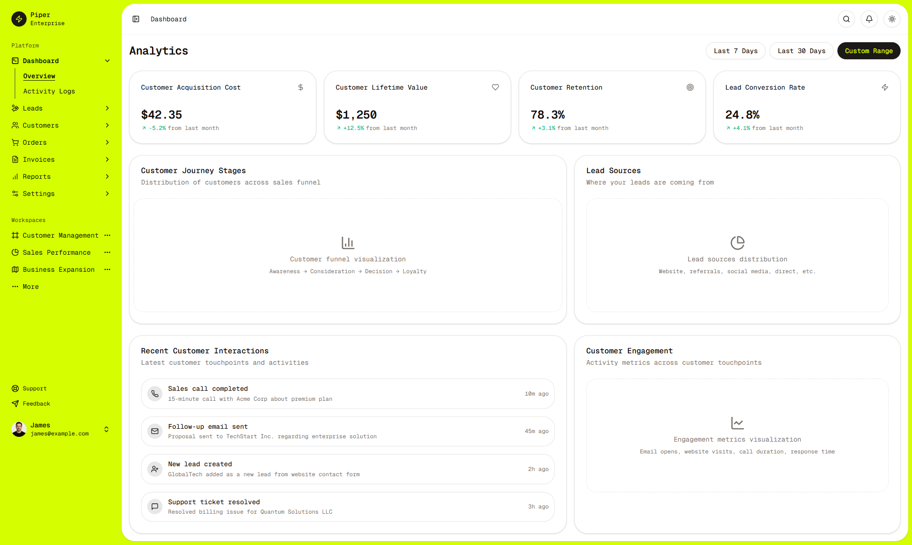

# Intentified - Intent-Driven Customer Relationship Platform

A modern intelligence-driven customer relationship platform built with Next.js and Shadcn UI components, featuring an intuitive interface for capturing, analyzing, and acting on customer intent signals to drive meaningful revenue growth.

## Product Overview

Intentified transforms how businesses understand and respond to customer intent. By collecting and analyzing real-time intent signals across multiple touchpoints, the platform helps companies:

- **Identify opportunities** based on real-time buying signals
- **Convert unknown visitors** into qualified leads using AI-driven insights
- **Optimize marketing spend** by focusing on high-intent prospects
- **Streamline workflows** with automated, intent-based actions
- **Drive revenue growth** through precision-targeted engagement

## Features

- **Intelligence-Driven UI**: Built with Shadcn UI components and Tailwind CSS
- **Intent Signal Tracking**: Capture and analyze real-time intent signals across billions of data points
- **Comprehensive Modules**: Customers, Leads, Invoices, Orders, and Reports
- **Responsive Design**: Fully responsive dashboard that works on all devices
- **Dark Mode Support**: Toggle between light and dark themes
- **Secure Authentication**: Role-based access control with Clerk authentication
- **Supabase Integration**: Powerful database and backend services

## Screenshots

### Dashboard Views




### Landing Page


### Mobile Experience

<div style="display: flex; justify-content: space-between;">
  
  
  
</div>

## Core Capabilities

### Intent Identification

- Real-Time Signal Capture: Monitor active buying signals across touchpoints
- Competitor Insights: Identify and target prospects looking at competitors
- Anonymous Visitor Tracking: Build profiles before formal identification

### Precision Analytics

- AI-driven Insights: Transform anonymous data into actionable intelligence
- Intent Dashboard: Visual representations of customer journey and intent
- Conversion Metrics: Track how intent signals translate to revenue

### Lead Management

- Lead Scoring: Prioritize prospects based on intent strength and fit
- Automated Workflows: Trigger actions based on intent signals
- Qualification Tracking: Monitor the journey from lead to customer

### Customer Relationship Tools

- Customer Segmentation: Group customers by behavior and value
- Order and Invoice Tracking: Manage transactions in one place
- Activity Logging: Keep detailed records of all customer interactions

## Technical Architecture

Intentified follows a feature-based architecture with clear separation of concerns:

### Frontend Framework

- **Next.js 15**: Server-side rendering, API routes, and modern React features
- **React 19**: Latest React version with concurrent rendering capabilities
- **TypeScript**: Strong typing throughout the application

### UI Components

- **Shadcn UI**: Re-usable components built on Radix UI primitives
- **Tailwind CSS**: Utility-first CSS framework for styling
- **Lucide Icons**: SVG icon set for consistent iconography

### Authentication & Authorization

- **Clerk**: User authentication, session management, and user metadata
- **Role-Based Access**: Protected routes based on user roles
- **Middleware**: Enforces authentication and authorization rules

### Database & Backend

- **Supabase**: PostgreSQL database with real-time capabilities
- **React Query**: Server state management, caching, and data fetching
- **Server Actions**: Form submissions and data mutations

### Data Visualization

- **Recharts**: Responsive charts and data visualization
- **TanStack Table**: Powerful, headless table library for data display

## Key Technical Features

### Intent Sequence Visualization

Custom components for visualizing customer intent:

- `IntentSequenceMultipleInputs`: Multiple data sources feeding the intent engine
- `IntentSequenceMultipleOutputs`: Intent signals driving multiple outputs
- `IntentSequenceWorkflowAnimation`: Animated intent data flows

### Dashboard Layout System

- Collapsible sidebar navigation
- Breadcrumb-based navigation
- Responsive design with mobile adaptations
- Light/dark theme switching

### Data Management Features

- Filtering capabilities
- Sorting functionality
- Pagination
- Export/import tools
- Context menus for actions

## Project Structure

```
src/
├── app/                 # Next.js App Router
│   ├── dashboard/       # Protected dashboard routes
│   │   ├── activity-logs/
│   │   ├── customers/
│   │   ├── leads/
│   │   ├── orders/
│   │   ├── reports/
│   │   └── ...
│   ├── sign-in/         # Authentication pages
│   └── sign-up/
├── components/          # Reusable components
│   ├── ui/              # Shadcn UI components
│   ├── shared/          # Common shared components
│   └── intent-sequence/ # Intent visualization components
├── features/            # Feature-based modules
│   ├── dashboard/       # Dashboard-related features
│   │   ├── components/  # UI components specific to dashboard
│   │   └── pages/       # Page components for dashboard sections
│   └── landing/         # Landing page components
├── data/                # Static data and fixtures
├── hooks/               # Custom React hooks
├── lib/                 # Utility functions and helpers
├── providers/           # Context providers
└── utils/               # Helper utilities
```

## Tech Stack

- **Framework**: Next.js 15.x with React 19
- **Styling**: Tailwind CSS
- **UI Components**: Shadcn UI with Radix UI primitives
- **Authentication**: Clerk with role-based access control
- **Database**: Supabase
- **State Management**: React Query for server state
- **Charts & Visualizations**: Recharts
- **Form Handling**: React Hook Form with Zod validation

## Authentication Setup

This project uses [Clerk](https://clerk.com) for authentication and user management. To set it up:

1. Create a Clerk account and project
2. Copy your API keys from the Clerk Dashboard
3. Create a `.env.local` file with your Clerk keys
4. Configure admin users by setting the role metadata in Clerk Dashboard

## Database Setup

This project uses [Supabase](https://supabase.com) for database and backend services:

1. Create a Supabase account and project
2. Add the required environment variables to your `.env.local` file

## Future Development Opportunities

- Advanced AI functionality for intent analysis
- Expanded integration capabilities
- Enhanced visualization and reporting tools
- Mobile application development

## Getting Started

First, install the dependencies:

```bash
npm install
# or
yarn install
# or
pnpm install
# or
bun install
```

Then, run the development server:

```bash
npm run dev
# or
yarn dev
# or
pnpm dev
# or
bun dev
```

Open [http://localhost:3000](http://localhost:3000) with your browser to see the result.

## Deployment

For detailed deployment instructions, please see [DEPLOYMENT.md](./DEPLOYMENT.md).