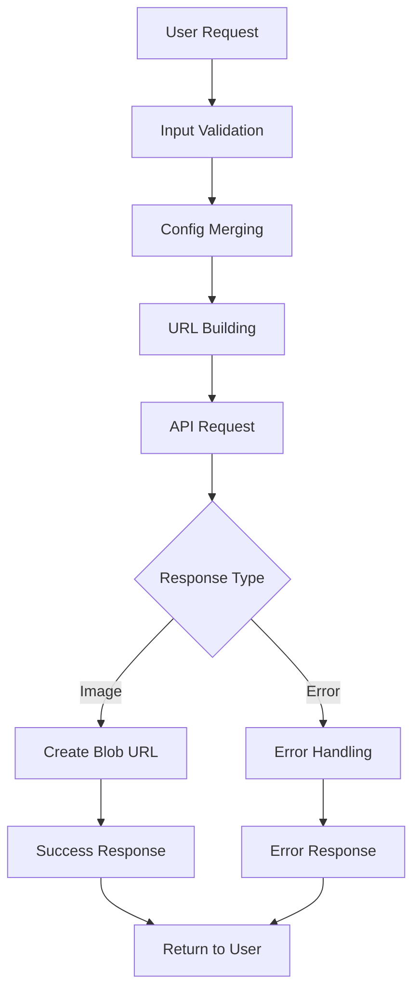

# Screenshot Service Documentation

## Overview

The Screenshot Service provides a comprehensive, type-safe wrapper around the screenshothis.com API for capturing website screenshots. It offers both simple and advanced functionality including retry logic, batch processing, and extensive configuration options.

## Architecture

### Core Components

#### 1. **Configuration Management**
- **Environment Variables**: Manages API keys and service configuration
- **Default Settings**: Provides sensible defaults for all optional parameters
- **Config Merging**: Intelligently combines user input with defaults

#### 2. **Request Processing**
- **URL Validation & Normalization**: Ensures URLs are properly formatted
- **Parameter Encoding**: Handles URL encoding and API parameter formatting
- **Request Building**: Constructs complete API requests with all parameters

#### 3. **Response Handling**
- **Image Processing**: Handles blob responses and creates object URLs
- **Error Classification**: Categorizes different types of failures
- **Metadata Extraction**: Provides detailed response information

#### 4. **Advanced Features**
- **Retry Logic**: Implements exponential backoff for failed requests
- **Batch Processing**: Handles multiple screenshots with rate limiting
- **Caching Support**: Provides cache key generation for external caching

## Data Flow



### Request Flow

1. **Input Validation**
   - Validates required URL parameter
   - Checks URL format and protocol
   - Verifies API key availability

2. **Configuration Processing**
   - Merges user config with defaults
   - Normalizes URL (adds https if missing)
   - Validates optional parameters

3. **API Request Construction**
   - Builds complete API URL with parameters
   - Handles URL encoding
   - Sets up timeout controls

4. **Response Processing**
   - Checks response content type
   - Creates blob URLs for images
   - Handles error responses appropriately

## Key Modules

### Core Functions

#### `takeScreenshot(config: ScreenshotConfig): Promise<ScreenshotResponse>`
Primary function for capturing a single screenshot.

**Features:**
- Input validation and normalization
- Timeout control with AbortController
- Comprehensive error handling
- Blob URL generation for images

**Usage:**
```typescript
const result = await takeScreenshot({
  url: 'https://example.com',
  fullPage: true,
  format: 'webp'
});
```

#### `takeMultipleScreenshots(configs: ScreenshotConfig[], concurrency?: number): Promise<ScreenshotResponse[]>`
Batch processing for multiple screenshots with rate limiting.

**Features:**
- Configurable concurrency control
- Automatic rate limiting between chunks
- Graceful handling of partial failures
- Progress tracking support

**Usage:**
```typescript
const results = await takeMultipleScreenshots([
  { url: 'https://site1.com' },
  { url: 'https://site2.com' }
], 2);
```

#### `takeScreenshotWithRetry(config: ScreenshotConfig, maxRetries?: number): Promise<ScreenshotResponse>`
Enhanced screenshot capture with retry logic.

**Features:**
- Exponential backoff retry strategy
- Smart error classification (retryable vs. permanent)
- Configurable retry attempts
- Comprehensive error reporting

**Usage:**
```typescript
const result = await takeScreenshotWithRetry({
  url: 'https://example.com'
}, 3);
```

### Utility Functions

#### `validateUrl(url: string): boolean`
Validates URL format and protocol.

#### `normalizeUrl(url: string): string`
Ensures URLs have proper protocol (defaults to https).

#### `encodeTargetUrl(url: string): string`
Handles URL encoding for API consumption.

#### `buildApiUrl(config: ScreenshotConfig): string`
Constructs complete API request URLs.

#### `handleScreenshotError(error: any): ScreenshotError`
Categorizes and formats error responses.

#### `getCacheKey(config: ScreenshotConfig): string`
Generates cache keys for external caching systems.

## Configuration Options

### Required Parameters
- **`url`**: Target website URL to screenshot

### Optional Parameters
- **`blockAds`**: Block advertisements (default: true)
- **`blockCookieBanners`**: Block cookie consent banners (default: true)
- **`blockTrackers`**: Block tracking scripts (default: true)
- **`prefersColorScheme`**: Light or dark mode preference (default: 'light')
- **`format`**: Image format - png, jpeg, webp (default: 'png')
- **`fullPage`**: Capture entire page vs. viewport (default: false)
- **`viewportWidth`**: Browser viewport width (default: 1920)
- **`viewportHeight`**: Browser viewport height (default: 1080)
- **`delay`**: Delay before capture in milliseconds (default: 0)
- **`timeout`**: Request timeout in milliseconds (default: 30000)

## Environment Configuration

### Required Environment Variables
```bash
SCREENSHOT_API_KEY=your_screenshothis_api_key
```

### Optional Environment Variables
```bash
SCREENSHOT_API_BASE_URL=https://api.screenshothis.com/v1/screenshots/take
SCREENSHOT_DEFAULT_TIMEOUT=30000
SCREENSHOT_MAX_RETRIES=3
```

## Error Handling

### Error Categories

#### Validation Errors
- Invalid URL format
- Missing required parameters
- Missing API key

#### Network Errors
- Connection timeouts
- DNS resolution failures
- Network connectivity issues

#### API Errors
- Invalid API key (401)
- Rate limiting (429)
- Bad request parameters (400)
- Service unavailable (5xx)

#### Response Errors
- Unexpected response format
- Missing image data
- Malformed responses

### Error Response Format
```typescript
interface ScreenshotError {
  code: string;      // Error category code
  message: string;   // Human-readable error message
  details?: any;     // Technical details for debugging
}
```

## Integration Examples

### Basic Screenshot
```typescript
import { takeScreenshot } from '@/packages/ai/lib/screenshot';

const result = await takeScreenshot({
  url: 'https://example.com'
});

if (result.success) {
  console.log('Screenshot URL:', result.imageUrl);
} else {
  console.error('Error:', result.error);
}
```

### Advanced Configuration
```typescript
const result = await takeScreenshot({
  url: 'https://example.com',
  fullPage: true,
  format: 'webp',
  viewportWidth: 1280,
  viewportHeight: 720,
  prefersColorScheme: 'dark',
  blockAds: true,
  delay: 2000
});
```

### Batch Processing
```typescript
const configs = [
  { url: 'https://competitor1.com' },
  { url: 'https://competitor2.com' },
  { url: 'https://competitor3.com' }
];

const results = await takeMultipleScreenshots(configs, 2);
const successful = results.filter(r => r.success);
console.log(`Successfully captured ${successful.length}/${results.length} screenshots`);
```

### With Retry Logic
```typescript
const result = await takeScreenshotWithRetry({
  url: 'https://unreliable-site.com'
}, 5);
```

### With Caching
```typescript
import { getCacheKey, takeScreenshot } from '@/packages/ai/lib/screenshot';

const config = { url: 'https://example.com' };
const cacheKey = getCacheKey(config);

// Check cache first
let result = await getFromCache(cacheKey);

if (!result) {
  result = await takeScreenshot(config);
  if (result.success) {
    await saveToCache(cacheKey, result);
  }
}
```

## Performance Considerations

### Rate Limiting
- Built-in concurrency control for batch operations
- Automatic delays between request chunks
- Respects API rate limits

### Memory Management
- Uses blob URLs for efficient image handling
- Automatic cleanup of temporary resources
- Streaming for large responses

### Timeout Handling
- Configurable request timeouts
- AbortController for clean cancellation
- Prevents hanging requests

## Integration Points

### With AI Services
```typescript
// Competitor analysis pipeline
const screenshots = await takeMultipleScreenshots(
  competitors.map(comp => ({ 
    url: comp.website,
    fullPage: true 
  }))
);
```

### With Storage Services
```typescript
// Save to Supabase storage
const result = await takeScreenshot({ url: website });
if (result.success) {
  const file = await fetch(result.imageUrl).then(r => r.blob());
  await supabase.storage.from('screenshots').upload(`${id}.png`, file);
}
```

### With Caching Systems
```typescript
// Redis caching integration
const cacheKey = getCacheKey(config);
const cached = await redis.get(cacheKey);

if (!cached) {
  const result = await takeScreenshot(config);
  if (result.success) {
    await redis.setex(cacheKey, 3600, JSON.stringify(result));
  }
}
```

## Testing Strategy

### Unit Tests
- Configuration validation
- URL encoding and normalization
- Error handling and classification
- Cache key generation

### Integration Tests
- API connectivity and responses
- Timeout and retry behavior
- Batch processing functionality

### Mock Testing
```typescript
// Mock API responses for testing
jest.mock('fetch');
const mockFetch = fetch as jest.MockedFunction<typeof fetch>;

mockFetch.mockResolvedValueOnce({
  ok: true,
  headers: { get: () => 'image/png' },
  blob: () => Promise.resolve(new Blob())
} as any);
```

## Troubleshooting

### Common Issues

#### Missing API Key
```
Error: Screenshot API key is not configured
Solution: Set SCREENSHOT_API_KEY environment variable
```

#### Invalid URL Format
```
Error: Invalid URL format
Solution: Ensure URL includes protocol (http:// or https://)
```

#### Rate Limiting
```
Error: API rate limit exceeded
Solution: Reduce concurrency or add delays between requests
```

#### Timeout Issues
```
Error: Screenshot request timed out
Solution: Increase timeout value or check network connectivity
```

### Debug Mode
Enable detailed logging by setting environment variable:
```bash
DEBUG=screenshot:*
```

## Future Enhancements

### Planned Features
- WebP optimization for smaller file sizes
- Custom CSS injection for page styling
- Mobile device emulation
- PDF generation support
- Watermark overlay capabilities

### Performance Optimizations
- Connection pooling for batch requests
- Progressive image loading
- Compression options
- CDN integration for image delivery

### Advanced Integrations
- Webhook support for async processing
- Queue management for high-volume usage
- Analytics and usage tracking
- Cost optimization features 