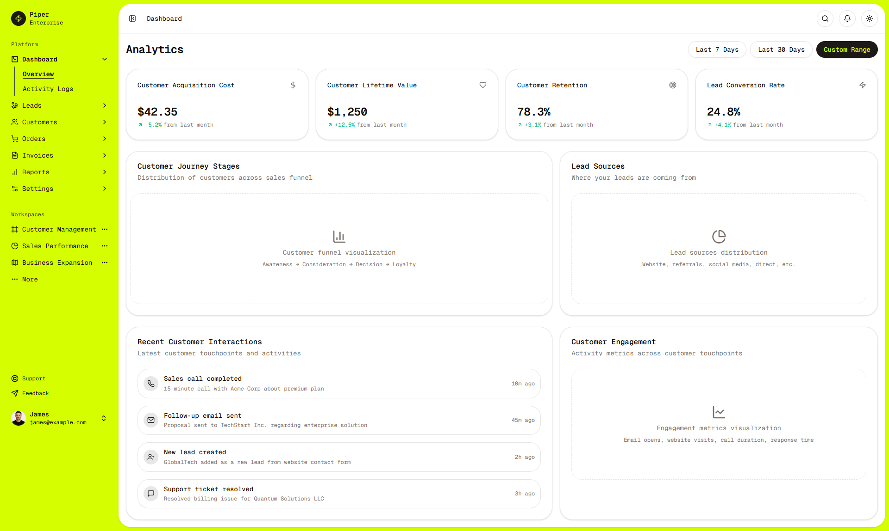
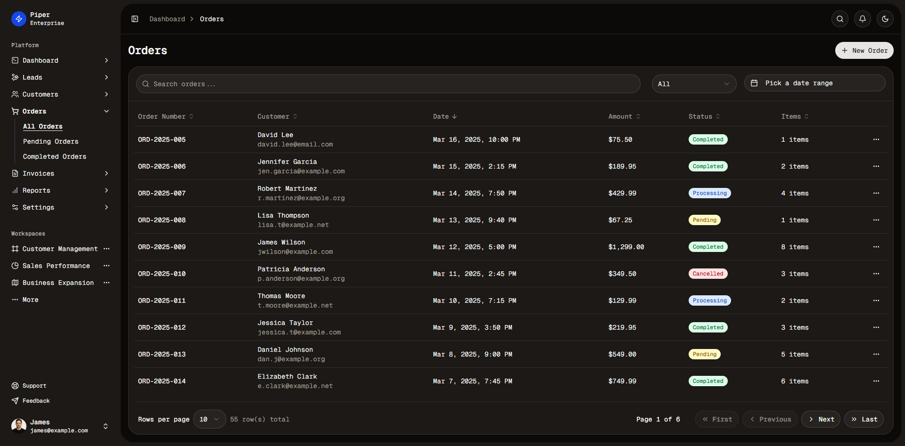
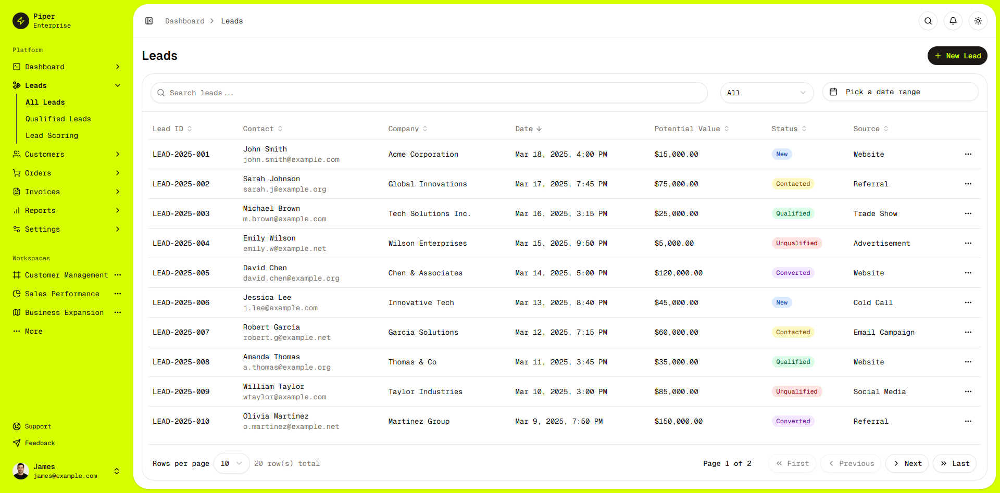
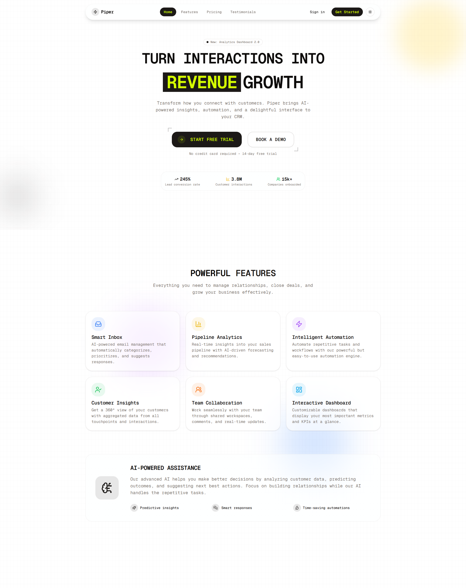
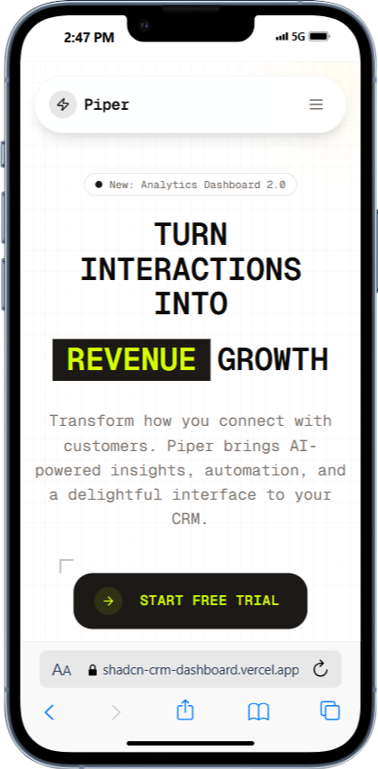
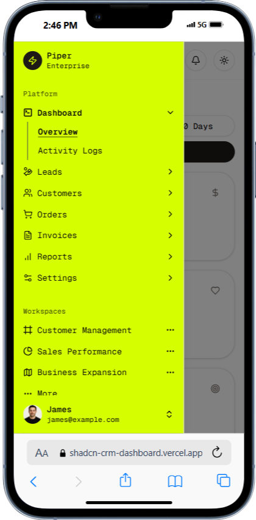
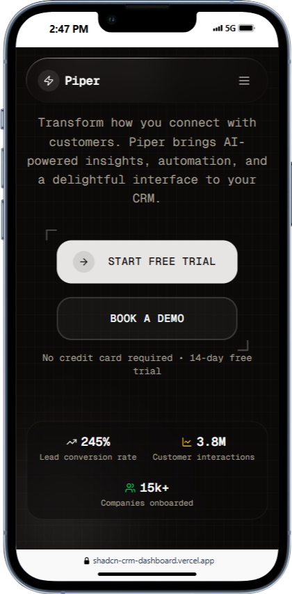

# Intentified - Intent-Driven Customer Relationship Platform

A modern intelligence-driven customer relationship platform built with Next.js and Shadcn UI components, featuring an intuitive interface for capturing, analyzing, and acting on customer intent signals to drive meaningful revenue growth.

## Product Overview

Intentified transforms how businesses understand and respond to customer intent. By collecting and analyzing real-time intent signals across multiple touchpoints, the platform helps companies:

- **Identify opportunities** based on real-time buying signals
- **Convert unknown visitors** into qualified leads using AI-driven insights
- **Optimize marketing spend** by focusing on high-intent prospects
- **Streamline workflows** with automated, intent-based actions
- **Drive revenue growth** through precision-targeted engagement

## Features

- **Intelligence-Driven UI**: Built with Shadcn UI components and Tailwind CSS
- **Intent Signal Tracking**: Capture and analyze real-time intent signals across billions of data points
- **Comprehensive Modules**: Customers, Leads, Invoices, Orders, and Reports
- **Responsive Design**: Fully responsive dashboard that works on all devices
- **Dark Mode Support**: Toggle between light and dark themes
- **Secure Authentication**: Role-based access control with Clerk authentication
- **Supabase Integration**: Powerful database and backend services

## Screenshots

### Dashboard Views





### Landing Page



### Mobile Experience

<div style="display: flex; justify-content: space-between;">
  
  
  
</div>

## Core Capabilities

### Intent Identification

- Real-Time Signal Capture: Monitor active buying signals across touchpoints
- Competitor Insights: Identify and target prospects looking at competitors
- Anonymous Visitor Tracking: Build profiles before formal identification

### Precision Analytics

- AI-driven Insights: Transform anonymous data into actionable intelligence
- Intent Dashboard: Visual representations of customer journey and intent
- Conversion Metrics: Track how intent signals translate to revenue

### Lead Management

- Lead Scoring: Prioritize prospects based on intent strength and fit
- Automated Workflows: Trigger actions based on intent signals
- Qualification Tracking: Monitor the journey from lead to customer

### Customer Relationship Tools

- Customer Segmentation: Group customers by behavior and value
- Order and Invoice Tracking: Manage transactions in one place
- Activity Logging: Keep detailed records of all customer interactions

## Technical Architecture

Intentified follows a feature-based architecture with clear separation of concerns:

### Frontend Framework

- **Next.js 15**: Server-side rendering, API routes, and modern React features
- **React 19**: Latest React version with concurrent rendering capabilities
- **TypeScript**: Strong typing throughout the application

### UI Components

- **Shadcn UI**: Re-usable components built on Radix UI primitives
- **Tailwind CSS**: Utility-first CSS framework for styling
- **Lucide Icons**: SVG icon set for consistent iconography

### Authentication & Authorization

- **Clerk**: User authentication, session management, and user metadata
- **Role-Based Access**: Protected routes based on user roles
- **Middleware**: Enforces authentication and authorization rules

### Database & Backend

- **Supabase**: PostgreSQL database with real-time capabilities
- **React Query**: Server state management, caching, and data fetching
- **Server Actions**: Form submissions and data mutations

### Data Visualization

- **Recharts**: Responsive charts and data visualization
- **TanStack Table**: Powerful, headless table library for data display

## Key Technical Features

### Intent Sequence Visualization

Custom components for visualizing customer intent:

- `IntentSequenceMultipleInputs`: Multiple data sources feeding the intent engine
- `IntentSequenceMultipleOutputs`: Intent signals driving multiple outputs
- `IntentSequenceWorkflowAnimation`: Animated intent data flows

### Dashboard Layout System

- Collapsible sidebar navigation
- Breadcrumb-based navigation
- Responsive design with mobile adaptations
- Light/dark theme switching

### Data Management Features

- Filtering capabilities
- Sorting functionality
- Pagination
- Export/import tools
- Context menus for actions

## Project Structure

```
src/
├── app/                 # Next.js App Router
│   ├── dashboard/       # Protected dashboard routes
│   │   ├── activity-logs/
│   │   ├── customers/
│   │   ├── leads/
│   │   ├── orders/
│   │   ├── reports/
│   │   └── ...
│   ├── sign-in/         # Authentication pages
│   └── sign-up/
├── components/          # Reusable components
│   ├── ui/              # Shadcn UI components
│   ├── shared/          # Common shared components
│   └── intent-sequence/ # Intent visualization components
├── features/            # Feature-based modules
│   ├── dashboard/       # Dashboard-related features
│   │   ├── components/  # UI components specific to dashboard
│   │   └── pages/       # Page components for dashboard sections
│   └── landing/         # Landing page components
├── data/                # Static data and fixtures
├── hooks/               # Custom React hooks
├── lib/                 # Utility functions and helpers
├── providers/           # Context providers
└── utils/               # Helper utilities
```

## Tech Stack

- **Framework**: Next.js 15.x with React 19
- **Styling**: Tailwind CSS
- **UI Components**: Shadcn UI with Radix UI primitives
- **Authentication**: Clerk with role-based access control
- **Database**: Supabase
- **State Management**: React Query for server state
- **Charts & Visualizations**: Recharts
- **Form Handling**: React Hook Form with Zod validation

## Authentication Setup

This project uses [Clerk](https://clerk.com) for authentication and user management. To set it up:

1. Create a Clerk account and project
2. Copy your API keys from the Clerk Dashboard
3. Create a `.env.local` file with your Clerk keys
4. Configure admin users by setting the role metadata in Clerk Dashboard

## Database Setup

This project uses [Supabase](https://supabase.com) for database and backend services:

1. Create a Supabase account and project
2. Add the required environment variables to your `.env.local` file

## Future Development Opportunities

- Advanced AI functionality for intent analysis
- Expanded integration capabilities
- Enhanced visualization and reporting tools
- Mobile application development

## Getting Started

First, install the dependencies:

```bash
npm install
# or
yarn install
# or
pnpm install
# or
bun install
```

Then, run the development server:

```bash
npm run dev
# or
yarn dev
# or
pnpm dev
# or
bun dev
```

Open [http://localhost:3000](http://localhost:3000) with your browser to see the result.

## Deployment

For detailed deployment instructions, please see [DEPLOYMENT.md](./DEPLOYMENT.md).


// tailwind.config.js
module.exports = {
  theme: {
    extend: {
      colors: {
        text: '#bbf5fd',
        background: '#000000',
        primary: '#006a75',
        secondary: '#70e7ff',
        accent: '#c2fff9',
      },
    },
  },
}


<!-- 10000 -->
1. Client Sign Ups 
2. 15000000
3. To calculate the cost per lead, I'll divide the monthly cost by the number of leads.
Cost per lead = Monthly cost / Number of leads
Cost per lead = $2,000 / 15,000,000
Cost per lead = $0.0001333... per lead
This equals approximately $0.00013 per lead or about 0.013 cents per lead.


 Absolutely! Let me document the complete data flow sequence for the competitive analysis on the
landing page:

Competitive Analysis Data Flow Documentation
1. UI Component Trigger

📍 File: apps/intentified/src/components/intentified-signal-sourcing-pipeline.tsx
User clicks "Start Tracking Intent Signals" button
↓
handleStartTracking() → setIsModalOpen(true)
↓
Modal opens with MultiStepForm component
1. Form Component

📍 File: apps/intentified/src/components/ai-form-flow/multi-step-form.tsx
MultiStepForm renders with:
- steps: COMPETITOR_ANALYSIS_CONFIG.steps (3 steps)
- mode: "competitor-analysis"
- streamHook: "competitor-analysis"
  ↓
  User completes form (company name, industry, website)
  ↓
  handleNext() → final step triggers stream connection
1. Stream Hook

📍 File: apps/intentified/src/hooks/use-competitor-analysis-stream.ts
useCompetitorAnalysisStream().connect() called with:
{
websiteUrl: "user-entered-url",
companyName: "user-entered-name",
industry: "user-selected-industry",
skipScreenshot: true
}
↓
Makes POST request to API endpoint
1. API Route Handler

📍 File: apps/intentified/src/app/api/intelligence/competitor-analysis/stream/route.ts
POST /api/intelligence/competitor-analysis/stream
↓
Validates request body (websiteUrl required)
↓
Creates CompetitorAnalysisRequest object
↓
Calls streamCompetitorAnalysis(request)
1. Stream Action

📍 File: apps/intentified/src/app/actions/stream-competitor-analysis.ts
streamCompetitorAnalysis() → createDataStreamResponse()
↓
Phase 1: Initialization - streams "Starting comprehensive competitor intelligence..."
↓
Phase 2: Enrichment - calls enrichCompanyBulk()
↓
Phase 3: Analysis - calls analyzeCompetitiveLandscape()
↓
Streams final result
1. Company Enrichment Service

📍 File: packages/ai/domains/enrichment/enrichment.service.ts
enrichCompanyBulk() called:
↓
1. exaR.scrapeWebsiteUrl(req) - main page content
   ↓
2. exaR.scrapeWebsiteSubPages(req) - subpage content
   ↓
3. takeScreenshot() - (skipped due to skipScreenshot: true)
   ↓
4. insights.summary() - AI analysis of content
   ↓
   Parallel execution of enrichment types:
- basic-info, company-summary, competitors, mind-map, news, website-sub-pages
1. Competitive Landscape Analysis

📍 File: packages/ai/domains/analysis/analysis.service.ts
analyzeCompetitiveLandscape() executes:
↓
Step 1: Scrape website content (main + sub pages)
↓
Step 2: Generate company summary via insights.summary()
↓
Step 3: Find competitors via exaR.findCompetitors()
↓
Step 4: Gather news via exaR.findNews()
↓
Step 5: Generate mind map via insights.mindMap()
↓
Process and structure final response
1. External API Services

📍 Files: packages/ai/integrations/exa/ & packages/ai/services/insights/
exaService - Web scraping and research
↓
- scrapeWebsiteUrl() - Extract main page content
- scrapeWebsiteSubPages() - Extract subpage content
- findCompetitors() - Identify competitors
- findNews() - Gather market news

insights - AI-powered analysis
↓
- summary() - Generate company positioning summary
- mindMap() - Create competitive intelligence map
1. Data Flow Back to UI

Analysis results → analyzeCompetitiveLandscape()
↓
Stream updates → streamCompetitorAnalysis()
↓
API response → /api/intelligence/competitor-analysis/stream
↓
Stream hook → useCompetitorAnalysisStream()
↓
MultiStepForm receives progress updates
↓
User sees real-time analysis progress
↓
Modal shows completion screen with results

Key Data Structures Flowing Through:
1. CompetitorAnalysisRequest
   - websiteUrl, companyName, industry, skipScreenshot
2. EnrichmentProgress
   - currentStep, totalSteps, currentType, completedTypes
3. CompetitorAnalysisResponse
   - company data, competitiveLandscape, insights, summary
4. Stream Updates
   - type: 'phase' | 'enrichment' | 'analysis' | 'result'
   - Real-time progress and results

This architecture enables real-time streaming of competitive analysis with clear separation of
concerns between UI, API, and AI processing layers.