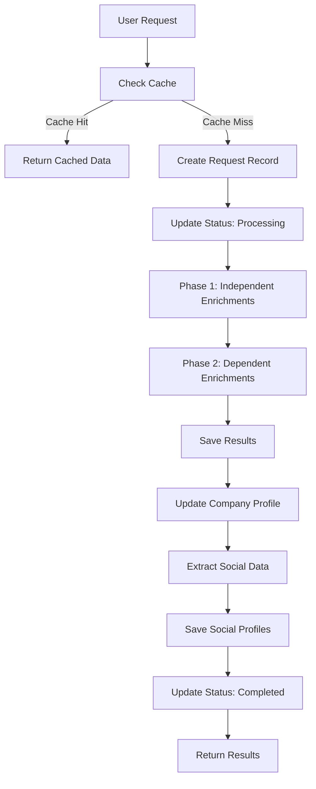
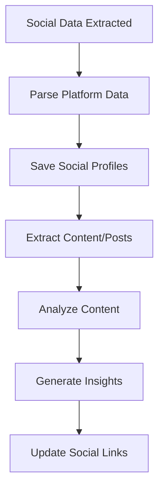
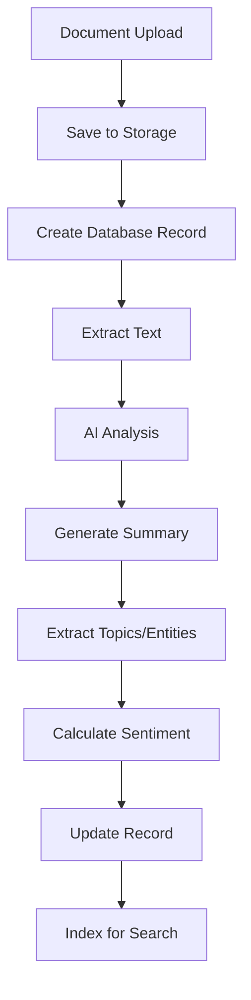
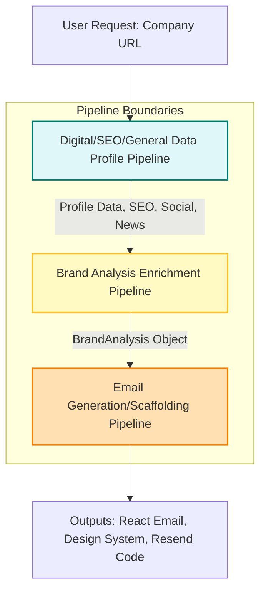
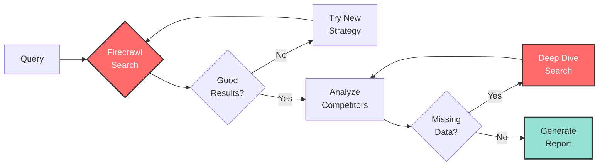

This file is a merged representation of a subset of the codebase, containing specifically included files, combined into a single document by Repomix.
The content has been processed where comments have been removed, empty lines have been removed, content has been formatted for parsing in markdown style, content has been compressed (code blocks are separated by ⋮---- delimiter).

# File Summary

## Purpose
This file contains a packed representation of the entire repository's contents.
It is designed to be easily consumable by AI systems for analysis, code review,
or other automated processes.

## File Format
The content is organized as follows:
1. This summary section
2. Repository information
3. Directory structure
4. Repository files (if enabled)
5. Multiple file entries, each consisting of:
  a. A header with the file path (## File: path/to/file)
  b. The full contents of the file in a code block

## Usage Guidelines
- This file should be treated as read-only. Any changes should be made to the
  original repository files, not this packed version.
- When processing this file, use the file path to distinguish
  between different files in the repository.
- Be aware that this file may contain sensitive information. Handle it with
  the same level of security as you would the original repository.

## Notes
- Some files may have been excluded based on .gitignore rules and Repomix's configuration
- Binary files are not included in this packed representation. Please refer to the Repository Structure section for a complete list of file paths, including binary files
- Only files matching these patterns are included: packages/ai
- Files matching patterns in .gitignore are excluded
- Files matching default ignore patterns are excluded
- Code comments have been removed from supported file types
- Empty lines have been removed from all files
- Content has been formatted for parsing in markdown style
- Content has been compressed - code blocks are separated by ⋮---- delimiter
- Files are sorted by Git change count (files with more changes are at the bottom)

# Directory Structure
```
packages/
  ai/
    .claude/
      settings.local.json
    agents/
      action/
        server-action/
          send-message.tsx
        thread/
          single/
            send-message.tsx
        chat-service.ts
        form-service.ts
        map-ui-state.tsx
        server-action-handler.ts
        storage-service.ts
        ui-streamer.tsx
      tools/
        schema/
          exa-research.ts
          exa.ts
          firecrawl.ts
          index.ts
          intelligence-enrichment.ts
          serper.ts
          tavily.ts
        types/
          ai.ts
          firecrawl.ts
          general.ts
          index.ts
          root.ts
          serper.ts
          tavily.ts
        competitive-analysis-tool.ts
        enrich-company-data-tool.ts
        enrich-company-summary-tool.ts
        enrich-competitors-tool.ts
        exa-research-tool.ts
        exa-tool.ts
        firecrawl-tool.ts
        index.ts
        intelligence-enrichment-tool.ts
        root.ts
        serper-tool.ts
        tavily-tool.ts
      utilities/
        common.ts
        generate-mindmap.ts
        index.ts
        summarize.ts
      index.ts
    components/
      message.tsx
      thread.tsx
    core/
      llm/
        anthropic.ts
        AnthropicModels_PSEUDOCODE.md
        AnthropicModels.md
        google.ts
        groq.ts
        model-registry.ts
        model-root.ts
        model-types.ts
        openai.ts
        xai.ts
      prompts/
        create-prompt.ts
        marketing.prompts.ts
        SEO_CRITERIA_BASE.prompt.ts
        SEO.prompt.ts
      system-instructions/
        index.ts
        sys-instruct-defined-insight.ts
        sys-instruct-extractor.ts
        sys-instruct-insight.ts
        sys-instruct-products.ts
        sys-instruct-related.ts
      workflows/
        index.ts
        research-report.service.ts
        types.ts
        workflow-orchestrator.service.ts
      README.md
    domains/
      enrichment/
        enrichment-persistence.service.ts
        enrichment.service.ts
        enrichment.test.ts
        example-usage.ts
        IMPLEMENTATION.md
        index.ts
        types.ts
      marketing/
        brand-analysis-enrichment.md
        brand-extractor.ts
        brand-positioning.ts
        brand-sentiment.ts
        Comprehensive List of AI Prompts for NewCopy.md
        index.ts
        marketing-intelligence.ts
        potential-marketing-integrations.md
        prompts.ts
        react-email-generator.service.ts
        services.spec.md
        social-media.ts
        types.ts
      seo/
        prompt.ts
        service.ts
    integrations/
      exa/
        exa-research.ts
        exa.ts
        index.ts
      screenshot/
        index.ts
        screenshot.api.ts
        screenshot.ts
      twilio/
        sms.ts
      firecrawl.ts
      index.ts
      serper.ts
      tavily.ts
      types.ts
    services/
      document-storage.service.ts
      index.ts
      insights.ts
      persistence.service.ts
      pure-services.ts
    workflows/
      competitive-analysis/
        README.md
        search-competitor-analysis-workflow.ts
      index.ts
      inquiry-generator.tsx
      intelligence-enrichment.ts
      query-extractor.ts
      query-suggestor.tsx
      root.ts
      RootAgentRefactor_PSEUDOCODE.md
      submit-message.tsx
      task-manager.tsx
      title-crafter.tsx
    AGENTS.md
    AIStatus.md
    index.ts
    keys.ts
    package.json
    README.mmd
    REFACTOR.md
    tsconfig.json
```

# Files

## File: packages/ai/.claude/settings.local.json
````json
{
  "enableAllProjectMcpServers": false
}
````

## File: packages/ai/agents/action/server-action/send-message.tsx
````typescript
import {SubmitMessagePayload, UIComponent} from '@/lib/types/ai'
import {google} from '@ai-sdk/google'
import {CoreMessage, Message, convertToCoreMessages, generateId} from 'ai'
import {getMutableAIState, streamUI} from 'ai/rsc'
import {storageService} from '../storage-service'
import {queryExtractor} from '../../workflows/query-extractor'
import {AI} from '@/app/action'
import {z} from 'zod'
export async function sendMessage(
  payload: SubmitMessagePayload
): Promise<UIComponent>
````

## File: packages/ai/agents/action/thread/single/send-message.tsx
````typescript
import { google } from "@ai-sdk/google";
import { CoreMessage, generateId } from "ai";
import { getMutableAIState, streamUI } from "ai/rsc";
import { z } from "zod";
import { queryExtractor } from "@/lib/agents/workflow/query-extractor";
import { AI, MessageProperty } from "@/app/(server-action)/action-single";
export async function sendMessage(formData: FormData)
````

## File: packages/ai/agents/action/chat-service.ts
````typescript
import { revalidatePath } from "next/cache";
import { redirect } from "next/navigation";
import { getRedisClient, RedisWrapper } from "@/lib/database/redis/root";
import fs from "fs";
import { ChatProperties } from "@/lib/types/ai";
import logger from "@/lib/utility/logger/root";
async function getRedis(): Promise<RedisWrapper>
export async function getChats(userId?: string | null)
export async function getChat(id: string)
export async function clearChats(
  userId: string = "anonymous"
): Promise<
export async function saveChat(userId: string, chat: ChatProperties)
export async function getSharedChat(id: string)
export async function shareChat(id: string, userId: string = "anonymous")
````

## File: packages/ai/agents/action/form-service.ts
````typescript
type FileData = {
  name: string;
  type: string;
  size: number;
  buffer: string;
};
type FormDataResult = {
  textInputs: Record<string, string>;
  files: FileData[];
};
export async function handleFormInput(
  formData: FormData
): Promise<FormDataResult>
````

## File: packages/ai/agents/action/map-ui-state.tsx
````typescript
import { ReactNode } from "react";
import { AssistantMessage } from "@/components/kratos/assistant-message";
import { UserMessage } from "@/components/kratos/user-message";
import { FileMessage } from "@/components/kratos/file-message";
import { ImageMessage } from "@/components/kratos/image-message";
import { ToolCallMessage } from "@/components/kratos/toll-call-message";
import { ProductCardContainer } from "@/components/kratos/product-card-container";
import {
  AIState,
  MessageProperty,
  UIState,
  AvailableTool,
  ExtendedToolResult,
} from "@/lib/types/ai";
import { ToolCallPart, ToolContent } from "ai";
import { ProductInsight, ProductsResponse } from "@/lib/types/general";
import { SectionToolResult } from "@/components/kratos/section-tool-result";
type MessageContent = {
  type: string;
  text?: string;
  data?: string;
  image?: string;
  toolName?: AvailableTool;
  result?: string;
};
type UIStateItem = {
  id: string;
  display: ReactNode;
};
const generateUniqueId = (baseId: string, index: number): string
const handleProductSearch = (result: string, id: string): UIStateItem =>
const handleGetProductDetails = (id: string, result: string): UIStateItem =>
const handleToolResult = (
  toolContent: MessageContent,
  id: string
): UIStateItem =>
⋮----
if (!Array.isArray(message.content))
⋮----
export const mapUIState = (state: AIState): UIState =>
````

## File: packages/ai/agents/action/server-action-handler.ts
````typescript
import { google } from "@ai-sdk/google";
import { CoreMessage, generateId, generateText, TextPart } from "ai";
import { getChat, saveChat } from "./chat-service";
import {
  AIState,
  ExtendedToolResult,
  MessageProperty,
  MutationPayload,
} from "@/lib/types/ai";
import { _debugHelper } from "@/lib/utility/debug/root";
export const mutateTool = <A = unknown, D = unknown>(
  payload: MutationPayload
) =>
export const handleSaveChat = async (
  state: AIState,
  session: null
) =>
export const toCoreMessage = (m: MessageProperty[]): CoreMessage[] =>
````

## File: packages/ai/agents/action/storage-service.ts
````typescript
interface TextEntry {
  key: string;
  value: string;
}
interface FileEntry {
  key: string;
  mime?: string;
  buffer: Buffer;
  base64: string;
}
interface ProcessedFormData {
  textEntries: TextEntry[];
  filesEntries: FileEntry[];
}
class StorageService
⋮----
async processFormData(formData: FormData): Promise<ProcessedFormData>
````

## File: packages/ai/agents/action/ui-streamer.tsx
````typescript

````

## File: packages/ai/agents/tools/schema/exa-research.ts
````typescript
import { z } from "zod";
````

## File: packages/ai/agents/tools/schema/exa.ts
````typescript
import { z } from "zod";
````

## File: packages/ai/agents/tools/schema/index.ts
````typescript

````

## File: packages/ai/agents/tools/schema/intelligence-enrichment.ts
````typescript
import { z } from "zod";
````

## File: packages/ai/agents/tools/types/ai.ts
````typescript
import { CoreMessage, LanguageModelV1StreamPart } from "ai";
import { ReactNode } from "react";
export interface ExtendedCoreMessage extends Omit<CoreMessage, "id"> {
  id: string;
}
export type MessageProperty = {
  id: string;
  role: "user" | "assistant" | "system" | "tool";
  content: CoreMessage["content"];
};
export type ChatProperties = {
  chatId: string;
  title: string;
  created: Date;
  userId: string;
  messages: MessageProperty[];
  sharePath?: string;
};
export type UseAction = {
  sendMessage: (f: FormData) => Promise<SendMessageCallback>;
};
export type SendMessageCallback = {
  id: string;
  display: ReactNode;
  stream: ReadableStream<LanguageModelV1StreamPart>;
};
export type AIState = {
  chatId: string;
  messages: MessageProperty[];
  isSharedPage?: boolean;
};
export type UIState = {
  id: string;
  display: ReactNode;
}[];
⋮----
export type AvailableTool =
  (typeof AvailableTools)[keyof typeof AvailableTools];
export type MutationPayload = {
  name: AvailableTool;
  args: unknown;
  result: unknown;
  overrideAssistant?: {
    content: string;
  };
};
export type ExtendedToolResult<A = unknown, D = unknown> = {
  success: boolean;
  name: string;
  args: A;
  data: D;
};
````

## File: packages/ai/agents/tools/types/firecrawl.ts
````typescript
import {
  ScrapeResponse,
  CrawlResponse,
  MapResponse,
} from "@mendable/firecrawl-js";
import { z } from "zod";
⋮----
export type ScrapeRequest = z.infer<typeof scrapeInputSchema>;
export type CrawlRequest = z.infer<typeof crawlUrlInputSchema>;
export type MapRequest = z.infer<typeof mapUrlInputSchema>;
export type RequestProperties<T = FirecrawlAction> = {
  action: T;
  properties: ScrapeRequest | CrawlRequest | MapRequest;
};
export enum FirecrawlAction {
  Scrape = "scrape",
  Crawl = "crawl",
  Map = "map",
}
export type FireCrawlOptions = {
  apiKey?: string;
  config?: Partial<{
    defaultWaitTime: number;
    maxRetries: number;
    retryDelay: number;
  }>;
};
export type FireCrawlResponse<T extends FirecrawlAction> =
  T extends FirecrawlAction.Scrape
    ? ScrapeResponse
    : T extends FirecrawlAction.Crawl
    ? CrawlResponse
    : T extends FirecrawlAction.Map
    ? MapResponse
    : never;
export type ErrorResponse = {
  success: false;
  error: string;
  message: string;
};
export type FirecrawlConfig = {
  defaultWaitTime: number;
  maxRetries: number;
  retryDelay: number;
};
````

## File: packages/ai/agents/tools/types/general.ts
````typescript
import { DeepPartial, JSONValue } from "ai";
import { PartialProductInsightDescription } from "../agents/schema/product-insight";
export type Store = {
  name: string;
  location: string;
  isOfficial: boolean;
};
export type Product = {
  title: string;
  image: string;
  price: string;
  rating: string | null;
  sold: string | null;
  link: string;
  store: Store;
};
export type ProductsResponse = {
  data: Product[];
  screenshot?: string;
};
export type PartialProductsResponse = DeepPartial<ProductsResponse>;
export type Related = {
  items: {
    query: string;
  }[];
};
export type PartialRelated = DeepPartial<Related>;
export type ProductInsight = {
  data: PartialProductInsightDescription;
  screenshot?: string;
};
export type PartialProductInsight = DeepPartial<ProductInsight>;
````

## File: packages/ai/agents/tools/types/index.ts
````typescript

````

## File: packages/ai/agents/tools/types/root.ts
````typescript
export type AIMessage = {
  role: "system" | "user" | "assistant" | "data";
  content: string;
  experimental_attachments: {
    name: string;
    contentType: string;
    url: string;
  }[];
};
````

## File: packages/ai/agents/tools/types/serper.ts
````typescript
import { z } from "zod";
import { serperRequestSchema } from "../agents/tools/schema/serper";
export type SerperSearchType =
  | "search"
  | "images"
  | "videos"
  | "places"
  | "news"
  | "shopping"
  | "scholar"
  | "patents";
interface BaseEntity {
  position?: number;
}
interface LinkEntity extends BaseEntity {
  title?: string;
  link?: string;
}
interface RatingEntity {
  rating?: number;
  ratingCount?: number;
}
interface TimestampEntity {
  date?: string;
}
interface ImageEntity {
  imageUrl?: string;
  thumbnailUrl?: string;
}
interface PriceEntity {
  price?: number | string;
  currency?: string;
  priceRange?: string;
}
export interface SerperSearchParameters {
  q: string;
  type: SerperSearchType;
  gl?: string;
  hl?: string;
  num?: number;
  page?: number;
  tbs?: string;
  location?: string;
  engine?: string;
}
export interface SerperRequestBody {
  q: string;
  gl?: string | null;
  location?: string | null;
  hl?: string | null;
  tbs?: string | null;
  num?: number | null;
}
export interface SerperRequestConfig {
  type: SerperSearchType;
  body: SerperRequestBody;
}
export interface SerperBaseResponse {
  searchParameters: SerperSearchParameters;
  credits: number;
}
export interface OrganicResult
  extends LinkEntity,
    RatingEntity,
    TimestampEntity,
    PriceEntity {
  snippet?: string;
  sitelinks?: LinkEntity[];
  attributes?: Record<string, string>;
}
export interface AnswerBox extends LinkEntity, TimestampEntity {
  snippet?: string;
  snippetHighlighted?: string[];
}
export interface PeopleAlsoAsk extends LinkEntity {
  question?: string;
  snippet?: string;
}
export interface RelatedSearch {
  query: string;
}
export interface ImageResult extends BaseEntity {
  title?: string;
  imageUrl?: string;
  imageWidth?: number;
  imageHeight?: number;
  thumbnailUrl?: string;
  thumbnailWidth?: number;
  thumbnailHeight?: number;
  source?: string;
  domain?: string;
  link?: string;
  googleUrl?: string;
}
export interface VideoResult extends LinkEntity, TimestampEntity, ImageEntity {
  snippet?: string;
  duration?: string;
  source?: string;
  channel?: string;
}
export interface PlaceResult extends BaseEntity, RatingEntity {
  title?: string;
  address?: string;
  latitude?: number;
  longitude?: number;
  category?: string;
  phoneNumber?: string;
  website?: string;
  cid?: string;
}
export interface NewsResult extends LinkEntity, TimestampEntity, ImageEntity {
  section?: string;
  source?: string;
  snippet?: string;
}
export interface ShoppingResult extends LinkEntity, RatingEntity, ImageEntity {
  source?: string;
  delivery?: string;
  offers?: string;
  productId?: string;
}
export interface ScholarResult extends LinkEntity {
  publicationInfo?: string;
  snippet?: string;
  year?: number;
  citedBy?: number;
}
export interface SerperSearchResults extends SerperBaseResponse {
  answerBox?: AnswerBox;
  organic: OrganicResult[];
  peopleAlsoAsk?: PeopleAlsoAsk[];
  relatedSearches?: RelatedSearch[];
}
export interface SerperImageResults extends SerperBaseResponse {
  images: ImageResult[];
}
export interface SerperVideoResults extends SerperBaseResponse {
  videos: VideoResult[];
}
export interface SerperPlaceResults extends SerperBaseResponse {
  places: PlaceResult[];
}
export interface SerperNewsResults extends SerperBaseResponse {
  news: NewsResult[];
}
export interface SerperShoppingResults extends SerperBaseResponse {
  shopping: ShoppingResult[];
}
export interface SerperScholarResults extends SerperBaseResponse {
  organic: ScholarResult[];
}
export type SerperResponse = SerperSearchResults &
  SerperImageResults &
  SerperVideoResults &
  SerperPlaceResults &
  SerperShoppingResults &
  SerperNewsResults;
export interface SerperResultsResponse<T = SerperResponse> {
  timestamp: string;
  type: SerperSearchType;
  data: T;
}
export type Req = z.infer<typeof serperRequestSchema>;
export type SerperOptions = {
  apikey?: string;
  timeout?: number;
  retries?: number;
};
````

## File: packages/ai/agents/tools/types/tavily.ts
````typescript
export interface TavilyResponse {
  query: string;
  follow_up_questions: string[] | null;
  answer: string;
  images: TavilyImages[];
  results: TavilyResult[];
  response_time: number;
}
export interface TavilyImages {
  url: string;
  description: string;
}
export interface TavilyResult {
  url: string;
  title: string;
  score: number;
  published_date: string;
  content: string;
}
export type TavilyClientOptions = {
  apiKey?: string;
};
export type TavilySearchOptions = {
  searchDepth?: "basic" | "advanced";
  topic?: "general" | "news" | "finance";
  days?: number;
  maxResults?: number;
  includeImages?: boolean;
  includeImageDescriptions?: boolean;
  includeAnswer?: boolean;
  includeRawContent?: boolean;
  includeDomains?: undefined | Array<string>;
  excludeDomains?: undefined | Array<string>;
  maxTokens?: undefined | number;
};
export type TavilyImage = {
  url: string;
  description?: string;
};
export type TavilySearchResult = {
  title: string;
  url: string;
  content: string;
  rawContent?: string;
  score: number;
  publishedDate?: string;
};
export type TavilySearchResponse = {
  timestamp?: string;
  answer?: string;
  query: string;
  responseTime: number;
  images: Array<TavilyImage>;
  results: Array<TavilySearchResult>;
};
export type TavilySearchResponseTool = TavilySearchResponse | string;
export type TavilyExtractResult = {
  url: string;
  rawContent: string;
};
export type TavilyExtractFailedResult = {
  url: string;
  error: string;
};
export type TavilyExtractResponse = {
  results: Array<TavilyExtractResult>;
  failedResults: Array<TavilyExtractFailedResult>;
  responseTime: number;
};
export type TavilySearchContextResponse = {
  url: string;
  content: string;
};
type TavilySearchFuncton = (
  query: string,
  options: TavilySearchOptions
) => Promise<TavilySearchResponse>;
type TavilyQNASearchFuncton = (
  query: string,
  options: TavilySearchOptions
) => Promise<string>;
type TavilyContextSearchFuncton = (
  query: string,
  options: TavilySearchOptions
) => Promise<string>;
type TavilyExtractFunction = (
  urls: Array<string>
) => Promise<TavilyExtractResponse>;
export type TavilyClient = {
  search: TavilySearchFuncton;
  searchQNA: TavilyQNASearchFuncton;
  searchContext: TavilyContextSearchFuncton;
  extract: TavilyExtractFunction;
};
````

## File: packages/ai/agents/tools/competitive-analysis-tool.ts
````typescript
import { tool } from "ai";
import { z } from "zod";
import { analyzeCompetitiveLandscape } from "../../services/pure-services";
import type { CompetitorAnalysisRequest } from "../../domains/enrichment/enrichment.service";
⋮----
export type CompetitiveLandscapeRequest = z.infer<typeof competitiveAnalysisRequestSchema>;
export type CompetitiveLandscapeResponse = z.infer<typeof competitiveLandscapeResponseSchema>;
````

## File: packages/ai/agents/tools/enrich-company-data-tool.ts
````typescript
import { tool } from "ai";
import { z } from "zod";
import { makeCompanyEnrichmentService } from "../../domains/enrichment/enrichment.service";
import type { EnrichmentType } from "../../domains/enrichment/types";
````

## File: packages/ai/agents/tools/enrich-company-summary-tool.ts
````typescript
import { tool } from "ai";
import { z } from "zod";
import { makeCompanyEnrichmentService } from "../../domains/enrichment"
````

## File: packages/ai/agents/tools/enrich-competitors-tool.ts
````typescript
import { enrichCompanySummaryPureService } from "../../services/pure-services";
import { makeCompanyEnrichmentService } from "../../domains/enrichment/enrichment.service";
import type { EnrichmentType } from "../../domains/enrichment/types";
import { enrichCompanySummary, enrichMindMap } from "../../services/pure-services";
import { tool } from "ai";
import { z } from "zod";
````

## File: packages/ai/agents/tools/index.ts
````typescript
import { enrichCompetitorsTool } from './enrich-competitors-tool'
import { enrichCompanyDataTool } from './enrich-company-data-tool';
import { enrichCompanySummaryTool } from './enrich-company-summary-tool';
import { competitiveAnalysisTool, competitiveLandscapeAnalysisTool } from './competitive-analysis-tool';
import { exaResearchTool, } from './exa-research-tool';
import { exaTool } from './exa-tool';
import { tavilySearch } from './tavily-tool';
import { serperSearch } from './serper-tool';
import { fireCrawlExtraction } from './firecrawl-tool';
import { intelligenceEnrichmentTool } from './intelligence-enrichment-tool';
⋮----
export const getToolsByCategory = (category: 'enrichment' | 'research' | 'all') =>
````

## File: packages/ai/agents/tools/intelligence-enrichment-tool.ts
````typescript
import { tool } from "ai";
import { z } from "zod";
import { decideProceedOrInquire } from "../workflows/intelligence-enrichment";
````

## File: packages/ai/agents/utilities/common.ts
````typescript
export const askAiStructuredResponse = async (
export const askAiTextResponse = async (
export const askSonnetWithThinking = async (
export const askAiWithWebSearch = async (
````

## File: packages/ai/agents/utilities/generate-mindmap.ts
````typescript
import type { CompanyMapParams, CompanyMindMap } from "../../integrations/types"
import { askAiStructuredResponse } from "./common"
import { MODEL_REGISTRY } from "../../core/llm/model-registry"
import { z } from "zod";
export const generateCompanyMindMap = async ({
  companySummary,
  mainpage,
  websiteUrl,
  competitors,
  funding,
  subpages,
}: CompanyMapParams): Promise<CompanyMindMap> =>
````

## File: packages/ai/agents/utilities/index.ts
````typescript

````

## File: packages/ai/agents/utilities/summarize.ts
````typescript
import { generateObject } from "ai";
import { z } from "zod";
import type { CompanySummaryParams, CompanySummaryResult } from "../../domains/enrichment"
import { askAiStructuredResponse } from "./common"
import { MODEL_REGISTRY } from "../../core/llm/model-registry"
export const generateCompanySummary = async ({
  subpages,
  mainpage,
  websiteUrl,
}: CompanySummaryParams): Promise<CompanySummaryResult> =>
````

## File: packages/ai/core/llm/anthropic.ts
````typescript
import { LLModels } from "../model-types";
import { anthropic, AnthropicProviderOptions } from '@ai-sdk/anthropic';
````

## File: packages/ai/core/llm/AnthropicModels_PSEUDOCODE.md
````markdown
# AnthropicModels_PSEUDOCODE.md

## Purpose
- Update the Anthropic model registry to include:
  - Claude 3.7 (enabled)
  - Sonnet-4 (enabled)
  - v0 (from Vercel AI SDK UI, enabled, provider: 'Vercel')
- Ensure extensibility, type safety, and compatibility with context7 MCP.

## Steps

1. Import the `LLModels` type from model-types.
2. Define a constant array `AnthropicModels` of type `LLModels[]`.
3. For each model, define:
   - `id`: unique string identifier (e.g., 'claude-3-7-sonnet-latest', 'sonnet-4', 'v0')
   - `name`: display name (e.g., 'Claude 3.7 Sonnet', 'Sonnet-4', 'Vercel v0')
   - `provider`: string (e.g., 'Anthropic', 'Vercel')
   - `providerId`: string (e.g., 'anthropic', 'vercel')
   - `status`: 'enabled' or 'disabled'
   - `capability`: array of strings (e.g., ['text', 'tool', 'files', 'images'])
4. Add/replace models:
   - Claude 3.7 Sonnet (enabled)
   - Sonnet-4 (enabled)
   - v0 (enabled, provider: 'Vercel', providerId: 'vercel')
5. Export the array as `AnthropicModels` using `as const` for type safety.
6. If v0 is not Anthropic, consider exporting it separately or in a unified model registry.
7. Ensure the structure is compatible with context7 MCP (modular, extensible, type-safe).

## Example Structure

```typescript
export const AnthropicModels: LLModels[] = [
  {
    id: 'claude-3-7-sonnet-latest',
    name: 'Claude 3.7 Sonnet',
    provider: 'Anthropic',
    providerId: 'anthropic',
    status: 'enabled',
    capability: ['text', 'tool', 'files', 'images'],
  },
  {
    id: 'sonnet-4',
    name: 'Sonnet-4',
    provider: 'Anthropic',
    providerId: 'anthropic',
    status: 'enabled',
    capability: ['text', 'tool', 'files', 'images'],
  },
  {
    id: 'v0',
    name: 'Vercel v0',
    provider: 'Vercel',
    providerId: 'vercel',
    status: 'enabled',
    capability: ['text', 'tool', 'files', 'images'],
  },
] as const;
```

// If v0 is not Anthropic, export it in a separate file or a unified registry.
````

## File: packages/ai/core/llm/AnthropicModels.md
````markdown
# AnthropicModels.md

## Overview
This document describes the architecture and data flow for the Anthropic model registry, now updated to include:
- **Claude 3.7 Sonnet** (Anthropic, enabled)
- **Sonnet-4** (Anthropic, enabled)
- **v0** (Vercel AI SDK UI, enabled)

## Key Modules
- **anthropic.ts**: Defines the `AnthropicModels` array, exporting all available Anthropic and related models.
- **model-types.ts**: Provides the `LLModels` type for type safety and extensibility.

## Architecture
- The model registry is a constant array of objects, each conforming to the `LLModels` type.
- Each model object includes:
  - `id`: Unique string identifier
  - `name`: Human-readable model name
  - `provider`: Model provider (e.g., 'Anthropic', 'Vercel')
  - `providerId`: Provider key (e.g., 'anthropic', 'vercel')
  - `status`: 'enabled' or 'disabled'
  - `capability`: Array of supported features (e.g., ['text', 'tool', 'files', 'images'])
- The registry is exported using `as const` for maximum type safety.

## Data Flow
- Consumers import `AnthropicModels` to access available models for selection, orchestration, or display.
- The registry is designed for easy extension—new models can be added by appending to the array.
- The structure is compatible with context7 MCP, supporting modular, type-safe, and extensible model management.

## Extensibility & Unified Registry
- The v0 model from Vercel AI SDK UI is included for convenience. If more non-Anthropic models are added, consider moving to a unified model registry (e.g., `AllLLMModels`) for cross-provider orchestration.
- The current structure allows for easy migration to a unified registry by merging arrays and updating imports.

## Example Usage
```typescript
import { AnthropicModels } from './anthropic';

const enabledModels = AnthropicModels.filter(m => m.status === 'enabled');
```

## Change Log
- **2024-06-XX**: Added Claude 3.7 Sonnet, Sonnet-4, and v0 (Vercel AI SDK UI). Updated for context7 MCP compatibility.
````

## File: packages/ai/core/llm/google.ts
````typescript
import { LLModels } from "../model-types";
````

## File: packages/ai/core/llm/groq.ts
````typescript
import { LLModels } from "../model-types";
````

## File: packages/ai/core/llm/model-registry.ts
````typescript
import {
  experimental_createProviderRegistry as createProviderRegistry,
  Provider,
} from "ai";
import { openai } from "@ai-sdk/openai";
import { anthropic } from "@ai-sdk/anthropic";
import { OpenAiModels } from "./llm/openai";
import { AnthropicModels } from "./llm/anthropic";
````

## File: packages/ai/core/llm/model-root.ts
````typescript
import { GoogleModels } from "./llm/google";
import { GroqModels } from "./llm/groq";
import { OpenAiModels } from "./llm/openai";
import { XaiModels } from "./llm/xai";
import { LLModels } from "./model-types";
⋮----
export function createModelId(model: LLModels): string
export function getDefaultModelId(models: LLModels[]): string
````

## File: packages/ai/core/llm/model-types.ts
````typescript
import type { anthropic } from "@ai-sdk/anthropic"
import type { openai } from "@ai-sdk/openai"
export type Model = {
  id: string;
  name: string;
  model: string | typeof anthropic | typeof openai;
  provider: string;
  providerId: string;
  status?: "online" | "disabled" | "experimental";
  capability?: ("tool" | "files" | "text" | "images")[];
};
export type LLModels = {
  id: string;
  model: typeof anthropic;
  name: string;
  provider:
    | "OpenAI"
    | "Groq"
    | "Google"
    | "Azure"
    | "Ollama"
    | "XAi"
    | "Anthropic"
    | ({} & string);
  providerId:
    | "openai"
    | "google"
    | "groq"
    | "azure"
    | "ollama"
    | "xai"
    | "anthropic"
    | ({} & string);
  status?: "online" | "disabled" | "experimental";
  capability?: ("tool" | "files" | "text" | "images")[];
};
````

## File: packages/ai/core/llm/openai.ts
````typescript
import { openai } from "@ai-sdk/openai"
import { LLModels } from "../model-types";
````

## File: packages/ai/core/llm/xai.ts
````typescript
import { LLModels } from "../model-types";
````

## File: packages/ai/core/prompts/create-prompt.ts
````typescript
export const createPromptParts = (base: string, prompt: string, originalData: object): string =>
export const createPrompt = ( prompt: string, customInstructions?: string, originalData?: object): string =>
````

## File: packages/ai/core/prompts/marketing.prompts.ts
````typescript

````

## File: packages/ai/core/prompts/SEO_CRITERIA_BASE.prompt.ts
````typescript

````

## File: packages/ai/core/prompts/SEO.prompt.ts
````typescript
import { SEO_CRITERIA_BASE_PROMPT } from "core/prompts/SEO_CRITERIA_BASE.prompt"
````

## File: packages/ai/core/system-instructions/index.ts
````typescript

````

## File: packages/ai/core/system-instructions/sys-instruct-defined-insight.ts
````typescript

````

## File: packages/ai/core/system-instructions/sys-instruct-extractor.ts
````typescript

````

## File: packages/ai/core/system-instructions/sys-instruct-insight.ts
````typescript

````

## File: packages/ai/core/system-instructions/sys-instruct-products.ts
````typescript

````

## File: packages/ai/core/system-instructions/sys-instruct-related.ts
````typescript

````

## File: packages/ai/core/workflows/index.ts
````typescript
export class WorkflowFactory
⋮----
static createFromTemplate(
    templateId: keyof typeof WORKFLOW_TEMPLATES,
    customizations?: Partial<any>
)
static validateTemplate(template: any): boolean
⋮----
export class WorkflowPromptEngine
⋮----
static generateStructuredPrompt(config: {
    goal: string;
    context: string;
    constraints: string[];
    format: string;
    examples?: string[];
}): string
static optimizePrompt(basePrompt: string, optimizations: {
    addSpecificity?: boolean;
    addExamples?: boolean;
    addConstraints?: string[];
    addFallbacks?: string[];
    clarifyExpectations?: string;
}): string
````

## File: packages/ai/core/workflows/research-report.service.ts
````typescript
import { generateObject, generateText } from 'ai';
import { anthropic } from '@ai-sdk/anthropic';
import { z } from 'zod';
import type {
  ResearchReportOptions,
  ResearchData,
  ResearchReport,
  WorkflowProgress,
  WorkflowResult,
  WorkflowExecutionOptions,
  IndustryReport,
  NewsArticle,
  CompanyProfile,
  MarketData,
  IndustryTrend,
  ChartData
} from './types';
⋮----
export class ResearchReportService
⋮----
async generateResearchReport(
    options: ResearchReportOptions,
    executionOptions: WorkflowExecutionOptions
): Promise<WorkflowResult<ResearchReport>>
private async executeResearchPhase(
    options: ResearchReportOptions,
    onProgress?: (progress: WorkflowProgress) => void
): Promise<ResearchData>
private async searchIndustryReports(industry: string): Promise<IndustryReport[]>
private async searchNewsArticles(industry: string): Promise<NewsArticle[]>
private async researchTopCompanies(industry: string): Promise<CompanyProfile[]>
private async gatherMarketData(industry: string): Promise<MarketData>
private async identifyTrends(industry: string): Promise<IndustryTrend[]>
private async executeDataOrganization(
    researchData: ResearchData,
    onProgress?: (progress: WorkflowProgress) => void
): Promise<ResearchData>
private async validateAndCleanData(data: ResearchData): Promise<ResearchData>
private async structureDataForAnalysis(data: ResearchData): Promise<ResearchData>
private async executeAnalysisPhase(
    data: ResearchData,
    options: ResearchReportOptions,
    onProgress?: (progress: WorkflowProgress) => void
): Promise<any>
private async analyzeTrends(trends: IndustryTrend[], news: NewsArticle[]): Promise<string>
private async analyzeCompetitiveLandscape(companies: CompanyProfile[]): Promise<string>
private async analyzeOpportunitiesAndThreats(data: ResearchData): Promise<string>
private async developFutureOutlook(data: ResearchData, trendAnalysis: string): Promise<string>
private async executeReportCreation(
    analysisResults: any,
    options: ResearchReportOptions,
    onProgress?: (progress: WorkflowProgress) => void
): Promise<ResearchReport>
private async createExecutiveSummary(analysisResults: any, industry: string): Promise<string>
private async createIndustryOverview(data: ResearchData, industry: string): Promise<string>
private async generateRecommendations(analysisResults: any): Promise<string[]>
private createMethodology(): string
private createReferences(data: ResearchData): string[]
private async generateCharts(data: ResearchData): Promise<ChartData[]>
````

## File: packages/ai/core/workflows/types.ts
````typescript
export interface WorkflowStep {
  id: string;
  name: string;
  description: string;
  phase: string;
  dependencies?: string[];
  estimatedDuration?: number;
  required: boolean;
  status: 'pending' | 'in_progress' | 'completed' | 'failed' | 'skipped';
  result?: any;
  error?: string;
}
export interface WorkflowPhase {
  id: string;
  name: string;
  description: string;
  steps: WorkflowStep[];
  status: 'pending' | 'in_progress' | 'completed' | 'failed';
  progress: number;
}
export interface WorkflowProgress {
  currentPhase: string;
  currentStep: string;
  overallProgress: number;
  phaseProgress: number;
  stepProgress: number;
  message: string;
  estimatedTimeRemaining?: number;
}
export interface WorkflowResult<T = any> {
  workflowId: string;
  status: 'completed' | 'failed' | 'cancelled';
  phases: WorkflowPhase[];
  result?: T;
  error?: string;
  metadata: {
    startTime: Date;
    endTime?: Date;
    totalDuration?: number;
    completedSteps: number;
    failedSteps: number;
    skippedSteps: number;
  };
}
export interface WorkflowExecutionOptions {
  workflowId: string;
  onProgress?: (progress: WorkflowProgress) => void;
  onPhaseComplete?: (phase: WorkflowPhase) => void;
  onStepComplete?: (step: WorkflowStep) => void;
  onError?: (error: Error, step?: WorkflowStep) => void;
  continueOnError?: boolean;
  maxRetries?: number;
  timeout?: number;
}
export interface ResearchReportOptions {
  industry: string;
  reportTitle?: string;
  targetAudience?: string;
  reportLength?: 'short' | 'medium' | 'comprehensive';
  includeCharts?: boolean;
  includeFinancials?: boolean;
  timeframe?: string;
}
export interface ResearchData {
  industryReports: IndustryReport[];
  newsArticles: NewsArticle[];
  companies: CompanyProfile[];
  marketData: MarketData;
  trends: IndustryTrend[];
}
export interface IndustryReport {
  title: string;
  source: string;
  url: string;
  publishDate: Date;
  summary: string;
  keyFindings: string[];
  relevanceScore: number;
}
export interface NewsArticle {
  title: string;
  source: string;
  url: string;
  publishDate: Date;
  summary: string;
  sentiment: 'positive' | 'negative' | 'neutral';
  relevanceScore: number;
}
export interface CompanyProfile {
  name: string;
  marketCap?: number;
  revenue?: number;
  employees?: number;
  marketShare?: number;
  strengths: string[];
  weaknesses: string[];
  recentNews: string[];
}
export interface MarketData {
  marketSize: number;
  growthRate: number;
  projectedSize?: number;
  keySegments: MarketSegment[];
  geographicData: GeographicSegment[];
}
export interface MarketSegment {
  name: string;
  size: number;
  growthRate: number;
  keyPlayers: string[];
}
export interface GeographicSegment {
  region: string;
  marketShare: number;
  growthRate: number;
}
export interface IndustryTrend {
  name: string;
  description: string;
  impact: 'high' | 'medium' | 'low';
  timeline: 'current' | 'emerging' | 'future';
  drivers: string[];
  implications: string[];
}
export interface ResearchReport {
  title: string;
  executiveSummary: string;
  industryOverview: string;
  competitiveLandscape: string;
  trendAnalysis: string;
  futureOutlook: string;
  recommendations: string[];
  methodology: string;
  references: string[];
  charts?: ChartData[];
  appendices?: string[];
}
export interface ChartData {
  title: string;
  type: 'bar' | 'line' | 'pie' | 'scatter' | 'table';
  data: any;
  description: string;
}
export interface EventPlanningOptions {
  eventType: string;
  numberOfAttendees: number;
  date: Date;
  budget: number;
  location: string;
  centralLocation?: string;
  foodPreferences?: string[];
  entertainmentPreferences?: string[];
  specialRequirements?: string[];
}
export interface VenueOption {
  name: string;
  location: string;
  capacity: number;
  cost: number;
  included: string[];
  amenities: string[];
  rating: number;
  reviews: string[];
  distance?: number;
  availability: boolean;
  contactInfo: ContactInfo;
}
export interface VendorOption {
  category: 'catering' | 'photography' | 'entertainment' | 'decorations' | 'other';
  name: string;
  services: string[];
  cost: number;
  rating: number;
  portfolio?: string[];
  contactInfo: ContactInfo;
  availability: boolean;
}
export interface ContactInfo {
  name: string;
  email: string;
  phone: string;
  website?: string;
}
export interface EventBudget {
  venue: number;
  catering: number;
  entertainment: number;
  decorations: number;
  staffing: number;
  marketing: number;
  contingency: number;
  total: number;
  breakdown: BudgetItem[];
}
export interface BudgetItem {
  category: string;
  description: string;
  cost: number;
  vendor?: string;
  notes?: string;
}
export interface EventTimeline {
  planningMilestones: TimelineItem[];
  dayOfSchedule: TimelineItem[];
  tasks: TaskItem[];
}
export interface TimelineItem {
  time: Date;
  description: string;
  duration?: number;
  responsible?: string;
  notes?: string;
}
export interface TaskItem {
  description: string;
  assignee: string;
  dueDate: Date;
  status: 'pending' | 'in_progress' | 'completed';
  priority: 'high' | 'medium' | 'low';
  dependencies?: string[];
}
export interface EventPlan {
  overview: {
    eventType: string;
    date: Date;
    attendees: number;
    budget: number;
    location: string;
  };
  selectedVenue: VenueOption;
  selectedVendors: VendorOption[];
  budget: EventBudget;
  timeline: EventTimeline;
  invitations: {
    template: string;
    distributionPlan: string;
    rsvpTracking: string;
  };
  contingencyPlans: string[];
  contactList: ContactInfo[];
}
export interface WebsiteMigrationOptions {
  websiteUrl: string;
  currentPlatform: string;
  newPlatform: string;
  migrationScope: 'full' | 'content-only' | 'design-only' | 'custom';
  goLiveDate?: Date;
  backupRequired?: boolean;
  seoPreservation?: boolean;
}
export interface ContentAudit {
  pages: PageInventory[];
  mediaFiles: MediaFile[];
  forms: FormInventory[];
  integrations: Integration[];
  seoElements: SEOElements;
  totalItems: number;
}
export interface PageInventory {
  url: string;
  title: string;
  contentType: 'page' | 'post' | 'product' | 'category' | 'other';
  wordCount: number;
  lastModified: Date;
  seoScore?: number;
  priority: 'high' | 'medium' | 'low';
  migrationNotes?: string;
}
export interface MediaFile {
  url: string;
  fileName: string;
  fileType: string;
  fileSize: number;
  usageCount: number;
  altText?: string;
  migrationStatus: 'pending' | 'migrated' | 'skipped';
}
export interface FormInventory {
  formId: string;
  name: string;
  fields: string[];
  submissions: number;
  integrations: string[];
  complexity: 'simple' | 'medium' | 'complex';
}
export interface Integration {
  name: string;
  type: 'analytics' | 'payment' | 'marketing' | 'social' | 'other';
  critical: boolean;
  migrationMethod: string;
  testingRequired: boolean;
}
export interface SEOElements {
  totalPages: number;
  metaTitles: number;
  metaDescriptions: number;
  altTexts: number;
  customUrls: number;
  redirectsNeeded: string[];
}
export interface MigrationPlan {
  overview: {
    sourceUrl: string;
    currentPlatform: string;
    targetPlatform: string;
    scope: string;
    timeline: Date[];
  };
  contentAudit: ContentAudit;
  technicalRequirements: TechnicalRequirement[];
  migrationTimeline: MigrationPhase[];
  testingPlan: TestCase[];
  launchStrategy: LaunchPlan;
  rollbackPlan: RollbackPlan;
}
export interface TechnicalRequirement {
  category: 'hosting' | 'database' | 'integrations' | 'performance' | 'security';
  requirement: string;
  priority: 'critical' | 'important' | 'nice-to-have';
  responsible: string;
  deadline: Date;
}
export interface MigrationPhase {
  name: string;
  startDate: Date;
  endDate: Date;
  deliverables: string[];
  dependencies: string[];
  risks: string[];
}
export interface TestCase {
  category: string;
  description: string;
  expectedResult: string;
  priority: 'critical' | 'important' | 'minor';
  status: 'pending' | 'passed' | 'failed';
}
export interface LaunchPlan {
  goLiveDate: Date;
  launchSteps: TimelineItem[];
  communicationPlan: string;
  monitoringPlan: string;
  successCriteria: string[];
}
export interface RollbackPlan {
  triggerConditions: string[];
  rollbackSteps: string[];
  timeToRollback: number;
  dataRecoveryPlan: string;
}
export interface ProductLaunchOptions {
  productName: string;
  targetAudience: string;
  launchDate?: Date;
  budget?: number;
  launchType: 'soft' | 'full' | 'beta' | 'preview';
  channels?: string[];
  geographicScope?: 'local' | 'national' | 'global';
}
export interface LaunchResearch {
  audienceInsights: AudienceInsight[];
  competitorAnalysis: CompetitorLaunch[];
  influencers: Influencer[];
  mediaOutlets: MediaOutlet[];
  industryEvents: IndustryEvent[];
  marketTiming: MarketTiming;
}
export interface AudienceInsight {
  segment: string;
  demographics: Record<string, any>;
  preferences: string[];
  channels: string[];
  painPoints: string[];
  motivations: string[];
}
export interface CompetitorLaunch {
  company: string;
  product: string;
  launchDate: Date;
  strategy: string;
  channels: string[];
  results: string[];
  lessonsLearned: string[];
}
export interface Influencer {
  name: string;
  platform: string;
  followers: number;
  engagementRate: number;
  niche: string[];
  contactInfo: ContactInfo;
  rates?: number;
  previousWork?: string[];
}
export interface MediaOutlet {
  name: string;
  type: 'blog' | 'podcast' | 'publication' | 'tv' | 'radio';
  audience: string;
  reach: number;
  contactInfo: ContactInfo;
  submissionGuidelines?: string;
}
export interface IndustryEvent {
  name: string;
  date: Date;
  location: string;
  attendees: number;
  relevance: number;
  opportunities: string[];
}
export interface MarketTiming {
  seasonality: string;
  competitorActivity: string;
  industryTrends: string[];
  optimalTiming: Date;
  risks: string[];
}
export interface LaunchStrategy {
  objectives: LaunchObjective[];
  messaging: LaunchMessaging;
  timeline: LaunchTimeline;
  budget: LaunchBudget;
  channels: LaunchChannel[];
}
export interface LaunchObjective {
  metric: string;
  target: number;
  timeframe: string;
  measurement: string;
}
export interface LaunchMessaging {
  valueProposition: string;
  keyMessages: string[];
  tagline?: string;
  campaignTheme: string;
  creativeGuidelines: string[];
}
export interface LaunchTimeline {
  prelaunch: TimelineItem[];
  launch: TimelineItem[];
  postlaunch: TimelineItem[];
}
export interface LaunchBudget {
  total: number;
  channels: Record<string, number>;
  activities: Record<string, number>;
  contingency: number;
}
export interface LaunchChannel {
  name: string;
  budget: number;
  tactics: string[];
  timeline: TimelineItem[];
  kpis: string[];
  responsible: string;
}
export interface LaunchCampaign {
  overview: {
    productName: string;
    launchDate: Date;
    targetAudience: string;
    budget: number;
  };
  research: LaunchResearch;
  strategy: LaunchStrategy;
  content: ContentPlan;
  execution: ExecutionPlan;
  measurement: MeasurementPlan;
}
export interface ContentPlan {
  landingPage: PageContent;
  socialMedia: SocialContent[];
  emailSequences: EmailContent[];
  pressKit: PressContent;
  videos: VideoContent[];
}
export interface PageContent {
  url: string;
  headline: string;
  subheadline: string;
  sections: PageSection[];
  cta: string;
  seoElements: SEOElements;
}
export interface PageSection {
  title: string;
  content: string;
  type: 'hero' | 'features' | 'benefits' | 'testimonials' | 'faq' | 'other';
}
export interface SocialContent {
  platform: string;
  posts: SocialPost[];
  schedule: Date[];
  hashtags: string[];
}
export interface SocialPost {
  content: string;
  media?: string[];
  postTime: Date;
  type: 'announcement' | 'behind-scenes' | 'user-generated' | 'educational';
}
export interface EmailContent {
  sequence: string;
  emails: EmailMessage[];
  segments: string[];
  timing: Date[];
}
export interface EmailMessage {
  subject: string;
  content: string;
  cta: string;
  personalization: string[];
}
export interface PressContent {
  pressRelease: string;
  factSheet: string;
  productImages: string[];
  executiveBios: string[];
  contactInfo: ContactInfo;
}
export interface VideoContent {
  title: string;
  type: 'product-demo' | 'testimonial' | 'behind-scenes' | 'explainer';
  duration: number;
  script: string;
  distribution: string[];
}
export interface ExecutionPlan {
  launchDay: LaunchDayPlan;
  influencerOutreach: InfluencerPlan;
  prActivities: PRPlan;
  paidAdvertising: AdPlan;
  partnerships: PartnershipPlan;
}
export interface LaunchDayPlan {
  checklist: string[];
  schedule: TimelineItem[];
  responsibilities: Record<string, string>;
  emergencyContacts: ContactInfo[];
}
export interface InfluencerPlan {
  targets: Influencer[];
  outreachMessages: string[];
  deliverables: string[];
  compensation: Record<string, number>;
}
export interface PRPlan {
  mediaList: MediaOutlet[];
  pitches: string[];
  pressRelease: string;
  timeline: TimelineItem[];
}
export interface AdPlan {
  platforms: string[];
  budgets: Record<string, number>;
  creatives: string[];
  targeting: Record<string, any>;
  schedule: TimelineItem[];
}
export interface PartnershipPlan {
  partners: string[];
  collaborations: string[];
  crossPromotions: string[];
  agreements: string[];
}
export interface MeasurementPlan {
  kpis: LaunchKPI[];
  trackingSetup: TrackingSetup[];
  dashboard: DashboardConfig;
  reporting: ReportingSchedule[];
}
export interface LaunchKPI {
  metric: string;
  target: number;
  current?: number;
  source: string;
  frequency: 'real-time' | 'daily' | 'weekly' | 'monthly';
}
export interface TrackingSetup {
  platform: string;
  events: string[];
  implementation: string;
  responsible: string;
}
export interface DashboardConfig {
  platform: string;
  widgets: string[];
  refreshRate: string;
  access: string[];
}
export interface ReportingSchedule {
  reportType: string;
  frequency: string;
  recipients: string[];
  deadline: string;
}
````

## File: packages/ai/core/workflows/workflow-orchestrator.service.ts
````typescript
import { generateObject, generateText } from 'ai';
import { anthropic } from '@ai-sdk/anthropic';
import { z } from 'zod';
import type {
  WorkflowStep,
  WorkflowPhase,
  WorkflowProgress,
  WorkflowResult,
  WorkflowExecutionOptions
} from './types';
export interface WorkflowDefinition {
  id: string;
  name: string;
  description: string;
  version: string;
  phases: WorkflowPhaseDefinition[];
  metadata: {
    category: string;
    estimatedDuration: number;
    complexity: 'simple' | 'medium' | 'complex';
    prerequisites: string[];
  };
}
export interface WorkflowPhaseDefinition {
  id: string;
  name: string;
  description: string;
  steps: WorkflowStepDefinition[];
  parallel?: boolean;
  optional?: boolean;
  conditions?: WorkflowCondition[];
}
export interface WorkflowStepDefinition {
  id: string;
  name: string;
  description: string;
  executor: string;
  inputs: Record<string, any>;
  outputs: string[];
  dependencies?: string[];
  retryable?: boolean;
  timeout?: number;
  fallbacks?: WorkflowFallback[];
}
export interface WorkflowCondition {
  type: 'input' | 'previous_result' | 'external';
  condition: string;
  action: 'skip' | 'fail' | 'alternative';
}
export interface WorkflowFallback {
  condition: string;
  alternative: WorkflowStepDefinition;
  description: string;
}
export interface WorkflowContext {
  workflowId: string;
  inputs: Record<string, any>;
  outputs: Record<string, any>;
  stepResults: Map<string, any>;
  errors: Map<string, Error>;
  metadata: Record<string, any>;
}
export interface WorkflowExecutor {
  executeStep(step: WorkflowStepDefinition, context: WorkflowContext): Promise<any>;
  validateInputs(inputs: Record<string, any>, requirements: Record<string, any>): boolean;
  handleError(error: Error, step: WorkflowStepDefinition, context: WorkflowContext): Promise<void>;
}
⋮----
executeStep(step: WorkflowStepDefinition, context: WorkflowContext): Promise<any>;
validateInputs(inputs: Record<string, any>, requirements: Record<string, any>): boolean;
handleError(error: Error, step: WorkflowStepDefinition, context: WorkflowContext): Promise<void>;
⋮----
export class WorkflowOrchestratorService
⋮----
registerExecutor(stepType: string, executor: WorkflowExecutor): void
async executeWorkflow<T = any>(
    definition: WorkflowDefinition,
    inputs: Record<string, any>,
    options: WorkflowExecutionOptions
): Promise<WorkflowResult<T>>
private async executePhase(
    phaseDefinition: WorkflowPhaseDefinition,
    context: WorkflowContext,
    options: WorkflowExecutionOptions
): Promise<WorkflowPhase>
private async executeStep(
    stepDefinition: WorkflowStepDefinition,
    context: WorkflowContext,
    options: WorkflowExecutionOptions
): Promise<WorkflowStep>
⋮----
phase: '', // Will be set by phase executor
⋮----
private async handleStepError(
    error: Error,
    stepDefinition: WorkflowStepDefinition,
    context: WorkflowContext,
    options: WorkflowExecutionOptions,
    step: WorkflowStep,
    retryCount: number = 0
): Promise<WorkflowStep>
private validateWorkflowDefinition(definition: WorkflowDefinition): void
private validateWorkflowInputs(
    inputs: Record<string, any>,
    definition: WorkflowDefinition
): void
private createWorkflowContext(
    workflowId: string,
    inputs: Record<string, any>
): WorkflowContext
private checkDependencies(
    dependencies: string[],
    context: WorkflowContext
): boolean
private async evaluateConditions(
    conditions: WorkflowCondition[],
    context: WorkflowContext
): Promise<boolean>
private async evaluateCondition(
    condition: WorkflowCondition,
    context: WorkflowContext
): Promise<boolean>
private async evaluateFallbackCondition(
    condition: string,
    error: Error,
    context: WorkflowContext
): Promise<boolean>
private createTimeoutPromise(timeoutMs: number): Promise<never>
getWorkflowStatus(workflowId: string): WorkflowProgress | null
async cancelWorkflow(workflowId: string, reason?: string): Promise<boolean>
async analyzeWorkflowPerformance(results: WorkflowResult[]): Promise<string>
````

## File: packages/ai/core/README.md
````markdown
# Core: *Zero external knowledge of your domains *
 
 ├── core/                
    │   ├── llm/             # Model adapters & shared clients (OpenAI, Anthropic…)
    │   ├── schemas/         # Re-usable Zod & JSONSchema defs
    │   ├── prompts/         # Tiny, pure text prompt strings (no logic)
    │   └── utils/           # Generic helpers, never import domain code
````

## File: packages/ai/domains/enrichment/enrichment-persistence.service.ts
````typescript
import type {
  EnrichmentRequest,
  EnrichmentProgress,
  BulkEnrichmentResponse
} from "./types";
import { makeCompanyEnrichmentService } from "./enrichment.service";
import { makeEnrichmentPersistenceService, type EnrichmentPersistenceService } from "../../services/persistence.service";
import { makeSocialMediaService, type SocialMediaService } from "../marketing/social-media.service";
import { makeDocumentStorageService, type DocumentStorageService } from "../../services/document-storage.service";
import { makeMarketingIntelligenceService, type MarketingIntelligenceService } from "../marketing/marketing-intelligence.service";
import type { SupabaseClient } from '@supabase/supabase-js';
interface Database {
  from: (table: string) => any;
}
export const makePersistedEnrichmentService = (db: Database, supabase: SupabaseClient, userId: string) =>
⋮----
const enrichCompanyWithPersistence = async (
    request: EnrichmentRequest,
    options: {
      useCache?: boolean;
onProgress?: (progress: EnrichmentProgress)
const getEnrichmentRequest = async (requestId: string) =>
const getEnrichmentHistory = async (limit?: number, offset?: number) =>
const getCompanyProfile = async (websiteUrl: string) =>
const reEnrichCompany = async (
    request: EnrichmentRequest,
    onProgress?: (progress: EnrichmentProgress) => void
): Promise<BulkEnrichmentResponse> =>
const uploadCompanyDocument = async (
    websiteUrl: string,
    file: File,
    metadata: {
      title: string;
      description?: string;
      documentType: 'financial_report' | 'pitch_deck' | 'whitepaper' | 'case_study' | 'product_spec' | 'legal_doc' | 'other';
      visibility?: 'private' | 'team' | 'public';
    }
) =>
const getCompanySocialInsights = async (websiteUrl: string) =>
const searchCompanyDocuments = async (
    websiteUrl: string,
    query: string,
    options?: {
      documentType?: 'financial_report' | 'pitch_deck' | 'whitepaper' | 'case_study' | 'product_spec' | 'legal_doc' | 'other';
      limit?: number;
    }
) =>
const generateMarketingIntelligenceAsync = async (
    companyProfileId: string,
    enrichmentData: BulkEnrichmentResponse,
    socialProfiles: any[],
    documents: any[]
) =>
const generateMarketingIntelligence = async (websiteUrl: string) =>
const getMarketingCampaign = async (websiteUrl: string) =>
⋮----
export type PersistedEnrichmentService = ReturnType<typeof makePersistedEnrichmentService>;
````

## File: packages/ai/domains/enrichment/enrichment.service.ts
````typescript
import type {
  EnrichmentRequest,
  EnrichmentProgress,
  BulkEnrichmentResponse,
  EnrichmentResult,
  EnrichmentType,
  CompanySummaryResult,
} from "./types"
import { insights } from "../../services/insights"
import { exaResearch } from "../../integrations/exa/exa-research"
import { exaService } from "../../integrations/exa"
import { takeScreenshot } from "../../integrations/screenshot"
export interface CompetitorAnalysisRequest {
  websiteUrl: string
  companyName?: string
  industry?: string
  focusAreas?: ('market-position' | 'strengths' | 'opportunities')[]
  skipScreenshot?: boolean
}
export interface CompetitorAnalysisProgress {
  requestId: string
  currentStep: number
  totalSteps: number
  currentType?: string
  message: string
  isComplete: boolean
}
export interface CompetitorAnalysisResponse {
  websiteUrl: string
  requestId: string
  company: {
    name: string
    summary: string
    positioning: string
    screenshot?: string
  }
  competitiveLandscape: {
    directCompetitors: Array<{
      name: string
      url: string
      description: string
      strengths: string[]
    }>
    marketPosition: {
      rank: string
      marketShare?: string
      growthTrend?: string
    }
    strengths: string[]
    opportunities: string[]
  }
  insights: {
    differentiators: string[]
    recommendations: string[]
    keyTakeaways: string[]
  }
  summary: {
    totalAnalyzed: number
    successful: number
    failed: number
    totalDuration: number
  }
}
⋮----
export const makeCompanyEnrichmentService = () =>
⋮----
const wrapEnrichmentResult = async <T>(
    type: EnrichmentType,
    operation: () => Promise<T>
): Promise<EnrichmentResult> =>
const enrichCompanySummary = async (request: EnrichmentRequest): Promise<EnrichmentResult> =>
const enrichCompetitors = async (request: EnrichmentRequest, summaryText?: string): Promise<EnrichmentResult> =>
const enrichMindMap = async (
    request: EnrichmentRequest,
    existingData?: {
      summary?: CompanySummaryResult;
      funding?: any;
      competitors?: any;
    }
): Promise<EnrichmentResult> =>
⋮----
const enrichCompany = async (
    req: EnrichmentRequest,
    onProgress?: (p: EnrichmentProgress) => void
): Promise<BulkEnrichmentResponse> =>
⋮----
const reportProgress = (currentType?: EnrichmentType) =>
⋮----
const analyzeCompetitiveLandscape = async (
    req: CompetitorAnalysisRequest,
    onProgress?: (p: CompetitorAnalysisProgress) => void
): Promise<CompetitorAnalysisResponse> =>
// Helper functions for competitor analysis
const processCompetitorData = (
    competitorsData: any,
    companySummary: any
): CompetitorAnalysisResponse['competitiveLandscape'] =>
const generateMarketInsights = (
    summary: any,
    competitors: any,
    news: any,
    mindMap: any
): CompetitorAnalysisResponse['insights'] =>
const extractCompanyName = (summary: any): string =>
const extractStrengths = (summary: any): string[] =>
const extractOpportunities = (summary: any, competitors: any): string[] =>
const extractDifferentiators = (summary: any, competitors: any): string[] =>
const generateRecommendations = (summary: any, competitors: any, news: any): string[] =>
const extractKeyTakeaways = (mindMap: any): string[] =>
````

## File: packages/ai/domains/enrichment/enrichment.test.ts
````typescript
import { makeCompanyEnrichmentService } from './enrichment.service';
import type { EnrichmentRequest, EnrichmentProgress } from './types';
async function testEnrichmentService()
````

## File: packages/ai/domains/enrichment/example-usage.ts
````typescript
import { createClient } from '@supabase/supabase-js';
import { makePersistedEnrichmentService } from './enrichment-persistence.service';
export async function enrichCompanyExample()
export async function getUserHistory()
export async function getCompanyData(websiteUrl: string)
export async function uploadCompanyDocument(
  websiteUrl: string,
  file: File,
  metadata: {
    title: string;
    description?: string;
    documentType: 'financial_report' | 'pitch_deck' | 'whitepaper' | 'case_study' | 'product_spec' | 'legal_doc' | 'other';
  }
)
export async function getCompanySocialInsights(websiteUrl: string)
export async function searchCompanyDocuments(
  websiteUrl: string,
  query: string,
  documentType?: 'financial_report' | 'pitch_deck' | 'whitepaper'
)
export async function generateMarketingCampaign(websiteUrl: string)
export async function getMarketingCampaign(websiteUrl: string)
export async function sendMarketingEmail(
  templateId: string,
  recipientData: {
    email: string;
    name: string;
    company: string;
    [key: string]: any;
  }
)
export async function completeMarketingWorkflow(websiteUrl: string)
````

## File: packages/ai/domains/enrichment/IMPLEMENTATION.md
````markdown
# Company Intelligence Platform - Implementation Documentation

## 📋 Overview

This document provides a comprehensive guide to implementing the Company Intelligence Platform, a sophisticated system for enriching, analyzing, and storing company data with integrated social media tracking and document management capabilities.

## 🏗️ Architecture Overview

### Core Components

1. **Enrichment Service** - Core company data enrichment using AI and web scraping
2. **Persistence Layer** - Database operations and caching
3. **Social Media Service** - Multi-platform social media tracking and analysis
4. **Document Storage Service** - AI-powered document processing and storage
5. **Unified Service** - Orchestration layer combining all capabilities

### Technology Stack

- **Database**: PostgreSQL (Supabase)
- **Storage**: Supabase Storage (S3-compatible)
- **AI/ML**: Anthropic Claude, OpenAI, Exa API
- **Web Scraping**: Firecrawl, Exa search
- **Search**: PostgreSQL Full-Text Search
- **Type Safety**: TypeScript throughout

## 🗄️ Database Schema

### Core Tables

#### 1. `enrichment_requests`
Tracks enrichment operations and their lifecycle.

```sql
CREATE TABLE enrichment_requests (
  id UUID PRIMARY KEY DEFAULT gen_random_uuid(),
  user_id UUID REFERENCES auth.users(id),
  website_url TEXT NOT NULL,
  enrichment_types TEXT[] NOT NULL,
  status TEXT NOT NULL DEFAULT 'pending', -- pending, processing, completed, failed
  created_at TIMESTAMPTZ DEFAULT NOW(),
  updated_at TIMESTAMPTZ DEFAULT NOW(),
  completed_at TIMESTAMPTZ,
  total_duration INTEGER, -- milliseconds
  
  -- Summary stats
  total_requested INTEGER NOT NULL DEFAULT 0,
  successful INTEGER NOT NULL DEFAULT 0,
  failed INTEGER NOT NULL DEFAULT 0,
  skipped INTEGER NOT NULL DEFAULT 0
);
```

#### 2. `enrichment_results`
Stores individual enrichment results with normalized structure.

```sql
CREATE TABLE enrichment_results (
  id UUID PRIMARY KEY DEFAULT gen_random_uuid(),
  request_id UUID REFERENCES enrichment_requests(id) ON DELETE CASCADE,
  type TEXT NOT NULL,
  status TEXT NOT NULL, -- success, error, skipped
  data JSONB,
  error_message TEXT,
  duration INTEGER, -- milliseconds
  created_at TIMESTAMPTZ DEFAULT NOW()
);
```

#### 3. `company_profiles`
Aggregated company data with caching capabilities.

```sql
CREATE TABLE company_profiles (
  id UUID PRIMARY KEY DEFAULT gen_random_uuid(),
  website_url TEXT UNIQUE NOT NULL,
  last_enriched_at TIMESTAMPTZ,
  enrichment_data JSONB NOT NULL DEFAULT '{}',
  social_links JSONB DEFAULT '{}',
  created_at TIMESTAMPTZ DEFAULT NOW(),
  updated_at TIMESTAMPTZ DEFAULT NOW()
);
```

### Social Media Tables

#### 4. `company_social_profiles`
Multi-platform social media profiles for companies.

```sql
CREATE TABLE company_social_profiles (
  id UUID PRIMARY KEY DEFAULT gen_random_uuid(),
  company_profile_id UUID REFERENCES company_profiles(id) ON DELETE CASCADE,
  platform TEXT NOT NULL, -- 'twitter', 'linkedin', 'instagram', 'facebook', 'tiktok', 'youtube'
  profile_url TEXT NOT NULL,
  username TEXT,
  handle TEXT,
  verified BOOLEAN DEFAULT false,
  follower_count INTEGER,
  following_count INTEGER,
  post_count INTEGER,
  bio TEXT,
  profile_image_url TEXT,
  last_scraped_at TIMESTAMPTZ DEFAULT NOW(),
  is_active BOOLEAN DEFAULT true,
  scraped_data JSONB DEFAULT '{}',
  created_at TIMESTAMPTZ DEFAULT NOW(),
  updated_at TIMESTAMPTZ DEFAULT NOW(),
  
  UNIQUE(company_profile_id, platform)
);
```

#### 5. `company_social_content`
Social media posts and content with engagement metrics.

```sql
CREATE TABLE company_social_content (
  id UUID PRIMARY KEY DEFAULT gen_random_uuid(),
  social_profile_id UUID REFERENCES company_social_profiles(id) ON DELETE CASCADE,
  
  -- Post metadata
  platform_post_id TEXT NOT NULL,
  post_type TEXT NOT NULL, -- 'post', 'tweet', 'story', 'video', 'reel', 'short'
  content_text TEXT,
  media_urls TEXT[],
  post_url TEXT,
  
  -- Engagement metrics
  likes_count INTEGER DEFAULT 0,
  shares_count INTEGER DEFAULT 0,
  comments_count INTEGER DEFAULT 0,
  views_count INTEGER DEFAULT 0,
  
  -- AI analysis
  sentiment_score DECIMAL(3,2),
  engagement_rate DECIMAL(5,4),
  topics TEXT[],
  mentions TEXT[],
  hashtags TEXT[],
  
  -- Timestamps
  posted_at TIMESTAMPTZ NOT NULL,
  scraped_at TIMESTAMPTZ DEFAULT NOW(),
  created_at TIMESTAMPTZ DEFAULT NOW(),
  
  UNIQUE(social_profile_id, platform_post_id)
);
```

### Document Storage Tables

#### 6. `company_documents`
AI-analyzed document storage with metadata.

```sql
CREATE TABLE company_documents (
  id UUID PRIMARY KEY DEFAULT gen_random_uuid(),
  company_profile_id UUID REFERENCES company_profiles(id) ON DELETE CASCADE,
  user_id UUID REFERENCES auth.users(id),
  
  -- Document metadata
  title TEXT NOT NULL,
  description TEXT,
  document_type TEXT NOT NULL, -- 'financial_report', 'pitch_deck', 'whitepaper', etc.
  file_name TEXT NOT NULL,
  file_size INTEGER, -- bytes
  mime_type TEXT,
  
  -- Storage information
  storage_path TEXT NOT NULL,
  storage_bucket TEXT NOT NULL DEFAULT 'company-documents',
  
  -- Processing status
  processing_status TEXT DEFAULT 'pending', -- 'pending', 'processing', 'completed', 'failed'
  extracted_text TEXT,
  summary TEXT,
  tags TEXT[],
  
  -- AI analysis
  ai_analysis JSONB DEFAULT '{}',
  sentiment_score DECIMAL(3,2),
  key_topics TEXT[],
  
  -- Access control
  visibility TEXT DEFAULT 'private', -- 'private', 'team', 'public'
  access_permissions JSONB DEFAULT '{}',
  
  -- Timestamps
  uploaded_at TIMESTAMPTZ DEFAULT NOW(),
  processed_at TIMESTAMPTZ,
  last_accessed_at TIMESTAMPTZ,
  created_at TIMESTAMPTZ DEFAULT NOW(),
  updated_at TIMESTAMPTZ DEFAULT NOW()
);
```

#### 7. `company_insights`
Aggregated insights across all data sources.

```sql
CREATE TABLE company_insights (
  id UUID PRIMARY KEY DEFAULT gen_random_uuid(),
  company_profile_id UUID REFERENCES company_profiles(id) ON DELETE CASCADE,
  
  -- Insight metadata
  insight_type TEXT NOT NULL, -- 'social_sentiment', 'document_analysis', 'funding_trend'
  title TEXT NOT NULL,
  description TEXT,
  confidence_score DECIMAL(3,2), -- 0.0 to 1.0
  
  -- Insight data
  insight_data JSONB NOT NULL,
  source_references JSONB DEFAULT '[]',
  
  -- Categorization
  category TEXT, -- 'financial', 'operational', 'market', 'social', 'competitive'
  priority TEXT DEFAULT 'medium', -- 'low', 'medium', 'high', 'critical'
  tags TEXT[],
  
  -- Validation
  validated_by UUID REFERENCES auth.users(id),
  validated_at TIMESTAMPTZ,
  validation_notes TEXT,
  
  -- Timestamps
  generated_at TIMESTAMPTZ DEFAULT NOW(),
  expires_at TIMESTAMPTZ,
  created_at TIMESTAMPTZ DEFAULT NOW(),
  updated_at TIMESTAMPTZ DEFAULT NOW()
);
```

### Indexes and Performance

```sql
-- Core enrichment indexes
CREATE INDEX idx_enrichment_requests_user_id ON enrichment_requests(user_id);
CREATE INDEX idx_enrichment_requests_website_url ON enrichment_requests(website_url);
CREATE INDEX idx_enrichment_results_request_id ON enrichment_results(request_id);
CREATE INDEX idx_enrichment_results_type ON enrichment_results(type);

-- Company profiles
CREATE INDEX idx_company_profiles_website_url ON company_profiles(website_url);

-- Social media indexes
CREATE INDEX idx_company_social_profiles_company_id ON company_social_profiles(company_profile_id);
CREATE INDEX idx_company_social_profiles_platform ON company_social_profiles(platform);
CREATE INDEX idx_company_social_content_profile_id ON company_social_content(social_profile_id);
CREATE INDEX idx_company_social_content_posted_at ON company_social_content(posted_at);

-- Document indexes
CREATE INDEX idx_company_documents_company_id ON company_documents(company_profile_id);
CREATE INDEX idx_company_documents_type ON company_documents(document_type);
CREATE INDEX idx_company_documents_user_id ON company_documents(user_id);

-- Insight indexes
CREATE INDEX idx_company_insights_company_id ON company_insights(company_profile_id);
CREATE INDEX idx_company_insights_type ON company_insights(insight_type);

-- Full-text search indexes
CREATE INDEX idx_company_documents_search ON company_documents 
USING gin(to_tsvector('english', title || ' ' || COALESCE(description, '') || ' ' || COALESCE(extracted_text, '')));

CREATE INDEX idx_company_social_content_search ON company_social_content 
USING gin(to_tsvector('english', COALESCE(content_text, '')));
```

### Row Level Security (RLS)

```sql
-- Enable RLS on all tables
ALTER TABLE company_social_profiles ENABLE ROW LEVEL SECURITY;
ALTER TABLE company_documents ENABLE ROW LEVEL SECURITY;
ALTER TABLE company_social_content ENABLE ROW LEVEL SECURITY;
ALTER TABLE company_insights ENABLE ROW LEVEL SECURITY;

-- Example policies
CREATE POLICY "Users can view company social profiles" 
ON company_social_profiles FOR SELECT USING (true);

CREATE POLICY "Users can manage their documents" 
ON company_documents FOR ALL USING (auth.uid() = user_id);

CREATE POLICY "Users can view social content" 
ON company_social_content FOR SELECT USING (true);

CREATE POLICY "Users can view insights" 
ON company_insights FOR SELECT USING (true);
```

## 🔧 Service Implementation

### 1. Core Enrichment Service

The refactored enrichment service eliminates redundant wrapper functions and focuses on orchestration:

**Key Features:**
- **Unified result wrapper** - Single `wrapEnrichmentResult()` function for DRY error handling
- **Direct API mapping** - Simple functions map directly to `exa.api.ts` calls
- **Parallel execution** - Intelligent dependency optimization
- **Progress tracking** - Real-time status updates

**File**: `/packages/ai/services/enrichment/enrichment.service.ts`

```typescript
// Example of the clean, non-redundant approach
const ENRICHMENT_TYPE_TO_FUNCTION: Record<EnrichmentType, Function> = {
  // Direct mappings - no redundant wrappers
  'basic-info': (req) => wrapEnrichmentResult('basic-info', () => exaR.scrapeWebsiteUrl(req)),
  'funding': (req) => wrapEnrichmentResult('funding', () => exaR.fetchFunding(req)),
  'linkedin': (req) => wrapEnrichmentResult('linkedin', () => exaR.scrapeLinkedin(req)),
  
  // Complex operations using specialized functions
  'company-summary': enrichCompanySummary,
  'competitors': enrichCompetitors,
  'mind-map': enrichMindMap,
};
```

### 2. Persistence Service

Handles all database operations with intelligent caching:

**Key Features:**
- **Request lifecycle management** - Track enrichment from start to completion
- **Smart caching** - 24-hour freshness with type-aware cache validation
- **Result normalization** - Consistent data structure across all enrichment types
- **Error resilience** - Partial failures don't break the entire process

**File**: `/packages/ai/services/enrichment/persistence.service.ts`

### 3. Social Media Service

Multi-platform social media tracking and analysis:

**Supported Platforms:**
- Twitter (X)
- LinkedIn
- Instagram
- Facebook
- TikTok
- YouTube

**Key Features:**
- **Profile tracking** - Follower counts, verification status, bio information
- **Content analysis** - Posts, engagement metrics, sentiment analysis
- **Insight generation** - Engagement trends, topic analysis, platform performance
- **Growth metrics** - Follower growth, post frequency, engagement trends

**File**: `/packages/ai/services/enrichment/social-media.service.ts`

```typescript
// Example insight generation
const insights = await socialMediaService.generateSocialInsights(companyProfileId);
// Returns: totalFollowers, avgEngagementRate, sentimentTrend, topTopics, etc.
```

### 4. Document Storage Service

AI-powered document processing and storage:

**Supported Document Types:**
- Financial reports
- Pitch decks
- Whitepapers
- Case studies
- Product specifications
- Legal documents

**Key Features:**
- **Secure storage** - Supabase Storage with access controls
- **AI processing** - Text extraction, summarization, sentiment analysis
- **Smart search** - Full-text search with relevance ranking
- **Document intelligence** - Topic extraction, entity recognition, key insights

**File**: `/packages/ai/services/enrichment/document-storage.service.ts`

```typescript
// Example document upload with AI processing
const documentId = await documentService.uploadDocument(companyId, file, {
  title: "Q3 Financial Report",
  documentType: "financial_report",
  description: "Third quarter results"
});
// Returns: Document ID, triggers background AI processing
```

### 5. Unified Orchestration Service

Combines all services into a single, powerful interface:

**Key Features:**
- **Single entry point** - One service for all company intelligence needs
- **Automatic social extraction** - Extracts social data from enrichment results
- **Document integration** - Links documents to company profiles
- **Cross-service insights** - Combines data from all sources

**File**: `/packages/ai/services/enrichment/enrichment-with-persistence.service.ts`

```typescript
// One call gets everything
const company = await enrichmentService.getCompanyProfile('https://company.com');
// Returns: enrichment data + social profiles + documents + insights
```

## 📊 Data Flow

### 1. Enrichment Process



### 2. Social Media Flow



### 3. Document Processing Flow



## 🔍 Key Features

### 1. Intelligent Caching

```typescript
// Automatic cache validation
const cachedData = await persistenceService.getCachedEnrichment(
  websiteUrl,
  requestedTypes
);

if (cachedData) {
  // Use cache if:
  // - Data is fresh (< 24 hours)
  // - All requested types are available
  return formatCachedResponse(cachedData);
}
```

### 2. Parallel Execution Optimization

```typescript
// Phase 1: Independent enrichments (parallel)
const independentTypes = ['basic-info', 'funding', 'linkedin', 'news'];

// Phase 2: Dependent enrichments (with shared data)
const dependentTypes = ['competitors', 'mind-map'];
// Uses results from Phase 1 to avoid redundant API calls
```

### 3. Progressive Enhancement

```typescript
// Start with basic enrichment
const basic = await enrichmentService.enrichCompany({
  websiteUrl: 'https://company.com',
  enrichmentTypes: ['basic-info', 'funding']
});

// Add social media later
const enhanced = await enrichmentService.enrichCompany({
  websiteUrl: 'https://company.com',
  enrichmentTypes: ['linkedin', 'twitter-profile']
});

// Cached data is preserved and extended
```

### 4. Full-Text Search

```typescript
// Search across all company data
const results = await enrichmentService.searchCompanyDocuments(
  'https://company.com',
  'quarterly revenue growth',
  { documentType: 'financial_report' }
);
```

## 🚀 Usage Examples

### Basic Company Enrichment

```typescript
import { createClient } from '@supabase/supabase-js';
import { makePersistedEnrichmentService } from './enrichment-with-persistence.service';

const supabase = createClient(
  process.env.NEXT_PUBLIC_SUPABASE_URL!,
  process.env.SUPABASE_SERVICE_ROLE_KEY!
);

const enrichmentService = makePersistedEnrichmentService(supabase, supabase, userId);

// Enrich company with social media tracking
const result = await enrichmentService.enrichCompany({
  websiteUrl: 'https://anthropic.com',
  enrichmentTypes: [
    'basic-info',
    'company-summary',
    'funding',
    'competitors',
    'linkedin',
    'twitter-profile',
    'news'
  ]
}, {
  useCache: true,
  onProgress: (progress) => {
    console.log(`${progress.currentStep}/${progress.totalSteps} - ${progress.currentType}`);
  },
  onPersisted: (requestId) => {
    console.log(`Request persisted: ${requestId}`);
  }
});
```

### Get Complete Company Profile

```typescript
// Single call returns everything
const company = await enrichmentService.getCompanyProfile('https://company.com');

console.log({
  basicData: company.enrichment_data,
  socialProfiles: company.socialProfiles,
  socialInsights: company.socialInsights,
  documents: company.documents,
  lastEnriched: company.last_enriched_at
});
```

### Upload and Process Documents

```typescript
// Upload company document
const documentId = await enrichmentService.uploadCompanyDocument(
  'https://company.com',
  file,
  {
    title: 'Q4 2024 Financial Report',
    description: 'Annual financial results',
    documentType: 'financial_report',
    visibility: 'team'
  }
);

// Document is automatically processed with AI
// - Text extraction
// - Summarization
// - Topic analysis
// - Sentiment analysis
// - Entity recognition
```

### Social Media Analytics

```typescript
// Get social media insights
const insights = await enrichmentService.getCompanySocialInsights('https://company.com');

console.log({
  totalFollowers: insights.totalFollowers,
  avgEngagementRate: insights.avgEngagementRate,
  sentimentTrend: insights.sentimentTrend,
  topTopics: insights.topTopics,
  platformBreakdown: insights.platformBreakdown
});
```

### Document Search

```typescript
// Search company documents
const documents = await enrichmentService.searchCompanyDocuments(
  'https://company.com',
  'revenue growth strategy',
  { documentType: 'financial_report', limit: 10 }
);

documents.forEach(doc => {
  console.log({
    title: doc.title,
    summary: doc.summary,
    sentiment: doc.sentimentScore,
    topics: doc.keyTopics
  });
});
```

## 🔧 Configuration

### Environment Variables

```bash
# Supabase
NEXT_PUBLIC_SUPABASE_URL=your_supabase_url
SUPABASE_SERVICE_ROLE_KEY=your_service_role_key

# AI Services
EXA_API_KEY=your_exa_api_key
ANTHROPIC_API_KEY=your_anthropic_key
OPENAI_API_KEY=your_openai_key
FIRECRAWL_API_KEY=your_firecrawl_key
```

### Supabase Storage Buckets

Create the following storage buckets in Supabase:

```typescript
// company-documents bucket configuration
{
  name: 'company-documents',
  public: false,
  fileSizeLimit: 50 * 1024 * 1024, // 50MB
  allowedMimeTypes: [
    'application/pdf',
    'application/vnd.openxmlformats-officedocument.wordprocessingml.document',
    'application/vnd.openxmlformats-officedocument.presentationml.presentation',
    'text/plain',
    'text/csv'
  ]
}
```

## 🔒 Security Considerations

### 1. Access Control

- **RLS Policies** - Users can only access their own data
- **Document Visibility** - Private, team, or public access levels
- **Signed URLs** - Secure document downloads with expiration
- **API Rate Limiting** - Prevent abuse of enrichment services

### 2. Data Privacy

- **No Sensitive Data Logging** - Personal information is not stored in logs
- **Encryption at Rest** - All data encrypted in Supabase
- **Secure File Storage** - Documents stored with access controls
- **Data Retention** - Configurable data retention policies

### 3. API Security

- **Authentication Required** - All endpoints require valid user authentication
- **Input Validation** - All inputs validated and sanitized
- **Error Handling** - No sensitive information exposed in error messages
- **Audit Logging** - All operations logged for security auditing

## 📈 Performance Optimization

### 1. Database Optimization

- **Strategic Indexing** - Indexes on all frequently queried columns
- **JSONB Operations** - Efficient storage and querying of structured data
- **Connection Pooling** - Supabase handles connection management
- **Query Optimization** - Optimized queries with proper joins and filtering

### 2. Caching Strategy

- **24-Hour Cache** - Automatic cache invalidation after 24 hours
- **Type-Aware Caching** - Only use cache if all requested types available
- **Selective Re-enrichment** - Re-enrich only missing or stale data
- **Cache Warming** - Background processes to keep popular data fresh

### 3. Parallel Processing

- **Phase-Based Execution** - Independent operations run in parallel
- **Dependency Optimization** - Dependent operations share data
- **Background Processing** - Document processing runs asynchronously
- **Progress Tracking** - Real-time updates without blocking operations

## 🧪 Testing Strategy

### 1. Unit Tests

```typescript
// Example test for enrichment service
describe('EnrichmentService', () => {
  it('should cache results correctly', async () => {
    const mockData = { /* test data */ };
    const result = await enrichmentService.enrichCompany(mockRequest);
    
    expect(result.summary.successful).toBeGreaterThan(0);
    expect(result.results).toBeDefined();
  });
});
```

### 2. Integration Tests

```typescript
// Example integration test
describe('Document Processing', () => {
  it('should process uploaded documents', async () => {
    const file = new File(['test content'], 'test.pdf');
    const documentId = await documentService.uploadDocument(companyId, file, metadata);
    
    // Wait for processing
    await waitForProcessing(documentId);
    
    const doc = await documentService.getDocument(documentId);
    expect(doc.processingStatus).toBe('completed');
    expect(doc.extractedText).toBeDefined();
  });
});
```

### 3. End-to-End Tests

```typescript
// Example E2E test
describe('Company Intelligence Pipeline', () => {
  it('should enrich company with social and documents', async () => {
    // 1. Enrich company
    const enrichment = await enrichmentService.enrichCompany(request);
    
    // 2. Upload document
    const docId = await enrichmentService.uploadCompanyDocument(url, file, metadata);
    
    // 3. Get complete profile
    const profile = await enrichmentService.getCompanyProfile(url);
    
    expect(profile.socialProfiles).toBeDefined();
    expect(profile.documents).toContain(expect.objectContaining({ id: docId }));
  });
});
```

## 🚦 Deployment

### 1. Database Migration

```sql
-- Run the complete schema from extended-schema.sql
-- Ensure all indexes and RLS policies are applied
-- Verify foreign key constraints
```

### 2. Storage Setup

```typescript
// Create storage buckets in Supabase dashboard
// Set up appropriate RLS policies for buckets
// Configure file size and type restrictions
```

### 3. Environment Configuration

```bash
# Production environment variables
# API keys for all services
# Database connection strings
# Storage configuration
```

### 4. Monitoring

```typescript
// Set up monitoring for:
// - Enrichment success rates
// - Processing times
// - Error rates
// - Cache hit rates
// - Document processing status
```

## 🔄 Maintenance

### 1. Data Cleanup

```sql
-- Periodic cleanup of old enrichment results
DELETE FROM enrichment_results 
WHERE created_at < NOW() - INTERVAL '90 days';

-- Cleanup failed document processing
DELETE FROM company_documents 
WHERE processing_status = 'failed' 
AND created_at < NOW() - INTERVAL '30 days';
```

### 2. Cache Management

```typescript
// Monitor cache hit rates
// Adjust cache duration based on usage patterns
// Implement cache warming for popular companies
```

### 3. Performance Monitoring

```typescript
// Track key metrics:
// - Average enrichment time
// - Cache hit percentage
// - Document processing success rate
// - Social media data freshness
```

## 🎯 Key Benefits

### 1. **Unified Intelligence Platform**
- Single interface for all company data
- Automatic cross-referencing between data sources
- Consistent data structure across all enrichment types

### 2. **Advanced Social Media Analytics**
- Multi-platform tracking and analysis
- Sentiment analysis and engagement metrics
- Growth trend analysis and competitive insights

### 3. **AI-Powered Document Intelligence**
- Automatic text extraction and summarization
- Topic modeling and entity recognition
- Full-text search across all documents

### 4. **Production-Ready Architecture**
- Intelligent caching and performance optimization
- Comprehensive error handling and resilience
- Security-first design with proper access controls

### 5. **Developer Experience**
- Type-safe TypeScript implementation
- Modular, extensible architecture
- Comprehensive documentation and examples

This implementation provides a complete, enterprise-grade company intelligence platform that scales from simple enrichment to sophisticated multi-source analytics with social media tracking and document management capabilities.

flowchart TD
    A[User Request: Company URL] --> B[Digital/SEO/General Data Profile Pipeline]
    B -->|Profile Data, SEO, Social, News| C[Brand Analysis Enrichment Pipeline]
    C -->|BrandAnalysis Object| D[Email Generation/Scaffolding Pipeline]
    D --> E[Outputs: React Email, Design System, Resend Code]

    subgraph "Pipeline Boundaries"
      B
      C
      D
    end

    style B fill:#e0f7fa,stroke:#00796b,stroke-width:2px
    style C fill:#fff9c4,stroke:#fbc02d,stroke-width:2px
    style D fill:#ffe0b2,stroke:#f57c00,stroke-width:2px

    Certainly! Here are both deliverables:

---

## 1. **Sample Pipeline Architecture Diagram (Mermaid)**

Add this to `PIPELINES.md` or `IMPLEMENTATION.md` for visual clarity.



**Legend:**
- **Blue:** Digital/SEO/General Data Profile
- **Yellow:** Brand Analysis Enrichment
- **Orange:** Email Generation/Scaffolding

---

## 2. **Actionable Checklist for Pipeline Delineation & Maturity**

**A. Documentation**
- [ ] Ensure `PIPELINES.md` exists at `packages/ai/PIPELINES.md`
- [ ] Reference `PIPELINES.md` in `IMPLEMENTATION.md` and onboarding docs
- [ ] Add/Update architecture diagrams (see above) in both docs
- [ ] Cross-link all pipeline-specific guides in `ai-docs/`

**B. Modular Service Contracts**
- [ ] Review each pipeline’s exported interface (input/output types, error handling)
- [ ] Document each pipeline’s contract in code and in `PIPELINES.md`
- [ ] Ensure downstream pipelines only depend on upstream outputs

**C. Testing**
- [ ] Audit test coverage for each pipeline (unit/integration)
- [ ] Add tests for pipeline handoffs (e.g., digital → brand, brand → email)
- [ ] Add error/edge case tests for each pipeline

**D. Orchestration**
- [ ] Evaluate if a pipeline orchestration layer is needed (for dependency management, retries, progress tracking)
- [ ] If needed, design and document the orchestration layer’s responsibilities and API

**E. Team Communication**
- [ ] Share `PIPELINES.md` and diagrams with the team
- [ ] Schedule a review meeting to discuss pipeline boundaries and next steps

---

### **How to Use**

- **Paste the Mermaid diagram** into your markdown documentation for a visual overview.
- **Work through the checklist** to ensure all recommendations are implemented and tracked.

---

Would you like a more detailed breakdown for any specific checklist item, or a sample implementation for the orchestration layer?
````

## File: packages/ai/domains/enrichment/index.ts
````typescript

````

## File: packages/ai/domains/enrichment/types.ts
````typescript
export interface EnrichmentRequest {
  websiteUrl: string;
  enrichmentTypes?: EnrichmentType[];
  requestId?: string;
}
export type EnrichmentType =
  | "basic-info"
  | "company-summary"
  | "funding"
  | "linkedin"
  | "founders"
  | "competitors"
  | "crunchbase"
  | "news"
  | "social-media"
  | "financial-report"
  | "github-url"
  | "pitchbook"
  | "tiktok"
  | "tracxn"
  | "wikipedia"
  | "youtube-videos"
  | "recent-tweets"
  | "reddit"
  | "twitter-profile"
  | "website-sub-pages"
  | "website-url"
  | "youtube-video-details"
  | "mind-map";
export interface EnrichmentResult {
  type: EnrichmentType;
  status: 'success' | 'error' | 'skipped';
  data?: any;
  error?: string;
  duration?: number;
}
export interface BulkEnrichmentResponse {
  websiteUrl: string;
  requestId: string;
  results: EnrichmentResult[];
  summary: {
    totalRequested: number;
    successful: number;
    failed: number;
    skipped: number;
    totalDuration: number;
  };
}
export interface EnrichmentProgress {
  requestId: string;
  currentStep: number;
  totalSteps: number;
  currentType?: EnrichmentType;
  completedTypes: EnrichmentType[];
  isComplete: boolean;
}
export interface BaseResearchParams {
  websiteUrl: string;
}
export interface CompanySummaryParams extends BaseResearchParams {
  subpages: any;
  mainpage: any;
}
export interface CompetitorSearchParams extends BaseResearchParams {
  summaryText: string;
}
export interface TwitterSearchParams {
  username: string;
}
export interface ExaSearchConfig {
  type?: "keyword" | "neural";
  numResults?: number;
  includeDomains?: string[];
  excludeDomains?: string[];
  includeText?: string[];
  category?: string;
  livecrawl?: string;
  text?: boolean;
  summary?: {
    query: string;
  };
  useAutoprompt?: boolean;
  subpages?: number;
  subpageTarget?: string[];
  startPublishedDate?: string;
  endPublishedDate?: string;
}
export interface ResearchResult {
  url: string;
  title?: string;
  text?: string;
  summary?: string;
  score?: number;
  publishedDate?: string;
  author?: string;
}
export interface ResearchResponse {
  results: ResearchResult[];
}
export interface CompanySummarySection {
  heading: string;
  text: string;
}
export interface CompanySummaryResult {
  sections: CompanySummarySection[];
}
export interface FundingInfo {
  hasFunding: boolean;
  details?: string;
  summary?: string;
}
export interface FounderInfo {
  name?: string;
  linkedinUrl: string;
  title?: string;
}
export interface CompetitorInfo {
  name: string;
  description: string;
  website?: string;
  similarity?: number;
}
export interface LinkedInProfile {
  url: string;
  content: string;
  employeeCount?: string;
  industry?: string;
}
export interface EnrichedCompanyPayload {
  websiteUrl: string;
  requestId: string;
  results: EnrichedCompanyResult[];
  summary: EnrichedCompanySummary;
}
export type EnrichedCompanyResult =
  | BasicInfoResult
  | CompanySummaryResult
  | FundingResult
  | LinkedinResult
  | FoundersResult
  | CrunchbaseResult
  | NewsResult
  | FinancialReportResult
  | GithubUrlResult
  | PitchbookResult
  | TiktokResult
  | TracxnResult
  | WikipediaResult
  | YoutubeVideosResult
  | RecentTweetsResult
  | RedditResult
  | TwitterProfileResult
  | WebsiteSubPagesResult
  | WebsiteUrlResult
  | YoutubeVideoDetailsResult
  | CompetitorsResult
  | MindMapResult;
interface BaseResult<T, K extends string> {
  type: K;
  status: "success" | "error";
  data: T;
  duration: number;
}
export interface BasicInfoResult extends BaseResult<BasicInfoData, "basic-info"> {}
export interface BasicInfoData {
  results: Array<{
    url: string;
    title: string;
    text: string;
    summary: string;
    publishedDate: string;
  }>;
}
export interface CompanySummaryResult extends BaseResult<CompanySummaryData, "company-summary"> {}
export interface CompanySummaryData {
  sections: Array<{
    heading: string;
    text: string;
  }>;
}
export interface FundingResult extends BaseResult<FundingData, "funding"> {}
export interface FundingData {
  results: unknown[];
}
export interface LinkedinResult extends BaseResult<LinkedinData, "linkedin"> {}
export interface LinkedinData {
  results: Array<{
    url: string;
    title: string;
    text: string;
    publishedDate: string;
  }>;
}
export interface FoundersResult extends BaseResult<FoundersData, "founders"> {}
export interface FoundersData {
  results: unknown[];
}
export interface CrunchbaseResult extends BaseResult<CrunchbaseData, "crunchbase"> {}
export interface CrunchbaseData {
  results: unknown[];
}
export interface NewsResult extends BaseResult<NewsData, "news"> {}
export interface NewsData {
  results: unknown[];
}
export interface FinancialReportResult extends BaseResult<FinancialReportData, "financial-report"> {}
export interface FinancialReportData {
  results: unknown[];
}
export interface GithubUrlResult extends BaseResult<GithubUrlData, "github-url"> {}
export interface GithubUrlData {
  results: unknown[];
}
export interface PitchbookResult extends BaseResult<PitchbookData, "pitchbook"> {}
export interface PitchbookData {
  results: unknown[];
}
export interface TiktokResult extends BaseResult<TiktokData, "tiktok"> {}
export interface TiktokData {
  results: unknown[];
}
export interface TracxnResult extends BaseResult<TracxnData, "tracxn"> {}
export interface TracxnData {
  results: unknown[];
}
export interface WikipediaResult extends BaseResult<WikipediaData, "wikipedia"> {}
export interface WikipediaData {
  results: unknown[];
}
export interface YoutubeVideosResult extends BaseResult<YoutubeVideosData, "youtube-videos"> {}
export interface YoutubeVideosData {
  results: unknown[];
}
export interface RecentTweetsResult extends BaseResult<RecentTweetsData, "recent-tweets"> {}
export interface RecentTweetsData {
  error: string;
}
export interface RedditResult extends BaseResult<RedditData, "reddit"> {}
export interface RedditData {
  results: unknown[];
}
export interface TwitterProfileResult extends BaseResult<TwitterProfileData, "twitter-profile"> {}
export interface TwitterProfileData {
  error: string;
}
export interface WebsiteSubPagesResult extends BaseResult<WebsiteSubPagesData, "website-sub-pages"> {}
export interface WebsiteSubPagesData {
  results: unknown[];
}
export interface WebsiteUrlResult extends BaseResult<WebsiteUrlData, "website-url"> {}
export interface WebsiteUrlData {
  results: Array<{
    url: string;
    title: string;
    text: string;
    summary: string;
    publishedDate: string;
  }>;
}
export interface YoutubeVideoDetailsResult extends BaseResult<YoutubeVideoDetailsData, "youtube-video-details"> {}
export interface YoutubeVideoDetailsData {
  error: string;
}
export interface CompetitorsResult extends BaseResult<CompetitorsData, "competitors"> {}
export interface CompetitorsData {
  results: Array<{
    url: string;
    title: string;
    text: string;
    summary: string;
    publishedDate: string;
  }>;
}
export interface MindMapResult extends BaseResult<MindMapData, "mind-map"> {}
export interface MindMapData {
  companyName: string;
  rootNode: MindMapNode;
}
export interface MindMapNode {
  title: string;
  description?: string;
  children?: MindMapNode[];
}
export interface EnrichedCompanySummary {
  totalRequested: number;
  successful: number;
  failed: number;
  skipped: number;
  totalDuration: number;
}
````

## File: packages/ai/domains/marketing/brand-analysis-enrichment.md
````markdown
## Tool Categories and Features

Based on the analysis of the provided materials, NewCopy.ai's tools are organized into the following categories:

### 1. Brand Analysis

#### Brand Extractor
- **Purpose**: Extract brand information, colors, and values from any website
- **Features**:
  - Website URL input
  - Automated extraction of brand elements
  - Color palette identification
  - Brand values recognition
- **Status**: Popular tool

#### Brand Sentiment Analyzer
- **Purpose**: Analyze brand sentiment, customer perception, and emotional associations
- **Features**:
  - Sentiment analysis of brand mentions
  - Customer perception metrics
  - Emotional association mapping
  - Competitive sentiment comparison

#### Brand Positioning Analyzer
- **Purpose**: Analyze brand positioning, unique value proposition, and market differentiation
- **Features**:
  - Competitive positioning analysis
  - Unique selling proposition identification
  - Market differentiation metrics
  - Positioning strategy recommendations

### 2. SEO Tools

#### SEO Analyzer
- **Purpose**: Analyze website SEO and get recommendations for improvement
- **Features**:
  - On-page SEO analysis
  - Technical SEO evaluation
  - Content optimization suggestions
  - Keyword usage assessment
- **Status**: Popular tool

#### Keyword Gap Analyzer
- **Purpose**: Compare your website against competitors to find untapped keyword opportunities
- **Features**:
  - Competitive keyword analysis
  - Keyword opportunity identification
  - Content gap detection
  - Ranking potential assessment
- **Status**: New tool

#### Schema Markup Generator
- **Purpose**: Generate structured data markup to enhance your search engine listings
- **Features**:
  - Automated schema.org markup generation
  - Rich snippet preview
  - Implementation guidance
  - SEO impact assessment
- **Status**: New tool

#### Technical SEO Auditor
- **Purpose**: Identify technical SEO issues that could be affecting your website's performance
- **Features**:
  - Crawlability assessment
  - Site speed analysis
  - Mobile-friendliness check
  - Technical error identification

#### Meta Tag Optimizer
- **Purpose**: Generate optimized meta tags for better SEO and social sharing
- **Features**:
  - Title tag optimization
  - Meta description generation
  - Open Graph tag creation
  - Twitter card optimization

### 3. Content

#### Content Analyzer
- **Purpose**: Analyze content tone, readability, and get improvement suggestions
- **Features**:
  - Readability scoring
  - Tone analysis
  - Content structure evaluation
  - Improvement recommendations

#### Content Brief Generator
- **Purpose**: Create comprehensive content briefs for SEO-optimized articles and pages
- **Features**:
  - Topic research
  - Keyword integration
  - Content structure planning
  - Competitor content analysis
- **Status**: New tool

### 4. Performance

#### Page Speed Insights
- **Purpose**: Analyze page loading performance and get optimization recommendations
- **Features**:
  - Page load time analysis
  - Performance bottleneck identification
  - Optimization suggestions
  - Mobile vs. desktop performance comparison

#### Mobile Optimization Checker
- **Purpose**: Check how well your website is optimized for mobile devices
- **Features**:
  - Mobile responsiveness testing
  - Touch element sizing analysis
  - Viewport configuration check
  - Mobile-friendly assessment

### 5. Compliance

#### Accessibility Auditor
- **Purpose**: Analyze website accessibility compliance and get improvement recommendations
- **Features**:
  - WCAG compliance checking
  - Accessibility issue identification
  - Remediation suggestions
  - Compliance risk assessment

--- 


# Validation of Reverse Engineering Hypotheses

## Overview
This document validates the reverse engineering hypotheses against the available evidence from the NewCopy.ai platform analysis. The validation ensures that the technical implementation hypotheses are reasonable and consistent with the observed features and UI elements.

### Brand Analysis Tools

#### Brand Extractor
- **Validation**: The hypothesis aligns with the observed tool description "Extract brand information, colors, and values from any website"
- **Evidence**: UI shows this as a popular tool, suggesting core functionality
- **Reasonable Components**: Web scraping, visual element analysis, and text analysis are all reasonable approaches for this functionality
- **Consistent Flow**: The hypothesized user flow matches the observed "Try it" button and likely input requirements

#### Brand Sentiment Analyzer
- **Validation**: Hypothesis matches the observed description "Analyze brand sentiment, customer perception, and emotional associations"
- **Evidence**: The tool's placement in the Brand Analysis category is consistent with the hypothesized functionality
- **Reasonable Components**: Sentiment analysis, emotion classification, and topic extraction are standard approaches for this type of tool
- **API Dependencies**: The suggested social media, news, and review platform APIs would be necessary for comprehensive sentiment analysis

#### Brand Positioning Analyzer
- **Validation**: Hypothesis aligns with the observed description "Analyze brand positioning, unique value proposition, and market differentiation"
- **Evidence**: The positioning within the Brand Analysis category supports the hypothesized functionality
- **Reasonable Components**: Competitor identification, messaging analysis, and positioning dimension extraction are appropriate for this tool
- **Implementation Approach**: The market research and competitor analysis components are consistent with the tool's purpose

### SEO Tools

#### SEO Analyzer
- **Validation**: Hypothesis matches the observed description "Analyze website SEO and get recommendations for improvement"
- **Evidence**: UI shows this as a popular tool, suggesting core functionality
- **Reasonable Components**: On-page SEO analysis, technical SEO analysis, and keyword analysis are standard components for SEO tools
- **API Dependencies**: The suggested Google PageSpeed Insights and Mobile-Friendly Test APIs are commonly used for SEO analysis

#### Keyword Gap Analyzer
- **Validation**: Hypothesis aligns with the observed description "Compare your website against competitors to find untapped keyword opportunities"
- **Evidence**: UI shows this as a new tool, consistent with the hypothesized advanced functionality
- **Reasonable Components**: Competitor identification, keyword extraction, and opportunity scoring are appropriate for this tool
- **Implementation Approach**: The gap analysis methodology is consistent with industry standards for keyword opportunity identification

#### Schema Markup Generator
- **Validation**: Hypothesis matches the observed description "Generate structured data markup to enhance your search engine listings"
- **Evidence**: UI shows this as a new tool, suggesting recently added functionality
- **Reasonable Components**: Page classification, entity extraction, and schema recommendation are appropriate for this tool
- **Implementation Approach**: The page-type-based schema recommendation approach is consistent with best practices

#### Technical SEO Auditor
- **Validation**: Hypothesis aligns with the observed description "Identify technical SEO issues that could be affecting your website's performance"
- **Evidence**: The tool's placement in the SEO category supports the hypothesized functionality
- **Reasonable Components**: Comprehensive crawl, core web vitals analysis, and issue detection are standard approaches for technical SEO auditing
- **API Dependencies**: The suggested advanced crawler and technical analysis APIs are appropriate for this functionality

#### Meta Tag Optimizer
- **Validation**: Hypothesis matches the observed description "Generate optimized meta tags for better SEO and social sharing"
- **Evidence**: The tool's placement in the SEO category supports the hypothesized functionality
- **Reasonable Components**: Current meta tag extraction, keyword analysis, and meta tag optimization are appropriate for this tool
- **Implementation Approach**: The separate optimization for search and social platforms is consistent with best practices

### Content Tools

#### Content Analyzer
- **Validation**: Hypothesis aligns with the observed description "Analyze content tone, readability, and get improvement suggestions"
- **Evidence**: The tool's placement in the Content category supports the hypothesized functionality
- **Reasonable Components**: Content structure analysis, readability analysis, and tone analysis are standard approaches for content analysis
- **Implementation Approach**: The multi-dimensional analysis approach is consistent with comprehensive content evaluation

#### Content Brief Generator
- **Validation**: Hypothesis matches the observed description "Create comprehensive content briefs for SEO-optimized articles and pages"
- **Evidence**: UI shows this as a new tool, suggesting recently added functionality
- **Reasonable Components**: Keyword research, competitor analysis, and outline generation are appropriate for this tool
- **Implementation Approach**: The search intent and competitor-based approach is consistent with best practices for content brief creation

### Performance Tools

#### Page Speed Insights
- **Validation**: Hypothesis aligns with the observed description "Analyze page loading performance and get optimization recommendations"
- **Evidence**: The tool's placement in the Performance category supports the hypothesized functionality
- **Reasonable Components**: Core web vitals analysis, resource analysis, and bottleneck identification are standard approaches for performance analysis
- **API Dependencies**: The suggested performance testing APIs are commonly used for page speed analysis

#### Mobile Optimization Checker
- **Validation**: Hypothesis matches the observed description "Check how well your website is optimized for mobile devices"
- **Evidence**: The tool's placement in the Performance category supports the hypothesized functionality
- **Reasonable Components**: Mobile emulation testing, responsive design analysis, and touch element analysis are appropriate for this tool
- **Implementation Approach**: The multi-device testing approach is consistent with comprehensive mobile optimization checking

### Compliance Tools

#### Accessibility Auditor
- **Validation**: Hypothesis aligns with the observed description "Analyze website accessibility compliance and get improvement recommendations"
- **Evidence**: The tool's placement in the Compliance category supports the hypothesized functionality
- **Reasonable Components**: Comprehensive accessibility scan, issue categorization, and WCAG compliance analysis are standard approaches for accessibility auditing
- **Implementation Approach**: The severity-based issue categorization and remediation guidance are consistent with accessibility best practices


---
# NewCopy.ai Tools - Reverse Engineering Hypothesis


### Key Features Identified

1. **One-Click Brand Extraction**
   - Extracts 54 brand attributes unique to a business
   - Automatically analyzes brand information fro
 
-> Should execute the following:

## Brand Analysis Tools

### 1. Brand Extractor

#### Technical Implementation Hypothesis

```
FUNCTION BrandExtractor(websiteURL):
    # Web Scraping Component
    html_content = WebScraper.fetch_and_parse(websiteURL)
    
    # Visual Element Analysis
    logo_elements = ImageDetector.find_logo_candidates(html_content)
    color_palette = ColorExtractor.extract_dominant_colors(html_content, sample_count=5)
    
    # Text Analysis
    about_page_content = WebScraper.find_about_page(websiteURL)
    mission_statement = TextAnalyzer.extract_mission_statement(about_page_content)
    
    # Brand Values Extraction
    all_text_content = TextAnalyzer.extract_all_text(html_content)
    brand_values = NLP_Model.extract_brand_values(all_text_content)
    
    # Social Media Integration
    social_links = LinkExtractor.find_social_media_links(html_content)
    social_presence = SocialMediaAnalyzer.analyze_profiles(social_links)
    
    # Result Compilation
    return {
        "brand_name": TextAnalyzer.extract_brand_name(html_content, logo_elements),
        "logo": logo_elements[0] if logo_elements else None,
        "color_palette": color_palette,
        "brand_values": brand_values,
        "mission_statement": mission_statement,
        "tone_of_voice": TextAnalyzer.analyze_tone(all_text_content),
        "social_presence": social_presence
    }
```

#### AI/ML Components:
- **Logo Detection**: Likely uses computer vision models (possibly YOLOv5 or similar) to identify logo elements on the page
- **Color Analysis**: Clustering algorithms (K-means) to identify dominant and accent colors
- **Text Analysis**: Fine-tuned language model (possibly GPT-3.5/4) to extract brand values and mission statements
- **Tone Analysis**: Sentiment and style classification models to determine brand voice characteristics

#### API Dependencies:
- OpenAI API or similar for text analysis
- Possibly Google Vision API for image analysis
- Custom web scraping infrastructure

#### User Flow:
1. User inputs website URL
2. System displays loading/processing indicator
3. System scrapes website and processes through various analyzers
4. Results displayed in categorized sections (visual identity, brand values, tone)
5. Option to export or save results

### 2. Brand Sentiment Analyzer

#### Technical Implementation Hypothesis

```
FUNCTION BrandSentimentAnalyzer(brandName, optionalWebsite=None):
    # Data Collection
    if optionalWebsite:
        website_mentions = WebScraper.extract_brand_mentions(optionalWebsite, brandName)
    
    # Social Media Sentiment
    social_mentions = SocialMediaAPI.search_brand_mentions(brandName, time_period="last_30_days")
    
    # News and Review Sentiment
    news_mentions = NewsAPI.search_brand_mentions(brandName, time_period="last_30_days")
    review_mentions = ReviewPlatformAPI.search_brand_reviews(brandName)
    
    # Sentiment Analysis
    all_mentions = website_mentions + social_mentions + news_mentions + review_mentions
    sentiment_results = SentimentAnalyzer.batch_analyze(all_mentions)
    
    # Emotion Classification
    emotion_results = EmotionClassifier.classify(all_mentions)
    
    # Topic Extraction
    topics = TopicExtractor.extract_topics(all_mentions)
    
    # Result Aggregation
    return {
        "overall_sentiment": sentiment_results.average(),
        "sentiment_breakdown": sentiment_results.distribution(),
        "emotional_associations": emotion_results.top_emotions(5),
        "key_topics": topics.ranked_by_relevance(10),
        "sentiment_over_time": sentiment_results.trend_analysis(),
        "comparative_analysis": sentiment_results.compare_to_industry_average()
    }
```

#### AI/ML Components:
- **Sentiment Analysis**: Fine-tuned BERT or RoBERTa model for sentiment classification
- **Emotion Detection**: Multi-label classification model to identify emotional associations
- **Topic Modeling**: LDA (Latent Dirichlet Allocation) or BERTopic for identifying key themes
- **Trend Analysis**: Time-series analysis for sentiment changes over time

#### API Dependencies:
- Social media APIs (Twitter/X, Facebook, Instagram)
- News APIs (Google News, NewsAPI)
- Review platform APIs (Trustpilot, G2, etc.)
- NLP service APIs (possibly Hugging Face or custom models)

#### User Flow:
1. User inputs brand name and optional website
2. System collects mentions across platforms
3. Analysis runs across multiple dimensions (sentiment, emotion, topics)
4. Interactive dashboard displays results with filtering options
5. Option to generate PDF report or export data

### 3. Brand Positioning Analyzer

#### Technical Implementation Hypothesis

```
FUNCTION BrandPositioningAnalyzer(brandName, industry, competitors=[]):
    # Market Research
    industry_data = MarketResearchAPI.get_industry_data(industry)
    
    # Competitor Analysis
    if not competitors:
        competitors = CompetitorIdentifier.find_top_competitors(brandName, industry, count=5)
    
    competitor_data = {}
    for competitor in competitors:
        competitor_data[competitor] = {
            "website": WebsiteAnalyzer.analyze(CompetitorDataAPI.get_website(competitor)),
            "social": SocialMediaAnalyzer.analyze(CompetitorDataAPI.get_social_profiles(competitor)),
            "messaging": MessagingAnalyzer.extract_key_messages(CompetitorDataAPI.get_marketing_materials(competitor))
        }
    
    # Brand Analysis
    brand_data = {
        "website": WebsiteAnalyzer.analyze(BrandDataAPI.get_website(brandName)),
        "social": SocialMediaAnalyzer.analyze(BrandDataAPI.get_social_profiles(brandName)),
        "messaging": MessagingAnalyzer.extract_key_messages(BrandDataAPI.get_marketing_materials(brandName))
    }
    
    # Positioning Map Generation
    positioning_dimensions = PositioningAnalyzer.identify_key_dimensions(industry_data, competitor_data, brand_data)
    positioning_map = PositioningAnalyzer.generate_map(positioning_dimensions, competitor_data, brand_data)
    
    # Differentiation Analysis
    differentiation_factors = DifferentiationAnalyzer.identify_unique_factors(brand_data, competitor_data)
    
    # Gap Analysis
    market_gaps = GapAnalyzer.identify_opportunities(industry_data, competitor_data)
    
    return {
        "positioning_map": positioning_map,
        "key_differentiators": differentiation_factors,
        "competitor_comparison": ComparisonGenerator.create_comparison_table(brand_data, competitor_data),
        "market_gaps": market_gaps,
        "positioning_recommendations": RecommendationEngine.generate(brand_data, competitor_data, market_gaps)
    }
```

#### AI/ML Components:
- **Competitor Identification**: Clustering and similarity algorithms to identify relevant competitors
- **Messaging Analysis**: NLP models to extract and categorize key messaging themes
- **Positioning Dimension Extraction**: Factor analysis to identify key differentiating dimensions
- **Recommendation Engine**: Decision tree or rule-based system combined with LLM for generating actionable recommendations

#### API Dependencies:
- Market research databases (Statista, IBISWorld)
- Company information APIs (Clearbit, Crunchbase)
- Web scraping infrastructure for competitor websites
- Social media APIs for brand presence analysis

#### User Flow:
1. User inputs brand name, industry, and optional competitors
2. System gathers market and competitor data
3. Analysis runs to identify positioning dimensions and differentiators
4. Interactive positioning map displayed with ability to adjust dimensions
5. Recommendations provided for strengthening positioning

## SEO Tools

### 4. SEO Analyzer

#### Technical Implementation Hypothesis

```
FUNCTION SEOAnalyzer(websiteURL, targetKeywords=[]):
    # Crawling
    site_structure = WebCrawler.crawl(websiteURL, max_pages=100)
    
    # On-Page SEO Analysis
    page_analyses = {}
    for page in site_structure.pages:
        page_analyses[page.url] = {
            "title": TitleAnalyzer.analyze(page.title, targetKeywords),
            "meta_description": MetaAnalyzer.analyze(page.meta_description, targetKeywords),
            "headings": HeadingAnalyzer.analyze(page.headings, targetKeywords),
            "content": ContentAnalyzer.analyze(page.content, targetKeywords),
            "images": ImageAnalyzer.analyze(page.images),
            "internal_links": LinkAnalyzer.analyze_internal(page.links, site_structure),
            "external_links": LinkAnalyzer.analyze_external(page.links)
        }
    
    # Technical SEO Analysis
    technical_analysis = {
        "page_speed": PageSpeedAPI.analyze(websiteURL),
        "mobile_friendliness": MobileFriendlinessAPI.analyze(websiteURL),
        "indexability": IndexabilityChecker.check(site_structure),
        "ssl": SSLChecker.check(websiteURL),
        "robots_txt": RobotsTxtAnalyzer.analyze(websiteURL + "/robots.txt"),
        "sitemap": SitemapAnalyzer.analyze(websiteURL + "/sitemap.xml"),
        "structured_data": StructuredDataAnalyzer.analyze(site_structure)
    }
    
    # Keyword Analysis
    if not targetKeywords:
        targetKeywords = KeywordExtractor.extract_from_site(site_structure)
    
    keyword_analysis = KeywordAnalyzer.analyze(targetKeywords, site_structure)
    
    # Recommendations Generation
    recommendations = RecommendationEngine.generate_seo_recommendations(
        page_analyses, 
        technical_analysis, 
        keyword_analysis
    )
    
    return {
        "overall_score": ScoreCalculator.calculate_seo_score(page_analyses, technical_analysis, keyword_analysis),
        "page_analyses": page_analyses,
        "technical_analysis": technical_analysis,
        "keyword_analysis": keyword_analysis,
        "prioritized_recommendations": recommendations.sort_by_impact()
    }
```

#### AI/ML Components:
- **Content Analysis**: NLP models to evaluate content quality, relevance, and keyword usage
- **Recommendation Prioritization**: ML ranking algorithm to prioritize recommendations by impact
- **Keyword Extraction**: NLP-based extraction of relevant keywords from site content
- **SEO Score Calculation**: Weighted scoring algorithm based on multiple factors

#### API Dependencies:
- Google PageSpeed Insights API
- Google Mobile-Friendly Test API
- Custom web crawler
- Search engine APIs for keyword data (if available)

#### User Flow:
1. User inputs website URL and optional target keywords
2. System crawls website and performs multi-faceted analysis
3. Overall SEO score calculated and displayed
4. Detailed breakdowns available for each analysis category
5. Prioritized recommendations presented with implementation guidance

### 5. Keyword Gap Analyzer

#### Technical Implementation Hypothesis

```
FUNCTION KeywordGapAnalyzer(websiteURL, competitorURLs=[]):
    # Website Keyword Extraction
    site_keywords = KeywordExtractor.extract_from_site(WebCrawler.crawl(websiteURL))
    site_rankings = KeywordRankingAPI.get_rankings(websiteURL)
    
    # Competitor Analysis
    if not competitorURLs:
        competitorURLs = CompetitorIdentifier.find_competitors(websiteURL, count=3)
    
    competitor_data = {}
    for competitor_url in competitorURLs:
        competitor_keywords = KeywordExtractor.extract_from_site(WebCrawler.crawl(competitor_url))
        competitor_rankings = KeywordRankingAPI.get_rankings(competitor_url)
        competitor_data[competitor_url] = {
            "keywords": competitor_keywords,
            "rankings": competitor_rankings
        }
    
    # Gap Analysis
    keyword_gaps = {
        "missing_keywords": KeywordGapFinder.find_missing(site_keywords, competitor_data),
        "underperforming_keywords": KeywordGapFinder.find_underperforming(site_rankings, competitor_data),
        "opportunity_keywords": KeywordGapFinder.find_opportunities(site_keywords, site_rankings, competitor_data)
    }
    
    # Difficulty and Volume Analysis
    for category in keyword_gaps:
        for keyword in keyword_gaps[category]:
            keyword.difficulty = KeywordDifficultyAPI.get_difficulty(keyword.term)
            keyword.volume = KeywordVolumeAPI.get_volume(keyword.term)
            keyword.potential_impact = ImpactCalculator.calculate(keyword.volume, keyword.difficulty, category)
    
    # Recommendations
    content_recommendations = ContentRecommender.generate(keyword_gaps["opportunity_keywords"])
    
    return {
        "keyword_gaps": keyword_gaps,
        "competitor_comparison": ComparisonGenerator.create_keyword_comparison(site_keywords, competitor_data),
        "prioritized_opportunities": sorted(keyword_gaps["opportunity_keywords"], key=lambda k: k.potential_impact, reverse=True),
        "content_recommendations": content_recommendations
    }
```

#### AI/ML Components:
- **Competitor Identification**: ML algorithms to identify relevant competitors based on search overlap
- **Keyword Extraction**: NLP models to extract relevant keywords from website content
- **Opportunity Scoring**: Predictive model to score keyword opportunities based on multiple factors
- **Content Recommendation**: NLP-based system to suggest content approaches for target keywords

#### API Dependencies:
- SEO data providers (Ahrefs, SEMrush, Moz)
- Search engine APIs (if available)
- Custom web crawler
- Keyword research APIs

#### User Flow:
1. User inputs website URL and optional competitor URLs
2. System analyzes website and competitor keyword profiles
3. Gap analysis identifies missing and opportunity keywords
4. Interactive comparison table shows keyword overlap and gaps
5. Prioritized opportunities presented with difficulty and volume metrics

### 6. Schema Markup Generator

#### Technical Implementation Hypothesis

```
FUNCTION SchemaMarkupGenerator(websiteURL, pageURL=None):
    # Page Analysis
    if pageURL:
        page_content = WebScraper.fetch_and_parse(pageURL)
        page_type = PageClassifier.classify(page_content)
    else:
        site_structure = WebCrawler.crawl(websiteURL, max_pages=10)
        pages_by_type = {}
        for page in site_structure.pages:
            page_type = PageClassifier.classify(page.content)
            if page_type not in pages_by_type:
                pages_by_type[page_type] = []
            pages_by_type[page_type].append(page)
    
    # Schema Type Determination
    if pageURL:
        recommended_schemas = SchemaRecommender.recommend_for_page(page_type, page_content)
        
        # Entity Extraction
        entities = EntityExtractor.extract(page_content, page_type)
        
        # Schema Generation
        schema_markup = SchemaGenerator.generate(recommended_schemas[0], entities)
        
        return {
            "page_url": pageURL,
            "page_type": page_type,
            "recommended_schemas": recommended_schemas,
            "generated_schema": schema_markup,
            "implementation_guide": ImplementationGuide.create(schema_markup),
            "preview": RichResultPreview.generate(schema_markup)
        }
    else:
        site_schemas = {}
        for page_type, pages in pages_by_type.items():
            recommended_schema = SchemaRecommender.recommend_for_page(page_type, pages[0].content)
            sample_entities = EntityExtractor.extract(pages[0].content, page_type)
            sample_schema = SchemaGenerator.generate(recommended_schema[0], sample_entities)
            
            site_schemas[page_type] = {
                "sample_page": pages[0].url,
                "recommended_schema": recommended_schema[0],
                "sample_markup": sample_schema,
                "affected_pages": len(pages)
            }
        
        return {
            "site_url": websiteURL,
            "schema_recommendations": site_schemas,
            "implementation_guide": SiteImplementationGuide.create(site_schemas),
            "priority_order": sorted(site_schemas.keys(), key=lambda pt: site_schemas[pt]["affected_pages"] * SchemaImpactScore.get(site_schemas[pt]["recommended_schema"]), reverse=True)
        }
```

#### AI/ML Components:
- **Page Classification**: ML model to classify page types (product, article, event, etc.)
- **Entity Extraction**: NER (Named Entity Recognition) models to extract relevant entities from page content
- **Schema Recommendation**: Rule-based system with ML ranking to recommend appropriate schema types
- **Rich Result Preview**: Template-based system to simulate search result appearance

#### API Dependencies:
- Google Structured Data Testing Tool API (or equivalent)
- Custom web crawler
- Possibly Google NLP API for entity extraction

#### User Flow:
1. User inputs website URL or specific page URL
2. System analyzes page content and structure
3. Appropriate schema types are recommended
4. Generated schema markup is displayed with implementation instructions
5. Rich result preview shows potential SERP appearance

### 7. Technical SEO Auditor

#### Technical Implementation Hypothesis

```
FUNCTION TechnicalSEOAuditor(websiteURL):
    # Comprehensive Crawl
    crawl_results = AdvancedCrawler.crawl(websiteURL, {
        "follow_redirects": True,
        "check_resources": True,
        "validate_html": True,
        "check_javascript": True,
        "mobile_emulation": True,
        "max_pages": 500
    })
    
    # Core Web Vitals Analysis
    cwv_results = CoreWebVitalsAPI.analyze(websiteURL)
    
    # Technical Issues Detection
    issues = {
        "crawlability": CrawlabilityChecker.check(crawl_results),
        "indexability": IndexabilityChecker.check(crawl_results),
        "mobile_usability": MobileUsabilityChecker.check(crawl_results),
        "page_speed": PageSpeedChecker.check(crawl_results, cwv_results),
        "security": SecurityChecker.check(websiteURL, crawl_results),
        "internationalization": InternationalizationChecker.check(crawl_results),
        "canonicalization": CanonicalizationChecker.check(crawl_results),
        "structured_data": StructuredDataChecker.check(crawl_results),
        "internal_linking": InternalLinkingChecker.check(crawl_results),
        "javascript_seo": JavascriptSEOChecker.check(crawl_results)
    }
    
    # Issue Prioritization
    prioritized_issues = []
    for category, category_issues in issues.items():
        for issue in category_issues:
            issue.impact_score = ImpactCalculator.calculate_technical_impact(issue, crawl_results)
            prioritized_issues.append(issue)
    
    prioritized_issues.sort(key=lambda x: x.impact_score, reverse=True)
    
    # Recommendations
    recommendations = RecommendationEngine.generate_technical_recommendations(prioritized_issues)
    
    return {
        "technical_health_score": HealthScoreCalculator.calculate(issues),
        "critical_issues": [i for i in prioritized_issues if i.severity == "critical"],
        "major_issues": [i for i in prioritized_issues if i.severity == "major"],
        "minor_issues": [i for i in prioritized_issues if i.severity == "minor"],
        "affected_pages": AffectedPagesAnalyzer.analyze(prioritized_issues, crawl_results),
        "recommendations": recommendations,
        "crawl_stats": crawl_results.stats
    }
```

#### AI/ML Components:
- **Issue Detection**: ML models trained to identify technical SEO issues from crawl data
- **Impact Prediction**: Regression models to predict the SEO impact of different technical issues
- **Recommendation Generation**: NLG (Natural Language Generation) system for creating actionable recommendations
- **Health Score Calculation**: Weighted algorithm incorporating multiple technical factors

#### API Dependencies:
- Google PageSpeed Insights API
- Google Mobile-Friendly Test API
- Chrome UX Report API for Core Web Vitals
- Custom advanced crawler
- Security scanning APIs

#### User Flow:
1. User inputs website URL
2. System performs comprehensive technical crawl and analysis
3. Technical health score calculated and displayed
4. Issues presented in prioritized order with severity ratings
5. Detailed recommendations provided for fixing critical issues

### 8. Meta Tag Optimizer

#### Technical Implementation Hypothesis

```
FUNCTION MetaTagOptimizer(pageURL, targetKeywords=[]):
    # Page Analysis
    page_content = WebScraper.fetch_and_parse(pageURL)
    
    # Current Meta Tag Extraction
    current_meta = {
        "title": MetaExtractor.extract_title(page_content),
        "description": MetaExtractor.extract_description(page_content),
        "og_title": MetaExtractor.extract_og_title(page_content),
        "og_description": MetaExtractor.extract_og_description(page_content),
        "og_image": MetaExtractor.extract_og_image(page_content),
        "twitter_card": MetaExtractor.extract_twitter_card(page_content),
        "twitter_title": MetaExtractor.extract_twitter_title(page_content),
        "twitter_description": MetaExtractor.extract_twitter_description(page_content),
        "twitter_image": MetaExtractor.extract_twitter_image(page_content),
        "canonical": MetaExtractor.extract_canonical(page_content)
    }
    
    # Keyword Analysis
    if not targetKeywords:
        page_text = TextExtractor.extract_main_content(page_content)
        extracted_keywords = KeywordExtractor.extract_from_text(page_text)
        targetKeywords = KeywordRanker.rank_by_relevance(extracted_keywords)[:5]
    
    # Meta Tag Optimization
    optimized_meta = {
        "title": TitleOptimizer.optimize(current_meta["title"], targetKeywords, page_content),
        "description": DescriptionOptimizer.optimize(current_meta["description"], targetKeywords, page_content),
        "og_title": SocialTitleOptimizer.optimize_for_facebook(current_meta["og_title"] or current_meta["title"], targetKeywords),
        "og_description": SocialDescriptionOptimizer.optimize_for_facebook(current_meta["og_description"] or current_meta["description"], targetKeywords),
        "twitter_title": SocialTitleOptimizer.optimize_for_twitter(current_meta["twitter_title"] or current_meta["title"], targetKeywords),
        "twitter_description": SocialDescriptionOptimizer.optimize_for_twitter(current_meta["twitter_description"] or current_meta["description"], targetKeywords)
    }
    
    # Image Recommendations
    if not current_meta["og_image"] or not current_meta["twitter_image"]:
        image_recommendations = ImageRecommender.recommend_social_images(page_content)
    else:
        image_recommendations = ImageAnalyzer.analyze_social_images(current_meta["og_image"], current_meta["twitter_image"])
    
    # Implementation Code
    implementation_html = CodeGenerator.generate_meta_tags(optimized_meta)
    
    return {
        "current_meta": current_meta,
        "optimized_meta": optimized_meta,
        "target_keywords": targetKeywords,
        "image_recommendations": image_recommendations,
        "implementation_html": implementation_html,
        "preview": {
            "google_serp": SERPPreviewGenerator.generate_google(optimized_meta["title"], optimized_meta["description"], pageURL),
            "facebook": SocialPreviewGenerator.generate_facebook(optimized_meta["og_title"], optimized_meta["og_description"], current_meta["og_image"]),
            "twitter": SocialPreviewGenerator.generate_twitter(optimized_meta["twitter_title"], optimized_meta["twitter_description"], current_meta["twitter_image"])
        }
    }
```

#### AI/ML Components:
- **Keyword Extraction**: NLP models to extract and rank relevant keywords from page content
- **Title Optimization**: NLG models to generate optimized titles incorporating target keywords
- **Description Optimization**: NLG models to generate compelling meta descriptions with keywords
- **Image Analysis**: Computer vision models to evaluate social sharing images

#### API Dependencies:
- Custom web scraper
- Possibly Google NLP API for keyword extraction
- Social media preview APIs

#### User Flow:
1. User inputs page URL and optional target keywords
2. System analyzes current meta tags and page content
3. Optimized meta tags generated for search and social
4. Preview displays show how results will appear in different platforms
5. Implementation code provided for easy integration

## Content Tools

### 9. Content Analyzer

#### Technical Implementation Hypothesis

```
FUNCTION ContentAnalyzer(contentURL=None, rawContent=None):
    # Content Acquisition
    if contentURL:
        content_text = WebScraper.extract_main_content(contentURL)
    else:
        content_text = rawContent
    
    # Content Structure Analysis
    structure_analysis = {
        "word_count": TextAnalyzer.count_words(content_text),
        "paragraph_count": TextAnalyzer.count_paragraphs(content_text),
        "sentence_count": TextAnalyzer.count_sentences(content_text),
        "heading_structure": HeadingAnalyzer.analyze_hierarchy(content_text),
        "content_sections": SectionAnalyzer.identify_sections(content_text)
    }
    
    # Readability Analysis
    readability_scores = {
        "flesch_kincaid": ReadabilityCalculator.flesch_kincaid(content_text),
        "smog_index": ReadabilityCalculator.smog(content_text),
        "coleman_liau": ReadabilityCalculator.coleman_liau(content_text),
        "automated_readability": ReadabilityCalculator.ari(content_text),
        "dale_chall": ReadabilityCalculator.dale_chall(content_text)
    }
    
    readability_summary = ReadabilityInterpreter.interpret_scores(readability_scores)
    
    # Tone Analysis
    tone_analysis = ToneAnalyzer.analyze(content_text)
    
    # SEO Analysis
    seo_analysis = {
        "keyword_density": KeywordAnalyzer.analyze_density(content_text),
        "potential_focus_keywords": KeywordExtractor.extract_candidates(content_text),
        "internal_linking": LinkAnalyzer.analyze_internal_opportunities(content_text, contentURL) if contentURL else None,
        "content_completeness": CompletenessAnalyzer.analyze(content_text, structure_analysis["heading_structure"])
    }
    
    # Improvement Suggestions
    improvement_suggestions = {
        "readability": ReadabilityImprover.suggest_improvements(content_text, readability_scores),
        "structure": StructureImprover.suggest_improvements(content_text, structure_analysis),
        "engagement": EngagementImprover.suggest_improvements(content_text, tone_analysis),
        "seo": SEOImprover.suggest_improvements(content_text, seo_analysis)
    }
    
    return {
        "structure_analysis": structure_analysis,
        "readability_analysis": {
            "scores": readability_scores,
            "summary": readability_summary
        },
        "tone_analysis": tone_analysis,
        "seo_analysis": seo_analysis,
        "improvement_suggestions": improvement_suggestions,
        "content_score": ContentScoreCalculator.calculate(structure_analysis, readability_scores, tone_analysis, seo_analysis)
    }
```

#### AI/ML Components:
- **Content Extraction**: ML models to identify and extract main content from web pages
- **Tone Analysis**: NLP models to classify content tone across multiple dimensions
- **Keyword Extraction**: NLP-based extraction of potential focus keywords
- **Improvement Suggestion**: NLG system to generate contextual improvement recommendations

#### API Dependencies:
- Custom web scraper with content extraction
- Possibly IBM Watson Tone Analyzer or similar
- Custom NLP pipeline for readability and structure analysis

#### User Flow:
1. User inputs content URL or pastes raw content
2. System analyzes content across multiple dimensions
3. Overall content score calculated and displayed
4. Detailed breakdowns available for each analysis category
5. Actionable improvement suggestions provided for each area

### 10. Content Brief Generator

#### Technical Implementation Hypothesis

```
FUNCTION ContentBriefGenerator(targetKeyword, contentType="blog_post"):
    # Keyword Research
    keyword_data = KeywordResearchAPI.get_data(targetKeyword)
    related_keywords = KeywordResearchAPI.get_related(targetKeyword)
    questions = KeywordResearchAPI.get_questions(targetKeyword)
    
    # Competitor Analysis
    serp_results = SERPAnalyzerAPI.analyze(targetKeyword)
    top_competitors = serp_results.top_results(5)
    
    competitor_analysis = {}
    for competitor in top_competitors:
        content = WebScraper.extract_main_content(competitor.url)
        competitor_analysis[competitor.url] = {
            "word_count": TextAnalyzer.count_words(content),
            "headings": HeadingExtractor.extract(content),
            "topics": TopicExtractor.extract(content),
            "content_structure": StructureAnalyzer.analyze(content)
        }
    
    # Content Structure Planning
    if contentType == "blog_post":
        structure_template = TemplateLibrary.get_blog_post_template()
    elif contentType == "landing_page":
        structure_template = TemplateLibrary.get_landing_page_template()
    elif contentType == "product_page":
        structure_template = TemplateLibrary.get_product_page_template()
    else:
        structure_template = TemplateLibrary.get_generic_template()
    
    # Outline Generation
    outline = OutlineGenerator.generate(
        targetKeyword,
        related_keywords,
        questions,
        competitor_analysis,
        structure_template
    )
    
    # SEO Recommendations
    seo_recommendations = SEORecommender.generate_for_content(
        targetKeyword,
        related_keywords,
        competitor_analysis
    )
    
    # Content Brief Compilation
    content_brief = {
        "target_keyword": targetKeyword,
        "search_intent": IntentAnalyzer.analyze(serp_results),
        "suggested_title": TitleGenerator.generate(targetKeyword, competitor_analysis),
        "suggested_meta_description": MetaDescriptionGenerator.generate(targetKeyword),
        "word_count_recommendation": WordCountRecommender.recommend(competitor_analysis),
        "outline": outline,
        "related_keywords": related_keywords.top(10),
        "questions_to_answer": questions.top(5),
        "seo_recommendations": seo_recommendations,
        "competitor_insights": CompetitorInsightGenerator.generate(competitor_analysis)
    }
    
    return content_brief
```

#### AI/ML Components:
- **Search Intent Analysis**: ML classification model to determine search intent from SERP data
- **Topic Extraction**: NLP models to extract key topics from competitor content
- **Outline Generation**: NLG system to create structured content outlines
- **Title Generation**: NLG model to generate engaging title options

#### API Dependencies:
- SEO data providers (Ahrefs, SEMrush, Moz)
- SERP API for analyzing search results
- Custom web scraper with content extraction
- Keyword research APIs

#### User Flow:
1. User inputs target keyword and content type
2. System researches keyword and analyzes top-ranking content
3. Comprehensive content brief generated with outline
4. SEO recommendations provided for optimizing content
5. Competitor insights highlight key topics to cover

## Performance Tools

### 11. Page Speed Insights

#### Technical Implementation Hypothesis

```
FUNCTION PageSpeedInsights(pageURL):
    # Core Web Vitals Analysis
    cwv_data = CoreWebVitalsAPI.analyze(pageURL)
    
    # Detailed Performance Analysis
    performance_data = PerformanceAnalyzerAPI.analyze(pageURL, {
        "device": "both",  # mobile and desktop
        "connection": "4g",
        "repeat": 3,  # run multiple tests for consistency
        "analyze_resources": True
    })
    
    # Resource Analysis
    resource_analysis = {
        "javascript": ResourceAnalyzer.analyze_javascript(performance_data),
        "css": ResourceAnalyzer.analyze_css(performance_data),
        "images": ResourceAnalyzer.analyze_images(performance_data),
        "fonts": ResourceAnalyzer.analyze_fonts(performance_data),
        "third_party": ResourceAnalyzer.analyze_third_party(performance_data)
    }
    
    # Bottleneck Identification
    bottlenecks = BottleneckIdentifier.identify(performance_data, resource_analysis)
    
    # Optimization Recommendations
    optimization_recommendations = {
        "critical": OptimizationRecommender.get_critical(bottlenecks, performance_data),
        "important": OptimizationRecommender.get_important(bottlenecks, performance_data),
        "minor": OptimizationRecommender.get_minor(bottlenecks, performance_data)
    }
    
    # Implementation Guidance
    implementation_guides = {}
    for priority, recommendations in optimization_recommendations.items():
        implementation_guides[priority] = []
        for recommendation in recommendations:
            implementation_guides[priority].append(
                ImplementationGuideGenerator.generate(recommendation, performance_data)
            )
    
    # Performance Score Calculation
    performance_scores = {
        "mobile": ScoreCalculator.calculate_performance(performance_data, "mobile"),
        "desktop": ScoreCalculator.calculate_performance(performance_data, "desktop")
    }
    
    return {
        "core_web_vitals": cwv_data,
        "performance_scores": performance_scores,
        "resource_analysis": resource_analysis,
        "bottlenecks": bottlenecks,
        "optimization_recommendations": optimization_recommendations,
        "implementation_guides": implementation_guides,
        "potential_improvement": ImprovementEstimator.estimate(performance_data, optimization_recommendations)
    }
```

#### AI/ML Components:
- **Bottleneck Identification**: ML models to identify performance bottlenecks from timing data
- **Optimization Prioritization**: Ranking algorithm to prioritize optimizations by impact
- **Implementation Guide Generation**: Template-based NLG system for creating implementation guides
- **Improvement Estimation**: Predictive model to estimate performance gains from optimizations

#### API Dependencies:
- Google PageSpeed Insights API
- Chrome UX Report API
- Custom performance testing infrastructure
- WebPageTest API or similar

#### User Flow:
1. User inputs page URL
2. System performs comprehensive performance analysis
3. Performance scores displayed for mobile and desktop
4. Resource analysis shows optimization opportunities
5. Prioritized recommendations provided with implementation guides

### 12. Mobile Optimization Checker

#### Technical Implementation Hypothesis

```
FUNCTION MobileOptimizationChecker(websiteURL):
    # Mobile Emulation Testing
    mobile_test_results = MobileEmulationTester.test(websiteURL, {
        "devices": ["iPhone 12", "Samsung Galaxy S21", "Google Pixel 5"],
        "orientations": ["portrait", "landscape"]
    })
    
    # Responsive Design Analysis
    responsive_analysis = ResponsiveAnalyzer.analyze(websiteURL, [
        320,  # small mobile
        375,  # medium mobile
        414,  # large mobile
        768,  # tablet
        1024  # desktop
    ])
    
    # Touch Element Analysis
    touch_analysis = TouchElementAnalyzer.analyze(mobile_test_results)
    
    # Mobile-Specific Features
    mobile_features = {
        "viewport_configuration": ViewportAnalyzer.analyze(websiteURL),
        "font_sizing": FontSizeAnalyzer.analyze(mobile_test_results),
        "content_sizing": ContentSizeAnalyzer.analyze(mobile_test_results),
        "tap_targets": TapTargetAnalyzer.analyze(touch_analysis),
        "mobile_redirects": RedirectAnalyzer.analyze(websiteURL),
        "app_banners": AppBannerDetector.detect(mobile_test_results)
    }
    
    # Mobile Page Speed
    mobile_speed = MobileSpeedTester.test(websiteURL)
    
    # Mobile UX Issues
    ux_issues = MobileUXAnalyzer.identify_issues(mobile_test_results, responsive_analysis, touch_analysis)
    
    # Recommendations
    recommendations = MobileOptimizationRecommender.generate(
        mobile_features,
        mobile_speed,
        ux_issues
    )
    
    # Mobile-Friendliness Score
    mobile_score = MobileFriendlinessScorer.calculate(
        mobile_features,
        mobile_speed,
        ux_issues
    )
    
    return {
        "mobile_friendliness_score": mobile_score,
        "device_compatibility": mobile_test_results.compatibility_summary,
        "responsive_behavior": responsive_analysis.summary,
        "touch_element_analysis": touch_analysis.summary,
        "mobile_features": mobile_features,
        "mobile_speed": mobile_speed.summary,
        "ux_issues": ux_issues,
        "recommendations": recommendations,
        "screenshots": mobile_test_results.screenshots
    }
```

#### AI/ML Components:
- **Touch Element Detection**: Computer vision models to identify and analyze touch elements
- **UX Issue Identification**: ML models trained to identify mobile UX issues from rendered pages
- **Responsive Breakpoint Detection**: Analysis algorithms to identify responsive design breakpoints
- **Recommendation Prioritization**: Ranking algorithm to prioritize mobile optimizations

#### API Dependencies:
- Google Mobile-Friendly Test API
- Custom mobile emulation testing infrastructure
- Browser automation for responsive testing
- Screenshot capture and analysis system

#### User Flow:
1. User inputs website URL
2. System tests website across multiple mobile devices and orientations
3. Mobile-friendliness score calculated and displayed
4. Detailed analysis provided for various mobile optimization factors
5. Screenshots show how site appears on different devices
````

## File: packages/ai/domains/marketing/brand-extractor.ts
````typescript
import { generateObject, generateText } from 'ai';
import { anthropic } from '@ai-sdk/anthropic';
import { z } from 'zod';
import type { BrandAttributes, ColorPalette, ToneAnalysis, SocialPresence } from './types';
import { BRAND_EXTRACTION_PROMPTS, formatPrompt } from './prompts';
⋮----
export interface BrandExtractionOptions {
  websiteUrl: string;
  includeVisualAnalysis?: boolean;
  includeSocialAnalysis?: boolean;
  maxPages?: number;
  onProgress?: (progress: { phase: string; progress: number; message: string }) => void;
}
export interface BrandExtractionResult {
  brandAttributes: BrandAttributes;
  confidence: number;
  sources: string[];
  extractionMetadata: {
    processingTime: number;
    pagesAnalyzed: number;
    visualElementsFound: number;
    socialLinksFound: number;
  };
}
export class BrandExtractorService
⋮----
async extractBrandAttributes(options: BrandExtractionOptions): Promise<BrandExtractionResult>
private async scrapeWebsiteContent(url: string, maxPages: number)
⋮----
textContent: '', // Main text content
htmlContent: '', // Raw HTML
images: [] as string[], // Image URLs
socialLinks: [] as string[], // Social media links
linkedPages: [] as string[], // Internal page links
metaTags: {} as Record<string, string>, // Meta tags
structuredData: {} as any // JSON-LD data
⋮----
/**
   * Extract basic brand information using AI
   */
private async extractBasicBrandInfo(websiteContent: any)
/**
   * Analyze brand tone and voice characteristics
   */
private async analyzeToneAndVoice(textContent: string): Promise<ToneAnalysis>
/**
   * Extract color palette from website
   */
private async extractColorPalette(websiteContent: any): Promise<ColorPalette>
⋮----
// This would use computer vision to analyze colors from screenshots
// For now, returning a basic structure
⋮----
/**
   * Analyze social media presence
   */
private async analyzeSocialPresence(socialLinks: string[]): Promise<SocialPresence>
⋮----
// This would integrate with social media APIs to get actual data
// For now, returning basic structure based on found links
⋮----
private calculateConfidence(brandAttributes: BrandAttributes, websiteContent: any): number
async refineBrandAttributes(
    currentAttributes: BrandAttributes,
    userFeedback: string
): Promise<BrandAttributes>
async evaluateBrandConsistency(
    brandAttributes: BrandAttributes,
    contentSections: string[]
): Promise<
````

## File: packages/ai/domains/marketing/brand-positioning.ts
````typescript
import { generateObject, generateText } from 'ai';
import { anthropic } from '@ai-sdk/anthropic';
import { z } from 'zod';
import type {
  BrandPositioningAnalysis,
  PositioningMap,
  PositioningDimension,
  Position,
  CompetitorPosition,
  Differentiator,
  CompetitorComparison,
  MarketGap,
  Recommendation
} from './types';
import { formatPrompt } from './prompts';
⋮----
export interface PositioningAnalysisOptions {
  brandName: string;
  industry: string;
  websiteUrl?: string;
  competitors?: string[];
  targetAudience?: string[];
  maxCompetitors?: number;
  onProgress?: (progress: { phase: string; progress: number; message: string }) => void;
}
export interface CompetitorProfile {
  name: string;
  website: string;
  description: string;
  strengths: string[];
  weaknesses: string[];
  marketPosition: string;
  targetAudience: string[];
  keyMessages: string[];
  pricing?: string;
  marketShare?: number;
}
export interface PositioningAnalysisResult {
  analysis: BrandPositioningAnalysis;
  competitorProfiles: CompetitorProfile[];
  metadata: {
    processingTime: number;
    competitorsAnalyzed: number;
    dataSourcesUsed: string[];
    confidenceScore: number;
  };
}
export class BrandPositioningService
⋮----
async analyzeBrandPositioning(options: PositioningAnalysisOptions): Promise<PositioningAnalysisResult>
private async identifyCompetitors(
    brandName: string,
    industry: string,
    providedCompetitors?: string[]
): Promise<string[]>
private async analyzeCompetitorProfiles(competitors: string[]): Promise<CompetitorProfile[]>
private async analyzeCompetitorProfile(competitorName: string): Promise<CompetitorProfile | null>
private async analyzeBrandProfile(
    brandName: string,
    websiteUrl?: string,
    industry?: string
): Promise<CompetitorProfile>
/**
   * Identify key positioning dimensions for the market
   */
private async identifyPositioningDimensions(
    industry: string,
    competitors: CompetitorProfile[],
    brand: CompetitorProfile
): Promise<PositioningDimension[]>
⋮----
return result.object.slice(0, 6); // Limit to 6 dimensions max
⋮----
/**
   * Generate positioning map with brand and competitor positions
   */
private async generatePositioningMap(
    dimensions: PositioningDimension[],
    competitors: CompetitorProfile[],
    brand: CompetitorProfile
): Promise<PositioningMap>
⋮----
// Select top 2 most important dimensions for X and Y axes
⋮----
// Separate brand and competitor positions
⋮----
/**
   * Identify key differentiating factors
   */
private async identifyDifferentiators(
    brand: CompetitorProfile,
    competitors: CompetitorProfile[]
): Promise<Differentiator[]>
/**
   * Identify market gaps and opportunities
   */
private async identifyMarketGaps(
    industry: string,
    competitors: CompetitorProfile[],
    positioningMap: PositioningMap
): Promise<MarketGap[]>
/**
   * Generate positioning recommendations
   */
private async generatePositioningRecommendations(
    brand: CompetitorProfile,
    competitors: CompetitorProfile[],
    marketGaps: MarketGap[],
    differentiators: Differentiator[]
): Promise<Recommendation[]>
/**
   * Generate comparison matrix for competitive analysis
   */
private async generateComparisonMatrix(
    brand: CompetitorProfile,
    competitors: CompetitorProfile[]
)
⋮----
// Key metrics to compare across all brands
⋮----
// Generate scores for each brand on this metric
⋮----
importance: this.getMetricImportance(metric) // Helper to assign importance
⋮----
// Fallback to default scores if AI generation fails
⋮----
scores[b.name] = 5; // Default neutral score
⋮----
/**
   * Helper to assign importance scores to metrics
   */
private getMetricImportance(metric: string): number
/**
   * Calculate confidence score for positioning analysis
   */
private calculatePositioningConfidence(
    analysis: BrandPositioningAnalysis,
    competitors: CompetitorProfile[]
): number
⋮----
// Competitor coverage confidence
⋮----
// Data richness confidence
⋮----
// Analysis depth confidence
⋮----
/**
   * Monitor positioning changes over time
   */
async trackPositioningChanges(
    brandName: string,
    industry: string,
    previousAnalysis: BrandPositioningAnalysis
): Promise<
⋮----
// This would compare current vs previous analysis to track movement
// Implementation would involve periodic re-analysis and change detection
⋮----
/**
   * Generate positioning strategy report
   */
async generatePositioningReport(analysis: BrandPositioningAnalysis, brandName: string): Promise<string>
````

## File: packages/ai/domains/marketing/brand-sentiment.ts
````typescript
import { generateObject, generateText } from 'ai';
import { anthropic } from '@ai-sdk/anthropic';
import { z } from 'zod';
import type {
  BrandSentimentAnalysis,
  SentimentScore,
  SentimentDistribution,
  EmotionalAssociation,
  Topic,
  TimeSeriesData,
  CompetitiveSentiment
} from './types';
import { formatPrompt } from './prompts';
⋮----
export interface SentimentAnalysisOptions {
  brandName: string;
  websiteUrl?: string;
  timePeriod?: 'last_7_days' | 'last_30_days' | 'last_90_days' | 'last_year';
  sources?: ('social' | 'news' | 'reviews' | 'forums' | 'blogs')[];
  includeCompetitors?: boolean;
  competitors?: string[];
  onProgress?: (progress: { phase: string; progress: number; message: string }) => void;
}
export interface MentionSource {
  id: string;
  source: 'twitter' | 'facebook' | 'instagram' | 'linkedin' | 'news' | 'review' | 'forum' | 'blog';
  url: string;
  content: string;
  author?: string;
  publishedAt: Date;
  engagement?: {
    likes: number;
    shares: number;
    comments: number;
  };
}
export interface SentimentAnalysisResult {
  analysis: BrandSentimentAnalysis;
  mentions: MentionSource[];
  metadata: {
    processingTime: number;
    totalMentions: number;
    sourcesAnalyzed: string[];
    confidenceScore: number;
  };
}
export class BrandSentimentService
⋮----
async analyzeBrandSentiment(options: SentimentAnalysisOptions): Promise<SentimentAnalysisResult>
private async collectBrandMentions(options: SentimentAnalysisOptions): Promise<MentionSource[]>
private async collectFromSource(
    source: string,
    brandName: string,
    timePeriod: string
): Promise<MentionSource[]>
private async analyzeMentionSentiments(mentions: MentionSource[]): Promise<Map<string, SentimentScore>>
private async extractEmotionalAssociations(mentions: MentionSource[]): Promise<EmotionalAssociation[]>
private async extractKeyTopics(
    mentions: MentionSource[],
    sentiments: Map<string, SentimentScore>
): Promise<Topic[]>
private calculateOverallSentiment(sentiments: Map<string, SentimentScore>): SentimentScore
private calculateSentimentDistribution(sentiments: Map<string, SentimentScore>): SentimentDistribution
private generateTimeSeriesData(
    mentions: MentionSource[],
    sentiments: Map<string, SentimentScore>
): TimeSeriesData[]
private async analyzeCompetitiveSentiment(
    brandName: string,
    competitors: string[]
): Promise<CompetitiveSentiment>
private getDefaultComparativeAnalysis(): CompetitiveSentiment
private calculateAnalysisConfidence(mentions: MentionSource[], overallSentiment: SentimentScore): number
private calculateTimeSpread(mentions: MentionSource[]): number
async monitorSentimentTrends(brandName: string, days: number = 7): Promise<TimeSeriesData[]>
async generateSentimentReport(analysis: BrandSentimentAnalysis): Promise<string>
````

## File: packages/ai/domains/marketing/Comprehensive List of AI Prompts for NewCopy.md
````markdown
# Comprehensive List of AI Prompts for NewCopy

## 1. Brand Intelligence Prompts

### 1.1 Brand Extraction Prompts

- **Website Analysis Prompt**: "Extract and analyze all brand attributes from the provided website URL, focusing on voice, tone, messaging patterns, visual identity, target audience characteristics, and value propositions."

- **Brand Voice Identification Prompt**: "Identify the brand's voice characteristics from the extracted content, categorizing as formal/informal, technical/conversational, serious/humorous, and passionate/matter-of-fact."

- **Brand Attribute Categorization Prompt**: "Categorize the extracted brand attributes into Product Overview, Product Strategy, Brand Identity, and Core Value Proposition sections."

- **Brand Consistency Evaluation Prompt**: "Evaluate the consistency of brand messaging across different website sections and identify any contradictions or variations in tone."

- **Brand Refinement Prompt**: "Based on user feedback, refine the extracted brand attributes to better align with the brand owner's perception of their identity."

### 1.2 Brand Settings Management Prompts

- **Brand Profile Completion Prompt**: "Identify missing or incomplete brand attributes and suggest values based on existing information and industry norms."

- **Brand Attribute Weighting Prompt**: "Analyze the relative importance of different brand attributes for content generation and suggest appropriate weighting values."

- **Brand Evolution Suggestion Prompt**: "Based on industry trends and competitive analysis, suggest potential brand attribute adjustments to improve market positioning."

- **Brand Consistency Check Prompt**: "Compare newly edited brand attributes against the overall brand profile and flag potential inconsistencies or contradictions."

## 2. Content Generation Prompts

### 2.1 Authentic Copy Generation Prompts

- **Brand-Aligned Content Prompt**: "Generate [content type] that embodies the brand's voice and tone while incorporating key messaging points about [topic], optimized for [target audience]."

- **Product Description Prompt**: "Create a product description for [product name] that highlights its unique value proposition, maintains the brand's voice, and incorporates key features and benefits."

- **Ad Copy Variation Prompt**: "Generate 3 variations of ad copy for [campaign purpose] that maintain consistent brand messaging while testing different approaches to the call-to-action."

- **Email Content Prompt**: "Create an email [subject line/body/CTA] for [campaign purpose] that aligns with the brand voice, resonates with [target audience], and drives [desired action]."

- **Value Proposition Articulation Prompt**: "Reformulate the brand's core value proposition into compelling messaging for [specific context], emphasizing [key benefit] for [target audience]."

### 2.2 Copy Block Creation Prompts

- **UI Element Copy Prompt**: "Generate copy for [UI element type] that communicates [function/purpose] clearly and concisely while maintaining brand voice."

- **Button Text Optimization Prompt**: "Create 5 variations of button text for [action] that maximize click-through potential while maintaining clarity and brand alignment."

- **Form Field Guidance Prompt**: "Generate user-friendly placeholder and help text for [form field] that guides users while maintaining the brand's tone."

- **Error Message Humanization Prompt**: "Rewrite technical error message '[error message]' to be more user-friendly and aligned with the brand's voice."

- **Confirmation Message Prompt**: "Create a confirmation message for [action completion] that reinforces the brand relationship and suggests next steps."

### 2.3 Landing Page Optimization Prompts

- **Landing Page Analysis Prompt**: "Analyze the provided landing page content and structure, identifying opportunities to improve conversion potential while maintaining brand alignment."

- **Headline Optimization Prompt**: "Generate 5 alternative headlines for [landing page] that improve clarity, engagement, and conversion potential while maintaining brand voice."

- **Benefits Section Prompt**: "Rewrite the benefits section to more clearly articulate value to the customer, using the brand's voice and focusing on [key value propositions]."

- **CTA Enhancement Prompt**: "Generate 3 variations of the primary call-to-action that create greater urgency and clarity while maintaining brand tone."

- **Social Proof Integration Prompt**: "Create templated copy for integrating customer testimonials that reinforces [key message] and builds credibility."

### 2.4 SEO Blog Recommendations Prompts

- **Topic Identification Prompt**: "Based on [industry/niche] and [target keywords], identify 10 high-potential blog topics that align with the brand's expertise and audience interests."

- **Blog Structure Prompt**: "Create a detailed outline for a blog post on [topic] that incorporates [target keywords], addresses user intent, and maintains the brand's voice and expertise positioning."

- **SEO Title Optimization Prompt**: "Generate 5 SEO-optimized title options for [blog topic] that incorporate [target keyword], create reader interest, and align with the brand's voice."

- **Meta Description Prompt**: "Create an engaging meta description for [blog post] that incorporates [target keyword], communicates value, and encourages clicks within 155 characters."

- **Content Gap Analysis Prompt**: "Analyze the top-ranking content for [target keyword] and identify information gaps that our content can uniquely address from our brand's perspective."

### 2.5 4-Step Blog Prompt Template

- **Step 1 - Topic Research Prompt**: "Research [topic area] to identify specific angles that align with our brand positioning, have search potential, and address audience needs."

- **Step 2 - Outline Development Prompt**: "Create a comprehensive outline for [blog topic] that includes an engaging introduction, logically structured sections addressing [key points], and a compelling conclusion with next steps."

- **Step 3 - Content Drafting Prompt**: "Draft a comprehensive blog post following the outline for [topic], incorporating [target keywords] naturally, maintaining our brand's [voice characteristics], and demonstrating expertise through [specific approaches]."

- **Step 4 - Optimization Prompt**: "Optimize the draft blog post by enhancing readability, strengthening SEO elements, ensuring brand voice consistency, and adding compelling calls-to-action."

## 3. Social Media Automation Prompts

### 3.1 Social Post Creation Prompts

- **Platform-Specific Content Prompt**: "Create a [platform] post about [topic/announcement] that aligns with our brand voice, optimizes for the platform's best practices, and drives [engagement goal]."

- **Campaign Message Adaptation Prompt**: "Adapt the core campaign message '[message]' into platform-optimized content for [platforms list], maintaining consistent messaging while leveraging each platform's unique features."

- **Hashtag Research Prompt**: "Identify 5-7 relevant and trending hashtags for content about [topic] that will extend reach while remaining appropriate for our brand positioning."

- **Engagement Question Prompt**: "Generate 3 engaging questions related to [topic] that align with our brand voice and will stimulate meaningful conversation with our [platform] audience."

- **Visual Content Suggestion Prompt**: "Based on the post copy about [topic], suggest appropriate visual content approaches that will enhance message impact and brand recognition."

### 3.2 Social Media Calendar Prompts

- **Content Mix Optimization Prompt**: "Analyze our current content mix and suggest an optimal balance of promotional, educational, entertaining, and engaging content for [platform] based on audience response patterns."

- **Posting Schedule Optimization Prompt**: "Based on our [platform] audience behavior data, recommend optimal posting times and frequency to maximize engagement."

- **Content Theme Development Prompt**: "Develop 4-6 content themes for [time period] that align with our brand positioning, business objectives, and audience interests."

- **Campaign Content Sequence Prompt**: "Create a 2-week content sequence for [campaign] across [platforms] that builds awareness, engagement, and conversion while maintaining narrative coherence."

- **Content Repurposing Prompt**: "Identify opportunities to repurpose the [original content] into multiple platform-optimized formats while maintaining message consistency."

### 3.3 Multi-Platform Publishing Prompts

- **Cross-Platform Adaptation Prompt**: "Adapt the core message '[message]' for [list of platforms], optimizing format, length, and tone for each platform while maintaining consistent brand voice and call-to-action."

- **Visual Asset Optimization Prompt**: "Recommend optimal image dimensions, formats, and approaches for [visual content] across [platforms] to maximize impact and engagement."

- **Platform-Specific Feature Utilization Prompt**: "Suggest ways to leverage unique features of [platform] (e.g., Stories, Polls, Carousels) to enhance the impact of content about [topic]."

- **Audience Targeting Prompt**: "Based on our brand positioning and content about [topic], recommend audience targeting parameters for [platform] to maximize relevance and engagement."

- **Performance Prediction Prompt**: "Analyze the draft content for [platform] and predict likely performance based on historical engagement patterns, suggesting optimizations to improve outcomes."

## 4. Analytics and Optimization Prompts

### 4.1 Content Performance Analysis Prompts

- **Performance Insight Prompt**: "Analyze the performance data for [content piece/campaign] and identify key patterns, unexpected outcomes, and actionable insights."

- **Underperformance Analysis Prompt**: "Examine [content piece] that performed below expectations and identify potential factors in messaging, timing, audience targeting, or external factors."

- **Success Pattern Identification Prompt**: "Analyze our top-performing content across [platforms/channels] and identify common elements that contribute to above-average engagement."

- **Competitive Benchmark Prompt**: "Compare our content performance metrics for [content type/topic] against industry benchmarks and identify areas for improvement."

- **Trend Identification Prompt**: "Analyze performance data over [time period] to identify emerging trends in audience preferences, engagement patterns, and content effectiveness."

### 4.2 Optimization Recommendation Prompts

- **Content Enhancement Prompt**: "Based on performance analysis of [content piece], recommend specific improvements to messaging, structure, or visual elements to increase effectiveness."

- **Audience Targeting Refinement Prompt**: "Analyze engagement patterns across audience segments and recommend targeting adjustments to improve relevance and response."

- **Channel Strategy Prompt**: "Evaluate performance across channels and recommend optimal content distribution strategy for [content type/campaign] based on audience engagement patterns."

- **Testing Strategy Prompt**: "Design an A/B testing approach for [content element] that will provide actionable insights on [specific question] while maintaining brand consistency."

- **ROI Improvement Prompt**: "Analyze cost-effectiveness of [campaign/content type] and recommend adjustments to improve return on investment."

## 5. AI Consultation Prompts

### 5.1 Brand Strategy Consultation Prompts

- **Brand Positioning Prompt**: "Based on the provided information about [company/product] and [target market], recommend positioning approaches that differentiate from competitors and resonate with the target audience."

- **Brand Voice Development Prompt**: "Guide the development of a distinctive brand voice for [company] that aligns with their values, audience expectations, and market positioning."

- **Value Proposition Refinement Prompt**: "Analyze the current value proposition and suggest refinements that more clearly communicate unique benefits to [target audience]."

- **Brand Evolution Prompt**: "Assess the current brand positioning in the context of [market changes/business evolution] and recommend strategic adjustments to maintain relevance and competitive advantage."

- **Brand Consistency Framework Prompt**: "Develop guidelines for maintaining brand consistency across [channels/touchpoints] while allowing appropriate flexibility for channel-specific requirements."

### 5.2 Marketing Strategy Assistance Prompts

- **Channel Strategy Prompt**: "Based on [business objectives], [target audience], and [resource constraints], recommend an optimal channel mix with allocation priorities."

- **Campaign Structure Prompt**: "Design a campaign structure for [objective] targeting [audience] that coordinates messaging across channels and creates an effective customer journey."

- **Budget Allocation Prompt**: "Analyze historical performance data and recommend budget allocation across [channels/tactics] to maximize [primary KPI] within [budget constraint]."

- **Competitive Response Prompt**: "Develop a strategic response to [competitor action/market change] that leverages our brand strengths and addresses potential market impact."

- **Marketing Measurement Prompt**: "Design a measurement framework for [campaign/initiative] that tracks both immediate performance and contribution to longer-term business objectives."

### 5.3 Real-time Creative Collaboration Prompts

- **Concept Expansion Prompt**: "Expand on the initial concept of [concept] by exploring different angles, approaches, and executions while maintaining alignment with [strategic objective]."

- **Idea Evaluation Prompt**: "Evaluate the concept [concept] against strategic objectives, brand alignment, practical feasibility, and potential audience impact."

- **Creative Problem-Solving Prompt**: "Generate approaches to address the creative challenge of [challenge description] while working within [constraints] and achieving [objectives]."

- **Concept Refinement Prompt**: "Refine the [concept] by addressing [specific weakness/concern] while preserving its core strengths and strategic alignment."

- **Implementation Guidance Prompt**: "Provide practical guidance for implementing the [creative concept] across [channels/touchpoints] while maintaining conceptual integrity and effectiveness."

## 6. AI Testing and Quality Assurance Prompts

### 6.1 Content Quality Assessment Prompts

- **Brand Alignment Evaluation Prompt**: "Evaluate the generated content against the brand profile and score alignment across voice, tone, messaging, and value proposition dimensions."

- **Grammar and Style Check Prompt**: "Analyze the text for grammatical accuracy, readability, and stylistic consistency, flagging any issues that require attention."

- **Engagement Potential Assessment Prompt**: "Assess the likely engagement potential of the content based on clarity, interest generation, emotional impact, and call-to-action effectiveness."

- **Originality Verification Prompt**: "Evaluate the content for originality and uniqueness, identifying any sections that closely resemble existing content."

- **Audience Relevance Check Prompt**: "Analyze how well the content addresses the needs, interests, and pain points of the specified target audience."

### 6.2 Bias and Fairness Testing Prompts

- **Inclusive Language Check Prompt**: "Review the content for potentially non-inclusive language, bias, or stereotypes related to gender, age, ethnicity, ability, or other characteristics."

- **Cultural Sensitivity Prompt**: "Evaluate the content for cultural appropriateness across different regions and identify any elements that might be problematic in specific markets."

- **Representation Analysis Prompt**: "Analyze the diversity and representation in the content, including language, examples, and implied assumptions about the audience."

- **Accessibility Review Prompt**: "Review the content for accessibility considerations, including clarity, readability, and compatibility with assistive technologies."

- **Ethical Alignment Prompt**: "Evaluate the content against ethical marketing principles, including truthfulness, transparency, and respect for consumer autonomy."

### 6.3 Model Validation Prompts

- **Consistency Testing Prompt**: "Generate multiple outputs for identical inputs and evaluate consistency in quality, tone, and messaging alignment."

- **Edge Case Testing Prompt**: "Test the model's performance with challenging inputs including minimal context, unusual requests, or ambiguous instructions."

- **Domain Adaptation Prompt**: "Evaluate the model's performance across different industry domains, identifying any areas where domain-specific knowledge appears insufficient."

- **Instruction Following Prompt**: "Assess how accurately the model follows specific instructions regarding content constraints, inclusion of key messages, or formatting requirements."

- **Improvement Suggestion Prompt**: "Based on output analysis, identify specific areas where the model could be improved through additional training, fine-tuning, or prompt engineering."

## 7. Technical Implementation Prompts

### 7.1 AI Model Training Prompts

- **Brand Voice Training Prompt**: "Fine-tune the language model to recognize and reproduce the distinctive elements of [brand]'s voice, including [specific characteristics]."

- **Domain-Specific Training Prompt**: "Enhance the model's knowledge and generation capabilities for the [industry/domain] vertical, focusing on terminology, common concepts, and audience expectations."

- **Content Type Specialization Prompt**: "Optimize model performance for generating [content type] by training on high-quality examples that demonstrate effective structure, tone, and persuasive elements."

- **Multilingual Adaptation Prompt**: "Extend the model's capabilities to maintain consistent brand voice and quality when generating content in [target languages]."

- **Performance Improvement Prompt**: "Based on identified weaknesses in [specific aspect], retrain the model with focused examples that demonstrate the desired output characteristics."

### 7.2 AI Integration Prompts

- **API Interaction Prompt**: "Design optimal prompt structures for the [specific API endpoint] that maximize consistency and quality of results while minimizing token usage."

- **Error Handling Prompt**: "Develop fallback prompting strategies for scenarios where initial generation attempts produce unsatisfactory results."

- **Context Management Prompt**: "Optimize the inclusion of brand context, user inputs, and historical interactions in prompts to improve relevance while managing token limitations."

- **Output Parsing Prompt**: "Extract structured data from model outputs including key messages, suggested headlines, and recommended keywords."

- **Hybrid System Prompt**: "Design prompt interfaces between AI generation and rule-based systems to combine the strengths of both approaches for [specific functionality]."

### 7.3 Prompt Engineering Prompts

- **Prompt Template Design Prompt**: "Create a standardized prompt template for [use case] that ensures consistent inclusion of brand context, user requirements, and generation parameters."

- **Instruction Optimization Prompt**: "Refine instructions for [specific task] to improve clarity, reduce ambiguity, and guide the model toward desired output characteristics."

- **Few-Shot Example Selection Prompt**: "Identify optimal examples to include in prompts for [generation task] that demonstrate desired output qualities without biasing toward specific content."

- **Parameter Tuning Prompt**: "Determine optimal temperature and top-p settings for [content type] generation that balance creativity and predictability appropriately."

- **Prompt Efficiency Prompt**: "Optimize the prompt structure for [use case] to reduce token usage while maintaining output quality and consistency."

## 8. User Experience Prompts

### 8.1 Onboarding and Guidance Prompts

- **Feature Introduction Prompt**: "Create user-friendly explanations of [feature] that communicate its value, basic usage, and relationship to the user's goals."

- **Contextual Help Prompt**: "Generate helpful guidance for users encountering [specific situation/error], providing clear next steps and explanations."

- **Progressive Disclosure Prompt**: "Design a sequence of tips that introduce advanced features of [tool/section] as users demonstrate readiness through their usage patterns."

- **Best Practice Guidance Prompt**: "Provide tailored best practices for [task] based on the user's specific context, goals, and experience level."

- **Success Pattern Prompt**: "Based on patterns from successful users, generate personalized recommendations for how this user could better achieve [specific goal]."

### 8.2 User Interaction Prompts

- **Query Interpretation Prompt**: "Interpret the user's request for [user input] to identify their underlying goal, required information, and appropriate response format."

- **Clarification Question Prompt**: "Generate appropriate clarifying questions when user inputs are ambiguous or insufficient to provide the best response."

- **Personalized Response Prompt**: "Craft responses to user questions about [topic] that reflect their usage history, preferences, and current context."

- **Feedback Solicitation Prompt**: "Generate contextually appropriate requests for user feedback about [feature/content] that feel natural and encourage thoughtful responses."

- **Next Action Suggestion Prompt**: "Based on the user's current activity and goals, suggest logical next actions that would provide additional value."

This comprehensive list encompasses the full range of AI prompts identified throughout the NewCopy Technical Product Requirements Document, covering all aspects of the application from brand intelligence and content generation to technical implementation and user experience.
````

## File: packages/ai/domains/marketing/index.ts
````typescript
export class MarketingIntelligenceFacade
⋮----
async performComprehensiveBrandAnalysis(options: {
    brandName: string;
    websiteUrl: string;
    industry: string;
    includeCompetitors?: boolean;
    competitors?: string[];
onProgress?: (progress:
async generateMarketingIntelligenceReport(analysisResult: any): Promise<string>
getBrandExtractor()
getBrandSentiment()
getBrandPositioning()
````

## File: packages/ai/domains/marketing/marketing-intelligence.ts
````typescript
import type {
  BulkEnrichmentResponse,
  CompanySummaryResult,
} from "../enrichment/types";
import { askAiStructuredResponse } from "../../agents/utilities/common";
import { z } from "zod";
interface Database {
  from: (table: string) => any;
}
export interface BrandAnalysis {
  tone: {
    primary: 'professional' | 'casual' | 'innovative' | 'traditional' | 'playful' | 'authoritative';
    secondary: string[];
    confidence: number;
    examples: string[];
  };
  communicationStyle: {
    style: 'direct' | 'conversational' | 'technical' | 'storytelling' | 'data-driven' | 'emotional';
    characteristics: string[];
    vocabulary: string[];
    sentenceStructure: 'short' | 'medium' | 'long' | 'varied';
  };
  brandIdentity: {
    values: string[];
    personality: string[];
    positioning: string;
    targetAudience: string;
    uniqueSellingProposition: string;
  };
  visualPreferences: {
    colorScheme: 'corporate' | 'modern' | 'minimalist' | 'vibrant' | 'dark' | 'light';
    designStyle: 'clean' | 'bold' | 'elegant' | 'playful' | 'technical' | 'artistic';
    imagery: string[];
  };
  competitiveAnalysis: {
    differentiators: string[];
    marketPosition: 'leader' | 'challenger' | 'niche' | 'startup';
    competitiveAdvantages: string[];
  };
}
export interface EmailTemplate {
  id: string;
  name: string;
  description: string;
  purpose: 'cold_outreach' | 'follow_up' | 'partnership' | 'product_demo' | 'content_sharing' | 'event_invitation' | 'feedback_request' | 'case_study' | 'newsletter' | 're_engagement';
  subject: string;
  previewText: string;
  content: {
    html: string;
    text: string;
    reactEmailComponent: string;
  };
  designVariant: {
    name: string;
    theme: 'minimal' | 'corporate' | 'modern' | 'creative' | 'dark' | 'colorful' | 'newsletter' | 'product' | 'event' | 'personal';
    primaryColor: string;
    secondaryColor: string;
    layout: 'single_column' | 'two_column' | 'hero_banner' | 'card_layout' | 'timeline' | 'grid';
  };
  personalization: {
    variables: string[];
    dynamicContent: Record<string, string>;
    conditionalSections: Array<{
      condition: string;
      content: string;
    }>;
  };
  performance: {
    estimatedOpenRate: number;
    estimatedClickRate: number;
    difficulty: 'easy' | 'medium' | 'hard';
    bestTimeToSend: string;
  };
  createdAt: string;
}
export interface MarketingCampaign {
  id: string;
  companyProfileId: string;
  brandAnalysis: BrandAnalysis;
  emailTemplates: EmailTemplate[];
  generatedAt: string;
  status: 'generating' | 'completed' | 'failed';
  totalTemplates: number;
  processingTime: number;
}
⋮----
export const makeMarketingIntelligenceService = (db: Database) =>
⋮----
const analyzeBrandIdentity = async (
    enrichmentData: BulkEnrichmentResponse,
    socialProfiles: SocialProfile[],
    documents: CompanyDocument[]
): Promise<BrandAnalysis> =>
const generateEmailTemplates = async (
    brandAnalysis: BrandAnalysis,
    companyData: {
      websiteUrl: string;
      companyName: string;
      industry?: string;
      summary?: string;
    }
): Promise<EmailTemplate[]> =>
const generateReactEmailComponent = async (
    template: Omit<EmailTemplate, 'id' | 'createdAt' | 'content'> & { content: { html: string; text: string } },
    brandAnalysis: BrandAnalysis,
    theme: EmailTemplate['designVariant']['theme']
): Promise<string> =>
const saveMarketingCampaign = async (
    companyProfileId: string,
    brandAnalysis: BrandAnalysis,
    emailTemplates: EmailTemplate[]
): Promise<string> =>
const getMarketingCampaign = async (companyProfileId: string): Promise<MarketingCampaign | null> =>
const generateMarketingIntelligence = async (
    companyProfileId: string,
    enrichmentData: BulkEnrichmentResponse,
    socialProfiles: SocialProfile[],
    documents: CompanyDocument[],
    onProgress?: (update: {
      step: string;
      currentStep: number;
      totalSteps: number;
      message: string;
    }) => void | Promise<void>
): Promise<MarketingCampaign> =>
const extractCompanyName = (enrichmentData: BulkEnrichmentResponse): string =>
const extractIndustry = (enrichmentData: BulkEnrichmentResponse): string | undefined =>
const extractCompanySummary = (enrichmentData: BulkEnrichmentResponse): string | undefined =>
⋮----
export type MarketingIntelligenceService = ReturnType<typeof makeMarketingIntelligenceService>;
````

## File: packages/ai/domains/marketing/potential-marketing-integrations.md
````markdown
# One-Sheet: 3rd-Party Data & Enrichment APIs

**Providers:**  
Clearbit · SimilarWeb · Semrush · Clay.com · SE Ranking · Capture.page · SurferSEO

---

## API Comparison

| Provider         | Core Value                                             | Typical Payload                                                        | Auth / Pricing*                                      | Best Use Cases                                              | Integration Pointers (Next.js + TS)                                                                                                                                                                                                                      |
|------------------|-------------------------------------------------------|------------------------------------------------------------------------|------------------------------------------------------|-------------------------------------------------------------|----------------------------------------------------------------------------------------------------------------------------------------------------------------------------------------------------------------------------------------------------------|
| **Clearbit**     | Firmographic & technographic enrichment (domain/email/IP) | `company.name`, `sector`, `employees`, `annual_revenue`, `tech[]`, `logoUrl`, `socials` | Bearer token. 50 free/mo, paid tiers, 600 req/min.   | Lead qualification, CRM autofill, company cards              | ```ts<br>const res = await fetch(`https://company.clearbit.com/v2/companies/find?domain=${domain}`, { headers: { Authorization: `Bearer ${CLEARBIT_KEY}` } });<br>const data: ClearbitCompany = await res.json();<br>```<br>- Wrap in `lib/clearbit.ts`<br>- Debounce calls<br>- Handle 404s gracefully |
| **SimilarWeb**   | Digital traffic, engagement, category rank            | `visits`, `bounceRate`, `avgVisitDuration`, `sources`, `geo[]`         | API key param. ~$200/mo, quotas, 10 RPS cap.         | Competitor benchmarking, TAM sizing, channel-mix analysis    | ```ts<br>await fetch(`https://api.similarweb.com/v1/website/${domain}/total-traffic-and-engagement/visits?api_key=${SW_KEY}&start_date=2025-01&end_date=2025-04&granularity=monthly`);<br>```<br>- Server-side only<br>- Cache 24h<br>- Use in `lib/similarweb.ts` |
| **Semrush**      | SEO/SEM keyword, backlink & SERP intelligence         | `keywords[]`, `volume`, `cpc`, `kd`, `serp_features`, backlinks stats  | Query-string `key=`. 10 free/day, paid, 20 RPS cap.  | Keyword gaps, paid-search spend, content opportunities       | - Wrap `domain_ranks` & `organic_keywords` in `lib/semrush.ts`<br>- Use `p-limit` to throttle<br>- Merge with “Market Trends” panel                                        |
| **Clay.com**     | Unified enrichment & workflow engine (50+ sources)    | Normalized `company`, `contacts[]`, `social`, `tech`, `signals`        | Bearer token. Pay-per-action, invite-only beta.      | Waterfall enrichment, prototyping, automated outreach        | ```ts<br>await fetch('https://api.clay.run/actions', { method: 'POST', headers: { Authorization: `Bearer ${CLAY_KEY}` }, body: JSON.stringify({ action: 'enrichCompany', inputs: { domain } }) });<br>```<br>- Use in `lib/clay.ts`<br>- Keep vendor-specific fallbacks |
| **SE Ranking**   | Rank-tracking & SEO site audit                        | `keyword`, `position`, `serp_features`, `visibility`, backlink counts  | Header `Token` or query `api_key`. From ~$39/mo, 20 RPS | Daily keyword monitoring, SERP visibility, alerting          | ```ts<br>await fetch(`https://api.seranking.com/v2/keywords/positions?project_id=${pid}&date=2025-05-28`, { headers: { 'Token': SERANKING_KEY } });<br>```<br>- Merge with Semrush for holistic SEO<br>- Use in `lib/seranking.ts`                         |
| **Capture.page** | Full-page screenshots & previews                      | PNG/JPG (base64/URL), meta-tags (`title`, `description`, colors`)      | `api_key` param. ~$1/1k, or monthly bundles.         | Thumbnails, landing-page change snapshots, visual reporting  | ```ts<br>const img = await fetch(`https://capture.page/api?url=${encodeURIComponent(url)}&size=1280x800&key=${CAPTURE_KEY}`);<br>```<br>- Store in S3<br>- CDN-cache 7d<br>- Use in `lib/capture-page.ts`                                               |
| **SurferSEO**    | Content score & SERP NLP recommendations              | `contentScore`, `keywords[]`, `keyword.density`, top-ranking pages     | Bearer token. Business plan, credit-based, 60 RPH    | Real-time content optimization, gap analysis, on-page audits | ```ts<br>await fetch('https://api.surferseo.com/seo-audit', { method: 'POST', headers: { Authorization: `Bearer ${SURFER_KEY}`, 'Content-Type': 'application/json' }, body: JSON.stringify({ url, keyword }) });<br>```<br>- Use in AI copywriter workflows<br>- Use in `lib/surferseo.ts` |

\*Pricing as of mid-2025; check vendor docs for latest.

---s

## Implementation Notes

1. **Server-Side Only**
   - Never expose API keys in client bundles.
   - Use Next.js Route Handlers or server actions (`NEXT_RUNTIME=nodejs`).

2. **Rate Limiting & Backoff**
   - Use `p-limit` or `bottleneck` to throttle (concurrency 3–5).
   - Prefer `Promise.allSettled` for batch calls to avoid 429 cascades.
   - Fallback to cached data on 429 errors.

3. **Caching**
   - Use Redis or KV store.
   - TTL: SimilarWeb & SE Ranking (24h), Clearbit/Clay (6h), SurferSEO (12h), screenshots (7d).

4. **Schema Normalization**
   - Define a `CompanyEnrichment` interface.
   - Normalize all API payloads to this shape for vendor-agnostic UI.

5. **Waterfall & Fallback**
   - Try: Clay → Clearbit → SimilarWeb → Semrush/SE Ranking.
   - Log misses for later backfill.

6. **Cost Control**
   - Batch keywords (Semrush, SE Ranking).
   - Debounce screenshot calls (Capture.page).

---

## Integration Pattern

- Create a thin wrapper for each provider in `lib/<provider>.ts`.
- Store API keys in `.env` and access via `process.env`.
- Import wrappers in Next.js route handlers, server actions, or background jobs.
- Always normalize to the `CompanyEnrichment` interface before returning to UI.

---

**Pro Tip:**  
Anticipate vendor outages or quota exhaustion by logging all misses and periodically backfilling from cache or alternate sources.  
Consider a plugin/strategy pattern for easy extension as new enrichment APIs emerge.
````

## File: packages/ai/domains/marketing/prompts.ts
````typescript
export type PromptTemplate = {
  readonly [key: string]: string;
};
export type PromptVariables = Record<string, string | string[]>;
export function formatPrompt(template: string, variables: PromptVariables): string
⋮----
export type PromptCategory = keyof typeof ALL_PROMPTS;
````

## File: packages/ai/domains/marketing/react-email-generator.service.ts
````typescript
import type { EmailTemplate, BrandAnalysis } from "./marketing-intelligence.service";
import { askAiStructuredResponse } from "../../agents/utilities/common";
import { MODEL_REGISTRY } from "../../core/llm/model-registry";
import { z } from "zod";
export interface ReactEmailComponentData {
  componentName: string;
  componentCode: string;
  propsInterface: string;
  exampleProps: Record<string, any>;
  dependencies: string[];
  styling: {
    css: string;
    inlineStyles: Record<string, Record<string, string>>;
  };
  responsiveBreakpoints: Record<string, string>;
  emailClientCompatibility: string[];
}
export interface EmailDesignSystem {
  colors: {
    primary: string;
    secondary: string;
    accent: string;
    neutral: string[];
    semantic: {
      success: string;
      warning: string;
      error: string;
      info: string;
    };
  };
  typography: {
    fontFamily: string;
    headingScale: Record<string, { fontSize: string; lineHeight: string; fontWeight: string }>;
    bodyText: Record<string, { fontSize: string; lineHeight: string }>;
  };
  spacing: {
    scale: string[];
    sections: Record<string, string>;
  };
  layout: {
    maxWidth: string;
    padding: Record<string, string>;
    borderRadius: Record<string, string>;
  };
  components: {
    button: Record<string, any>;
    card: Record<string, any>;
    header: Record<string, any>;
    footer: Record<string, any>;
  };
}
⋮----
export const makeReactEmailGeneratorService = () =>
⋮----
const generateDesignSystem = async (brandAnalysis: BrandAnalysis): Promise<EmailDesignSystem> =>
const generateReactEmailComponent = async (
    template: EmailTemplate,
    brandAnalysis: BrandAnalysis,
    designSystem: EmailDesignSystem
): Promise<ReactEmailComponentData> =>
const generateTemplateVariations = async (
    baseTemplate: EmailTemplate,
    brandAnalysis: BrandAnalysis,
    variationCount: number = 3
): Promise<EmailTemplate[]> =>
⋮----
reactEmailComponent: '' // Will be generated separately
⋮----
/**
   * Generate complete email component package
   */
const generateEmailComponentPackage = async (
    template: EmailTemplate,
    brandAnalysis: BrandAnalysis
): Promise<
⋮----
// Step 1: Generate design system
⋮----
// Step 2: Generate main component
⋮----
// Step 3: Generate template variations
⋮----
// Step 4: Generate React components for variations
⋮----
// Add small delay to avoid rate limiting
⋮----
/**
   * Generate Resend-ready email template
   */
const generateResendTemplate = async (
    template: EmailTemplate,
    componentData: ReactEmailComponentData
): Promise<
⋮----
export type ReactEmailGeneratorService = ReturnType<typeof makeReactEmailGeneratorService>;
````

## File: packages/ai/domains/marketing/services.spec.md
````markdown
# NewCopy.ai Tools - Reverse Engineering Hypothesis

## Brand Analysis Tools

### 1. Brand Extractor

#### Technical Implementation Hypothesis

```
FUNCTION BrandExtractor(websiteURL):
    # Web Scraping Component
    html_content = WebScraper.fetch_and_parse(websiteURL)
    
    # Visual Element Analysis
    logo_elements = ImageDetector.find_logo_candidates(html_content)
    color_palette = ColorExtractor.extract_dominant_colors(html_content, sample_count=5)
    
    # Text Analysis
    about_page_content = WebScraper.find_about_page(websiteURL)
    mission_statement = TextAnalyzer.extract_mission_statement(about_page_content)
    
    # Brand Values Extraction
    all_text_content = TextAnalyzer.extract_all_text(html_content)
    brand_values = NLP_Model.extract_brand_values(all_text_content)
    
    # Social Media Integration
    social_links = LinkExtractor.find_social_media_links(html_content)
    social_presence = SocialMediaAnalyzer.analyze_profiles(social_links)
    
    # Result Compilation
    return {
        "brand_name": TextAnalyzer.extract_brand_name(html_content, logo_elements),
        "logo": logo_elements[0] if logo_elements else None,
        "color_palette": color_palette,
        "brand_values": brand_values,
        "mission_statement": mission_statement,
        "tone_of_voice": TextAnalyzer.analyze_tone(all_text_content),
        "social_presence": social_presence
    }
```

#### AI/ML Components:
- **Logo Detection**: Likely uses computer vision models (possibly YOLOv5 or similar) to identify logo elements on the page
- **Color Analysis**: Clustering algorithms (K-means) to identify dominant and accent colors
- **Text Analysis**: Fine-tuned language model (possibly GPT-3.5/4) to extract brand values and mission statements
- **Tone Analysis**: Sentiment and style classification models to determine brand voice characteristics

#### API Dependencies:
- OpenAI API or similar for text analysis
- Possibly Google Vision API for image analysis
- Custom web scraping infrastructure

#### User Flow:
1. User inputs website URL
2. System displays loading/processing indicator
3. System scrapes website and processes through various analyzers
4. Results displayed in categorized sections (visual identity, brand values, tone)
5. Option to export or save results

### 2. Brand Sentiment Analyzer

#### Technical Implementation Hypothesis

```
FUNCTION BrandSentimentAnalyzer(brandName, optionalWebsite=None):
    # Data Collection
    if optionalWebsite:
        website_mentions = WebScraper.extract_brand_mentions(optionalWebsite, brandName)
    
    # Social Media Sentiment
    social_mentions = SocialMediaAPI.search_brand_mentions(brandName, time_period="last_30_days")
    
    # News and Review Sentiment
    news_mentions = NewsAPI.search_brand_mentions(brandName, time_period="last_30_days")
    review_mentions = ReviewPlatformAPI.search_brand_reviews(brandName)
    
    # Sentiment Analysis
    all_mentions = website_mentions + social_mentions + news_mentions + review_mentions
    sentiment_results = SentimentAnalyzer.batch_analyze(all_mentions)
    
    # Emotion Classification
    emotion_results = EmotionClassifier.classify(all_mentions)
    
    # Topic Extraction
    topics = TopicExtractor.extract_topics(all_mentions)
    
    # Result Aggregation
    return {
        "overall_sentiment": sentiment_results.average(),
        "sentiment_breakdown": sentiment_results.distribution(),
        "emotional_associations": emotion_results.top_emotions(5),
        "key_topics": topics.ranked_by_relevance(10),
        "sentiment_over_time": sentiment_results.trend_analysis(),
        "comparative_analysis": sentiment_results.compare_to_industry_average()
    }
```

#### AI/ML Components:
- **Sentiment Analysis**: Fine-tuned BERT or RoBERTa model for sentiment classification
- **Emotion Detection**: Multi-label classification model to identify emotional associations
- **Topic Modeling**: LDA (Latent Dirichlet Allocation) or BERTopic for identifying key themes
- **Trend Analysis**: Time-series analysis for sentiment changes over time

#### API Dependencies:
- Social media APIs (Twitter/X, Facebook, Instagram)
- News APIs (Google News, NewsAPI)
- Review platform APIs (Trustpilot, G2, etc.)
- NLP service APIs (possibly Hugging Face or custom models)

#### User Flow:
1. User inputs brand name and optional website
2. System collects mentions across platforms
3. Analysis runs across multiple dimensions (sentiment, emotion, topics)
4. Interactive dashboard displays results with filtering options
5. Option to generate PDF report or export data

### 3. Brand Positioning Analyzer

#### Technical Implementation Hypothesis

```
FUNCTION BrandPositioningAnalyzer(brandName, industry, competitors=[]):
    # Market Research
    industry_data = MarketResearchAPI.get_industry_data(industry)
    
    # Competitor Analysis
    if not competitors:
        competitors = CompetitorIdentifier.find_top_competitors(brandName, industry, count=5)
    
    competitor_data = {}
    for competitor in competitors:
        competitor_data[competitor] = {
            "website": WebsiteAnalyzer.analyze(CompetitorDataAPI.get_website(competitor)),
            "social": SocialMediaAnalyzer.analyze(CompetitorDataAPI.get_social_profiles(competitor)),
            "messaging": MessagingAnalyzer.extract_key_messages(CompetitorDataAPI.get_marketing_materials(competitor))
        }
    
    # Brand Analysis
    brand_data = {
        "website": WebsiteAnalyzer.analyze(BrandDataAPI.get_website(brandName)),
        "social": SocialMediaAnalyzer.analyze(BrandDataAPI.get_social_profiles(brandName)),
        "messaging": MessagingAnalyzer.extract_key_messages(BrandDataAPI.get_marketing_materials(brandName))
    }
    
    # Positioning Map Generation
    positioning_dimensions = PositioningAnalyzer.identify_key_dimensions(industry_data, competitor_data, brand_data)
    positioning_map = PositioningAnalyzer.generate_map(positioning_dimensions, competitor_data, brand_data)
    
    # Differentiation Analysis
    differentiation_factors = DifferentiationAnalyzer.identify_unique_factors(brand_data, competitor_data)
    
    # Gap Analysis
    market_gaps = GapAnalyzer.identify_opportunities(industry_data, competitor_data)
    
    return {
        "positioning_map": positioning_map,
        "key_differentiators": differentiation_factors,
        "competitor_comparison": ComparisonGenerator.create_comparison_table(brand_data, competitor_data),
        "market_gaps": market_gaps,
        "positioning_recommendations": RecommendationEngine.generate(brand_data, competitor_data, market_gaps)
    }
```

#### AI/ML Components:
- **Competitor Identification**: Clustering and similarity algorithms to identify relevant competitors
- **Messaging Analysis**: NLP models to extract and categorize key messaging themes
- **Positioning Dimension Extraction**: Factor analysis to identify key differentiating dimensions
- **Recommendation Engine**: Decision tree or rule-based system combined with LLM for generating actionable recommendations

#### API Dependencies:
- Market research databases (Statista, IBISWorld)
- Company information APIs (Clearbit, Crunchbase)
- Web scraping infrastructure for competitor websites
- Social media APIs for brand presence analysis

#### User Flow:
1. User inputs brand name, industry, and optional competitors
2. System gathers market and competitor data
3. Analysis runs to identify positioning dimensions and differentiators
4. Interactive positioning map displayed with ability to adjust dimensions
5. Recommendations provided for strengthening positioning

## SEO Tools

### 4. SEO Analyzer

#### Technical Implementation Hypothesis

```
FUNCTION SEOAnalyzer(websiteURL, targetKeywords=[]):
    # Crawling
    site_structure = WebCrawler.crawl(websiteURL, max_pages=100)
    
    # On-Page SEO Analysis
    page_analyses = {}
    for page in site_structure.pages:
        page_analyses[page.url] = {
            "title": TitleAnalyzer.analyze(page.title, targetKeywords),
            "meta_description": MetaAnalyzer.analyze(page.meta_description, targetKeywords),
            "headings": HeadingAnalyzer.analyze(page.headings, targetKeywords),
            "content": ContentAnalyzer.analyze(page.content, targetKeywords),
            "images": ImageAnalyzer.analyze(page.images),
            "internal_links": LinkAnalyzer.analyze_internal(page.links, site_structure),
            "external_links": LinkAnalyzer.analyze_external(page.links)
        }
    
    # Technical SEO Analysis
    technical_analysis = {
        "page_speed": PageSpeedAPI.analyze(websiteURL),
        "mobile_friendliness": MobileFriendlinessAPI.analyze(websiteURL),
        "indexability": IndexabilityChecker.check(site_structure),
        "ssl": SSLChecker.check(websiteURL),
        "robots_txt": RobotsTxtAnalyzer.analyze(websiteURL + "/robots.txt"),
        "sitemap": SitemapAnalyzer.analyze(websiteURL + "/sitemap.xml"),
        "structured_data": StructuredDataAnalyzer.analyze(site_structure)
    }
    
    # Keyword Analysis
    if not targetKeywords:
        targetKeywords = KeywordExtractor.extract_from_site(site_structure)
    
    keyword_analysis = KeywordAnalyzer.analyze(targetKeywords, site_structure)
    
    # Recommendations Generation
    recommendations = RecommendationEngine.generate_seo_recommendations(
        page_analyses, 
        technical_analysis, 
        keyword_analysis
    )
    
    return {
        "overall_score": ScoreCalculator.calculate_seo_score(page_analyses, technical_analysis, keyword_analysis),
        "page_analyses": page_analyses,
        "technical_analysis": technical_analysis,
        "keyword_analysis": keyword_analysis,
        "prioritized_recommendations": recommendations.sort_by_impact()
    }
```

#### AI/ML Components:
- **Content Analysis**: NLP models to evaluate content quality, relevance, and keyword usage
- **Recommendation Prioritization**: ML ranking algorithm to prioritize recommendations by impact
- **Keyword Extraction**: NLP-based extraction of relevant keywords from site content
- **SEO Score Calculation**: Weighted scoring algorithm based on multiple factors

#### API Dependencies:
- Google PageSpeed Insights API
- Google Mobile-Friendly Test API
- Custom web crawler
- Search engine APIs for keyword data (if available)

#### User Flow:
1. User inputs website URL and optional target keywords
2. System crawls website and performs multi-faceted analysis
3. Overall SEO score calculated and displayed
4. Detailed breakdowns available for each analysis category
5. Prioritized recommendations presented with implementation guidance

### 5. Keyword Gap Analyzer

#### Technical Implementation Hypothesis

```
FUNCTION KeywordGapAnalyzer(websiteURL, competitorURLs=[]):
    # Website Keyword Extraction
    site_keywords = KeywordExtractor.extract_from_site(WebCrawler.crawl(websiteURL))
    site_rankings = KeywordRankingAPI.get_rankings(websiteURL)
    
    # Competitor Analysis
    if not competitorURLs:
        competitorURLs = CompetitorIdentifier.find_competitors(websiteURL, count=3)
    
    competitor_data = {}
    for competitor_url in competitorURLs:
        competitor_keywords = KeywordExtractor.extract_from_site(WebCrawler.crawl(competitor_url))
        competitor_rankings = KeywordRankingAPI.get_rankings(competitor_url)
        competitor_data[competitor_url] = {
            "keywords": competitor_keywords,
            "rankings": competitor_rankings
        }
    
    # Gap Analysis
    keyword_gaps = {
        "missing_keywords": KeywordGapFinder.find_missing(site_keywords, competitor_data),
        "underperforming_keywords": KeywordGapFinder.find_underperforming(site_rankings, competitor_data),
        "opportunity_keywords": KeywordGapFinder.find_opportunities(site_keywords, site_rankings, competitor_data)
    }
    
    # Difficulty and Volume Analysis
    for category in keyword_gaps:
        for keyword in keyword_gaps[category]:
            keyword.difficulty = KeywordDifficultyAPI.get_difficulty(keyword.term)
            keyword.volume = KeywordVolumeAPI.get_volume(keyword.term)
            keyword.potential_impact = ImpactCalculator.calculate(keyword.volume, keyword.difficulty, category)
    
    # Recommendations
    content_recommendations = ContentRecommender.generate(keyword_gaps["opportunity_keywords"])
    
    return {
        "keyword_gaps": keyword_gaps,
        "competitor_comparison": ComparisonGenerator.create_keyword_comparison(site_keywords, competitor_data),
        "prioritized_opportunities": sorted(keyword_gaps["opportunity_keywords"], key=lambda k: k.potential_impact, reverse=True),
        "content_recommendations": content_recommendations
    }
```

#### AI/ML Components:
- **Competitor Identification**: ML algorithms to identify relevant competitors based on search overlap
- **Keyword Extraction**: NLP models to extract relevant keywords from website content
- **Opportunity Scoring**: Predictive model to score keyword opportunities based on multiple factors
- **Content Recommendation**: NLP-based system to suggest content approaches for target keywords

#### API Dependencies:
- SEO data providers (Ahrefs, SEMrush, Moz)
- Search engine APIs (if available)
- Custom web crawler
- Keyword research APIs

#### User Flow:
1. User inputs website URL and optional competitor URLs
2. System analyzes website and competitor keyword profiles
3. Gap analysis identifies missing and opportunity keywords
4. Interactive comparison table shows keyword overlap and gaps
5. Prioritized opportunities presented with difficulty and volume metrics

### 6. Schema Markup Generator

#### Technical Implementation Hypothesis

```
FUNCTION SchemaMarkupGenerator(websiteURL, pageURL=None):
    # Page Analysis
    if pageURL:
        page_content = WebScraper.fetch_and_parse(pageURL)
        page_type = PageClassifier.classify(page_content)
    else:
        site_structure = WebCrawler.crawl(websiteURL, max_pages=10)
        pages_by_type = {}
        for page in site_structure.pages:
            page_type = PageClassifier.classify(page.content)
            if page_type not in pages_by_type:
                pages_by_type[page_type] = []
            pages_by_type[page_type].append(page)
    
    # Schema Type Determination
    if pageURL:
        recommended_schemas = SchemaRecommender.recommend_for_page(page_type, page_content)
        
        # Entity Extraction
        entities = EntityExtractor.extract(page_content, page_type)
        
        # Schema Generation
        schema_markup = SchemaGenerator.generate(recommended_schemas[0], entities)
        
        return {
            "page_url": pageURL,
            "page_type": page_type,
            "recommended_schemas": recommended_schemas,
            "generated_schema": schema_markup,
            "implementation_guide": ImplementationGuide.create(schema_markup),
            "preview": RichResultPreview.generate(schema_markup)
        }
    else:
        site_schemas = {}
        for page_type, pages in pages_by_type.items():
            recommended_schema = SchemaRecommender.recommend_for_page(page_type, pages[0].content)
            sample_entities = EntityExtractor.extract(pages[0].content, page_type)
            sample_schema = SchemaGenerator.generate(recommended_schema[0], sample_entities)
            
            site_schemas[page_type] = {
                "sample_page": pages[0].url,
                "recommended_schema": recommended_schema[0],
                "sample_markup": sample_schema,
                "affected_pages": len(pages)
            }
        
        return {
            "site_url": websiteURL,
            "schema_recommendations": site_schemas,
            "implementation_guide": SiteImplementationGuide.create(site_schemas),
            "priority_order": sorted(site_schemas.keys(), key=lambda pt: site_schemas[pt]["affected_pages"] * SchemaImpactScore.get(site_schemas[pt]["recommended_schema"]), reverse=True)
        }
```

#### AI/ML Components:
- **Page Classification**: ML model to classify page types (product, article, event, etc.)
- **Entity Extraction**: NER (Named Entity Recognition) models to extract relevant entities from page content
- **Schema Recommendation**: Rule-based system with ML ranking to recommend appropriate schema types
- **Rich Result Preview**: Template-based system to simulate search result appearance

#### API Dependencies:
- Google Structured Data Testing Tool API (or equivalent)
- Custom web crawler
- Possibly Google NLP API for entity extraction

#### User Flow:
1. User inputs website URL or specific page URL
2. System analyzes page content and structure
3. Appropriate schema types are recommended
4. Generated schema markup is displayed with implementation instructions
5. Rich result preview shows potential SERP appearance

### 7. Technical SEO Auditor

#### Technical Implementation Hypothesis

```
FUNCTION TechnicalSEOAuditor(websiteURL):
    # Comprehensive Crawl
    crawl_results = AdvancedCrawler.crawl(websiteURL, {
        "follow_redirects": True,
        "check_resources": True,
        "validate_html": True,
        "check_javascript": True,
        "mobile_emulation": True,
        "max_pages": 500
    })
    
    # Core Web Vitals Analysis
    cwv_results = CoreWebVitalsAPI.analyze(websiteURL)
    
    # Technical Issues Detection
    issues = {
        "crawlability": CrawlabilityChecker.check(crawl_results),
        "indexability": IndexabilityChecker.check(crawl_results),
        "mobile_usability": MobileUsabilityChecker.check(crawl_results),
        "page_speed": PageSpeedChecker.check(crawl_results, cwv_results),
        "security": SecurityChecker.check(websiteURL, crawl_results),
        "internationalization": InternationalizationChecker.check(crawl_results),
        "canonicalization": CanonicalizationChecker.check(crawl_results),
        "structured_data": StructuredDataChecker.check(crawl_results),
        "internal_linking": InternalLinkingChecker.check(crawl_results),
        "javascript_seo": JavascriptSEOChecker.check(crawl_results)
    }
    
    # Issue Prioritization
    prioritized_issues = []
    for category, category_issues in issues.items():
        for issue in category_issues:
            issue.impact_score = ImpactCalculator.calculate_technical_impact(issue, crawl_results)
            prioritized_issues.append(issue)
    
    prioritized_issues.sort(key=lambda x: x.impact_score, reverse=True)
    
    # Recommendations
    recommendations = RecommendationEngine.generate_technical_recommendations(prioritized_issues)
    
    return {
        "technical_health_score": HealthScoreCalculator.calculate(issues),
        "critical_issues": [i for i in prioritized_issues if i.severity == "critical"],
        "major_issues": [i for i in prioritized_issues if i.severity == "major"],
        "minor_issues": [i for i in prioritized_issues if i.severity == "minor"],
        "affected_pages": AffectedPagesAnalyzer.analyze(prioritized_issues, crawl_results),
        "recommendations": recommendations,
        "crawl_stats": crawl_results.stats
    }
```

#### AI/ML Components:
- **Issue Detection**: ML models trained to identify technical SEO issues from crawl data
- **Impact Prediction**: Regression models to predict the SEO impact of different technical issues
- **Recommendation Generation**: NLG (Natural Language Generation) system for creating actionable recommendations
- **Health Score Calculation**: Weighted algorithm incorporating multiple technical factors

#### API Dependencies:
- Google PageSpeed Insights API
- Google Mobile-Friendly Test API
- Chrome UX Report API for Core Web Vitals
- Custom advanced crawler
- Security scanning APIs

#### User Flow:
1. User inputs website URL
2. System performs comprehensive technical crawl and analysis
3. Technical health score calculated and displayed
4. Issues presented in prioritized order with severity ratings
5. Detailed recommendations provided for fixing critical issues

### 8. Meta Tag Optimizer

#### Technical Implementation Hypothesis

```
FUNCTION MetaTagOptimizer(pageURL, targetKeywords=[]):
    # Page Analysis
    page_content = WebScraper.fetch_and_parse(pageURL)
    
    # Current Meta Tag Extraction
    current_meta = {
        "title": MetaExtractor.extract_title(page_content),
        "description": MetaExtractor.extract_description(page_content),
        "og_title": MetaExtractor.extract_og_title(page_content),
        "og_description": MetaExtractor.extract_og_description(page_content),
        "og_image": MetaExtractor.extract_og_image(page_content),
        "twitter_card": MetaExtractor.extract_twitter_card(page_content),
        "twitter_title": MetaExtractor.extract_twitter_title(page_content),
        "twitter_description": MetaExtractor.extract_twitter_description(page_content),
        "twitter_image": MetaExtractor.extract_twitter_image(page_content),
        "canonical": MetaExtractor.extract_canonical(page_content)
    }
    
    # Keyword Analysis
    if not targetKeywords:
        page_text = TextExtractor.extract_main_content(page_content)
        extracted_keywords = KeywordExtractor.extract_from_text(page_text)
        targetKeywords = KeywordRanker.rank_by_relevance(extracted_keywords)[:5]
    
    # Meta Tag Optimization
    optimized_meta = {
        "title": TitleOptimizer.optimize(current_meta["title"], targetKeywords, page_content),
        "description": DescriptionOptimizer.optimize(current_meta["description"], targetKeywords, page_content),
        "og_title": SocialTitleOptimizer.optimize_for_facebook(current_meta["og_title"] or current_meta["title"], targetKeywords),
        "og_description": SocialDescriptionOptimizer.optimize_for_facebook(current_meta["og_description"] or current_meta["description"], targetKeywords),
        "twitter_title": SocialTitleOptimizer.optimize_for_twitter(current_meta["twitter_title"] or current_meta["title"], targetKeywords),
        "twitter_description": SocialDescriptionOptimizer.optimize_for_twitter(current_meta["twitter_description"] or current_meta["description"], targetKeywords)
    }
    
    # Image Recommendations
    if not current_meta["og_image"] or not current_meta["twitter_image"]:
        image_recommendations = ImageRecommender.recommend_social_images(page_content)
    else:
        image_recommendations = ImageAnalyzer.analyze_social_images(current_meta["og_image"], current_meta["twitter_image"])
    
    # Implementation Code
    implementation_html = CodeGenerator.generate_meta_tags(optimized_meta)
    
    return {
        "current_meta": current_meta,
        "optimized_meta": optimized_meta,
        "target_keywords": targetKeywords,
        "image_recommendations": image_recommendations,
        "implementation_html": implementation_html,
        "preview": {
            "google_serp": SERPPreviewGenerator.generate_google(optimized_meta["title"], optimized_meta["description"], pageURL),
            "facebook": SocialPreviewGenerator.generate_facebook(optimized_meta["og_title"], optimized_meta["og_description"], current_meta["og_image"]),
            "twitter": SocialPreviewGenerator.generate_twitter(optimized_meta["twitter_title"], optimized_meta["twitter_description"], current_meta["twitter_image"])
        }
    }
```

#### AI/ML Components:
- **Keyword Extraction**: NLP models to extract and rank relevant keywords from page content
- **Title Optimization**: NLG models to generate optimized titles incorporating target keywords
- **Description Optimization**: NLG models to generate compelling meta descriptions with keywords
- **Image Analysis**: Computer vision models to evaluate social sharing images

#### API Dependencies:
- Custom web scraper
- Possibly Google NLP API for keyword extraction
- Social media preview APIs

#### User Flow:
1. User inputs page URL and optional target keywords
2. System analyzes current meta tags and page content
3. Optimized meta tags generated for search and social
4. Preview displays show how results will appear in different platforms
5. Implementation code provided for easy integration

## Content Tools

### 9. Content Analyzer

#### Technical Implementation Hypothesis

```
FUNCTION ContentAnalyzer(contentURL=None, rawContent=None):
    # Content Acquisition
    if contentURL:
        content_text = WebScraper.extract_main_content(contentURL)
    else:
        content_text = rawContent
    
    # Content Structure Analysis
    structure_analysis = {
        "word_count": TextAnalyzer.count_words(content_text),
        "paragraph_count": TextAnalyzer.count_paragraphs(content_text),
        "sentence_count": TextAnalyzer.count_sentences(content_text),
        "heading_structure": HeadingAnalyzer.analyze_hierarchy(content_text),
        "content_sections": SectionAnalyzer.identify_sections(content_text)
    }
    
    # Readability Analysis
    readability_scores = {
        "flesch_kincaid": ReadabilityCalculator.flesch_kincaid(content_text),
        "smog_index": ReadabilityCalculator.smog(content_text),
        "coleman_liau": ReadabilityCalculator.coleman_liau(content_text),
        "automated_readability": ReadabilityCalculator.ari(content_text),
        "dale_chall": ReadabilityCalculator.dale_chall(content_text)
    }
    
    readability_summary = ReadabilityInterpreter.interpret_scores(readability_scores)
    
    # Tone Analysis
    tone_analysis = ToneAnalyzer.analyze(content_text)
    
    # SEO Analysis
    seo_analysis = {
        "keyword_density": KeywordAnalyzer.analyze_density(content_text),
        "potential_focus_keywords": KeywordExtractor.extract_candidates(content_text),
        "internal_linking": LinkAnalyzer.analyze_internal_opportunities(content_text, contentURL) if contentURL else None,
        "content_completeness": CompletenessAnalyzer.analyze(content_text, structure_analysis["heading_structure"])
    }
    
    # Improvement Suggestions
    improvement_suggestions = {
        "readability": ReadabilityImprover.suggest_improvements(content_text, readability_scores),
        "structure": StructureImprover.suggest_improvements(content_text, structure_analysis),
        "engagement": EngagementImprover.suggest_improvements(content_text, tone_analysis),
        "seo": SEOImprover.suggest_improvements(content_text, seo_analysis)
    }
    
    return {
        "structure_analysis": structure_analysis,
        "readability_analysis": {
            "scores": readability_scores,
            "summary": readability_summary
        },
        "tone_analysis": tone_analysis,
        "seo_analysis": seo_analysis,
        "improvement_suggestions": improvement_suggestions,
        "content_score": ContentScoreCalculator.calculate(structure_analysis, readability_scores, tone_analysis, seo_analysis)
    }
```

#### AI/ML Components:
- **Content Extraction**: ML models to identify and extract main content from web pages
- **Tone Analysis**: NLP models to classify content tone across multiple dimensions
- **Keyword Extraction**: NLP-based extraction of potential focus keywords
- **Improvement Suggestion**: NLG system to generate contextual improvement recommendations

#### API Dependencies:
- Custom web scraper with content extraction
- Possibly IBM Watson Tone Analyzer or similar
- Custom NLP pipeline for readability and structure analysis

#### User Flow:
1. User inputs content URL or pastes raw content
2. System analyzes content across multiple dimensions
3. Overall content score calculated and displayed
4. Detailed breakdowns available for each analysis category
5. Actionable improvement suggestions provided for each area

### 10. Content Brief Generator

#### Technical Implementation Hypothesis

```
FUNCTION ContentBriefGenerator(targetKeyword, contentType="blog_post"):
    # Keyword Research
    keyword_data = KeywordResearchAPI.get_data(targetKeyword)
    related_keywords = KeywordResearchAPI.get_related(targetKeyword)
    questions = KeywordResearchAPI.get_questions(targetKeyword)
    
    # Competitor Analysis
    serp_results = SERPAnalyzerAPI.analyze(targetKeyword)
    top_competitors = serp_results.top_results(5)
    
    competitor_analysis = {}
    for competitor in top_competitors:
        content = WebScraper.extract_main_content(competitor.url)
        competitor_analysis[competitor.url] = {
            "word_count": TextAnalyzer.count_words(content),
            "headings": HeadingExtractor.extract(content),
            "topics": TopicExtractor.extract(content),
            "content_structure": StructureAnalyzer.analyze(content)
        }
    
    # Content Structure Planning
    if contentType == "blog_post":
        structure_template = TemplateLibrary.get_blog_post_template()
    elif contentType == "landing_page":
        structure_template = TemplateLibrary.get_landing_page_template()
    elif contentType == "product_page":
        structure_template = TemplateLibrary.get_product_page_template()
    else:
        structure_template = TemplateLibrary.get_generic_template()
    
    # Outline Generation
    outline = OutlineGenerator.generate(
        targetKeyword,
        related_keywords,
        questions,
        competitor_analysis,
        structure_template
    )
    
    # SEO Recommendations
    seo_recommendations = SEORecommender.generate_for_content(
        targetKeyword,
        related_keywords,
        competitor_analysis
    )
    
    # Content Brief Compilation
    content_brief = {
        "target_keyword": targetKeyword,
        "search_intent": IntentAnalyzer.analyze(serp_results),
        "suggested_title": TitleGenerator.generate(targetKeyword, competitor_analysis),
        "suggested_meta_description": MetaDescriptionGenerator.generate(targetKeyword),
        "word_count_recommendation": WordCountRecommender.recommend(competitor_analysis),
        "outline": outline,
        "related_keywords": related_keywords.top(10),
        "questions_to_answer": questions.top(5),
        "seo_recommendations": seo_recommendations,
        "competitor_insights": CompetitorInsightGenerator.generate(competitor_analysis)
    }
    
    return content_brief
```

#### AI/ML Components:
- **Search Intent Analysis**: ML classification model to determine search intent from SERP data
- **Topic Extraction**: NLP models to extract key topics from competitor content
- **Outline Generation**: NLG system to create structured content outlines
- **Title Generation**: NLG model to generate engaging title options

#### API Dependencies:
- SEO data providers (Ahrefs, SEMrush, Moz)
- SERP API for analyzing search results
- Custom web scraper with content extraction
- Keyword research APIs

#### User Flow:
1. User inputs target keyword and content type
2. System researches keyword and analyzes top-ranking content
3. Comprehensive content brief generated with outline
4. SEO recommendations provided for optimizing content
5. Competitor insights highlight key topics to cover

## Performance Tools

### 11. Page Speed Insights

#### Technical Implementation Hypothesis

```
FUNCTION PageSpeedInsights(pageURL):
    # Core Web Vitals Analysis
    cwv_data = CoreWebVitalsAPI.analyze(pageURL)
    
    # Detailed Performance Analysis
    performance_data = PerformanceAnalyzerAPI.analyze(pageURL, {
        "device": "both",  # mobile and desktop
        "connection": "4g",
        "repeat": 3,  # run multiple tests for consistency
        "analyze_resources": True
    })
    
    # Resource Analysis
    resource_analysis = {
        "javascript": ResourceAnalyzer.analyze_javascript(performance_data),
        "css": ResourceAnalyzer.analyze_css(performance_data),
        "images": ResourceAnalyzer.analyze_images(performance_data),
        "fonts": ResourceAnalyzer.analyze_fonts(performance_data),
        "third_party": ResourceAnalyzer.analyze_third_party(performance_data)
    }
    
    # Bottleneck Identification
    bottlenecks = BottleneckIdentifier.identify(performance_data, resource_analysis)
    
    # Optimization Recommendations
    optimization_recommendations = {
        "critical": OptimizationRecommender.get_critical(bottlenecks, performance_data),
        "important": OptimizationRecommender.get_important(bottlenecks, performance_data),
        "minor": OptimizationRecommender.get_minor(bottlenecks, performance_data)
    }
    
    # Implementation Guidance
    implementation_guides = {}
    for priority, recommendations in optimization_recommendations.items():
        implementation_guides[priority] = []
        for recommendation in recommendations:
            implementation_guides[priority].append(
                ImplementationGuideGenerator.generate(recommendation, performance_data)
            )
    
    # Performance Score Calculation
    performance_scores = {
        "mobile": ScoreCalculator.calculate_performance(performance_data, "mobile"),
        "desktop": ScoreCalculator.calculate_performance(performance_data, "desktop")
    }
    
    return {
        "core_web_vitals": cwv_data,
        "performance_scores": performance_scores,
        "resource_analysis": resource_analysis,
        "bottlenecks": bottlenecks,
        "optimization_recommendations": optimization_recommendations,
        "implementation_guides": implementation_guides,
        "potential_improvement": ImprovementEstimator.estimate(performance_data, optimization_recommendations)
    }
```

#### AI/ML Components:
- **Bottleneck Identification**: ML models to identify performance bottlenecks from timing data
- **Optimization Prioritization**: Ranking algorithm to prioritize optimizations by impact
- **Implementation Guide Generation**: Template-based NLG system for creating implementation guides
- **Improvement Estimation**: Predictive model to estimate performance gains from optimizations

#### API Dependencies:
- Google PageSpeed Insights API
- Chrome UX Report API
- Custom performance testing infrastructure
- WebPageTest API or similar

#### User Flow:
1. User inputs page URL
2. System performs comprehensive performance analysis
3. Performance scores displayed for mobile and desktop
4. Resource analysis shows optimization opportunities
5. Prioritized recommendations provided with implementation guides

### 12. Mobile Optimization Checker

#### Technical Implementation Hypothesis

```
FUNCTION MobileOptimizationChecker(websiteURL):
    # Mobile Emulation Testing
    mobile_test_results = MobileEmulationTester.test(websiteURL, {
        "devices": ["iPhone 12", "Samsung Galaxy S21", "Google Pixel 5"],
        "orientations": ["portrait", "landscape"]
    })
    
    # Responsive Design Analysis
    responsive_analysis = ResponsiveAnalyzer.analyze(websiteURL, [
        320,  # small mobile
        375,  # medium mobile
        414,  # large mobile
        768,  # tablet
        1024  # desktop
    ])
    
    # Touch Element Analysis
    touch_analysis = TouchElementAnalyzer.analyze(mobile_test_results)
    
    # Mobile-Specific Features
    mobile_features = {
        "viewport_configuration": ViewportAnalyzer.analyze(websiteURL),
        "font_sizing": FontSizeAnalyzer.analyze(mobile_test_results),
        "content_sizing": ContentSizeAnalyzer.analyze(mobile_test_results),
        "tap_targets": TapTargetAnalyzer.analyze(touch_analysis),
        "mobile_redirects": RedirectAnalyzer.analyze(websiteURL),
        "app_banners": AppBannerDetector.detect(mobile_test_results)
    }
    
    # Mobile Page Speed
    mobile_speed = MobileSpeedTester.test(websiteURL)
    
    # Mobile UX Issues
    ux_issues = MobileUXAnalyzer.identify_issues(mobile_test_results, responsive_analysis, touch_analysis)
    
    # Recommendations
    recommendations = MobileOptimizationRecommender.generate(
        mobile_features,
        mobile_speed,
        ux_issues
    )
    
    # Mobile-Friendliness Score
    mobile_score = MobileFriendlinessScorer.calculate(
        mobile_features,
        mobile_speed,
        ux_issues
    )
    
    return {
        "mobile_friendliness_score": mobile_score,
        "device_compatibility": mobile_test_results.compatibility_summary,
        "responsive_behavior": responsive_analysis.summary,
        "touch_element_analysis": touch_analysis.summary,
        "mobile_features": mobile_features,
        "mobile_speed": mobile_speed.summary,
        "ux_issues": ux_issues,
        "recommendations": recommendations,
        "screenshots": mobile_test_results.screenshots
    }
```

#### AI/ML Components:
- **Touch Element Detection**: Computer vision models to identify and analyze touch elements
- **UX Issue Identification**: ML models trained to identify mobile UX issues from rendered pages
- **Responsive Breakpoint Detection**: Analysis algorithms to identify responsive design breakpoints
- **Recommendation Prioritization**: Ranking algorithm to prioritize mobile optimizations

#### API Dependencies:
- Google Mobile-Friendly Test API
- Custom mobile emulation testing infrastructure
- Browser automation for responsive testing
- Screenshot capture and analysis system

#### User Flow:
1. User inputs website URL
2. System tests website across multiple mobile devices and orientations
3. Mobile-friendliness score calculated and displayed
4. Detailed analysis provided for various mobile optimization factors
5. Screenshots show how site appears on different devices

## Compliance Tools

### 13. Accessibility Auditor

#### Technical Implementation Hypothesis

```
FUNCTION AccessibilityAuditor(websiteURL, standardLevel="WCAG2AA"):
    # Comprehensive Accessibility Scan
    accessibility_scan = AccessibilityScannerAPI.scan(websiteURL, {
        "standard": standardLevel,
        "max_pages": 10
    })
    
    # Issue Categorization
    issues_by_category = {
        "critical": [],
        "serious": [],
        "moderate": [],
        "minor": []
    }
    
    for issue in accessibility_scan.issues:
        issues_by_category[issue.severity].append(issue)
    
    # WCAG Compliance Analysis
    wcag_compliance = {
        "perceivable": WCAGAnalyzer.analyze_perceivable(accessibility_scan),
        "operable": WCAGAnalyzer.analyze_operable(accessibility_scan),
        "understandable": WCAGAnalyzer.analyze_understandable(accessibility_scan),
        "robust": WCAGAnalyzer.analyze_robust(accessibility_scan)
    }
    
    # Affected User Groups
    affected_users = UserImpactAnalyzer.analyze(accessibility_scan)
    
    # Manual Check Recommendations
    manual_checks = ManualCheckRecommender.recommend(accessibility_scan)
    
    # Remediation Guidance
    remediation_guides = {}
    for severity, issues in issues_by_category.items():
        remediation_guides[severity] = []
        for issue in issues:
            remediation_guides[severity].append(
                RemediationGuideGenerator.generate(issue)
            )
    
    # Compliance Score
    compliance_score = ComplianceScoreCalculator.calculate(accessibility_scan, standardLevel)
    
    # Legal Risk Assessment
    legal_risk = LegalRiskAssessor.assess(accessibility_scan, standardLevel)
    
    return {
        "compliance_score": compliance_score,
        "issues_summary": {
            "critical": len(issues_by_category["critical"]),
            "serious": len(issues_by_category["serious"]),
            "moderate": len(issues_by_category["moderate"]),
            "minor": len(issues_by_category["minor"])
        },
        "wcag_compliance": wcag_compliance,
        "affected_user_groups": affected_users,
        "detailed_issues": issues_by_category,
        "remediation_guides": remediation_guides,
        "manual_checks": manual_checks,
        "legal_risk_assessment": legal_risk
    }
```

#### AI/ML Components:
- **Accessibility Issue Detection**: ML models trained to identify accessibility issues from DOM and rendered pages
- **User Impact Analysis**: Classification models to determine affected user groups for each issue
- **Remediation Guide Generation**: NLG system to create contextual remediation instructions
- **Legal Risk Assessment**: Rule-based system with ML components to assess compliance risk

#### API Dependencies:
- Accessibility testing APIs (Axe, WAVE, etc.)
- Custom accessibility scanner
- WCAG compliance checking system
- Browser automation for rendering and testing

#### User Flow:
1. User inputs website URL and selects compliance standard level
2. System performs comprehensive accessibility scan
3. Compliance score calculated and displayed
4. Issues presented by severity with affected user groups
5. Detailed remediation guides provided for fixing issues
````

## File: packages/ai/domains/marketing/social-media.ts
````typescript
import type { EnrichmentResult } from "../enrichment/types";
interface Database {
  from: (table: string) => any;
}
export interface SocialProfile {
  id: string;
  platform: 'twitter' | 'linkedin' | 'instagram' | 'facebook' | 'tiktok' | 'youtube';
  profileUrl: string;
  username?: string;
  handle?: string;
  verified: boolean;
  followerCount?: number;
  followingCount?: number;
  postCount?: number;
  bio?: string;
  profileImageUrl?: string;
  lastScrapedAt: string;
  isActive: boolean;
  scrapedData: Record<string, any>;
}
export interface SocialContent {
  id: string;
  platformPostId: string;
  postType: 'post' | 'tweet' | 'story' | 'video' | 'reel' | 'short';
  contentText?: string;
  mediaUrls: string[];
  postUrl?: string;
  likesCount: number;
  sharesCount: number;
  commentsCount: number;
  viewsCount: number;
  sentimentScore?: number;
  engagementRate?: number;
  topics: string[];
  mentions: string[];
  hashtags: string[];
  postedAt: string;
  scrapedAt: string;
}
export interface SocialInsights {
  totalFollowers: number;
  totalPosts: number;
  avgEngagementRate: number;
  sentimentTrend: 'positive' | 'neutral' | 'negative';
  topTopics: string[];
  growthMetrics: {
    followerGrowth: number;
    postFrequency: number;
    engagementTrend: number;
  };
  platformBreakdown: Record<string, {
    followers: number;
    posts: number;
    engagement: number;
  }>;
}
export const makeSocialMediaService = (db: Database) =>
⋮----
const saveSocialProfiles = async (
    companyProfileId: string,
    socialData: Record<string, any>
): Promise<void> =>
⋮----
// Upsert social profiles
⋮----
const getSocialProfiles = async (companyProfileId: string): Promise<SocialProfile[]> =>
const saveSocialContent = async (
    socialProfileId: string,
    posts: any[]
): Promise<void> =>
const generateSocialInsights = async (companyProfileId: string): Promise<SocialInsights> =>
const updateCompanySocialLinks = async (
    companyProfileId: string,
    socialLinks: Record<string, string>
): Promise<void> =>
⋮----
export type SocialMediaService = ReturnType<typeof makeSocialMediaService>;
````

## File: packages/ai/domains/marketing/types.ts
````typescript
export interface BrandAttributes {
  brandName: string;
  logo?: string;
  colorPalette: ColorPalette;
  brandValues: string[];
  missionStatement?: string;
  toneOfVoice: ToneAnalysis;
  socialPresence: SocialPresence;
}
export interface ColorPalette {
  primary: string;
  secondary: string[];
  accent: string[];
  dominant: string[];
}
export interface ToneAnalysis {
  formality: 'formal' | 'informal' | 'mixed';
  technicality: 'technical' | 'conversational' | 'mixed';
  mood: 'serious' | 'humorous' | 'balanced';
  passion: 'passionate' | 'matter-of-fact' | 'varied';
  confidence: number;
}
export interface SocialPresence {
  platforms: SocialPlatform[];
  overallEngagement: number;
  brandConsistency: number;
}
export interface SocialPlatform {
  platform: 'twitter' | 'facebook' | 'instagram' | 'linkedin' | 'youtube' | 'tiktok';
  url: string;
  followers?: number;
  engagementRate?: number;
  lastActive?: Date;
}
export interface BrandSentimentAnalysis {
  overallSentiment: SentimentScore;
  sentimentBreakdown: SentimentDistribution;
  emotionalAssociations: EmotionalAssociation[];
  keyTopics: Topic[];
  sentimentOverTime: TimeSeriesData[];
  comparativeAnalysis: CompetitiveSentiment;
}
export interface SentimentScore {
  score: number;
  confidence: number;
  classification: 'positive' | 'negative' | 'neutral';
}
export interface SentimentDistribution {
  positive: number;
  negative: number;
  neutral: number;
}
export interface EmotionalAssociation {
  emotion: string;
  intensity: number;
  frequency: number;
}
export interface Topic {
  name: string;
  relevance: number;
  sentiment: SentimentScore;
  mentions: number;
}
export interface TimeSeriesData {
  date: Date;
  sentiment: SentimentScore;
  volume: number;
}
export interface CompetitiveSentiment {
  industryAverage: SentimentScore;
  competitors: CompetitorSentiment[];
  marketPosition: 'leader' | 'challenger' | 'follower' | 'niche';
}
export interface CompetitorSentiment {
  name: string;
  sentiment: SentimentScore;
  marketShare?: number;
}
export interface BrandPositioningAnalysis {
  positioningMap: PositioningMap;
  keyDifferentiators: Differentiator[];
  competitorComparison: CompetitorComparison;
  marketGaps: MarketGap[];
  positioningRecommendations: Recommendation[];
}
export interface PositioningMap {
  dimensions: PositioningDimension[];
  brandPosition: Position;
  competitorPositions: CompetitorPosition[];
}
export interface PositioningDimension {
  name: string;
  lowLabel: string;
  highLabel: string;
  importance: number;
}
export interface Position {
  x: number;
  y: number;
  dimensions: string[];
}
export interface CompetitorPosition {
  name: string;
  position: Position;
  marketShare?: number;
}
export interface Differentiator {
  factor: string;
  strength: number;
  uniqueness: number;
  marketValue: number;
}
export interface CompetitorComparison {
  competitors: CompetitorProfile[];
  comparisonMatrix: ComparisonMetric[];
}
export interface CompetitorProfile {
  name: string;
  website: string;
  strengths: string[];
  weaknesses: string[];
  marketPosition: string;
  targetAudience: string[];
}
export interface ComparisonMetric {
  metric: string;
  brandScore: number;
  competitorScores: Record<string, number>;
  importance: number;
}
export interface MarketGap {
  opportunity: string;
  size: number;
  difficulty: number;
  timeline: 'immediate' | 'short-term' | 'medium-term' | 'long-term';
}
export interface Recommendation {
  title: string;
  description: string;
  priority: 'high' | 'medium' | 'low';
  impact: number;
  effort: number;
  timeline: string;
  dependencies?: string[];
}
export interface SEOAnalysis {
  overallScore: number;
  pageAnalyses: Record<string, PageAnalysis>;
  technicalAnalysis: TechnicalAnalysis;
  keywordAnalysis: KeywordAnalysis;
  prioritizedRecommendations: SEORecommendation[];
}
export interface PageAnalysis {
  title: MetricScore;
  metaDescription: MetricScore;
  headings: MetricScore;
  content: MetricScore;
  images: MetricScore;
  internalLinks: MetricScore;
  externalLinks: MetricScore;
}
export interface MetricScore {
  score: number;
  issues: string[];
  recommendations: string[];
}
export interface TechnicalAnalysis {
  pageSpeed: PerformanceMetric;
  mobileFriendliness: MetricScore;
  indexability: MetricScore;
  ssl: MetricScore;
  robotsTxt: MetricScore;
  sitemap: MetricScore;
  structuredData: MetricScore;
}
export interface PerformanceMetric {
  score: number;
  coreWebVitals: CoreWebVitals;
  issues: string[];
  opportunities: string[];
}
export interface CoreWebVitals {
  lcp: number;
  fid: number;
  cls: number;
}
export interface KeywordAnalysis {
  targetKeywords: Keyword[];
  organicKeywords: Keyword[];
  keywordGaps: Keyword[];
  opportunities: KeywordOpportunity[];
}
export interface Keyword {
  term: string;
  volume: number;
  difficulty: number;
  currentRank?: number;
  targetRank?: number;
  intent: 'informational' | 'commercial' | 'transactional' | 'navigational';
}
export interface KeywordOpportunity extends Keyword {
  potentialImpact: number;
  effort: number;
  timeToRank: number;
}
export interface SEORecommendation extends Recommendation {
  category: 'technical' | 'on-page' | 'content' | 'links';
  affectedPages: string[];
  implementationGuide: string;
}
export interface ContentAnalysis {
  structureAnalysis: ContentStructure;
  readabilityAnalysis: ReadabilityMetrics;
  toneAnalysis: ToneAnalysis;
  seoAnalysis: ContentSEO;
  improvementSuggestions: ContentSuggestions;
  contentScore: number;
}
export interface ContentStructure {
  wordCount: number;
  paragraphCount: number;
  sentenceCount: number;
  headingStructure: HeadingHierarchy[];
  contentSections: ContentSection[];
}
export interface HeadingHierarchy {
  level: number;
  text: string;
  position: number;
}
export interface ContentSection {
  title: string;
  wordCount: number;
  topics: string[];
}
export interface ReadabilityMetrics {
  scores: ReadabilityScores;
  summary: ReadabilitySummary;
}
export interface ReadabilityScores {
  fleschKincaid: number;
  smogIndex: number;
  colemanLiau: number;
  automatedReadability: number;
  daleChall: number;
}
export interface ReadabilitySummary {
  gradeLevel: number;
  readingTime: number;
  complexity: 'very-easy' | 'easy' | 'fairly-easy' | 'standard' | 'fairly-difficult' | 'difficult' | 'very-difficult';
  targetAudience: string;
}
export interface ContentSEO {
  keywordDensity: KeywordDensity[];
  potentialFocusKeywords: string[];
  internalLinkingOpportunities?: string[];
  contentCompleteness: number;
}
export interface KeywordDensity {
  keyword: string;
  density: number;
  frequency: number;
  optimal: boolean;
}
export interface ContentSuggestions {
  readability: string[];
  structure: string[];
  engagement: string[];
  seo: string[];
}
export interface EnrichmentProvider {
  name: string;
  endpoint: string;
  apiKey: string;
  rateLimit: RateLimit;
  cache: CacheConfig;
}
export interface RateLimit {
  requestsPerMinute: number;
  requestsPerHour: number;
  requestsPerDay: number;
}
export interface CacheConfig {
  ttl: number;
  keyPrefix: string;
}
export interface ClearbitCompany {
  name: string;
  domain: string;
  sector: string;
  employees: number;
  annualRevenue: number;
  tech: string[];
  logoUrl: string;
  description: string;
  founded: number;
  location: {
    city: string;
    state: string;
    country: string;
  };
}
export interface SimilarWebData {
  visits: number;
  bounceRate: number;
  avgVisitDuration: number;
  sources: TrafficSource[];
  geo: GeographicData[];
  categories: string[];
}
export interface TrafficSource {
  source: 'direct' | 'search' | 'social' | 'referral' | 'email' | 'display';
  percentage: number;
}
export interface GeographicData {
  country: string;
  percentage: number;
}
export interface CompanyEnrichment {
  company: ClearbitCompany;
  traffic: SimilarWebData;
  seo: SEOAnalysis;
  brand: BrandAttributes;
  sentiment: BrandSentimentAnalysis;
  positioning: BrandPositioningAnalysis;
  lastUpdated: Date;
  sources: string[];
}
export interface MarketingIntelligenceConfig {
  providers: EnrichmentProvider[];
  defaultCacheTtl: number;
  maxConcurrentRequests: number;
  enableFallbacks: boolean;
  enableStreaming: boolean;
}
export interface EnrichmentProgress {
  phase: 'starting' | 'scraping' | 'analyzing' | 'enriching' | 'finalizing' | 'complete';
  progress: number;
  message: string;
  currentProvider?: string;
  estimatedTimeRemaining?: number;
}
export interface StreamingEnrichmentData {
  type: 'progress' | 'partial-result' | 'result' | 'error';
  data: EnrichmentProgress | Partial<CompanyEnrichment> | CompanyEnrichment | Error;
}
````

## File: packages/ai/domains/seo/prompt.ts
````typescript
export const createPrompt = (originalData: object): string =>
````

## File: packages/ai/domains/seo/service.ts
````typescript
import { NextRequest, NextResponse } from "next/server";
import { createAnthropic } from "@ai-sdk/anthropic";
import { createOpenAI } from "@ai-sdk/openai";
import { generateObject } from "ai";
import { z } from "zod";
import { Ratelimit } from "@upstash/ratelimit";
import { Redis } from "@upstash/redis";
import anthropic from "@ai-sdk/anthropic";
⋮----
export const generateImprovedSEO = async (
⋮----
// Define schema for the expected LLM output
⋮----
// Generate the prompt
⋮----
// Generate improved data using the AI model
````

## File: packages/ai/integrations/exa/exa-research.ts
````typescript
import type { WebsiteResearchParams, CompetitorSearchParams, TwitterSearchParams } from "../types"
import type { z } from "zod";
import type { baseSearchOptionsSchema } from "../../agents/tools/schema/exa";
import { createExaService, ExaService } from "./exa"
type ExaSearchConfig = z.infer<typeof baseSearchOptionsSchema> & {
  text?: boolean;
  summary?: { query: string };
  livecrawl?: "always" | "never" | "fallback";
  subpages?: number;
  subpageTarget?: string[];
};
const withDomain = (domains: string[])
const withoutDomain = (domains: string[])
export const exaResearch = (exa: ExaService) =>
⋮----
const S = (q: string, c?: ExaSearchConfig) => exa.search(
const SC = (q: string, c?: ExaSearchConfig) => exa.searchAndContents(
const G = (urls: string[], c?: ExaSearchConfig) => exa.getContents(
const profile =
    (
      domain: string,
      keyword: string,
      opts?: {
queryOverride?: (params: WebsiteResearchParams &
⋮----
const fetchFinancialReport = (
⋮----
const fetchFunding = (
⋮----
const fetchWikipedia = (
const fetchYoutubeVideos = (
const youtubeVideoDetails = (
const scrapeWebsiteUrl = (
const scrapeWebsiteSubPages = (
const findCompetitors = ({
    websiteUrl,
    summaryText,
}: CompetitorSearchParams)
const findNews = (
const scrapeLinkedin = (
const scrapeTwitterProfile = (
const scrapeRecentTweets = (
const scrapeReddit = (
````

## File: packages/ai/integrations/exa/exa.ts
````typescript
import Exa from 'exa-js';
import type { z } from 'zod';
import type {
  baseSearchOptionsSchema,
  contentOptionsSchema,
  searchOptionsSchema,
  searchAndContentsOptionsSchema,
  getContentsOptionsSchema,
  findSimilarOptionsSchema,
  findSimilarAndContentsOptionsSchema,
  answerOptionsSchema,
} from '../../agents/tools/schema/exa';
⋮----
type BaseSearchOptions = z.infer<typeof baseSearchOptionsSchema>;
type ContentOptions = z.infer<typeof contentOptionsSchema>;
type SearchOptions = z.infer<typeof searchOptionsSchema>;
type SearchAndContentsOptions = z.infer<typeof searchAndContentsOptionsSchema>;
type GetContentsOptions = z.infer<typeof getContentsOptionsSchema>;
type FindSimilarOptions = z.infer<typeof findSimilarOptionsSchema>;
type FindSimilarAndContentsOptions = z.infer<typeof findSimilarAndContentsOptionsSchema>;
type AnswerOptions = z.infer<typeof answerOptionsSchema>;
export interface ExaResult {
  url: string;
  id: string;
  title?: string | null;
  score?: number;
  publishedDate?: string;
  author?: string;
  text?: string;
  highlights?: string[];
  highlightScores?: number[];
  summary?: string;
}
export interface ExaResponse {
  results: ExaResult[];
  autopromptString?: string;
}
export const search = async (options: SearchOptions): Promise<ExaResponse> =>
export const searchAndContents = async (options: SearchAndContentsOptions): Promise<ExaResponse> =>
export const getContents = async (options: GetContentsOptions): Promise<ExaResponse> =>
export const findSimilar = async (options: FindSimilarOptions): Promise<ExaResponse> =>
export const findSimilarAndContents = async (options: FindSimilarAndContentsOptions): Promise<ExaResponse> =>
export const answer = async (options: AnswerOptions): Promise<string> =>
⋮----
export type ExaService = typeof exaService;
export const createExaService = (apiKey?: string) =>
````

## File: packages/ai/integrations/exa/index.ts
````typescript

````

## File: packages/ai/integrations/screenshot/index.ts
````typescript

````

## File: packages/ai/integrations/screenshot/screenshot.api.ts
````typescript
import {
  takeScreenshot,
  takeMultipleScreenshots,
  takeScreenshotWithRetry,
  getCacheKey,
  type ScreenshotConfig,
  type ScreenshotResponse
} from './screenshot';
export async function captureCompetitorScreenshot(websiteUrl: string): Promise<ScreenshotResponse>
export async function captureCompetitorPortfolio(competitors: Array<
export async function generateWebsitePreview(
  url: string,
  options: {
    darkMode?: boolean;
    mobile?: boolean;
  } = {}
): Promise<ScreenshotResponse>
export async function captureAndStoreScreenshot(
  url: string,
  storageKey: string,
  supabaseClient: any
): Promise<
export class CachedScreenshotService
⋮----
async getScreenshot(config: ScreenshotConfig): Promise<ScreenshotResponse>
clearCache(): void
getCacheStats():
⋮----
export async function enrichCompanyWithScreenshot(company: {
  name: string;
  website: string;
  id: string;
}): Promise<
export async function handleWebsiteAnalysis(websiteUrl: string): Promise<
export async function captureWebsiteWithFallbacks(url: string): Promise<ScreenshotResponse>
export async function processLargeCompetitorList(
  competitors: Array<{ name: string; website: string }>,
  onProgress?: (completed: number, total: number) => void
): Promise<Array<
````

## File: packages/ai/integrations/screenshot/screenshot.ts
````typescript
export interface ScreenshotConfig {
  url: string;
  blockAds?: boolean;
  blockCookieBanners?: boolean;
  blockTrackers?: boolean;
  prefersColorScheme?: 'light' | 'dark';
  format?: 'png' | 'jpeg' | 'webp';
  fullPage?: boolean;
  viewportWidth?: number;
  viewportHeight?: number;
  delay?: number;
  timeout?: number;
}
export interface ScreenshotResponse {
  success: boolean;
  imageUrl?: string;
  error?: string;
  metadata?: {
    url: string;
    timestamp: number;
    format: string;
    size?: number;
  };
}
export interface ScreenshotError {
  code: string;
  message: string;
  details?: any;
}
⋮----
function validateUrl(url: string): boolean
function normalizeUrl(url: string): string
function encodeTargetUrl(url: string): string
function buildApiUrl(config: ScreenshotConfig): string
function handleScreenshotError(error: any): ScreenshotError
function mergeConfig(userConfig: ScreenshotConfig): ScreenshotConfig
export async function takeScreenshot(config: ScreenshotConfig): Promise<ScreenshotResponse>
⋮----
// Create a blob URL for the image
⋮----
export async function takeMultipleScreenshots(
  configs: ScreenshotConfig[],
  concurrency = 3
): Promise<ScreenshotResponse[]>
export async function takeScreenshotWithRetry(
  config: ScreenshotConfig,
  maxRetries = MAX_RETRIES
): Promise<ScreenshotResponse>
export function getCacheKey(config: ScreenshotConfig): string
````

## File: packages/ai/integrations/twilio/sms.ts
````typescript

````

## File: packages/ai/integrations/firecrawl.ts
````typescript
import dotenv from "dotenv";
⋮----
import {
  ScrapeRequest,
  scrapeInputSchema,
  FireCrawlResponse,
  FirecrawlAction,
  CrawlRequest,
  crawlUrlInputSchema,
  MapRequest,
  mapUrlInputSchema,
  RequestProperties,
  FirecrawlConfig,
  ErrorResponse,
} from "../agents/tools/types/firecrawl";
import FirecrawlApp from "@mendable/firecrawl-js";
import { z } from "zod";
⋮----
export function initializeFirecrawl()
async function executeWithRetry<T>(
  operation: () => Promise<T>,
  actionType: string,
  context: Record<string, any>,
  config: FirecrawlConfig = DEFAULT_CONFIG
): Promise<T>
export async function scrapeUrl(
  payload: ScrapeRequest,
  config: Partial<FirecrawlConfig> = {}
)
export async function crawlUrl(
  payload: CrawlRequest,
  config: Partial<FirecrawlConfig> = {}
)
export async function mapUrl(
  payload: MapRequest,
  config: Partial<FirecrawlConfig> = {}
)
function handleError(error: unknown, input: RequestProperties): ErrorResponse
````

## File: packages/ai/integrations/index.ts
````typescript

````

## File: packages/ai/integrations/serper.ts
````typescript
import { serperRequestSchema } from "../agents/tools/schema/serper"
class SerperError extends Error
⋮----
constructor(message: string, public details?: Record<string, unknown>)
⋮----
class Serper
⋮----
constructor(options?: SerperOptions)
async search(req: Req)
````

## File: packages/ai/integrations/tavily.ts
````typescript
import type { TavilyClientOptions, TavilySearchOptions, TavilySearchResponse, TavilySearchContextResponse, TavilyExtractResponse, TavilyClient } from "@/agents/tools/types/tavily"
import { tavily } from "@tavily/core";
class TavilySearchError extends Error
⋮----
constructor(message: string)
⋮----
export class Tavily
⋮----
constructor(options?: TavilyClientOptions)
async search(
    query: string,
    options: TavilySearchOptions = {}
): Promise<TavilySearchResponse>
async searchContext(
    query: string,
    options: TavilySearchOptions = {}
): Promise<TavilySearchContextResponse[]>
async searchQNA(
    query: string,
    options: TavilySearchOptions = {}
): Promise<string>
async extract(urls: string[]): Promise<TavilyExtractResponse>
private validateQuery(query: string, searchType: string): void
private handleSearchError(
    error: unknown,
    searchType: string,
    query: string
): never
````

## File: packages/ai/integrations/types.ts
````typescript
export interface WebsiteResearchParams {
  websiteUrl: string;
}
export interface CompanySummaryParams extends WebsiteResearchParams {
  subpages: any;
  mainpage: any;
}
export interface CompanyMapParams extends WebsiteResearchParams {
  mainpage: any;
  companySummary?: any;
  competitors?: any;
  funding?: any;
  subpages?: any;
}
export interface CompetitorSearchParams extends WebsiteResearchParams {
  summaryText: string;
}
export interface TwitterSearchParams {
  username: string;
}
export interface YouTubeVideoDetails {
  title: string;
  viewCount: string;
  publishedAt: string;
  channelTitle: string;
}
export interface CompanySummarySection {
  heading: string;
  text: string;
}
export interface CompanySummaryResult {
  sections: CompanySummarySection[];
}
export interface MindMapNode {
  title: string;
  description: string;
  children?: MindMapNode[];
}
export interface CompanyMindMap {
  companyName: string;
  rootNode: {
    title: string;
    children: Array<{
      title: string;
      description: string;
      children: Array<{
        title: string;
        description: string;
      }>;
    }>;
  };
}
export interface ResearchResult {
  url: string;
  title?: string;
  text?: string;
  summary?: string;
  score?: number;
  publishedDate?: string;
  author?: string;
}
export interface ResearchResponse {
  results: ResearchResult[];
}
````

## File: packages/ai/services/document-storage.service.ts
````typescript
import type { SupabaseClient } from '@supabase/supabase-js';
interface Database {
  from: (table: string) => any;
}
export interface CompanyDocument {
  id: string;
  companyProfileId: string;
  userId: string;
  title: string;
  description?: string;
  documentType: 'financial_report' | 'pitch_deck' | 'whitepaper' | 'case_study' | 'product_spec' | 'legal_doc' | 'other';
  fileName: string;
  fileSize?: number;
  mimeType?: string;
  storagePath: string;
  storageBucket: string;
  processingStatus: 'pending' | 'processing' | 'completed' | 'failed';
  extractedText?: string;
  summary?: string;
  tags: string[];
  aiAnalysis: Record<string, any>;
  sentimentScore?: number;
  keyTopics: string[];
  visibility: 'private' | 'team' | 'public';
  accessPermissions: Record<string, any>;
  uploadedAt: string;
  processedAt?: string;
  lastAccessedAt?: string;
  createdAt: string;
  updatedAt: string;
}
export interface DocumentAnalysis {
  summary: string;
  keyPoints: string[];
  sentiment: {
    score: number;
    label: 'positive' | 'neutral' | 'negative';
    confidence: number;
  };
  topics: Array<{
    topic: string;
    relevance: number;
  }>;
  entities: Array<{
    name: string;
    type: 'person' | 'company' | 'location' | 'money' | 'date' | 'other';
    confidence: number;
  }>;
  metadata: {
    pageCount?: number;
    wordCount: number;
    readingTime: number;
    language: string;
  };
  insights: Array<{
    type: string;
    content: string;
    confidence: number;
  }>;
}
export const makeDocumentStorageService = (db: Database, supabase: SupabaseClient, userId: string) =>
⋮----
const uploadDocument = async (
    companyProfileId: string,
    file: File,
    metadata: {
      title: string;
      description?: string;
      documentType: CompanyDocument['documentType'];
      visibility?: CompanyDocument['visibility'];
    }
): Promise<string> =>
const processDocument = async (documentId: string): Promise<DocumentAnalysis> =>
const getCompanyDocuments = async (
    companyProfileId: string,
    options: {
      documentType?: CompanyDocument['documentType'];
      limit?: number;
      offset?: number;
    } = {}
): Promise<CompanyDocument[]> =>
const getDocumentDownloadUrl = async (
    documentId: string,
    expiresIn: number = 3600
): Promise<string> =>
const searchDocuments = async (
    companyProfileId: string,
    query: string,
    options: {
      documentType?: CompanyDocument['documentType'];
      limit?: number;
    } = {}
): Promise<CompanyDocument[]> =>
const deleteDocument = async (documentId: string): Promise<void> =>
const processDocumentAsync = async (documentId: string) =>
const extractTextFromPDF = async (fileData: Blob): Promise<string> =>
const extractTextFromDocument = async (fileData: Blob, mimeType: string): Promise<string> =>
const analyzeDocumentWithAI = async (text: string, documentType: string): Promise<DocumentAnalysis> =>
⋮----
export type DocumentStorageService = ReturnType<typeof makeDocumentStorageService>;
````

## File: packages/ai/services/insights.ts
````typescript
import type { CompanyMapParams, CompanyMindMap } from "../integrations/types"
import { generateCompanySummary } from "../agents/utilities"
import { generateCompanyMindMap } from "../agents/utilities/generate-mindmap"
import { makeCompanyEnrichmentService, type CompetitorAnalysisRequest, type CompetitorAnalysisResponse } from "../domains/enrichment/enrichment.service"
import type { CompanySummaryParams, CompanySummaryResult, EnrichmentRequest } from "../domains/enrichment/types"
````

## File: packages/ai/services/persistence.service.ts
````typescript
import type {
  EnrichmentRequest,
  EnrichmentResult,
  BulkEnrichmentResponse,
  EnrichmentType
} from "../domains/enrichment/types";
interface Database {
  from: (table: string) => any;
}
export interface EnrichmentRequestRecord {
  id: string;
  user_id: string;
  website_url: string;
  enrichment_types: EnrichmentType[];
  status: 'pending' | 'processing' | 'completed' | 'failed';
  created_at: string;
  updated_at: string;
  completed_at?: string;
  total_duration?: number;
  total_requested: number;
  successful: number;
  failed: number;
  skipped: number;
}
export interface EnrichmentResultRecord {
  id: string;
  request_id: string;
  type: EnrichmentType;
  status: 'success' | 'error' | 'skipped';
  data?: any;
  error_message?: string;
  duration?: number;
  created_at: string;
}
export interface CompanyProfileRecord {
  id: string;
  website_url: string;
  last_enriched_at?: string;
  enrichment_data: Record<string, any>;
  created_at: string;
  updated_at: string;
}
export const makeEnrichmentPersistenceService = (db: Database, userId: string) =>
⋮----
const createEnrichmentRequest = async (
    request: EnrichmentRequest
): Promise<string> =>
const updateRequestStatus = async (
    requestId: string,
    status: EnrichmentRequestRecord['status'],
    summary?: BulkEnrichmentResponse['summary']
): Promise<void> =>
const saveEnrichmentResults = async (
    requestId: string,
    results: EnrichmentResult[]
): Promise<void> =>
const upsertCompanyProfile = async (
    websiteUrl: string,
    enrichmentData: Record<EnrichmentType, any>
): Promise<void> =>
const getEnrichmentRequest = async (
    requestId: string
): Promise<EnrichmentRequestRecord &
const getCompanyProfile = async (
    websiteUrl: string
): Promise<CompanyProfileRecord | null> =>
const getUserEnrichmentHistory = async (
    limit: number = 10,
    offset: number = 0
): Promise<EnrichmentRequestRecord[]> =>
const isEnrichmentFresh = (lastEnrichedAt: string): boolean =>
const getCachedEnrichment = async (
    websiteUrl: string,
    requestedTypes: EnrichmentType[]
): Promise<Partial<Record<EnrichmentType, any>> | null> =>
⋮----
export type EnrichmentPersistenceService = ReturnType<typeof makeEnrichmentPersistenceService>;
````

## File: packages/ai/services/pure-services.ts
````typescript
import type {
  EnrichmentRequest,
  EnrichmentResult,
  EnrichmentProgress,
  BulkEnrichmentResponse,
  EnrichmentType,
  CompanySummaryResult
} from "../domains/enrichment/types";
import { makeCompanyEnrichmentService } from "../domains/enrichment/enrichment.service";
export const wrapEnrichmentResult = async <T>(
  type: EnrichmentType,
  operation: () => Promise<T>
): Promise<EnrichmentResult> =>
export const enrichCompanySummaryPureService = async (request: EnrichmentRequest): Promise<EnrichmentResult> =>
export const enrichCompetitorsPureService = async (
  request: EnrichmentRequest,
  summaryText?: string
): Promise<EnrichmentResult> =>
export const enrichMindMapPureService = async (
  request: EnrichmentRequest,
  existingData?: {
    summary?: CompanySummaryResult;
    funding?: any;
    competitors?: any;
  }
): Promise<EnrichmentResult> =>
export const analyzeCompetitiveLandscapePureService = async (
  request: CompetitorAnalysisRequest,
  onProgress?: (progress: CompetitorAnalysisProgress) => void
): Promise<CompetitorAnalysisResponse> =>
export const processCompetitorDataPureService = (
  competitorsData: any,
  companySummary?: any
): any =>
const generateMarketInsightsPureService = (
  summary: any,
  competitors: any,
  news: any,
  mindMap: any
): CompetitorAnalysisResponse['insights'] =>
const extractMarketPositionPureService = (summary: any, competitors: any): string =>
const extractCompanyNamePureService = (summary: any): string =>
const extractStrengths = (summary: any): string[] =>
const extractOpportunitiesPureService = (summary: any, competitors: any): string[] =>
const extractDifferentiatorsPureService = (summary: any, competitors: any): string[] =>
const generateRecommendationsPureService = (summary: any, competitors: any, news: any): string[] =>
const extractKeyTakeaways = (mindMap: any): string[] =>
const extractCompetitiveAdvantages = (summary: any, competitors: any): string[] =>
export async function enrichCompanySummary(request: EnrichmentRequest): Promise<EnrichmentResult>
export async function enrichCompetitors(
  request: EnrichmentRequest,
  summaryText?: string
): Promise<EnrichmentResult>
export async function enrichMindMap(
  request: EnrichmentRequest,
  existingData?: {
    summary?: CompanySummaryResult;
    funding?: any;
    competitors?: any;
  }
): Promise<EnrichmentResult>
export async function analyzeCompetitiveLandscape(
  request: CompetitorAnalysisRequest,
  onProgress?: (progress: CompetitorAnalysisProgress) => void
): Promise<CompetitorAnalysisResponse>
export async function enrichCompanyBulk(
  request: EnrichmentRequest,
  onProgress?: (progress: EnrichmentProgress) => void
): Promise<BulkEnrichmentResponse>
export function validateEnrichmentRequest(request: EnrichmentRequest): void
export function getDefaultEnrichmentTypes(analysisType: 'marketing' | 'competitor' | 'full'): string[]
````

## File: packages/ai/workflows/competitive-analysis/README.md
````markdown
# Search Competitor Analysis (with LangGraph)

<div align="center">
  
</div>

AI-powered competitor analysis using LangGraph and Firecrawl's search endpoint.

## 🔍 This is a demonstration of search within Firecrawl

This example showcases the power of Firecrawl's `/search` endpoint with LangGraph orchestration:
- **Search for competitors** using queries like "alternatives to X" or "X competitors"
- **Get full page content** automatically scraped from each search result
- **Extract detailed insights** from the scraped content including features, pricing, and positioning
- **All in one API call** - no need to separately search then scrape
- **LangGraph workflow** - structured multi-node processing with state management

## How it Works



## 🤖 Agentic Features

This example demonstrates **agentic behavior** with LangGraph:

### 1. **Smart Search Retry Loop**
- Starts with standard search: "alternatives to X"
- If insufficient results, tries different strategies:
  - **VS search**: "X vs" to find comparison articles
  - **Year-specific**: "best X alternatives 2024"
  - **Like search**: "tools like X" or "sites like X"
- Continues until finding enough quality competitors

### 2. **Selective Deep Dive Loop**
- After initial competitor analysis, identifies missing data
- Performs targeted searches for specific information:
  - Missing pricing → searches "CompanyName pricing plans"
  - Missing features → searches "CompanyName features capabilities"
- Only deep dives when necessary, not for every competitor

### 3. **Decision Points**
- **After search**: Do we have enough competitors? → Retry or proceed
- **After analysis**: Is data complete? → Deep dive or generate report
- Makes intelligent decisions based on data quality

## Quick Start

1. Install dependencies:
```bash
npm install
```

2. Set up API keys in `.env`:
```
FIRECRAWL_API_KEY=your_firecrawl_api_key
OPENAI_API_KEY=your_openai_api_key
```

3. Run:
```bash
npm start
```

Enter a company name when prompted to get competitor analysis.

## Get API Keys
- Firecrawl: https://firecrawl.dev
- OpenAI: https://platform.openai.com

## Features
- Automated competitor discovery
- Market positioning analysis
- Feature comparison
- Strategic insights
````

## File: packages/ai/workflows/competitive-analysis/search-competitor-analysis-workflow.ts
````typescript
import { ChatOpenAI } from "@langchain/openai";
import { StateGraph, END } from "@langchain/langgraph";
import FirecrawlApp from '@mendable/firecrawl-js';
import { z } from 'zod';
import { writeFileSync, mkdirSync, existsSync } from 'fs';
import { marked } from 'marked';
import dotenv from 'dotenv';
import chalk from 'chalk';
import ora from 'ora';
⋮----
function logGraphTransition(fromNode, toNode, state)
function addReasoning(state, reasoning)
async function discoverCompetitors(state)
function shouldRetrySearch(state)
async function gatherCompetitorData(state)
async function generateReport(state)
⋮----
async function runWorkflow(query)
async function main()
````

## File: packages/ai/workflows/index.ts
````typescript

````

## File: packages/ai/workflows/inquiry-generator.tsx
````typescript
import { CoreMessage, streamObject } from "ai";
import { createStreamableUI, createStreamableValue } from "ai/rsc";
import { Inquiry, inquirySchema, PartialInquiry } from "../schema/inquiry";
import { google } from "@ai-sdk/google";
⋮----
type InquiryPayload = {
  model: string;
  messages: CoreMessage[];
  scope?: "current" | "global";
  uiStream: ReturnType<typeof createStreamableUI>;
};
export async function inquire({
  model,
  messages,
  scope = "current",
  uiStream,
}: InquiryPayload): Promise<Inquiry>
````

## File: packages/ai/workflows/intelligence-enrichment.ts
````typescript
import { google } from "@ai-sdk/google";
import { CoreMessage, generateObject } from "ai";
import { nextActionDecisionSchema } from "../tools/schema/intelligence-enrichment";
import { MODEL_REGISTRY } from "../../core/llm/model-registry"
export type NextActionDecision = {
  decision: "proceed" | "inquire";
};
⋮----
export type DecideProceedOrInquirePayload = {
  model: string;
  messages: CoreMessage[];
  scope?: "current" | "global";
};
export async function decideProceedOrInquire({
  model,
  messages,
  scope = "current",
}: DecideProceedOrInquirePayload): Promise<NextActionDecision>
````

## File: packages/ai/workflows/query-extractor.ts
````typescript
import { CoreUserMessage, ImagePart, FilePart } from "ai";
import { fileTypeFromBuffer } from "file-type";
import { storageService } from "../action/storage-service";
export async function queryExtractor(formData: FormData)
````

## File: packages/ai/workflows/query-suggestor.tsx
````typescript
import { CoreMessage, streamObject } from "ai";
import { createStreamableUI, createStreamableValue } from "ai/rsc";
import {
  PartialRelated,
  RelatedQuery,
  relatedSchemaOutput,
} from "../schema/related-query";
import { google } from "@ai-sdk/google";
import { RelatedMessage } from "@/components/kratos/assistant-messages/related-message";
type QuerySuggestorPayload = {
  model: string;
  messages: CoreMessage[];
  scope: "last-message" | "overall";
  uiStream: ReturnType<typeof createStreamableUI>;
};
⋮----
export async function querySuggestor({
  model,
  messages,
  scope = "last-message",
  uiStream,
}: QuerySuggestorPayload): Promise<RelatedQuery>
````

## File: packages/ai/workflows/root.ts
````typescript
import {google} from '@ai-sdk/google'
import {
  CoreAssistantMessage,
  CoreMessage,
  CoreToolMessage,
  streamText,
  Message,
} from 'ai'
import {createStreamableUI, createStreamableValue} from 'ai/rsc'
import {toolContainer} from '../tools/root'
import fs from 'fs'
interface RootAgentPayload {
  model: string
  messages: CoreMessage[]
  uiStream: ReturnType<typeof createStreamableUI>
}
export async function agent(
````

## File: packages/ai/workflows/RootAgentRefactor_PSEUDOCODE.md
````markdown
# RootAgentRefactor_PSEUDOCODE.md

## Purpose
Refactor the agent workflow to use a model registry, custom tool container, and proper streaming UI updates. Ensure modularity, type safety, and extensibility.

---

## Pseudocode

1. **Imports**
   - Import model registry (e.g., `getModelByName`)
   - Import `toolContainer` for tools
   - Import `AssistantMessage` React component
   - Import streaming and UI primitives from AI SDK
   - Import types/interfaces as needed

2. **Define Payload Interface**
   - `RootAgentPayload` with `model`, `messages`, `uiStream`

3. **agent Function**
   - Accepts `RootAgentPayload`
   - Initialize `fullResponse`, `responseMessages`, `toolResults`
   - Log or persist incoming messages for debugging
   - Create a streamable text value for incremental updates

4. **Model Selection**
   - Use `getModelByName(model)` to get the correct model implementation
   - Handle errors if model is not found

5. **Tool Preparation**
   - Use `toolContainer` to get tools, passing context if needed (e.g., `uiStream`)

6. **Streaming Setup**
   - Call `streamText` with:
     - `model` (from registry)
     - `messages`
     - `tools` (from toolContainer)
     - `onStepFinish` to update UI (append/update `AssistantMessage`)
     - `onFinish` to collect response messages and tool results

7. **Streaming Loop**
   - For each delta in `fullStream`:
     - If delta is text, update `fullResponse` and streamable text

8. **Finalize**
   - Mark streamable text as done
   - Build and return payload with model, text, response messages, tool results

9. **Export**
   - Export `agent` as a named export

---

## Notes
- Use dependency injection for model and tools
- Ensure all types are properly defined
- Use functional, named exports
- Document all major steps in the implementation
````

## File: packages/ai/workflows/submit-message.tsx
````typescript
import { AI } from "@/app/action";
import {
  MessageProperty,
  UIComponent,
  SubmitMessagePayload,
} from "@/lib/types/ai";
import { CoreMessage, generateId } from "ai";
import { createStreamableUI, getMutableAIState } from "ai/rsc";
import { agent } from "./root";
import { querySuggestor } from "./query-suggestor";
import fs from "fs";
import { FollowupPanel } from "@/components/kratos/assistant-messages/followup-panel";
import { inquire } from "./inquiry-generator";
import { taskManager } from "./task-manager";
import { NextAction } from "../schema/next-action";
import { CopilotInquiry } from "@/components/kratos/assistant-messages/inquiry";
import { queryExtractor } from "./query-extractor";
export async function submitMessage(
  payload: SubmitMessagePayload
): Promise<UIComponent>
````

## File: packages/ai/workflows/task-manager.tsx
````typescript
import { google } from "@ai-sdk/google";
import { CoreMessage, generateObject } from "ai";
import { nextActionSchema } from "../schema/next-action";
⋮----
type TaskManagerPayload = {
  model: string;
  messages: CoreMessage[];
  scope?: "current" | "global";
};
export async function taskManager({
  model,
  messages,
  scope = "current",
}: TaskManagerPayload)
````

## File: packages/ai/workflows/title-crafter.tsx
````typescript
import {MessageProperty} from '@/lib/types/ai'
import {google} from '@ai-sdk/google'
import {CoreUserMessage, generateText} from 'ai'
⋮----
type TitleCrafterPayload = {
  context: MessageProperty[]
}
export async function titleCrafter(
````

## File: packages/ai/AGENTS.md
````markdown
I'll format this content in markdown for you. Here's the formatted version:

---
## Quick verdict

Solid v1, but it's God-classing hard: one 650-line service that does everything, synchronous loops that cost tokens & time, and prompts mixed with plumbing. Let's refactor before it calcifies.

---

### 🔑 What you nailed

| 👍 | Why it matters |
|---|---|
| Zod everywhere | Input/AI-output validation = runtime sanity. Nice. |
| Progress callbacks | Useful for UI hooks / async job logs. |
| Confidence scoring | Execs love a single KPI—even if it's heuristic. |
| Granular helper methods | At least the monster class is chunked. |

---

### 🚧 Pain points (and fixes)

| Issue | Why it hurts | Fix in a sentence |
|---|---|---|
| One mega-class | Hard to test, swap models, or parallelise. | Split into domain services: CompetitorDiscoveryService, ProfileAnalyzer, MapBuilder, RecommendationEngine. |
| Serial for ... of scraping | 8 competitors × GPT calls = minutes & 💸. | await Promise.allSettled(...) with concurrency gate (e.g. p-limit 3). |
| Prompt spaghetti inline | Impossible to unit-test or localise. | Move every prompt to /prompts/*.md (import as raw string). |
| Hard-coded model/version | Claude changes ID every few months. | Inject via constructor or DI container: new BrandPositioningService({ model: anthropic("claude-latest") }). |
| No caching | Re-analyzing same competitor burns tokens. | Store competitorProfile in Redis/Upstash keyed by name+version, 24h TTL. |
| Long prompts risk token limit | Competitor descriptions × 8 → 8-12 K tokens. | Truncate fields (str.description.slice(0,500)), or use embeddings + RAG chunk retrieval. |
| Synchronous progress % math | Numbers jump oddly if steps expand later. | Emit phases only; let UI compute percentage from an array length. |
| Custom confidence math | Looks scientific but arbitrary. | Either expose formula publicly or switch to statistical certainty (stdev of scores, data completeness). |

---

### ✂️ Tactical refactor sketch

```typescript
// packages/ai/domains/marketing/index.ts
export async function analyzeBrandPositioning(opts: Options) {
  const competitors = await competitorDiscovery.find(opts);
  const [brandProfile, competitorProfiles] = await Promise.all([
    profileAnalyzer.analyzeBrand(opts),
    profileAnalyzer.analyzeMany(competitors),
  ]);

  const dimensions = dimensionService.identify({ industry: opts.industry, profiles: competitorProfiles, brandProfile });
  const map = mapBuilder.build(dimensions, competitorProfiles, brandProfile);
  const differentiators = diffService.compute(brandProfile, competitorProfiles);
  const gaps = gapService.find(opts.industry, map, competitorProfiles);
  const recs = recoService.generate({ brandProfile, gaps, differentiators });

  return resultAssembler.assemble(/* ... */);
}
```

Each service:
- Pure function → easy Jest tests.
- Own prompt in prompts/xyz.md.
- Shared aiClient injected (Claude, GPT-4o, Llama 3—you decide).

---

### 🏎️ Low-hanging perf wins
1. Concurrency gating

```typescript
import pLimit from 'p-limit';
const limit = pLimit(3);
await Promise.all(competitors.map(c => limit(() => analyzeProfile(c))));
```

2. Retry with exponential backoff

```typescript
import retry from 'async-retry';
const profile = await retry(() => analyzeProfile(name), { retries: 3 });
```

3. Streaming chunk consumer
   - Use Anthropic's messages.stream to build diff gradually; emit progress tokens to front-end—makes a 30-sec call feel instant.

---

### 🧹 Quick code tweaks (no full rewrite)
- Make schemas const so Zod infers types:

```typescript
const PositionSchema = z.object({ ... }) as const;
export type Position = z.infer<typeof PositionSchema>;
```

- Guard env/model upfront

```typescript
if (!process.env.ANTHROPIC_API_KEY) throw new Error('No key');
```

- Move magic numbers to config

```typescript
const MAX_COMPETITORS = opts.maxCompetitors ?? 8;
```

- Use type predicates for progress

```typescript
type Phase = 'research' | 'analysis' | 'positioning' | 'complete';
onProgress?.({ phase: 'research' satisfies Phase, ... })
```

---

### 🤖 Future delegation
1. Background job: wrap analyzeBrandPositioning in Inngest/Trigger.dev; stream logs to RunPod worker.
2. LLM self-evaluation: after recommendations, run a "critique" prompt to auto-QA the output (score coherence, originality).
3. Scheduled refresh: cron every 30 days; diff new map vs old, push Slack alert if position shifts >0.2.

---

### Bottom line

Great foundation—but refactor now before it owns you. Split responsibilities, add concurrency & caching, externalise prompts, and you'll cut cost 50%, latency 3×, and dev pain 100%. 🪄
Here's a repeatable recipe to break them apart across packages/ai/ without a week-long crusade.

---

### 1. Auto-detect the worst offenders (1-min)

```bash
# at repo root
npx eslint --ext .ts packages/ai \
  --rule 'max-lines: [2, 400]' --format table
```

Anything over ~400 lines is a smell → queue for surgery.

---

### 2. Slice each God-file into 4 predictable layers

| Layer | New path | What lives here |
|---|---|---|
| prompts | .../prompts/xyz.md | Only plain text – zero TS. |
| schemas | .../schemas/xyz.schema.ts | Zod defs + export type. |
| services | .../services/xyz.service.ts | Pure async fns; no SDK calls. |
| integrations / adapters | integrations/<vendor>/xyz.adapter.ts | generateObject(), HTTP, etc. |

Rule: services import adapters & schemas; never the reverse.

---

### 3. Refactor pattern (repeat per file)

```typescript
// BEFORE: in brand-positioning.ts
const prompt = `Analyze the brand positioning ...`;

// AFTER
// prompts/brand-profile.md
Analyze the brand positioning ...

// services/profile-analyzer.service.ts
import brandProfilePrompt from "../prompts/brand-profile.md";
import { profileSchema } from "../schemas/profile.schema";
import { aiClient } from "../adapters/anthropic.adapter";

export async function analyzeBrandProfile(input: BrandInput) {
  const { object } = await aiClient.generateObject({
    prompt: format(brandProfilePrompt, input),
    schema: profileSchema,
  });
  return object;
}
```

Then your orchestrator becomes tiny:

```typescript
export async function analyzeBrandPositioning(opts: Options) {
  const comps   = await competitorDiscovery(opts);
  const profiles = await Promise.all(conps.map(analyzeCompetitorProfile));
  ...
}
```

---

### 4. Concurrency & caching in one util

```typescript
// utils/with-cache.ts
import { Redis } from "ioredis";
const redis = new Redis(process.env.REDIS_URL!);

export const withCache = <T>(key: string, fn: () => Promise<T>, ttl = 86400) =>
  redis.get(key).then(JSON.parse).catch(async () => {
    const val = await fn();
    await redis.set(key, JSON.stringify(val), "EX", ttl);
    return val;
  });
```

Use inside adapters:
```typescript
return withCache(`profile:${name}`, () => aiCall());
```

---

### 5. Enforce it going forward
- ESLint rule: max-lines, no-string-literal-prompt (regex for ``` or \n).
- boundaries plugin: forbid integrations/* importing from services/*.
- Pull-request template: "Does this file exceed 400 lines? break it up."

---

### 30-Second Checklist for each new feature
1. Prompt in prompts/.
2. Schema + types in schemas/.
3. Adapter hits the LLM.
4. Service = pure logic.
5. Facade in sdk/ exposes one clean function.

Follow that loop and the "happening all over" problem disappears. 🚀

Those five files are trying to moon-land brand discovery, enrichment, sentiment, positioning, and a demo inside a single folder.
Result: 2,000+ lines of code, half-duplicated helpers, multiple prompt styles, circular imports, and zero mechanical sympathy.

Below is a ruthless plan to chop them into a maintainable, testable, non-over-engineered shape without rewriting business logic.

---

### 1. Immediate triage – cut the fat

| File | Typical line-count | Core responsibility it should keep | Stuff to rip out |
|---|---|---|---|
| brand-extractor.ts | ~150 | Only parse raw web data → structured BrandProfileDto. | Prompt strings, LLM calls, file I/O. |
| brand-sentiment.ts | ~120 | Given text → return { positive, neutral, negative } scores. | Networking, prompt building, logging. |
| brand-positioning.ts | 650 🤯 | Orchestrate competitor discovery → positioning map → recs. | Raw markdown prompts, Zod schemas, progress printing, CLI args. |
| enrichment.service.ts | ~400 | Fan-out to vendors (Clearbit, Proxycurl…) and unify. | Anything that's not vendor adapter glue. |
| example-usage.ts | — | Keep as a Jest integration test only. | All production imports. |

---

### 2. Target folder structure

```
packages/
  ai/
    core/                       # Pure, reusable
      prompts/
        brand/
          extract-profile.md
          sentiment.md
          dimensions.md
      schemas/
        brand-profile.schema.ts
        sentiment.schema.ts
    integrations/               # Talk to outside world
      anthropic/
        generate.adapter.ts
      clearbit/
        index.adapter.ts
    domains/
      marketing/
        services/
          extractor.service.ts
          sentiment.service.ts
          positioning.service.ts
        orchestrators/
          analyze-brand.ts      # stitches services together
    sdk/
      index.ts                  # public API surface for other apps
```

---

### 3. How to move each chunk (repeatable recipe)
1. Prompts → raw .md files in core/prompts/brand/.
2. Zod schemas + exported types → core/schemas/.
3. External calls (generateObject, HTTP) → adapter with caching + retries.
4. Pure transforms → service functions that only accept/return typed data.
5. Long procedural flow → orchestrator that wires services.

Example before (inside brand-positioning.ts):

```typescript
const prompt = `Identify the top 5-8 direct competitors for ...`;
const result = await generateObject({ model, schema, prompt });
```

after:

```typescript
// services/competitor-discovery.service.ts
import promptTemplate from "@/core/prompts/brand/competitor-discovery.md";
import { competitorListSchema } from "@/core/schemas/competitor.schema";
import { anthropicAdapter } from "@/integrations/anthropic";

export async function discoverCompetitors(input: CompetitorDiscoveryInput) {
  const prompt = format(promptTemplate, input);
  const { object } = await anthropicAdapter.generateObject(prompt, competitorListSchema);
  return object.competitors;
}
```

The orchestrator just does:

```typescript
export async function analyzeBrand(opts) {
  const comps   = await discoverCompetitors(opts);
  const profiles = await Promise.all(comps.map(analyzeCompetitorProfile));
  ...
}
```

---

### 4. Concurrency & cost sanity (positioning file was serial)

```typescript
import pLimit from "p-limit";
const limit = pLimit(3); // max three Anthropic calls in flight

const profiles = await Promise.allSettled(
  competitors.map(c => limit(() => analyzeCompetitorProfile(c)))
);
```

Add a withCache wrapper (Redis/Upstash) around every expensive adapter to kill duplicate token spend.

---

### 5. Enforce the new world order
- ESLint max-lines, boundaries plugin:

```javascript
// .eslintrc
"boundaries/elements": [
  { "type": "core", "pattern": "packages/ai/core" },
  { "type": "integrations", "pattern": "packages/ai/integrations" },
  { "type": "services", "pattern": "packages/ai/**/services" }
],
"boundaries/ignore": ["**/*.test.ts"]
```

- Husky pre-commit rejects files > 400 lines or prompts embedded in .ts.
- README in every folder: "What belongs here, what never belongs here."

---

### 6. Quick win script (bash) to explode giant files

```bash
mkdir -p packages/ai/domains/marketing/services
mv brand-extractor.ts packages/ai/domains/marketing/services/extractor.service.ts
mv brand-sentiment.ts packages/ai/domains/marketing/services/sentiment.service.ts
mv brand-positioning.ts packages/ai/domains/marketing/orchestrators/positioning-orchestrator.ts
mv enrichment.service.ts packages/ai/integrations/clearbit/clearbit.adapter.ts

# Then adjust imports with:
npx ts-morph renameImports --glob "packages/ai/**/*.ts" \
  --from "./brand-positioning" --to "@/domains/marketing/orchestrators/positioning-orchestrator"
```

---

### 7. Keep example-usage.ts as integration test

```typescript
test("brand positioning end-to-end", async () => {
  const result = await analyzeBrand({
    brandName: "Stripe",
    industry: "payments",
  });
  expect(result.analysis.positioningMap.dimensions.length).toBe(2);
});
```

Run daily in CI to ensure adapters + prompts didn't drift.

---

### Bottom line

Those files are over-engineered because they bundle prompts, schemas, infra, and orchestration in one pot.
Slice them by concern, add caching + concurrency, enforce with ESLint, and the chaos disappears.

If you want me to refactor one of them live, just tell me which file to start with and I'll spit out the patch. 🛠️
````

## File: packages/ai/README.mmd
````
<pre>
packages/
└── ai/
    ├── core/                # Zero external knowledge of your domains
    │   ├── llm/             # Model adapters & shared clients (OpenAI, Anthropic…)
    │   ├── schemas/         # Re-usable Zod & JSONSchema defs
    │   ├── prompts/         # Tiny, pure text prompt strings (no logic)
    │   └── utils/           # Generic helpers, never import domain code
    │
    ├── domains/             # “Business” problems, one folder per bounded context
    │   ├── competitive-analysis/
    │   │   ├── tool.ts      # Thin adapter → domain service
    │   │   ├── service.ts   # Pure logic, unit-testable
    │   │   ├── types.ts
    │   │   └── tests/
    │   └── …
    │
    ├── agents/              # Runtime glue that orchestrates tools
    │   ├── base-agent.ts
    │   ├── agent-factory.ts
    │   └── profiles/        # Declarative JSON / TS blueprints
    │
    ├── workflows/           # Multi-step pipelines (RAG, crawl-analyze-summarize…)
    │   └── restaurant-onboarding.workflow.ts
    │
    ├── infra/               # Anything that touches the outside world
    │   ├── storage/         # Pinecone, Supabase, S3, Redis …
    │   └── browser-automation/  # Playwright/Selenium stuff
    │
    └── index.ts             # Barrel exports with <10 lines, nothing else
</pre>
````

## File: packages/ai/REFACTOR.md
````markdown
# [Competitor Analysis Architecture](`mdc:CompetitorAnalysisStreamingArchitecture.md`)

---

## 1. **Refactor Streaming to AI SDK 5 Data Streams**

### **A. Replace all `ai/rsc` streaming with AI SDK 5 streaming primitives**

- Use `createDataStreamResponse` and `dataStream.writeData` for all streaming server actions.
- Remove all usage of `createStreamableValue` and similar legacy patterns.
- Ensure all progress, phase, and result updates are sent via `dataStream.writeData`.
- Use `dataStream.done()` to close the stream.

### **B. Example Refactor for a Streaming Handler**

**Before:**

```typescript
const stream = createStreamableValue<EnrichmentStreamUpdate>();
stream.update({ type: 'progress', ... });
stream.done();
return stream.value;
```

**After:**

```typescript
return createDataStreamResponse({
  execute: async dataStream => {
    dataStream.writeData({ type: 'progress', ... });
    dataStream.done();
  },
  onError: error => error instanceof Error ? error.message : String(error),
});
```

---

## 2. **Extend and Modularize Enrichment Services**

### **A. Modular Service Design**

- Each enrichment function (e.g., `enrichCompanySummary`, `enrichCompetitors`, `analyzeCompetitiveLandscape`) should be a named export in `enrichment.service.ts`.
- Each function should be pure, stateless, and accept all dependencies as parameters (for testability and agent use).

### **B. Example Modular Export**

```typescript
export async function enrichCompanySummary(request: EnrichmentRequest): Promise<EnrichmentResult> { ... }
export async function enrichCompetitors(request: EnrichmentRequest, summaryText?: string): Promise<EnrichmentResult> { ... }
export async function analyzeCompetitiveLandscape(request: CompetitorAnalysisRequest, onProgress?: (p: CompetitorAnalysisProgress) => void): Promise<CompetitorAnalysisResponse> { ... }
```

---

## 3. **Implement as AI Agent Tools in `@/agents/tools`**

### **A. Tool Pattern**

- Use the `tool` helper from `ai` to wrap each enrichment function as a tool.
- Define a Zod schema for each tool's parameters for type safety and validation.
- Each tool should call the corresponding service function and return the result.

### **B. Example Tool Implementation**

```typescript
import { tool } from "ai";
import { z } from "zod";
import { enrichCompanySummary } from "@/services/enrichment/enrichment.service";

export const enrichCompanySummaryTool = tool({
  description: "Enriches a company summary given a website URL.",
  parameters: z.object({
    websiteUrl: z.string().url(),
  }),
  execute: async ({ websiteUrl }) => {
    return await enrichCompanySummary({ websiteUrl });
  },
});
```

- Repeat for each enrichment/analysis function.

---

## 4. **Agent Integration**

- Import and register these tools in your agent's tool container (e.g., `@/agents/tools/root.ts`).
- This allows your AI agents to call these enrichment/analysis tools as part of their workflow.

---

## 5. **Documentation and Testing**

- Document each tool and service function (purpose, parameters, return type, usage example).
- Add or update tests to cover the new streaming and tool interfaces.

---

## 6. **Pseudocode for the Full Refactor**

**Filename:** `EnrichmentStreamingAndAgentTools_PSEUDOCODE.md`

```markdown
# Pseudocode: Enrichment Streaming and Agent Tool Refactor

## 1. Refactor Streaming Server Actions

For each streaming server action:
- Replace createStreamableValue with createDataStreamResponse.
- In the execute callback:
  - For each progress/phase/result update, call dataStream.writeData({...}).
  - On error, call dataStream.writeData({ type: 'error', error: ... }) and dataStream.done().
  - On completion, call dataStream.done().

## 2. Modularize Enrichment Service Functions

For each enrichment/analysis function:
- Export as a named async function.
- Accept all dependencies as parameters or use dependency injection.
- Return a typed result.

## 3. Implement as AI Agent Tools

For each service function:
- Create a tool in @/agents/tools.
- Use the tool helper from ai.
- Define a Zod schema for parameters.
- In execute, call the service function and return the result.

## 4. Register Tools with Agents

- Import all tools in @/agents/tools/root.ts.
- Add to the tool container for agent access.

## 5. Document and Test

- Write usage docs for each tool and service.
- Add/extend tests for streaming and tool execution.
```

---

## 7. **Why This Refactor Improves the Code**

- **Modernizes streaming**: Uses the latest, more flexible AI SDK 5 streaming protocol.
- **Improves modularity**: Each enrichment/analysis function is a standalone, testable unit.
- **Enables agent extensibility**: All enrichment/analysis logic is available as tools for AI agents.
- **Enhances maintainability**: Clear separation of concerns, type safety, and documentation.
- **Boosts testability**: Pure functions and tools are easy to mock and test.

---

## Next Steps

1. **Write and save the pseudocode as `EnrichmentStreamingAndAgentTools_PSEUDOCODE.md`.**
2. **Refactor the streaming server actions to use AI SDK 5.**
3. **Modularize and export all enrichment/analysis functions.**
4. **Implement and register tools for each function.**
5. **Document and test.**

---

**Would you like to review the pseudocode first, or proceed directly to implementation?**  
Let me know if you want to see a concrete example for a specific enrichment function/tool!

---

## modern AI/LLM codebases: **every enrichment/analysis capability should be both**

1. **A pure, type-safe service function** (for direct programmatic use in code, e.g., in server actions, API routes, or other business logic).
2. **A tool definition** (for use by AI agents, with Zod schema validation, description, and a standard `execute` interface).

This dual interface ensures:

- **Maximum reusability** (call in code, or expose to agents)
- **Type safety and validation** (via Zod schemas for tools)
- **Consistent documentation and discoverability** (tools are self-describing)
- **Easy testing and mocking** (pure functions for services, tools for agent integration tests)

---

## **Recommended Pattern**

### 1. **Service Function (Pure, Named Export)**

- Accepts typed input, returns a typed result (Promise).
- No side effects except what’s required for the operation.
- No dependency on agent/tool context.

```typescript
// packages/ai/services/enrichment/enrichment.service.ts
export async function enrichCompanySummary(request: EnrichmentRequest): Promise<EnrichmentResult> { ... }
export async function analyzeCompetitiveLandscape(request: CompetitorAnalysisRequest, onProgress?: (p: CompetitorAnalysisProgress) => void): Promise<CompetitorAnalysisResponse> { ... }
```

### 2. **Tool Definition (for Agent Use)**

- Wraps the service function.
- Exports a Zod schema for parameters.
- Provides a description for agent self-documentation.
- Implements an `execute` function that calls the service.

```typescript
// packages/ai/agents/tools/enrich-company.ts
import { tool } from "ai";
import { z } from "zod";
import { enrichCompanySummary } from "@/services/enrichment/enrichment.service";

export const enrichCompanySummaryTool = tool({
  description: "Enriches a company summary given a website URL.",
  parameters: z.object({
    websiteUrl: z.string().url(),
  }),
  execute: async ({ websiteUrl }) => {
    return await enrichCompanySummary({ websiteUrl });
  },
});
```

### 3. **Export Both for Consumption**

- **Service functions** are exported as named exports from the service module.
- **Tools** are exported as named exports from the tools module.
- **Optionally, export an array of all tools** for easy agent registration.

```typescript
// packages/ai/services/enrichment/index.ts
export * from "./enrichment.service";

// packages/ai/agents/tools/index.ts
export * from "./enrich-company";
export * from "./competitor-analysis";
// ...etc

export const enrichmentTools = [
  enrichCompanySummaryTool,
  analyzeCompetitiveLandscapeTool,
  // ...other tools
];
```

---

## **How to Use**

### **A. As a Service in Code**

```typescript
import { enrichCompanySummary } from "@repo/ai/services/enrichment";

const result = await enrichCompanySummary({ websiteUrl: "https://..." });
```

### **B. As a Tool in an Agent**

```typescript
import { enrichmentTools } from "@repo/ai/agents/tools";

agent.registerTools(enrichmentTools);
```

---

## **Summary Table**

| Use Case         | Import From                        | How to Use                        |
|------------------|------------------------------------|-----------------------------------|
| In code/service  | `@repo/ai/services/enrichment`     | `await enrichCompanySummary(...)` |
| In agent/tooling | `@repo/ai/agents/tools`            | `agent.registerTools([...])`      |

---

## **Why This Pattern?**

- **DRY**: No duplicated logic—service is the source of truth, tool is a wrapper.
- **Type-safe**: Zod schemas for agent input, TypeScript for service.
- **Composable**: Add new enrichments once, expose everywhere.
- **Testable**: Pure functions are easy to test; tools can be integration tested.
- **Discoverable**: Tools array can be introspected for agent capabilities.

---

## **Next Steps**

1. **Refactor all enrichment/analysis logic to follow this pattern.**
2. **For each service, create a corresponding tool.**
3. **Export both individually and as arrays for easy consumption.**
4. **Document usage in both contexts.**

---

**Would you like a concrete example for a specific enrichment function/tool, or a template for all?**  
Let me know if you want a code template for the array export or a sample agent registration!

---

# AI SDK 5 Streaming, Enrichment Services, and Agent Tooling Architecture

## Overview

This document describes the refactor and best practices for:

- Migrating all streaming logic to the [AI SDK 5 Data Stream protocol](https://ai-sdk.dev/docs/ai-sdk-ui/streaming-data)
- Modularizing enrichment/analysis services for both direct code use and agent tool consumption
- Implementing a dual interface: every enrichment capability is available as both a pure service and an agent tool

---

## 1. AI SDK 5 Streaming: Custom Data & Annotations

### **Why?**

- Enables streaming of progress, status, and custom data alongside model responses
- Standardizes how server actions communicate with the client (e.g., for use with `useChat`)

### **Key Primitives**

- `createDataStreamResponse`: Creates a streaming response for API routes
- `dataStream.writeData`: Streams custom data objects
- `dataStream.writeMessageAnnotation`: Attaches metadata to streamed messages
- `dataStream.writeSource`: Streams custom sources (e.g., URLs)
- `dataStream.done()`: Closes the stream

### **Example: Streaming Custom Data**

```typescript
import { openai } from '@ai-sdk/openai';
import { generateId, createDataStreamResponse, streamText } from 'ai';

export async function POST(req: Request) {
  const { messages } = await req.json();

  return createDataStreamResponse({
    execute: dataStream => {
      dataStream.writeData('initialized call');

      const result = streamText({
        model: openai('gpt-4o'),
        messages,
        onChunk() {
          dataStream.writeMessageAnnotation({ chunk: '123' });
        },
        onFinish() {
          dataStream.writeMessageAnnotation({
            id: generateId(),
            other: 'information',
          });
          dataStream.writeData('call completed');
        },
      });

      result.mergeIntoDataStream(dataStream);
    },
    onError: error => error instanceof Error ? error.message : String(error),
  });
}
```

### **Client Consumption**

- Use the `useChat` hook from `@ai-sdk/react` to access streamed data and annotations.
- Example:

  ```tsx
  const { data, messages } = useChat();
  ```

---

## 2. Dual Service/Tool Pattern for Enrichment & Analysis

### **Why?**

- **Reusability:** Service functions can be called directly in business logic or server actions.
- **Agent Integration:** Tools expose the same logic to LLM agents, with validation and descriptions.
- **Type Safety:** Zod schemas for agent input, TypeScript for service logic.
- **Testability:** Pure functions are easy to test; tools can be integration tested.

### **Pattern**

#### **A. Service Function (Pure, Named Export)**

```typescript
// packages/ai/services/enrichment/enrichment.service.ts
export async function enrichCompanySummary(request: EnrichmentRequest): Promise<EnrichmentResult> { ... }
export async function analyzeCompetitiveLandscape(request: CompetitorAnalysisRequest, onProgress?: (p: CompetitorAnalysisProgress) => void): Promise<CompetitorAnalysisResponse> { ... }
```

#### **B. Tool Definition (for Agent Use)**

```typescript
// packages/ai/agents/tools/enrich-company.ts
import { tool } from "ai";
import { z } from "zod";
import { enrichCompanySummary } from "@/services/enrichment/enrichment.service";

export const enrichCompanySummaryTool = tool({
  description: "Enriches a company summary given a website URL.",
  parameters: z.object({
    websiteUrl: z.string().url(),
  }),
  execute: async ({ websiteUrl }) => {
    return await enrichCompanySummary({ websiteUrl });
  },
});
```

#### **C. Export Both for Consumption**

```typescript
// packages/ai/services/enrichment/index.ts
export * from "./enrichment.service";

// packages/ai/agents/tools/index.ts
export * from "./enrich-company";
export * from "./competitor-analysis";
// ...etc

export const enrichmentTools = [
  enrichCompanySummaryTool,
  analyzeCompetitiveLandscapeTool,
  // ...other tools
];
```

---

## 3. Usage

### **A. As a Service in Code**

```typescript
import { enrichCompanySummary } from "@repo/ai/services/enrichment";
const result = await enrichCompanySummary({ websiteUrl: "https://..." });
```

### **B. As a Tool in an Agent**

```typescript
import { enrichmentTools } from "@repo/ai/agents/tools";
agent.registerTools(enrichmentTools);
```

---

## 4. Example: Streaming Competitor Analysis

**Server Action:**

```typescript
import { createDataStreamResponse } from 'ai';
import { analyzeCompetitiveLandscape } from '@/services/enrichment/enrichment.service';

export async function POST(req: Request) {
  const request = await req.json();

  return createDataStreamResponse({
    execute: async dataStream => {
      try {
        // Stream initial phase
        dataStream.writeData({ type: 'phase', phase: 'Initialization', ... });

        // Run analysis, streaming progress
        await analyzeCompetitiveLandscape(request, progress => {
          dataStream.writeData({ type: 'progress', ...progress });
        });

        // Stream final result
        dataStream.writeData({ type: 'result', ...finalResult });
        dataStream.done();
      } catch (error) {
        dataStream.writeData({ type: 'error', error: error.message });
        dataStream.done();
      }
    },
    onError: error => error instanceof Error ? error.message : String(error),
  });
}
```

---

## 5. Why This Pattern?

- **DRY:** No duplicated logic—service is the source of truth, tool is a wrapper.
- **Type-safe:** Zod schemas for agent input, TypeScript for service.
- **Composable:** Add new enrichments once, expose everywhere.
- **Testable:** Pure functions are easy to test; tools can be integration tested.
- **Discoverable:** Tools array can be introspected for agent capabilities.

---

## 6. Pseudocode for the Full Refactor

**Filename:** `EnrichmentStreamingAndAgentTools_PSEUDOCODE.md`

```markdown
# Pseudocode: Enrichment Streaming and Agent Tool Refactor

## 1. Refactor Streaming Server Actions

For each streaming server action:
- Replace createStreamableValue with createDataStreamResponse.
- In the execute callback:
  - For each progress/phase/result update, call dataStream.writeData({...}).
  - On error, call dataStream.writeData({ type: 'error', error: ... }) and dataStream.done().
  - On completion, call dataStream.done().

## 2. Modularize Enrichment Service Functions

For each enrichment/analysis function:
- Export as a named async function.
- Accept all dependencies as parameters or use dependency injection.
- Return a typed result.

## 3. Implement as AI Agent Tools

For each service function:
- Create a tool in @/agents/tools.
- Use the tool helper from ai.
- Define a Zod schema for parameters.
- In execute, call the service function and return the result.

## 4. Register Tools with Agents

- Import all tools in @/agents/tools/root.ts.
- Add to the tool container for agent access.

## 5. Document and Test

- Write usage docs for each tool and service.
- Add/extend tests for streaming and tool execution.
```

---

## 7. Reference: AI SDK UI - Streaming Custom Data

> _See full notepad for code and usage patterns for `createDataStreamResponse`, `writeData`, `writeMessageAnnotation`, and client consumption with `useChat`._

---

## 8. Summary Table

| Use Case         | Import From                        | How to Use                        |
|------------------|------------------------------------|-----------------------------------|
| In code/service  | `@repo/ai/services/enrichment`     | `await enrichCompanySummary(...)` |
| In agent/tooling | `@repo/ai/agents/tools`            | `agent.registerTools([...])`      |

---

## 9. Next Steps

1. Refactor all enrichment/analysis logic to follow this pattern.
2. For each service, create a corresponding tool.
3. Export both individually and as arrays for easy consumption.
4. Document usage in both contexts.

---

**This document should be kept up to date as new enrichment/analysis capabilities are added.**  
For further details, see the [AI SDK 5 Streaming Data documentation](https://ai-sdk.dev/docs/ai-sdk-ui/streaming-data).

---
````

## File: packages/ai/agents/tools/schema/firecrawl.ts
````typescript
import { z } from "zod";
````

## File: packages/ai/agents/tools/schema/serper.ts
````typescript
import { z } from "zod";
````

## File: packages/ai/agents/tools/schema/tavily.ts
````typescript
import { z } from "zod";
````

## File: packages/ai/agents/tools/firecrawl-tool.ts
````typescript
import { tool } from "ai";
import { firecrawlInputSchema } from "./schema/firecrawl";
import { fireCrawlClient, scrapeUrl, crawlUrl, mapUrl } from "../../integrations/firecrawl";
import type { ScrapeRequest, CrawlRequest, MapRequest } from "./types"
⋮----
type FirecrawlToolArgs =
  | { action: "scrape"; scrapeOptions: ScrapeRequest }
  | { action: "crawl"; crawlOptions: CrawlRequest }
  | { action: "map"; mapOptions: MapRequest };
````

## File: packages/ai/agents/tools/root.ts
````typescript
import { createStreamableUI } from "ai/rsc";
import { fireCrawlExtraction } from "./firecrawl-tool";
import { serperSearch } from "./serper-tool";
import { tavilySearch } from "./tavily-tool";
import { competitiveAnalysisTool } from "./competitive-analysis-tool";
import { enrichCompanyDataTool } from "./enrich-company-data-tool";
import { enrichCompanySummaryTool } from "./enrich-company-summary-tool"
import { enrichCompetitorsTool } from "./enrich-competitors-tool"
⋮----
type Chunk = {
  uiStream: ReturnType<typeof createStreamableUI>;
};
export const toolContainer = (model: string, chunk: Chunk) =>
export type FunctionToolsName = keyof ReturnType<typeof toolContainer>
````

## File: packages/ai/agents/tools/serper-tool.ts
````typescript
import { serperRequestSchema } from "./schema"
import { serper } from "../../integrations/serper"
import { tool } from "ai";
````

## File: packages/ai/agents/tools/tavily-tool.ts
````typescript
import { tool } from "ai";
import { tavilySearchSchema } from "./schema/tavily";
import { tavilySearchClient } from "../../integrations/tavily";
````

## File: packages/ai/agents/index.ts
````typescript

````

## File: packages/ai/components/message.tsx
````typescript
import type { Message as MessageType } from 'ai';
import type { ComponentProps } from 'react';
import Markdown from 'react-markdown';
import { twMerge } from 'tailwind-merge';
type MessageProps = {
  data: MessageType;
  markdown?: ComponentProps<typeof Markdown>;
};
````

## File: packages/ai/components/thread.tsx
````typescript
import type { HTMLAttributes } from 'react';
import { twMerge } from 'tailwind-merge';
type ThreadProps = HTMLAttributes<HTMLDivElement>;
export const Thread = ({ children, className, ...props }: ThreadProps) => (
  <div
    className={twMerge(
      'flex flex-1 flex-col items-start gap-4 overflow-y-auto p-8 pb-0',
      className
    )}
    {...props}
  >
    {children}
  </div>
);
⋮----
className=
````

## File: packages/ai/AIStatus.md
````markdown
# AI Package Status Report

## Overview

This document provides a comprehensive status update on the current features, capabilities, and gaps within the `@repo/ai` package. It is intended to inform maintainers, contributors, and integrators about what is implemented, what is partially complete, and what is missing or planned.

---

## 1. **Core Purpose**

The `@repo/ai` package is a modular, TypeScript-based library designed to provide advanced AI-powered research, enrichment, and marketing intelligence services. It integrates multiple AI models (OpenAI, Google Gemini, Anthropic, Groq, XAI), web search APIs (Exa, Firecrawl, Serper, Tavily), and prompt engineering utilities for business and marketing automation.

---

## 2. **Feature Matrix**

| Feature Area                | Status         | Details / Gaps                                                                                  |
|-----------------------------|---------------|-------------------------------------------------------------------------------------------------|
| **AI Model Integration**    | ✅ Complete   | Supports OpenAI, Google Gemini, Anthropic, Groq, XAI. Model registry and provider abstraction.   |
| **Web Search Tools**        | ✅ Complete   | Exa, Firecrawl, Serper, Tavily tools with schema validation and tool wrappers.                  |
| **Prompt Engineering**      | ✅ Complete   | Extensive prompt library for marketing, brand, content, analytics, QA, and technical tasks.      |
| **Company Enrichment**      | ✅ Complete   | Modular enrichment flows: summary, funding, founders, competitors, social, mind map, etc.        |
| **Persistence Layer**       | ✅ Complete   | Database-agnostic services for enrichment, document storage, and marketing campaign data.        |
| **Document Storage/Analysis**| ✅ Complete  | Upload, process, analyze, and search company documents. AI-powered text extraction and analysis. |
| **Social Media Insights**   | ✅ Complete   | Social profile scraping, content analysis, engagement metrics, and insights generation.          |
| **Marketing Intelligence**  | ✅ Complete   | Brand analysis, email template generation, campaign orchestration, and React Email integration.  |
| **React Email Generation**  | ✅ Complete   | Generates design systems, React components, and Resend-compatible templates for emails.          |
| **Workflow Orchestration**  | ✅ Complete   | Inquiry, suggestion, and task management flows for user queries and agent responses.             |
| **Streaming UI/Agent**      | ✅ Complete   | Streamable UI for agent responses, follow-up, and inquiry panels.                                |
| **Type Safety (Zod)**       | ✅ Complete   | All tool inputs/outputs and service contracts are Zod-validated.                                 |
| **Testing/Examples**        | ⚠️ Partial   | Some test and example files exist, but coverage is not comprehensive.                            |
| **Documentation**           | ⚠️ Partial   | Some implementation docs and prompt lists; lacks full API and architecture documentation.        |
| **Error Handling**          | ⚠️ Partial   | Most tools/services have error handling, but some edge cases and user feedback could improve.    |
| **Multi-language Support**  | ⚠️ Partial   | Inquiry and suggestion flows support localization, but not all prompts and outputs are localized.|
| **Security/Validation**     | ⚠️ Partial   | Input validation is strong, but output sanitization and permission checks could be enhanced.     |
| **CI/CD & Linting**         | ❌ Missing    | No explicit CI/CD, linting, or formatting configuration in the package itself.                   |
| **User/Team Management**    | ❌ Missing    | No built-in user/team roles or permissions; relies on external integration.                      |
| **Analytics/Monitoring**    | ❌ Missing    | No built-in usage analytics or monitoring for AI calls or enrichment flows.                      |

---

## 3. **Detailed Feature Status**

### A. **AI Model & Tooling Integration**
- **Model Registry**: Fully implemented, supports dynamic provider enablement.
- **Tool Wrappers**: All major web search and extraction tools are wrapped with Zod schemas and error handling.
- **Streaming Support**: Agent and UI flows support streaming responses.

### B. **Enrichment & Research Services**
- **Company Enrichment**: Modular, extensible, and covers all major data points (summary, funding, social, etc.).
- **Persistence**: Database-agnostic, supports Supabase and custom DBs.
- **Bulk/Async Flows**: Bulk enrichment and async document processing supported.

### C. **Document & Social Media Services**
- **Document Storage**: Upload, process, analyze, and search documents; AI-powered extraction.
- **Social Media**: Profile and content scraping, insights, and engagement metrics.

### D. **Marketing Intelligence**
- **Brand Analysis**: Extracts tone, identity, visual preferences, and competitive analysis.
- **Email Generation**: Generates templates, React components, and Resend-compatible code.
- **Campaign Orchestration**: End-to-end campaign generation and storage.

### E. **Prompt Engineering**
- **Prompt Library**: Extensive, modular, and covers all major marketing and content tasks.
- **Prompt Usage**: Prompts are used in enrichment, marketing, and workflow services.

### F. **Workflow & UI**
- **Inquiry/Task Management**: Dynamic inquiry and task manager flows for user queries.
- **UI Components**: Streamable UI for agent responses, follow-ups, and inquiries.

### G. **Testing & Documentation**
- **Tests**: Some test files and example usages exist, but not all services are covered.
- **Docs**: Prompt lists and some implementation docs exist; lacks full API/architecture docs.

---

## 4. **Known Gaps & Areas for Improvement**

- **Testing**: Increase coverage, especially for edge cases and error flows.
- **Documentation**: Add full API reference, architecture diagrams, and integration guides.
- **CI/CD**: Add linting, formatting, and automated test workflows.
- **Security**: Enhance output sanitization and add permission checks for sensitive operations.
- **Localization**: Expand multi-language support to all prompts and outputs.
- **Analytics**: Add usage tracking and monitoring for AI and enrichment operations.
- **User/Team Management**: Integrate or provide hooks for user roles and permissions.
- **Performance**: Review and optimize for large-scale enrichment and document processing.

---

## 5. **Summary Table**

| Area                | Status      | Notes                                                      |
|---------------------|-------------|------------------------------------------------------------|
| Model Integration   | ✅ Complete | All major providers supported                              |
| Web Search Tools    | ✅ Complete | Exa, Firecrawl, Serper, Tavily                            |
| Enrichment Flows    | ✅ Complete | Modular, extensible, async                                 |
| Document Services   | ✅ Complete | Upload, process, analyze, search                           |
| Social Media        | ✅ Complete | Profile/content scraping, insights                         |
| Marketing Intel     | ✅ Complete | Brand analysis, email/campaign generation                  |
| Prompt Library      | ✅ Complete | Extensive, modular                                         |
| Workflow/Streaming  | ✅ Complete | Inquiry, suggestion, task manager, UI streaming            |
| Type Safety         | ✅ Complete | Zod everywhere                                             |
| Testing             | ⚠️ Partial | Needs more coverage                                        |
| Documentation       | ⚠️ Partial | Needs full API/architecture docs                           |
| Error Handling      | ⚠️ Partial | Good, but can improve for edge cases                       |
| Localization        | ⚠️ Partial | Inquiry/suggestion flows only                              |
| Security            | ⚠️ Partial | Input validation strong, output/permissions can improve    |
| CI/CD               | ❌ Missing  | No explicit config                                         |
| User Management     | ❌ Missing  | No built-in roles/permissions                              |
| Analytics           | ❌ Missing  | No built-in usage tracking                                 |

---✅ Complete Workflow System Implementation

  1. Comprehensive Type Definitions (types.ts)

  - Base Workflow Types: WorkflowStep, WorkflowPhase,
  WorkflowProgress, WorkflowResult
  - Research Report Types: Complete types for market
  research, industry analysis, and report generation
  - Event Planning Types: Venue options, vendor selection,
  budget allocation, and timeline management
  - Website Migration Types: Content audit, migration
  planning, testing, and launch strategies
  - Product Launch Types: Market research, campaign
  strategy, content planning, and measurement

  2. Research Report Service (research-report.service.ts)

  - 4-Phase Workflow: Research → Organization → Analysis →
  Report Creation
  - AI-Powered Analysis: Uses Claude for trend analysis,
  competitive landscape assessment, and future outlook
  - Progress Tracking: Real-time progress updates through
  all phases
  - Comprehensive Output: Executive summary, detailed
  sections, charts, and recommendations

  3. Workflow Orchestrator 
  (workflow-orchestrator.service.ts)

  - Advanced Orchestration: Handles complex multi-phase
  workflows with dependencies
  - Error Handling: Retries, fallbacks, and graceful error
  recovery
  - Parallel Execution: Support for parallel step execution
  within phases
  - Condition Evaluation: AI-powered condition evaluation
  for dynamic workflow paths
  - Performance Analytics: Workflow performance analysis and
   optimization recommendations

  4. Workflow Templates (index.ts)

  - Pre-built Templates: Research Report, Event Planning,
  Website Migration, Product Launch
  - Factory Pattern: Easy workflow creation from templates
  with customizations
  - Best Practices Engine: Prompt optimization following
  engineering best practices
  - Validation: Template structure validation and dependency
   checking

  🎯 Key Features Implemented

  Multi-Step Orchestration

  - Sequential and parallel step execution
  - Dependency management between steps
  - Progress tracking across phases
  - Error recovery with retries and fallbacks

  AI-Powered Intelligence

  - Dynamic condition evaluation
  - Context-aware decision making
  - Intelligent fallback selection
  - Performance optimization suggestions

  Best Practices Integration

  - Structured prompt engineering
  - Clear goal specification
  - Constraint management
  - Adaptability and efficiency focus

  Production Ready

  - Type-safe implementation
  - Comprehensive error handling
  - Performance monitoring
  - Scalable architecture

  🔧 Integration Patterns

  The workflow system follows your existing patterns:
  - AI SDK 5 Integration: Uses generateObject and
  generateText for AI interactions
  - Progress Streaming: Real-time progress updates
  compatible with your streaming architecture
  - Type Safety: Full TypeScript support throughout
  - Modular Design: Each workflow service is independently
  implementable

  📋 Available Workflows

  1. Research Report Generation: Complete market research
  with AI analysis
  2. Event Planning: Venue research, vendor selection,
  budget planning
  3. Website Migration: Content audit, technical planning,
  migration execution
  4. Product Launch Campaign: Market research, strategy,
  content creation, measurement

  Each workflow can be executed independently or combined
  for complex business processes, with full progress
  tracking and error recovery capabilities.
````

## File: packages/ai/agents/tools/exa-research-tool.ts
````typescript
import { tool } from "ai";
import { exaEnrichInputSchema } from "./schema/exa-research";
import { exaResearch as exaResearchFunction } from "../../integrations/exa/exa-research";
import { exaService } from "../../integrations/exa/exa";
import { z } from "zod"
````

## File: packages/ai/agents/tools/exa-tool.ts
````typescript
import { tool } from "ai";
import { exaInputSchema } from "./schema/exa";
import { exaService } from "../../integrations/exa";
````

## File: packages/ai/services/index.ts
````typescript

````

## File: packages/ai/keys.ts
````typescript

````

## File: packages/ai/index.ts
````typescript

````

## File: packages/ai/tsconfig.json
````json
{
  "extends": "../typescript-config/nextjs.json",
  "compilerOptions": {
    "composite": true,
    "baseUrl": ".",
    "declarationMap": true,
    "emitDeclarationOnly": true,
    "noEmit": false,
    "skipLibCheck": true,
    "paths": {
      "@/agents/*": ["./agents/*"],
      "@/services/*": ["./services/*"],
      "@/provider/*": ["./provider/*"]
    }
  },
  "include": ["**/*.ts", "**/*.tsx", "**/**/*.ts", "services", "agents/**/*.ts", "provider/**/*.ts", "domains/enrichment"],
  "references": [
    // { "path": "@db" },
    // { "path": "../design-system" }
  ]
}
````

## File: packages/ai/package.json
````json
{
  "name": "@repo/ai",
  "version": "0.0.0",
  "private": true,
  "scripts": {
    "clean": "git clean -xdf .cache .turbo dist node_modules",
    "typecheck": "tsc --noEmit --emitDeclarationOnly false"
  },
  "exports": {
    ".": "./index.ts",
    "./lib": "./lib/index.ts",
    "./services": "./services/index.ts",
    "./types": "./services/enrichment/types.ts",
    "./agents": "./agents/index.ts"
  },
  "dependencies": {
    "@ai-sdk/anthropic": "^1.2.12",
    "@ai-sdk/openai": "^1.3.22",
    "@mendable/firecrawl-js": "^1.25.5",
    "@t3-oss/env-nextjs": "^0.13.6",
    "@tavily/core": "^0.5.6",
    "ai": "^4.3.16",
    "dot-env": "^0.0.1",
    "dotenv": "^16.5.0",
    "exa-js": "^1.8.8",
    "react": "^19.1.0",
    "react-markdown": "^10.1.0",
    "tailwind-merge": "^3.3.0",
    "zod": "^3.25.56"
  },
  "devDependencies": {
    "@repo/typescript-config": "*",
    "@types/node": "22.15.14",
    "@types/react": "19.1.3",
    "@types/react-dom": "^19.1.6"
  }
}
````
