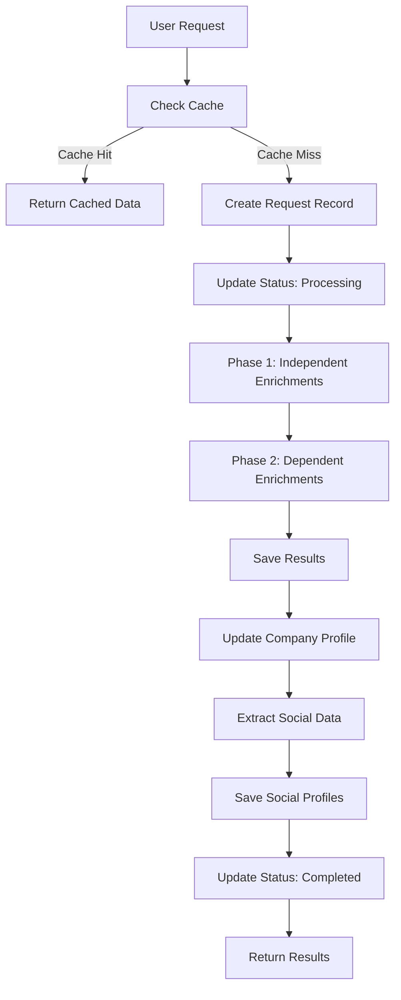
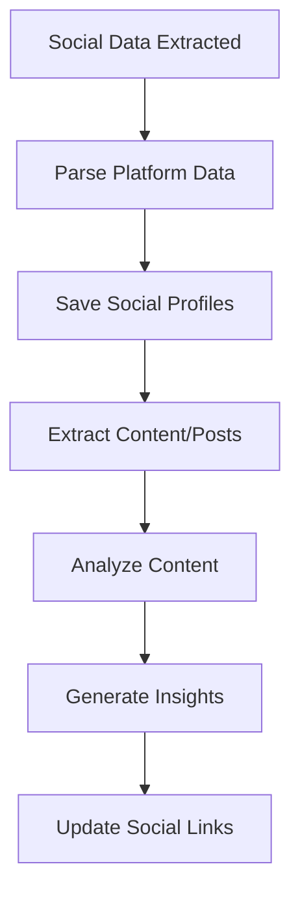
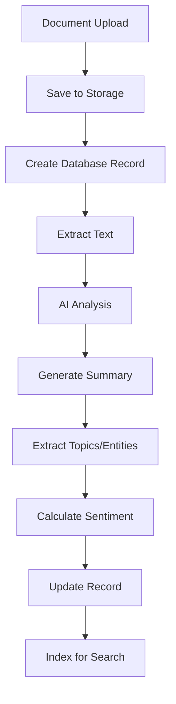

# Company Intelligence Platform - Implementation Documentation

## 📋 Overview

This document provides a comprehensive guide to implementing the Company Intelligence Platform, a sophisticated system for enriching, analyzing, and storing company data with integrated social media tracking and document management capabilities.

## 🏗️ Architecture Overview

### Core Components

1. **Enrichment Service** - Core company data enrichment using AI and web scraping
2. **Persistence Layer** - Database operations and caching
3. **Social Media Service** - Multi-platform social media tracking and analysis
4. **Document Storage Service** - AI-powered document processing and storage
5. **Unified Service** - Orchestration layer combining all capabilities

### Technology Stack

- **Database**: PostgreSQL (Supabase)
- **Storage**: Supabase Storage (S3-compatible)
- **AI/ML**: Anthropic Claude, OpenAI, Exa API
- **Web Scraping**: Firecrawl, Exa search
- **Search**: PostgreSQL Full-Text Search
- **Type Safety**: TypeScript throughout

## 🗄️ Database Schema

### Core Tables

#### 1. `enrichment_requests`
Tracks enrichment operations and their lifecycle.

```sql
CREATE TABLE enrichment_requests (
  id UUID PRIMARY KEY DEFAULT gen_random_uuid(),
  user_id UUID REFERENCES auth.users(id),
  website_url TEXT NOT NULL,
  enrichment_types TEXT[] NOT NULL,
  status TEXT NOT NULL DEFAULT 'pending', -- pending, processing, completed, failed
  created_at TIMESTAMPTZ DEFAULT NOW(),
  updated_at TIMESTAMPTZ DEFAULT NOW(),
  completed_at TIMESTAMPTZ,
  total_duration INTEGER, -- milliseconds
  
  -- Summary stats
  total_requested INTEGER NOT NULL DEFAULT 0,
  successful INTEGER NOT NULL DEFAULT 0,
  failed INTEGER NOT NULL DEFAULT 0,
  skipped INTEGER NOT NULL DEFAULT 0
);
```

#### 2. `enrichment_results`
Stores individual enrichment results with normalized structure.

```sql
CREATE TABLE enrichment_results (
  id UUID PRIMARY KEY DEFAULT gen_random_uuid(),
  request_id UUID REFERENCES enrichment_requests(id) ON DELETE CASCADE,
  type TEXT NOT NULL,
  status TEXT NOT NULL, -- success, error, skipped
  data JSONB,
  error_message TEXT,
  duration INTEGER, -- milliseconds
  created_at TIMESTAMPTZ DEFAULT NOW()
);
```

#### 3. `company_profiles`
Aggregated company data with caching capabilities.

```sql
CREATE TABLE company_profiles (
  id UUID PRIMARY KEY DEFAULT gen_random_uuid(),
  website_url TEXT UNIQUE NOT NULL,
  last_enriched_at TIMESTAMPTZ,
  enrichment_data JSONB NOT NULL DEFAULT '{}',
  social_links JSONB DEFAULT '{}',
  created_at TIMESTAMPTZ DEFAULT NOW(),
  updated_at TIMESTAMPTZ DEFAULT NOW()
);
```

### Social Media Tables

#### 4. `company_social_profiles`
Multi-platform social media profiles for companies.

```sql
CREATE TABLE company_social_profiles (
  id UUID PRIMARY KEY DEFAULT gen_random_uuid(),
  company_profile_id UUID REFERENCES company_profiles(id) ON DELETE CASCADE,
  platform TEXT NOT NULL, -- 'twitter', 'linkedin', 'instagram', 'facebook', 'tiktok', 'youtube'
  profile_url TEXT NOT NULL,
  username TEXT,
  handle TEXT,
  verified BOOLEAN DEFAULT false,
  follower_count INTEGER,
  following_count INTEGER,
  post_count INTEGER,
  bio TEXT,
  profile_image_url TEXT,
  last_scraped_at TIMESTAMPTZ DEFAULT NOW(),
  is_active BOOLEAN DEFAULT true,
  scraped_data JSONB DEFAULT '{}',
  created_at TIMESTAMPTZ DEFAULT NOW(),
  updated_at TIMESTAMPTZ DEFAULT NOW(),
  
  UNIQUE(company_profile_id, platform)
);
```

#### 5. `company_social_content`
Social media posts and content with engagement metrics.

```sql
CREATE TABLE company_social_content (
  id UUID PRIMARY KEY DEFAULT gen_random_uuid(),
  social_profile_id UUID REFERENCES company_social_profiles(id) ON DELETE CASCADE,
  
  -- Post metadata
  platform_post_id TEXT NOT NULL,
  post_type TEXT NOT NULL, -- 'post', 'tweet', 'story', 'video', 'reel', 'short'
  content_text TEXT,
  media_urls TEXT[],
  post_url TEXT,
  
  -- Engagement metrics
  likes_count INTEGER DEFAULT 0,
  shares_count INTEGER DEFAULT 0,
  comments_count INTEGER DEFAULT 0,
  views_count INTEGER DEFAULT 0,
  
  -- AI analysis
  sentiment_score DECIMAL(3,2),
  engagement_rate DECIMAL(5,4),
  topics TEXT[],
  mentions TEXT[],
  hashtags TEXT[],
  
  -- Timestamps
  posted_at TIMESTAMPTZ NOT NULL,
  scraped_at TIMESTAMPTZ DEFAULT NOW(),
  created_at TIMESTAMPTZ DEFAULT NOW(),
  
  UNIQUE(social_profile_id, platform_post_id)
);
```

### Document Storage Tables

#### 6. `company_documents`
AI-analyzed document storage with metadata.

```sql
CREATE TABLE company_documents (
  id UUID PRIMARY KEY DEFAULT gen_random_uuid(),
  company_profile_id UUID REFERENCES company_profiles(id) ON DELETE CASCADE,
  user_id UUID REFERENCES auth.users(id),
  
  -- Document metadata
  title TEXT NOT NULL,
  description TEXT,
  document_type TEXT NOT NULL, -- 'financial_report', 'pitch_deck', 'whitepaper', etc.
  file_name TEXT NOT NULL,
  file_size INTEGER, -- bytes
  mime_type TEXT,
  
  -- Storage information
  storage_path TEXT NOT NULL,
  storage_bucket TEXT NOT NULL DEFAULT 'company-documents',
  
  -- Processing status
  processing_status TEXT DEFAULT 'pending', -- 'pending', 'processing', 'completed', 'failed'
  extracted_text TEXT,
  summary TEXT,
  tags TEXT[],
  
  -- AI analysis
  ai_analysis JSONB DEFAULT '{}',
  sentiment_score DECIMAL(3,2),
  key_topics TEXT[],
  
  -- Access control
  visibility TEXT DEFAULT 'private', -- 'private', 'team', 'public'
  access_permissions JSONB DEFAULT '{}',
  
  -- Timestamps
  uploaded_at TIMESTAMPTZ DEFAULT NOW(),
  processed_at TIMESTAMPTZ,
  last_accessed_at TIMESTAMPTZ,
  created_at TIMESTAMPTZ DEFAULT NOW(),
  updated_at TIMESTAMPTZ DEFAULT NOW()
);
```

#### 7. `company_insights`
Aggregated insights across all data sources.

```sql
CREATE TABLE company_insights (
  id UUID PRIMARY KEY DEFAULT gen_random_uuid(),
  company_profile_id UUID REFERENCES company_profiles(id) ON DELETE CASCADE,
  
  -- Insight metadata
  insight_type TEXT NOT NULL, -- 'social_sentiment', 'document_analysis', 'funding_trend'
  title TEXT NOT NULL,
  description TEXT,
  confidence_score DECIMAL(3,2), -- 0.0 to 1.0
  
  -- Insight data
  insight_data JSONB NOT NULL,
  source_references JSONB DEFAULT '[]',
  
  -- Categorization
  category TEXT, -- 'financial', 'operational', 'market', 'social', 'competitive'
  priority TEXT DEFAULT 'medium', -- 'low', 'medium', 'high', 'critical'
  tags TEXT[],
  
  -- Validation
  validated_by UUID REFERENCES auth.users(id),
  validated_at TIMESTAMPTZ,
  validation_notes TEXT,
  
  -- Timestamps
  generated_at TIMESTAMPTZ DEFAULT NOW(),
  expires_at TIMESTAMPTZ,
  created_at TIMESTAMPTZ DEFAULT NOW(),
  updated_at TIMESTAMPTZ DEFAULT NOW()
);
```

### Indexes and Performance

```sql
-- Core enrichment indexes
CREATE INDEX idx_enrichment_requests_user_id ON enrichment_requests(user_id);
CREATE INDEX idx_enrichment_requests_website_url ON enrichment_requests(website_url);
CREATE INDEX idx_enrichment_results_request_id ON enrichment_results(request_id);
CREATE INDEX idx_enrichment_results_type ON enrichment_results(type);

-- Company profiles
CREATE INDEX idx_company_profiles_website_url ON company_profiles(website_url);

-- Social media indexes
CREATE INDEX idx_company_social_profiles_company_id ON company_social_profiles(company_profile_id);
CREATE INDEX idx_company_social_profiles_platform ON company_social_profiles(platform);
CREATE INDEX idx_company_social_content_profile_id ON company_social_content(social_profile_id);
CREATE INDEX idx_company_social_content_posted_at ON company_social_content(posted_at);

-- Document indexes
CREATE INDEX idx_company_documents_company_id ON company_documents(company_profile_id);
CREATE INDEX idx_company_documents_type ON company_documents(document_type);
CREATE INDEX idx_company_documents_user_id ON company_documents(user_id);

-- Insight indexes
CREATE INDEX idx_company_insights_company_id ON company_insights(company_profile_id);
CREATE INDEX idx_company_insights_type ON company_insights(insight_type);

-- Full-text search indexes
CREATE INDEX idx_company_documents_search ON company_documents 
USING gin(to_tsvector('english', title || ' ' || COALESCE(description, '') || ' ' || COALESCE(extracted_text, '')));

CREATE INDEX idx_company_social_content_search ON company_social_content 
USING gin(to_tsvector('english', COALESCE(content_text, '')));
```

### Row Level Security (RLS)

```sql
-- Enable RLS on all tables
ALTER TABLE company_social_profiles ENABLE ROW LEVEL SECURITY;
ALTER TABLE company_documents ENABLE ROW LEVEL SECURITY;
ALTER TABLE company_social_content ENABLE ROW LEVEL SECURITY;
ALTER TABLE company_insights ENABLE ROW LEVEL SECURITY;

-- Example policies
CREATE POLICY "Users can view company social profiles" 
ON company_social_profiles FOR SELECT USING (true);

CREATE POLICY "Users can manage their documents" 
ON company_documents FOR ALL USING (auth.uid() = user_id);

CREATE POLICY "Users can view social content" 
ON company_social_content FOR SELECT USING (true);

CREATE POLICY "Users can view insights" 
ON company_insights FOR SELECT USING (true);
```

## 🔧 Service Implementation

### 1. Core Enrichment Service

The refactored enrichment service eliminates redundant wrapper functions and focuses on orchestration:

**Key Features:**
- **Unified result wrapper** - Single `wrapEnrichmentResult()` function for DRY error handling
- **Direct API mapping** - Simple functions map directly to `exa.api.ts` calls
- **Parallel execution** - Intelligent dependency optimization
- **Progress tracking** - Real-time status updates

**File**: `/packages/ai/services/enrichment/enrichment.service.ts`

```typescript
// Example of the clean, non-redundant approach
const ENRICHMENT_TYPE_TO_FUNCTION: Record<EnrichmentType, Function> = {
  // Direct mappings - no redundant wrappers
  'basic-info': (req) => wrapEnrichmentResult('basic-info', () => exaR.scrapeWebsiteUrl(req)),
  'funding': (req) => wrapEnrichmentResult('funding', () => exaR.fetchFunding(req)),
  'linkedin': (req) => wrapEnrichmentResult('linkedin', () => exaR.scrapeLinkedin(req)),
  
  // Complex operations using specialized functions
  'company-summary': enrichCompanySummary,
  'competitors': enrichCompetitors,
  'mind-map': enrichMindMap,
};
```

### 2. Persistence Service

Handles all database operations with intelligent caching:

**Key Features:**
- **Request lifecycle management** - Track enrichment from start to completion
- **Smart caching** - 24-hour freshness with type-aware cache validation
- **Result normalization** - Consistent data structure across all enrichment types
- **Error resilience** - Partial failures don't break the entire process

**File**: `/packages/ai/services/enrichment/persistence.service.ts`

### 3. Social Media Service

Multi-platform social media tracking and analysis:

**Supported Platforms:**
- Twitter (X)
- LinkedIn
- Instagram
- Facebook
- TikTok
- YouTube

**Key Features:**
- **Profile tracking** - Follower counts, verification status, bio information
- **Content analysis** - Posts, engagement metrics, sentiment analysis
- **Insight generation** - Engagement trends, topic analysis, platform performance
- **Growth metrics** - Follower growth, post frequency, engagement trends

**File**: `/packages/ai/services/enrichment/social-media.service.ts`

```typescript
// Example insight generation
const insights = await socialMediaService.generateSocialInsights(companyProfileId);
// Returns: totalFollowers, avgEngagementRate, sentimentTrend, topTopics, etc.
```

### 4. Document Storage Service

AI-powered document processing and storage:

**Supported Document Types:**
- Financial reports
- Pitch decks
- Whitepapers
- Case studies
- Product specifications
- Legal documents

**Key Features:**
- **Secure storage** - Supabase Storage with access controls
- **AI processing** - Text extraction, summarization, sentiment analysis
- **Smart search** - Full-text search with relevance ranking
- **Document intelligence** - Topic extraction, entity recognition, key insights

**File**: `/packages/ai/services/enrichment/document-storage.service.ts`

```typescript
// Example document upload with AI processing
const documentId = await documentService.uploadDocument(companyId, file, {
  title: "Q3 Financial Report",
  documentType: "financial_report",
  description: "Third quarter results"
});
// Returns: Document ID, triggers background AI processing
```

### 5. Unified Orchestration Service

Combines all services into a single, powerful interface:

**Key Features:**
- **Single entry point** - One service for all company intelligence needs
- **Automatic social extraction** - Extracts social data from enrichment results
- **Document integration** - Links documents to company profiles
- **Cross-service insights** - Combines data from all sources

**File**: `/packages/ai/services/enrichment/enrichment-with-persistence.service.ts`

```typescript
// One call gets everything
const company = await enrichmentService.getCompanyProfile('https://company.com');
// Returns: enrichment data + social profiles + documents + insights
```

## 📊 Data Flow

### 1. Enrichment Process



### 2. Social Media Flow



### 3. Document Processing Flow



## 🔍 Key Features

### 1. Intelligent Caching

```typescript
// Automatic cache validation
const cachedData = await persistenceService.getCachedEnrichment(
  websiteUrl,
  requestedTypes
);

if (cachedData) {
  // Use cache if:
  // - Data is fresh (< 24 hours)
  // - All requested types are available
  return formatCachedResponse(cachedData);
}
```

### 2. Parallel Execution Optimization

```typescript
// Phase 1: Independent enrichments (parallel)
const independentTypes = ['basic-info', 'funding', 'linkedin', 'news'];

// Phase 2: Dependent enrichments (with shared data)
const dependentTypes = ['competitors', 'mind-map'];
// Uses results from Phase 1 to avoid redundant API calls
```

### 3. Progressive Enhancement

```typescript
// Start with basic enrichment
const basic = await enrichmentService.enrichCompany({
  websiteUrl: 'https://company.com',
  enrichmentTypes: ['basic-info', 'funding']
});

// Add social media later
const enhanced = await enrichmentService.enrichCompany({
  websiteUrl: 'https://company.com',
  enrichmentTypes: ['linkedin', 'twitter-profile']
});

// Cached data is preserved and extended
```

### 4. Full-Text Search

```typescript
// Search across all company data
const results = await enrichmentService.searchCompanyDocuments(
  'https://company.com',
  'quarterly revenue growth',
  { documentType: 'financial_report' }
);
```

## 🚀 Usage Examples

### Basic Company Enrichment

```typescript
import { createClient } from '@supabase/supabase-js';
import { makePersistedEnrichmentService } from './enrichment-with-persistence.service';

const supabase = createClient(
  process.env.NEXT_PUBLIC_SUPABASE_URL!,
  process.env.SUPABASE_SERVICE_ROLE_KEY!
);

const enrichmentService = makePersistedEnrichmentService(supabase, supabase, userId);

// Enrich company with social media tracking
const result = await enrichmentService.enrichCompany({
  websiteUrl: 'https://anthropic.com',
  enrichmentTypes: [
    'basic-info',
    'company-summary',
    'funding',
    'competitors',
    'linkedin',
    'twitter-profile',
    'news'
  ]
}, {
  useCache: true,
  onProgress: (progress) => {
    console.log(`${progress.currentStep}/${progress.totalSteps} - ${progress.currentType}`);
  },
  onPersisted: (requestId) => {
    console.log(`Request persisted: ${requestId}`);
  }
});
```

### Get Complete Company Profile

```typescript
// Single call returns everything
const company = await enrichmentService.getCompanyProfile('https://company.com');

console.log({
  basicData: company.enrichment_data,
  socialProfiles: company.socialProfiles,
  socialInsights: company.socialInsights,
  documents: company.documents,
  lastEnriched: company.last_enriched_at
});
```

### Upload and Process Documents

```typescript
// Upload company document
const documentId = await enrichmentService.uploadCompanyDocument(
  'https://company.com',
  file,
  {
    title: 'Q4 2024 Financial Report',
    description: 'Annual financial results',
    documentType: 'financial_report',
    visibility: 'team'
  }
);

// Document is automatically processed with AI
// - Text extraction
// - Summarization
// - Topic analysis
// - Sentiment analysis
// - Entity recognition
```

### Social Media Analytics

```typescript
// Get social media insights
const insights = await enrichmentService.getCompanySocialInsights('https://company.com');

console.log({
  totalFollowers: insights.totalFollowers,
  avgEngagementRate: insights.avgEngagementRate,
  sentimentTrend: insights.sentimentTrend,
  topTopics: insights.topTopics,
  platformBreakdown: insights.platformBreakdown
});
```

### Document Search

```typescript
// Search company documents
const documents = await enrichmentService.searchCompanyDocuments(
  'https://company.com',
  'revenue growth strategy',
  { documentType: 'financial_report', limit: 10 }
);

documents.forEach(doc => {
  console.log({
    title: doc.title,
    summary: doc.summary,
    sentiment: doc.sentimentScore,
    topics: doc.keyTopics
  });
});
```

## 🔧 Configuration

### Environment Variables

```bash
# Supabase
NEXT_PUBLIC_SUPABASE_URL=your_supabase_url
SUPABASE_SERVICE_ROLE_KEY=your_service_role_key

# AI Services
EXA_API_KEY=your_exa_api_key
ANTHROPIC_API_KEY=your_anthropic_key
OPENAI_API_KEY=your_openai_key
FIRECRAWL_API_KEY=your_firecrawl_key
```

### Supabase Storage Buckets

Create the following storage buckets in Supabase:

```typescript
// company-documents bucket configuration
{
  name: 'company-documents',
  public: false,
  fileSizeLimit: 50 * 1024 * 1024, // 50MB
  allowedMimeTypes: [
    'application/pdf',
    'application/vnd.openxmlformats-officedocument.wordprocessingml.document',
    'application/vnd.openxmlformats-officedocument.presentationml.presentation',
    'text/plain',
    'text/csv'
  ]
}
```

## 🔒 Security Considerations

### 1. Access Control

- **RLS Policies** - Users can only access their own data
- **Document Visibility** - Private, team, or public access levels
- **Signed URLs** - Secure document downloads with expiration
- **API Rate Limiting** - Prevent abuse of enrichment services

### 2. Data Privacy

- **No Sensitive Data Logging** - Personal information is not stored in logs
- **Encryption at Rest** - All data encrypted in Supabase
- **Secure File Storage** - Documents stored with access controls
- **Data Retention** - Configurable data retention policies

### 3. API Security

- **Authentication Required** - All endpoints require valid user authentication
- **Input Validation** - All inputs validated and sanitized
- **Error Handling** - No sensitive information exposed in error messages
- **Audit Logging** - All operations logged for security auditing

## 📈 Performance Optimization

### 1. Database Optimization

- **Strategic Indexing** - Indexes on all frequently queried columns
- **JSONB Operations** - Efficient storage and querying of structured data
- **Connection Pooling** - Supabase handles connection management
- **Query Optimization** - Optimized queries with proper joins and filtering

### 2. Caching Strategy

- **24-Hour Cache** - Automatic cache invalidation after 24 hours
- **Type-Aware Caching** - Only use cache if all requested types available
- **Selective Re-enrichment** - Re-enrich only missing or stale data
- **Cache Warming** - Background processes to keep popular data fresh

### 3. Parallel Processing

- **Phase-Based Execution** - Independent operations run in parallel
- **Dependency Optimization** - Dependent operations share data
- **Background Processing** - Document processing runs asynchronously
- **Progress Tracking** - Real-time updates without blocking operations

## 🧪 Testing Strategy

### 1. Unit Tests

```typescript
// Example test for enrichment service
describe('EnrichmentService', () => {
  it('should cache results correctly', async () => {
    const mockData = { /* test data */ };
    const result = await enrichmentService.enrichCompany(mockRequest);
    
    expect(result.summary.successful).toBeGreaterThan(0);
    expect(result.results).toBeDefined();
  });
});
```

### 2. Integration Tests

```typescript
// Example integration test
describe('Document Processing', () => {
  it('should process uploaded documents', async () => {
    const file = new File(['test content'], 'test.pdf');
    const documentId = await documentService.uploadDocument(companyId, file, metadata);
    
    // Wait for processing
    await waitForProcessing(documentId);
    
    const doc = await documentService.getDocument(documentId);
    expect(doc.processingStatus).toBe('completed');
    expect(doc.extractedText).toBeDefined();
  });
});
```

### 3. End-to-End Tests

```typescript
// Example E2E test
describe('Company Intelligence Pipeline', () => {
  it('should enrich company with social and documents', async () => {
    // 1. Enrich company
    const enrichment = await enrichmentService.enrichCompany(request);
    
    // 2. Upload document
    const docId = await enrichmentService.uploadCompanyDocument(url, file, metadata);
    
    // 3. Get complete profile
    const profile = await enrichmentService.getCompanyProfile(url);
    
    expect(profile.socialProfiles).toBeDefined();
    expect(profile.documents).toContain(expect.objectContaining({ id: docId }));
  });
});
```

## 🚦 Deployment

### 1. Database Migration

```sql
-- Run the complete schema from extended-schema.sql
-- Ensure all indexes and RLS policies are applied
-- Verify foreign key constraints
```

### 2. Storage Setup

```typescript
// Create storage buckets in Supabase dashboard
// Set up appropriate RLS policies for buckets
// Configure file size and type restrictions
```

### 3. Environment Configuration

```bash
# Production environment variables
# API keys for all services
# Database connection strings
# Storage configuration
```

### 4. Monitoring

```typescript
// Set up monitoring for:
// - Enrichment success rates
// - Processing times
// - Error rates
// - Cache hit rates
// - Document processing status
```

## 🔄 Maintenance

### 1. Data Cleanup

```sql
-- Periodic cleanup of old enrichment results
DELETE FROM enrichment_results 
WHERE created_at < NOW() - INTERVAL '90 days';

-- Cleanup failed document processing
DELETE FROM company_documents 
WHERE processing_status = 'failed' 
AND created_at < NOW() - INTERVAL '30 days';
```

### 2. Cache Management

```typescript
// Monitor cache hit rates
// Adjust cache duration based on usage patterns
// Implement cache warming for popular companies
```

### 3. Performance Monitoring

```typescript
// Track key metrics:
// - Average enrichment time
// - Cache hit percentage
// - Document processing success rate
// - Social media data freshness
```

## 🎯 Key Benefits

### 1. **Unified Intelligence Platform**
- Single interface for all company data
- Automatic cross-referencing between data sources
- Consistent data structure across all enrichment types

### 2. **Advanced Social Media Analytics**
- Multi-platform tracking and analysis
- Sentiment analysis and engagement metrics
- Growth trend analysis and competitive insights

### 3. **AI-Powered Document Intelligence**
- Automatic text extraction and summarization
- Topic modeling and entity recognition
- Full-text search across all documents

### 4. **Production-Ready Architecture**
- Intelligent caching and performance optimization
- Comprehensive error handling and resilience
- Security-first design with proper access controls

### 5. **Developer Experience**
- Type-safe TypeScript implementation
- Modular, extensible architecture
- Comprehensive documentation and examples

This implementation provides a complete, enterprise-grade company intelligence platform that scales from simple enrichment to sophisticated multi-source analytics with social media tracking and document management capabilities.